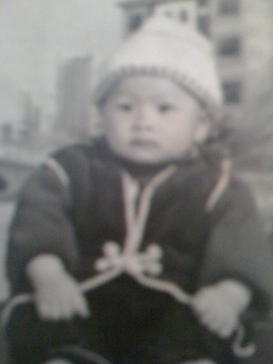
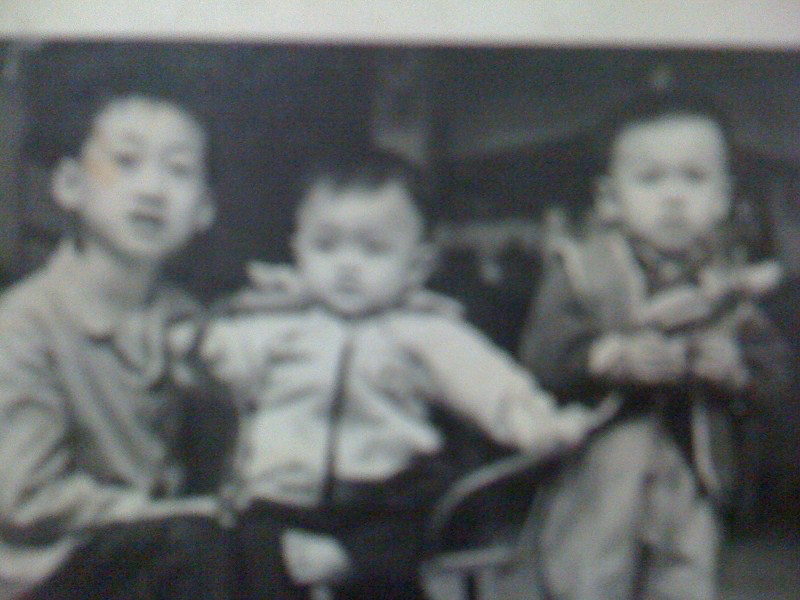
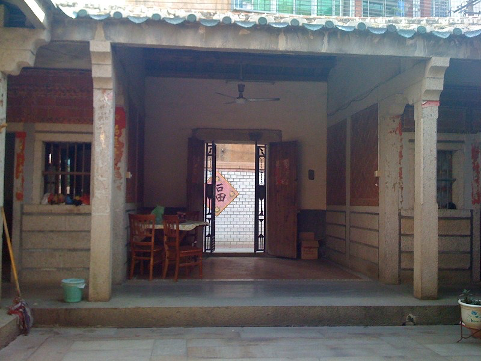

# 我的童年

1984年夏天，我出生在福建泉州的一个小村庄。那时候的农村，白天鸡鸣狗吠，夜晚虫鸣蛙叫，空气中总是飘着泥土和庄稼的气息。

我家住在村子内，一座朴素的土砖房，屋后有一片池塘和一片菜地，种着各种青菜。

记忆中的夏夜，凉席上是星光和暑气，蚊香的烟在黑暗中画着圈，我常躺在竹床上，听看着当年的电视。

父亲在当地电厂工作，是个海军退役军人。他热情开朗，喜欢与人交流。退伍后分配到电厂，和大部分人一样工作辛苦。

"屋里经常有人笑，那是有福的人家。"村里的老人常这么说。

而我家确实常常笑声不断，父亲工作之余经常会邀请同事和朋友到家中，他那爽朗的笑声和精彩的故事总能让家里充满欢声笑语。

母亲出身于一个传统工艺家庭。和大部分的母亲一样专注照顾家庭

我的外公是一位鎏金佛像手艺人。

每逢节假日，我都会去外公家。他住在城里的老街区，狭窄的巷道两旁是斑驳的老房子，空气中弥漫着香料和木材的气味。

外公的工作室就在一楼，窗子很小，但光线却很好。

"外公，这是怎么做出来的？"五岁的我好奇地问道，指着一尊刚完成的小佛像。

外公会蹲下来，耐心地向我解释鎏金的过程："先要把铜雕刻成形，然后涂上水银和金粉的混合物，再用火烤，水银蒸发后，金就附在铜上了。"

还记得他说这话时的神情，认真而专注，仿佛在讲述一件神圣的事。

外公的工作室充满了木材和矿物的味道，一种特殊的气息混合着焦煤和松香。

我常常在那里一坐就是几个小时，看着外公如何将普通的木头变成闪闪发光的艺术品。

"做工艺跟做人一样，要有耐心，一丝不苟。"外公一边雕刻一边说，"看似不重要的细节，往往决定成败。"

从外公那里，我学到了专注和坚持。八岁之前，我经常会去外公的工作室

在那里，我接触到了各种传统工艺和艺术形式，也懂得了细节的重要性。

我的爷爷在水电行业做公务员，是村里少有的"干部"，也是家族中的顶梁柱。

与父亲的直接热情和外公的内敛专注不同，爷爷擅长构建关系网络，协调各方关系，解决复杂问题。

八十年代中期的农村，干部是备受尊敬的，也是村里人遇到问题时首先想到的"救星"。

记得村里修水渠时，几个生产队为水量分配争执不下，是爷爷出面调解，既照顾了上游村民灌溉的需求，又保证了下游村民有足够的水用，最终平息了纠纷。

"做事靠能力，成事靠人脉。"这是爷爷经常挂在嘴边的一句话。

爷爷在当地有着广泛的人脉关系，从公社到大队，从粮站到学校，他似乎认识每一个能帮上忙的人。

更重要的是，他懂得如何维护这些关系，让它们在需要时能够派上用场。

有一次，我初中时想参加市里的美术比赛，但当时报名已经截止。

爷爷通过他认识的朋友，不仅为我争取到了一个参赛名额，还安排了专门的老师为我进行赛前指导。

"人和人之间，没有过不去的坎。"爷爷对我说，"关键是你要找到正确的人，用正确的方式沟通。"

爷爷还经常带我去拜访他的各路朋友，让我从小就学会了如何与不同背景的人相处。

每次拜访前，他都会教我该如何称呼对方，该说些什么，甚至如何根据对方的反应调整谈话内容。

"观察比说话更重要，"爷爷说，"你要学会看懂别人眼神里的想法。"

我记得有一次，村里要通电，爷爷带着几袋家里种的水果，去拜访电力局的朋友。

他没有直接提要求，而是先关心对方家人，谈天气谈收成，等到氛围轻松了，才不经意地提到村里通电的事。

不出一个月，我们村成了周围最早通电的村子之一。

这些社交智慧的训练无形中培养了我敏锐的观察力和适应不同场合的能力，这在我后来的创业道路上帮了大忙。

搬到城里，是因为家里希望我能有更好的学习环境。其实所谓"更好"，也只是离家近、方便照顾。

那时候的实验小学很普通，校门口是两棵老榕树，操场是水泥地。

实验小学没有什么特别的地方，教室里总是有粉笔灰的味道，桌椅有些破旧。

老师很严格，作业多，考试频繁。

刚进城时，我有些不适应。城里的同学说话快，见识广，喜欢讨论各种新鲜事。

我更喜欢安静地看书，或者一个人画画。每次班级活动，我总是最后一个发言，但老师发现我画画不错，就让我参加了学校的画画比赛。

在一中，我最喜欢画画室和仙都楼外的篮球场。

第一次参加市里的绘画比赛。虽然没得奖，但老师鼓励我："你画得很有想法。"

后来又有几次机会，参加了校内外的绘画比赛，慢慢地，我有了属于自己的小圈子。

除了画画，体育课是我最喜欢的时间。学校的篮球场虽然不大，但每到课间和放学，总有一群同学在打球。

我个子高，跑得快，很快就被拉进了班级篮球队。我们参加过几次校内比赛，那种拼搏和协作的感觉让我很享受。

在这些活动中，渐渐适应了城市的生活节奏。虽然我依然喜欢独处，但也学会了在团队中找到自己的位置。

每次比赛、每次演出，都是一次新的尝试和成长。

童年的时光就在这样的日子里慢慢流逝。没有太多轰轰烈烈的故事，更多的是日常的坚持和探索。

回头看，那些安静的午后、操场上的汗水、画室里的颜料味、篮球场的协作，都是我成长路上最真实的印记。
https://cunkebao.feishu.cn/sync/X2o9dVUfxsKvCxbwS5ecb1bWnUW
