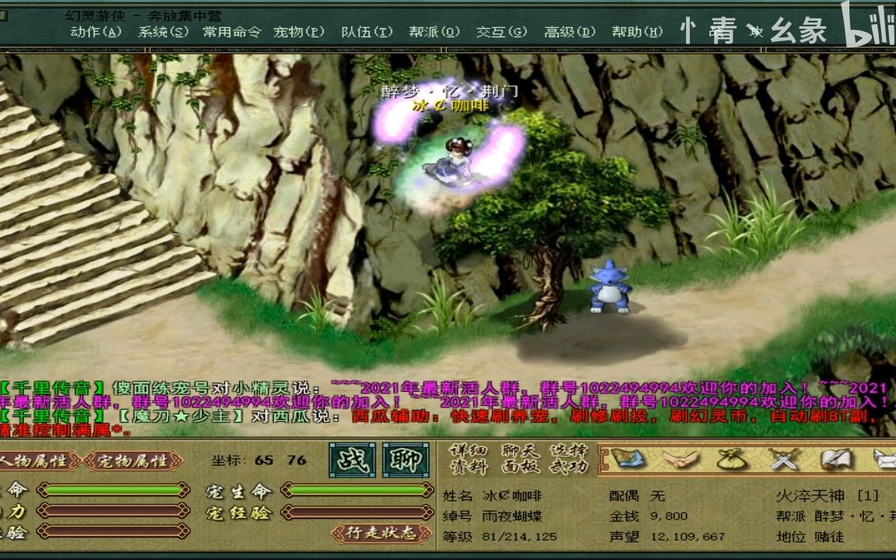

# 沉迷网游后的创业萌芽：第一次做虚拟物品交易

说说那段迷恋网游的时代

那是一个寒冷的冬天，大年三十的晚上，家里因为一些琐事，父母吵得不可开交。实在受不了这种压抑的氛围，索性离家出走，跑到市中心的网吧上网。那时在玩《幻灵游侠》这款游戏，每天都会在上面花费大量的时间。

离家出走之前，在网吧，认识了一个叫小廖的朋友，他当时在一家网吧当网管，游戏里的装备和虚拟货币多得让人眼红。有一天，小廖说，他通过卖游戏里的虚拟物品赚了不少钱。听后非常惊讶，也非常心动。

“你是怎么做到的？”迫不及待地问他。

小廖笑了笑，说：“很简单，只要你有值钱的装备和宠物，就能在游戏论坛或者QQ群里找到买家。人是逐利的动物，只要有市场，就不愁卖不出去。”

当时离家出走，身上只有最后5块钱车费，《幻灵游侠》里已经积累了一些不错的宠物，并且长期在幻灵论坛里晒属性，索性决定卖掉一些换点零花钱。于是在游戏论坛上发布了一条出售虚拟物品的帖子，很快就有隔壁网吧的李总联系。

为了赚这笔钱，不得不走几公里路去见他。一路上心情复杂，既兴奋又紧张，毕竟是第一次做虚拟物品交易。

见面后，李总检查了游戏宠物，确认无误后，他当场给了700元现金。那一刻，感到无比的兴奋和成就感。这次交易不仅赚到了钱，也看见了通过游戏赚钱的可能性。

回到家后，把这700元藏了起来，心里暗暗决定要继续做这件事。于是开始专注于只打蝴蝶这种宠物。放学后，研究游戏的市场行情，在论坛内晒图片寻找更多的买家。

在这个过程中，逐渐意识到，专注和坚持是一个IP形成的基础。只有不断提升技能和积累资源，才能在这个市场上立足。为了赚更多的钱，甚至开始学习一些基本的编程知识，尝试自己开发一些游戏工具。

然而，这条路并不容易。有一次，交易过程中遇到了一个骗子，对方拿了装备却没给钱，并且盗了号。那次损失非常痛苦，但没有放弃，而是更加谨慎地选择交易对象，并且学会了如何保护自己的利益。

回顾这段经历，还是很开心的。那时虽然年纪小，却是第一次出现创业的萌芽。通过一次虚拟物品交易，不仅赚到了钱，还学会了坚持和聚焦一件细致的事情很容易带来成功。这段经历对后来的创业产生了深远的影响。

有时候会想，如果没有那次大年三十的离家出走，是否还能走上创业路？或许，正是那次经历让人看见了潜力，也明白了一个道理：无论遇到什么困难，只要坚持下去，就一定能找到解决的办法。

https://eb4dqd8omx.feishu.cn/sync/X2o9dVUfxsKvCxbwS5ecb1bWnUW
