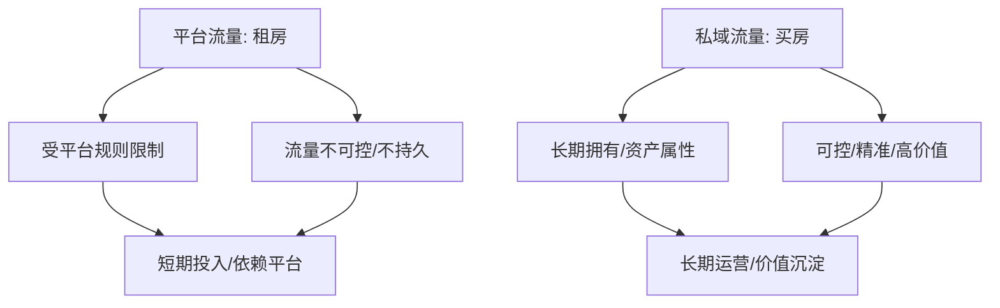

# 4.1 私域是互联网地产：构建私域流量池

## 内容概要

本章探讨了在当今互联网平台发达的时代，如何构建真正属于自己的私域流量池，从平台流量向私域流量转化的过程和策略。通过我在厦门本地抖音账号运营的实践经验，分享了将近2万粉丝从公域引流到私域的方法，以及私域流量池的精细化运营策略。文章阐述了"平台流量如租房，私域流量如买房"的核心理念，强调了私域流量作为互联网资产的长期价值。

---
#### 平台流量 vs 私域流量


---

## 正文

在互联网平台发达的今天，我在思考一个问题：如何才能在瞬息万变的互联网世界里，拥有真正属于自己的资产？

我运营着一个拥有将近2万粉丝的厦门本地同城的抖音账号，每天发布的短视频都能带来不错的流量。曾经我以为，这就是在互联网上的立足之本。然而，随着对互联网生态的深入理解，我逐渐意识到，相比于公众号、抖音等平台流量，私域流量才是更可控、更精准、更有价值的"互联网资产"。

"平台流量就像租房子，而私域流量就像买房子。租房子每个月都要交租金，一旦不租了，房子就不是你的了。但买了房子，你就能拥有长期的使用权，甚至可以转卖升值。"这是我经常用来形容平台流量与私域流量区别的比喻。

我意识到，大部分做抖音、电商、和实体门店的创业者一直以来都在"租房子"，而没有想过要"买房子"。他们把大量精力投入到抖音内容创作、淘宝店铺运营、实体店铺装修等方面，却忽略了将这些流量沉淀到自己的私域渠道中。

抖音账号虽然流量很大，但用户粘性不高，变现能力也有限。一旦平台算法调整或者出现其他变故，流量就会受到很大影响。我曾亲眼目睹许多抖音账号因为违规或者算法调整而流量骤减，甚至面临账号被封的风险。这让我更加坚定了构建私域流量池的决心，因为它承载着我对"互联网地产"的向往和追求。

那么，具体如何构建私域流量池呢？经过不断实践和摸索，我总结出了以下几个关键策略：

---
#### 构建私域流量池三步策略

```mermaid
graph TD
    Step1[精细化运营公域账号] --> Step2[引导用户加入私域社群];
    Step2 --> Step3[精细化运营私域社群];
    Step3 --> Success[私域流量池构建成功];

    Step1: 提升用户粘性/个人IP打造
    Step2: 独家内容/福利/悬念引导
    Step3: 用户分层/精准服务/活动组织
```
---

### 2. 引导用户加入我的私域社群

仅仅在抖音上获得流量是远远不够的，我需要将这些流量引导到自己的私域渠道中。为此，我专门开发了"存客宝"这个AI私域工具，方便在我的视频和评论区中，引导用户添加我的微信号，并拉他们进入我的私域社群。

为了吸引用户加入，我在社群中定期分享一些独家内容和福利，比如行业最新动态、实用干货、优惠活动等。我还会在抖音视频中埋下一些悬念，告诉用户"完整版内容请关注我的微信公众号"或者"想了解更多细节请添加我的微信"，这样能够有效引导用户到私域渠道。

### 3. 精细化运营私域社群，提升用户活跃度

将用户引入私域只是第一步，更重要的是如何留住他们，提升他们的活跃度和忠诚度。

首先，我根据用户的兴趣爱好，将他们细分为不同的社群，并设置了一个门槛筛选用户，确保社群质量。例如，我有专门针对创业者的"鹭岛创业者联盟"，有针对数字营销从业者的"私域运营交流群"，还有针对个人成长爱好者的"卡若成长营"等。

在群内，我提供更有针对性的内容和服务，解答用户的问题，分享最新的行业动态和干货。我还定期组织一些线上线下活动，增强用户之间的互动和粘性。例如，线上的知识分享会、案例分析会，线下的创业者沙龙、私域运营峰会等。

我花了半年多的时间，将私域社群运营起来。惊喜的是，社群的转化率远远高于预期。通过精细化运营和持续提供价值，我在社群中建立了良好的口碑和信任度，用户的活跃度和忠诚度也不断提升。

我开始在社群中推广付费课程、咨询服务和孵化业务，并取得了不错的收益。更重要的是，通过私域社群，与粉丝建立了更深层次的连接，我的影响力不再局限于抖音平台，而是延伸到其它平台，以及线下。因此，我还组织了"鹭岛企业家联盟"，将线上社群的力量转化为线下的实际行动和商业合作。

我一直认为，影响力就等于钱，链接认同的用户就是你的资产。私域流量不是简单的加好友、拉群，而是要用真心去换取用户的认可和信任。只有当用户真正认同你的价值观，愿意与你建立长期稳定的连接，你的私域流量池才能真正发挥作用，才能真正成为你的资产。

通过构建私域流量池，我不仅实现了收入的增长，更重要的是建立了一个可持续发展的商业模式。无论是平台规则如何变化，还是市场环境如何波动，我都能通过私域流量池与用户保持稳定的连接，持续为他们提供价值，实现商业目标。

正如我常说的那样，"在互联网时代，谁掌握了私域流量，谁就掌握了未来。"私域流量不仅是一种营销手段，更是一种商业思维和战略资产。通过构建强大的私域流量池，我们能够在充满不确定性的互联网世界中，拥有真正属于自己的"互联网地产"。

## 关键收获

1. **"平台流量如租房，私域流量如买房"** - 平台流量受限于平台规则和算法，而私域流量是真正属于自己的资产
2. **三步构建私域流量池** - 精细化运营公域账号、引导用户进入私域、精细化运营私域社群
3. **用户分层与精准服务** - 根据用户特点和需求分类管理，提供针对性内容和服务
4. **线上线下联动** - 将线上社群的力量转化为线下的实际行动和商业合作
5. **真心创造信任** - 私域流量的核心在于用真心换取用户的认可和信任

## 行动指南

1. 审视你当前的流量来源，评估对平台依赖的风险，开始规划私域流量池建设
2. 在公域平台内容中融入个人IP元素，增强用户对你的记忆和情感连接
3. 设计有吸引力的私域引流策略，如独家内容、专属福利、问题解答等
4. 对私域用户进行细分和分层管理，为不同类型的用户提供针对性服务
5. 定期在私域中举办活动，增强用户粘性和活跃度，培养社群氛围

#卡若的IP财富旅程 #私域流量 #用户运营 #互联网资产

