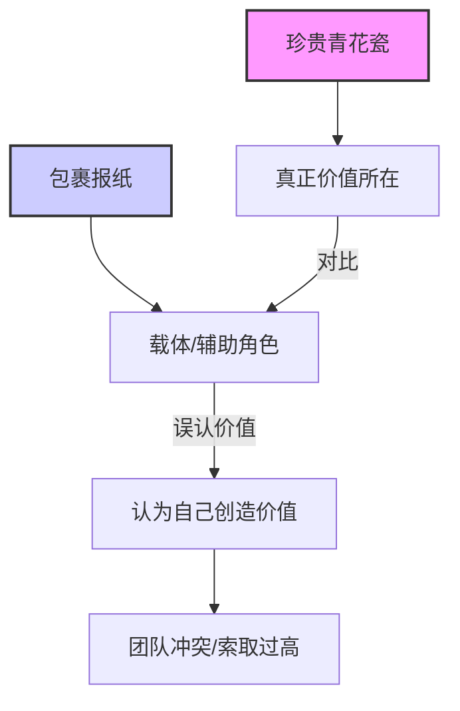
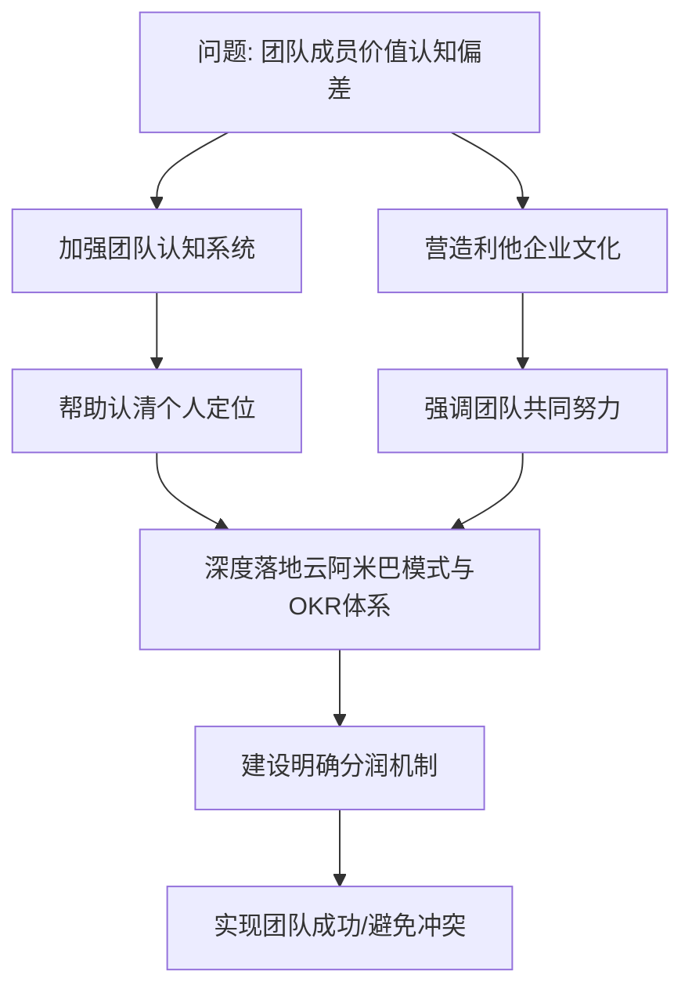
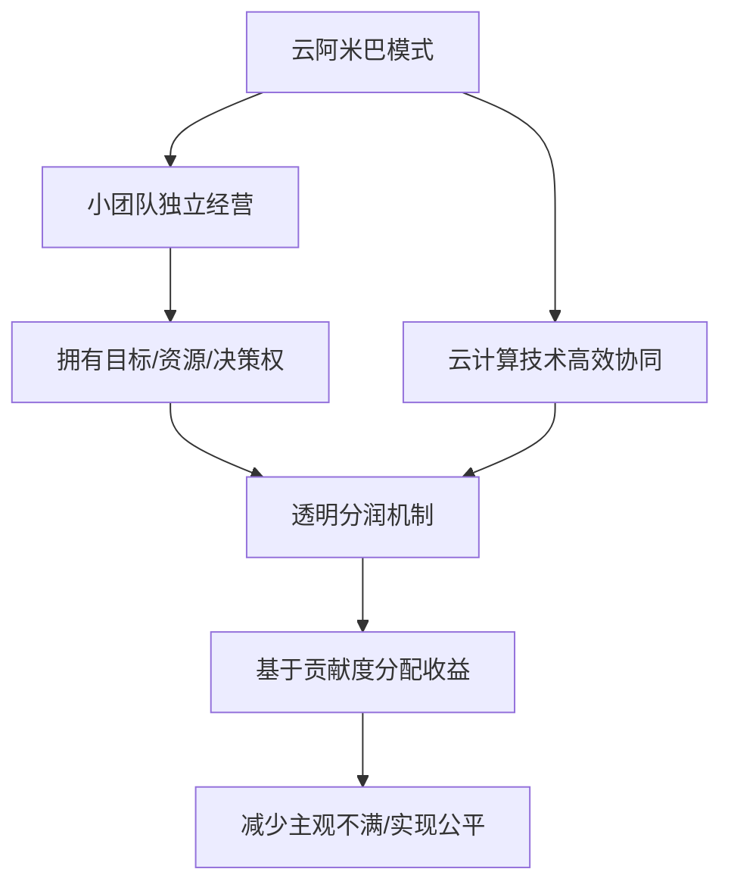

# 4.3 团队背叛后的反思：青花瓷和报纸的故事

## 内容概要

本章通过"青花瓷和报纸"的寓言故事，深入剖析了团队建设中的价值认知问题。以我亲身经历的团队背叛事件为切入点，探讨了如何辨别真正有价值的合作伙伴，以及如何构建健康的团队文化。文章阐述了在企业发展过程中，核心资产与辅助角色的区别，以及自我认知在团队协作中的重要性。同时提出了"云阿米巴模式"和OKR体系等实操方案，帮助企业建立更加透明、公平的合作机制，避免类似的团队冲突再次发生。

---
#### 青花瓷与报纸：价值认知寓言

---

## 正文

五缘湾大桥在阳光的照耀下熠熠生辉，桥下的帆船与游艇在湛蓝的海面上悠然自得。办公室的窗外，景色如画，正是这样的美景，让人心旷神怡。翔安的体育馆也在不远处，那里经常举办各种赛事，增添了不少生机。我坐在办公室里，看着这一切，心中却有些许的沉重和思索，这沉重与思索，正是我在IP财富旅程中，对团队与价值深层理解的起点。

"你知道吗，婼瑄，"我缓缓开口，对坐在对面的合伙人说道，"我想起了你上次说的，你爷爷讲的青花瓷和报纸的故事。"

婼瑄点了点头，眼中闪过一丝回忆的光芒。"是啊，我爷爷总是用这个故事来教导我很多道理。"

"那天你跟我讲的故事让我印象深刻，"我继续道，"特别是那段青花瓷的价值远超报纸的部分。"

婼瑄微微一笑，开始讲述那个故事。"有一张报纸，它一直包着一只珍贵的青花瓷。随着时间的推移，青花瓷的价值不断攀升。报纸因此产生了错觉，认为自己的价值也在增长，甚至认为这一切都是自己的功劳。"

"但是实际上，"婼瑄继续，"真正的价值在于青花瓷，而不是报纸。报纸不过是个载体，它没有意识到自己如果不能与青花瓷产生深度的链接，它是可替代的。"

我点点头，"这个故事让我想起了我们公司的情况。我们沉淀11年的AI私域工具：存客宝和几千名兼职的碎片时间资源就像那只青花瓷，而我们团队中的一些成员，却像那张报纸一样，没有认清自己的真正价值。"

"没错，"婼瑄接过话头，"有些人错了，不知道自己错了。你和他说，他还不承认。智慧的人往往自知者明，自胜者强。"

"你说得对。"我深吸一口气，继续说道，"我们最近遇到的一些挫折，正是因为团队中的一些人没有正确认知自己的定位，过于自满。他们只看到了眼前的利益，而没有看到背后我们大家共同的努力。"

### 青花瓷与报纸：价值的本质

"这正是我爷爷说的青花瓷的道理，"婼瑄说，"青花瓷是由多个维度和很多人的努力交织才塑造了它的价值，而报纸只是包着它，刚好也遇到了它。只有不断提升自己的内在价值，才能真正与团队紧密结合，创造更大的价值。"

这个简单的比喻背后，其实隐藏着深刻的商业哲理。在企业发展过程中，总有一些核心资产（如技术、品牌、用户资源等）是企业价值的真正所在，而个人或某些团队成员往往只是这些核心资产的载体或管理者。当载体误认为自己创造了全部价值，并因此索取过高回报或甚至试图独占资源时，就会产生团队冲突，甚至导致公司分裂。

我的团队曾经历过这样的挫折。一些优秀的员工在公司发展到一定阶段后，开始认为自己是公司成功的唯一原因，忽视了平台、团队、历史积累等因素的重要性。最终，他们选择离开，自立门户，却发现缺少了公司的平台和资源支持，很难取得同样的成就。

### 寻找解决之道

我沉思片刻，说道："那我们要怎么做才能避免这种情况再发生呢？"

"首先，"婼瑄建议，"我们要加强团队的认知系统，帮助每个人认清自己的定位。其次，我们要营造一种利他的企业文化，让每个人都明白，只有通过团队的共同努力，才能实现真正的成功。"

---
#### 团队冲突解决之道

---

我点点头，表示赞同。"那我们就从这几个方面入手。我们需要深度落地我们的'云阿米巴模式'和OKR体系，提高大家的认知水平和自我定位。"

"云阿米巴模式"是我经过多年实践总结出的一种组织管理模式。它借鉴了稻盛和夫的阿米巴经营模式，但更加适合互联网企业和远程协作的特点。在这个模式中，每个小团队都是一个相对独立的经营单位，拥有自己的目标、资源和决策权，同时通过云计算技术实现高效协同。

---
#### 云阿米巴模式核心思想

---

"继续建设明确的分润机制，"婼瑄补充道，"让那些真正为团队做出贡献的人得到应有的回报。"

透明的分润机制是避免团队内部不公平感的关键。我们建立了一套基于贡献度的分润系统，清晰地记录每个人的工作成果和价值创造，并据此分配收益。这样一来，团队成员就能直观地看到自己的价值和回报之间的关系，减少因为主观感受而产生的不满。

### 构建健康团队文化

"我也想到了一个办法，"我说，"我们可以邀请一些优秀的超级个体和成功的企业来公司，分享他们的经验和教训，帮助我们的小伙伴开阔视野。"

学习和借鉴外部经验，可以帮助团队成员建立更加客观的认知框架。通过了解其他成功企业和个人的成长历程，团队成员可以更好地理解成功背后的复杂因素，避免简单地将成功归因于个人能力。

"这是个好主意，"婼瑄表示赞同，"我们还可以通过'存客宝'、'碎片时间'、'游戏知识付费'、'地摊经济数字化'、'场景化流量分发'等项目，让大家真正参与进来，感受团队合作的力量。"

实践是最好的老师。通过让团队成员深度参与到具体项目中，他们可以亲身体验团队协作的价值，理解个人能力与团队支持之间的关系。这种体验比任何理论教育都更加深刻有效。

"你说得对，"我微笑着点点头，"我们要继续努力，让我们的团队像那只珍贵的青花瓷一样，不断提升自己的价值。"

### 从挫折中成长

团队的背叛虽然给公司带来了暂时的困难，但也促使我们反思和改进。我们重新审视了团队建设、人才培养和企业文化等方面的问题，找到了更加健康和可持续的发展路径。

正如那个青花瓷和报纸的故事所启示的那样，真正的价值来自于内在的质量和创新，而不是表面的光环和临时的成功。我们要帮助每个团队成员找到自己的价值定位，并在团队中发挥最大的作用。

我们继续讨论着具体的实施方案，窗外的阳光依旧明媚，五缘湾大桥下的帆船与游艇在海面上自在地航行，仿佛在预示着前方的美好未来。虽然团队曾经历过背叛和挫折，但这些经历也让我们变得更加成熟和坚强。

正如每一次危机都蕴含着机遇，团队的背叛也给了我们重新构建更加健康的组织文化的机会。未来，我们将继续秉持"自知者明，自胜者强"的理念，打造一个人人自知、互相成就的优秀团队。

## 关键收获

1. **价值认知的重要性** - 准确认知自己和他人在团队中的价值定位，是健康团队关系的基础
2. **"青花瓷与报纸"的哲理** - 区分核心价值与载体，避免角色混淆导致的团队冲突
3. **云阿米巴模式** - 通过小团队自主经营与协同合作，实现组织的灵活性和高效性
4. **透明分润机制** - 建立基于贡献度的清晰分配系统，让回报与价值创造直接挂钩
5. **实践与体验的力量** - 通过具体项目参与，加深对团队协作价值的理解和认同

## 行动指南

1. 定期组织团队认知培训，帮助成员准确定位自己的角色和价值
2. 建立透明的绩效评估和分润机制，明确价值创造与回报的关系
3. 邀请外部成功案例分享，拓宽团队视野，建立更客观的认知框架
4. 实施"云阿米巴"等灵活管理模式，平衡团队自主性与整体协同
5. 创造更多团队协作机会，通过实践体验强化对集体价值的认同

#卡若的IP财富旅程 #团队管理 #企业文化 #组织发展

