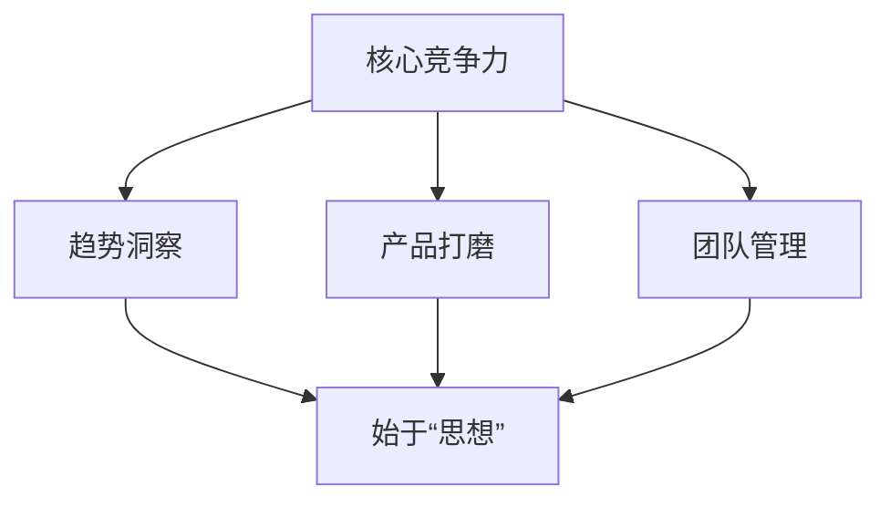

# 4.4-写作即编程：用文字构建思想体系

## 引子：思想的架构与文字的逻辑

2020年到2023年，这是一个充满变数与机遇的三年。疫情的冲击，市场的洗牌，让许多传统商业模式摇摇欲坠。然而，也正是在这样的背景下，数字化的浪潮汹涌而至，私域流量的价值日益凸显。我深知，无论外部环境如何变化，核心竞争力永远在于对趋势的洞察、对产品的打磨，以及对团队的有效管理。而这一切，都始于“思想”。

---
#### 核心竞争力构建流程


---

我常常说，写作即编程。这不是简单的比喻，而是我多年来实践与思考的结晶。如同程序员用代码构建复杂的软件系统，我用文字构建我的思想体系、我的商业逻辑。每一个字、每一句话，都是我思维的最小单元，它们被精心组织、逻辑严密，最终形成一个能够自我运行、不断迭代的“操作系统”。这个操作系统，就是我的“内核”。

## 事件展开：从产品到机制的深度思考

与李长俊和王路的多次深度交流，让我对“写作即编程”有了更深刻的理解。我们探讨过内容创作的精髓，精准流量的获取，以及如何打造个人IP。王路曾分享他对内容创作的看法，强调了精准流量和IP打造的重要性，这与我的“五行营销”理念不谋而合。他说：“内容是载体，流量是血液，IP是灵魂。”这让我更加坚信，优质的内容和清晰的逻辑，是吸引流量、沉淀用户的基石。

---
#### 写作即编程：思想体系构建

```mermaid
graph TD
    A[写作即编程] --> B[文字构建思想体系];
    B --> C[商业逻辑清晰化];
    C --> D[最小思维单元: 字/句];
    D --> E[精心组织/逻辑严密];
    E --> F[可自我运行/迭代的"操作系统"];
    F --> G[形成"内核"];
```
---

然而，光有流量和IP还不够。我曾直言不讳地指出：“产品第一，业务第二，包括机制第三。”这句话，是我在无数次试错和复盘后得出的真理。很多创业者只顾着追求流量，却忽略了产品的本质和业务的转化链路。当产品无法提供超值的价值时，即使再大的流量池也难以留存用户，最终只会陷入不断消耗时间与精力的困境。

我清楚地记得，在一次与李长俊的对话中，他提到一个项目方在获取大量客户后，因为没有完善的转化机制，导致客户流失严重。这让我更加坚定了“产品第一”的信念。我强调，所有的流量、所有的运营，都必须围绕着核心产品展开，并且要有一个清晰、可量化的交付标准。只有当客户真正从产品中获得了超值的收益，他们才会成为你最忠实的拥趸，甚至主动为你进行“隐形裂变”。

## 冲突与高潮：内核的缺失与信息差的价值

在与李长俊探讨一个投资项目时，他提到一个创业公司缺乏“内核”。他追问：“什么是内核？内核就是只有我公司有的，别人都没有。”我当时就指出，许多人所谓的“内核”只是空泛的概念，无法带来实际的商业价值。真正的内核，是独特的产品、是难以复制的运营模式、是深厚的行业认知。如果一个公司没有自己的内核，就很难在激烈的市场竞争中立足。

---
#### 商业核心要素与信息差价值

```mermaid
graph TD
    A[商业成功] --> B[拥有"内核"];
    B --> B1[独特产品];
    B --> B2[难以复制运营模式];
    B --> B3[深厚行业认知];

    C[信息差价值] --> C1[洞察市场规则];
    C --> C2[流量玩法理解];
    C --> C3[变现路径分析];
    C1 & C2 & C3 --> D[成熟模式1:1复制];
    D --> E[数据驱动/放大优化];
```
---

我们谈到了抖音的商业生态。我观察到，抖音上很多项目的营收和投流都变得非常透明。这让我看到了一个巨大的机会：“你赚的是信息差的钱。”这不是简单的搬运，而是基于对行业规则、流量玩法、变现路径的深刻理解，将成熟的、经过验证的项目模式进行“1:1复制”。比如，找到抖音上已经成功变现的“二奢包包”、“宠物医生”、“茶叶大胸美女跳舞”等IP，分析他们的朋友圈话术、视频内容、转化路径，然后进行像素级的复制。

这种复制，并不是简单的抄袭。它需要你具备“数据驱动”的能力，能够快速识别爆款内容，分析用户反馈，然后根据自己的资源优势（例如我拥有2000名兼职人员和完善的私域承接体系），进行放大和优化。李长俊曾提到，这种模式下，连思考都变得多余，只需要“傻白甜”地照抄朋友圈、照抄话术。这就是我所说的“写作即编程”在实际应用中的体现——通过结构化的思考和流程化的复制，将成功模式标准化，实现快速扩张。

## 人物内心独白与反思：自律与坚持的内核驱动

作为一个INTP，我深知自己内心的逻辑严谨和对效率的追求。我习惯将复杂的问题拆解为最小单元，然后通过编程式的思维，设计出最有效率的解决方案。这种“自律”和“坚持”，成为了我构建思想体系的“内核驱动”。即使面对“拖延倾向”，我也会努力通过这种结构化的思维方式来克服。

我反思，在创业的旅途中，我曾为自己的“高要求”买单，也曾因“不够霸气、书生气”而错失一些机会。但正是这些经历，让我更加坚定了对“产品第一”的信念，也让我意识到，真正的强大并非外在的张扬，而是内在的“认知升级”和“持续学习”。

## 结尾与悬念：文字的力量与财富的旅程

文字，不再仅仅是记录思想的工具，它成为了构建财富、连接资源、影响世界的强大力量。通过“写作即编程”，我将我的思想体系、我的商业模式、我的核心理念，以最清晰、最有效的方式呈现出来。这不仅让我的团队能够快速复制成功，也让我的合作方能够清晰地理解我的价值主张。

下一次，我将深入探讨“我在私域领域的布局：构建账号矩阵”，揭示我是如何运用这一思想体系，在私域流量的海洋中，构建起一个个高效、稳定的账号矩阵，实现流量的源源不断。 