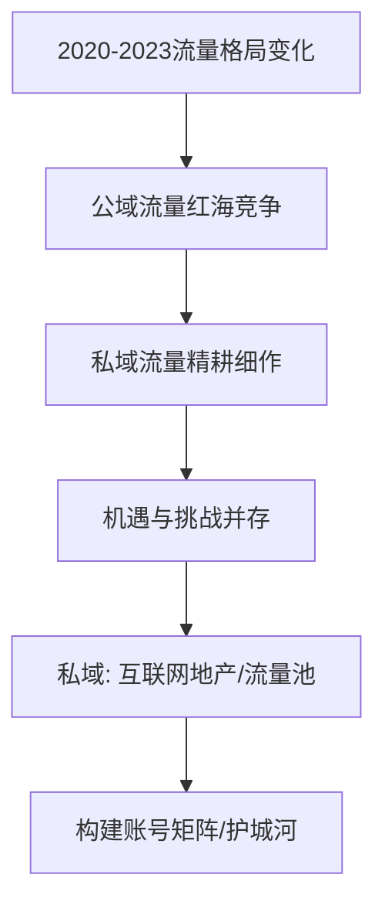
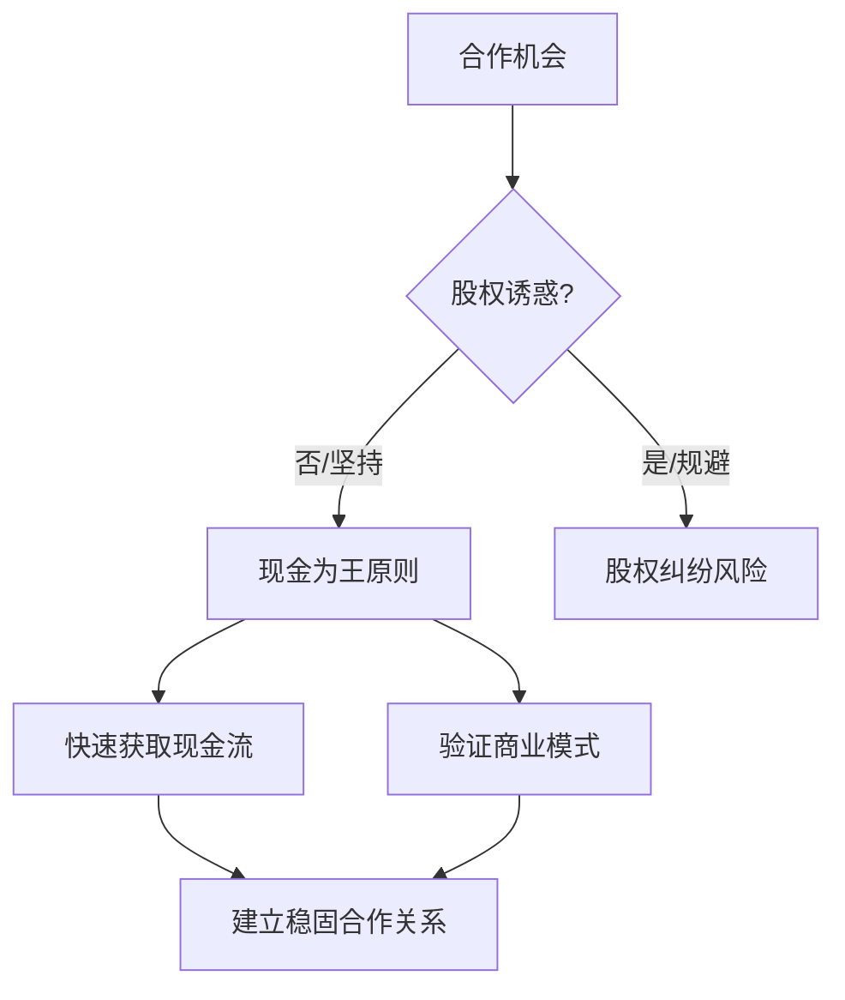

# 4.5-我在私域领域的布局：构建账号矩阵

## 引子：流量时代的"护城河"

在2020年至2023年这几年间，互联网流量的格局发生了翻天覆地的变化。从公域流量的红海竞争，到私域流量的精耕细作，每一次转变都意味着新的机遇和挑战。对我而言，私域不仅仅是一个营销概念，它更像是一片未被完全开发的"互联网地产"，谁能在这片土地上构建起自己的"账号矩阵"，谁就能拥有源源不断的"流量池"，从而建立起难以逾越的"护城河"。

---
#### 流量格局变化与私域战略


---

我深知，仅仅依靠单一平台或单一账号的流量是不可持续的。就像盖房子，只有地基打得牢，才能建造摩天大楼。我的目标是建立一个多平台、多账号的矩阵，将不同平台的流量引入我的私域池，再通过精细化运营实现转化和裂变。这正是我的"私域布局"的核心策略。

## 事件展开：从单点突破到全面复制

构建账号矩阵并非一蹴而就，它是一个从单点突破到全面"复制"的过程。在与李长俊和王路的交流中，我们多次提及"复制"的重要性。我曾提出，在抖音等平台上，许多成功的项目模式都具有极高的"可复制性"。例如，通过对"二奢包包"、"宠物医生"等成功IP的深入分析，我们可以提炼出他们的朋友圈话术、视频内容、转化路径，然后进行"像素级复制"。

---
#### 账号矩阵构建与复制流程

```mermaid
graph TD
    A[构建账号矩阵] --> B[单点突破];
    B --> C[全面复制];
    C --> D[成功模式可复制性分析];
    D --> E[像素级复制 (朋友圈/视频/转化路径)];
    E --> F[数据驱动/标准化执行];
    F --> G[云阿米巴团队分发/高效执行];
    G --> H[实现快速规模化];
```
---

这个过程，我将其比喻为"1:1复制"。这并非简单的抄袭，而是基于对"数据驱动"的深刻理解。我们通过数据分析，快速识别出哪些内容能够带来流量、哪些转化路径最为高效，然后将这些成功经验标准化，并分发给我的"云阿米巴"团队。这个团队，包括了30个抖音账号、我的开发团队、运营团队、兼职人员和合作伙伴，他们就像一个个独立的作战单元，在我的指挥下，高效地执行复制任务。

我还记得与李长俊讨论一个"素人IP"项目时，他提到只要找到成功的模式，即使是"傻白甜"也能照抄朋友圈、照抄话术。这恰恰印证了我的"写作即编程"理念——通过流程化的设计和标准化的执行，将复杂的商业模式变得简单易行，从而实现快速规模化。

## 冲突与高潮：股权诱惑与现金为王

在构建账号矩阵和拓展业务的过程中，我面临过许多合作机会，其中不乏以"股权"作为吸引力的诱惑。然而，我始终坚守一个原则："千万不要想着和别人分股份，股份永远没有现金性感。"这句话，是我在无数次合作实践中得出的经验教训。

---
#### 现金流与股权选择


---

我曾与一位朋友探讨过一个项目，对方希望通过股权合作来绑定资源。但我深知，在创业初期，最重要的是快速获取现金流，验证商业模式，而非陷入复杂的股权纠纷。现金流的稳定，才是企业生存和发展的基础。我更倾向于通过明确的现金激励，来驱动团队和合作伙伴的积极性，让他们在最短的时间内看到实实在在的收益。正如我所说的："产品第一，业务第二，包括机制第三。"一个清晰、可量化的现金回报机制，比任何股权激励都更具吸引力。

我追求的是"你赚的是信息差的钱"。这意味着，我的价值在于能够洞察市场空白、发现未被充分利用的资源，然后通过高效的运营和复制，将这些信息差转化为实实在在的收益。在这个过程中，我的"五行营销"理念发挥了关键作用，它指导我如何根据不同项目的属性，制定个性化的营销策略，实现流量的最大化利用和变现。

## 人物内心独白与反思：效率至上与持续迭代

作为一个INTP，我天生对效率和逻辑有着极高的要求。在"私域布局"和"账号矩阵"的构建过程中，我始终追求最简洁、最高效的路径。我深知，时间就是金钱，每一次不必要的沟通、每一次无效的尝试，都是对生命的浪费。因此，我将我的思想体系、我的运营模式，都设计得尽可能标准化和自动化，以便团队成员能够快速上手，减少磨合成本。

我反思，在过去的几年里，我始终在学习和迭代。面对市场变化，我从不固步自封。正是这种持续学习的姿态，让我能够不断地调整我的策略，优化我的"账号矩阵"，确保它始终保持活力和竞争力。我甚至会利用AI技术来辅助我进行团队成员的性格分析，以确保团队的协同效率达到最优。

## 结尾与悬念：无限可能与下一个风口

我的"私域布局"和"账号矩阵"不仅仅是一个商业模式，它更是一个不断生长、不断进化的生态系统。通过持续的"复制"和"数据驱动"，我不仅实现了流量的倍增，也为我的项目孵化提供了源源不断的动力。每一个新账号的加入，都意味着一个新的流量入口；每一次成功复制，都意味着一次商业模式的验证。

在下一个篇章中，我将探讨"加速原始积累，步入私域基础设施建设"，揭示我是如何将这些看似零散的流量和项目，整合成为一个强大的"私域基础设施"，从而为更大规模的商业扩张奠定基础。 