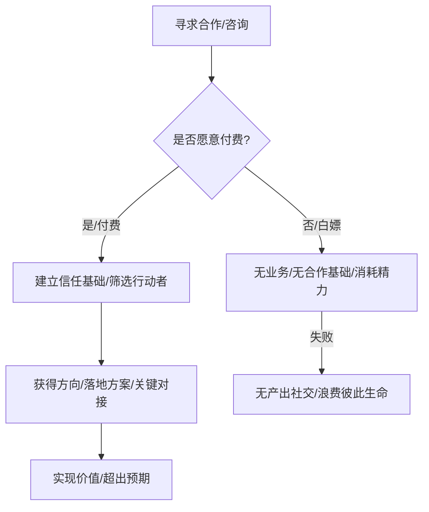
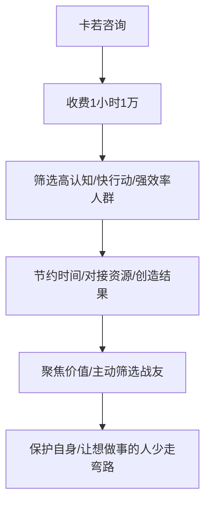
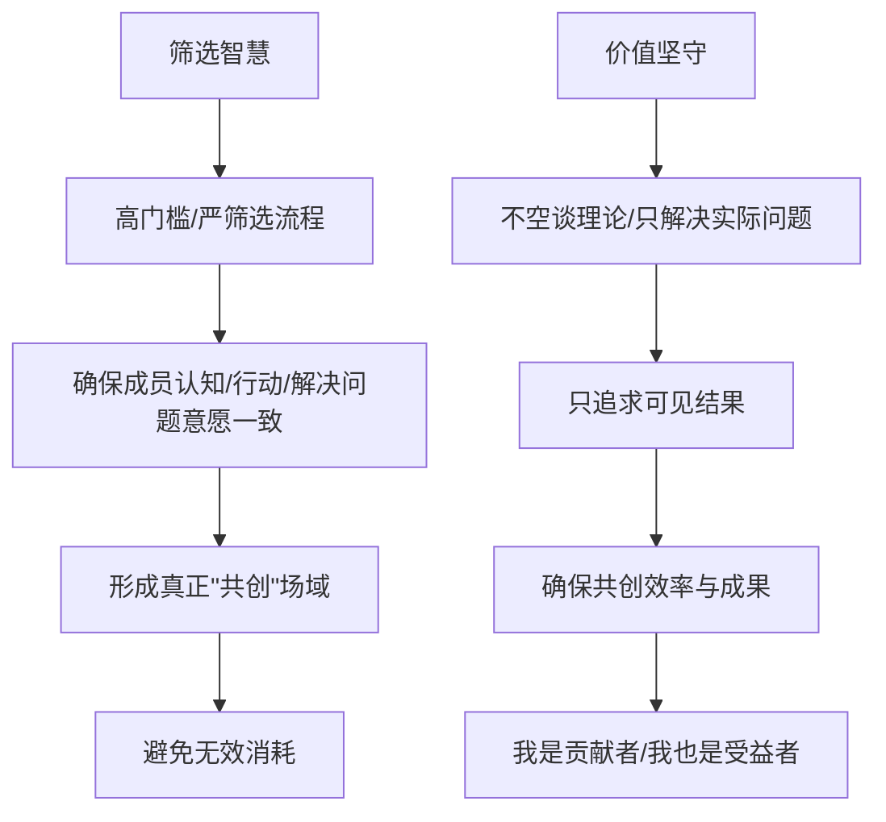

# 卡若：为什么找我咨询私域收费1小时1万

## 引子：价值交换的门槛

在我的IP财富旅程中，我始终坚信价值交换的等价性。时间是无价的，而我的经验和洞察更是通过无数实践与沉淀所得。因此，对于寻求合作和咨询的伙伴，我设定了一个清晰的规则，这既是对我自身价值的尊重，也是对真正有志于行动者的筛选。

---
#### 付费咨询筛选机制

---

不付费来交流的，就是白嫖。

你来找我，要么是要结果、要么是要方法。

否则——咱没业务，没合作基础，你找我干嘛？

光谈愿景、讲故事，聊卖货，那不如写小说去。

大家都搞事业，不把精力浪费在无产出社交上，那是对彼此不尊重。

又不是有业务直接合作，是消耗，是浪费彼此生命。聊合作，先拿诚意出来。

做生意又不是来交朋友的，是来解决问题、增加产出的

所以我的规则就一句话：

聊天收费，一小时一万，不定期涨价。
这不是自抬身价，是我能给到你更大价值的底气。

你跟我聊，我能给你方向、落地方案、关键对接，但别想着"意思一下"就来想要结果。

没沉没成本的交流，结局只有一个：各说各话，谁也不真投心力。

我见过太多"大饼画手"，讲得天花乱坠，最后啥也没落地。
为什么？因为从第一步就没建立信任基础——那就是"付费"。

为什么要给你流量池、私域打法、方法论、人才库，我只对认同价值、尊重时间、愿意投资的伙伴开放。

你看不上我没关系，但我也不打算免费证明自己。
这不是傲慢，这是商业常识：
没门槛的合作，不赚钱。没代价的承诺，全是空话。

我做私域十几年，吃过太多"试试"的亏、聊过太多"等一下"的人。
我现在只做一件事：
为值得的人，节省时间、对接资源、创造结果。

---
#### 高价值咨询的逻辑

---

所以你要跟我深入聊，有两种方式：
    1.  报课，两天快速落地个人6980，企业5万，课程能让你少走半年弯路；
    2.  咨询，1小时1万，直接讨论你最核心的商业以及私域问题。

如果你这两样都不愿意，那就别谈合作。

你再有项目、再大梦想，我不感兴趣。
你把钱和时间交给市场，把试错和团队交给试错，那是你的事。

因为我只相信"愿意投资"的人——
他们认知更高，行动更快，效率更强，也是我真正要共创的人。

我的咨询、课程、服务，私域变现AI、不是"产品"，而是筛选机制。
能进来的人，本身就是优质客户，也是潜在合伙人。

不是卖时间，而是聚焦价值。
不是被动等待合作，而是主动筛选战友。

我的底线清晰、规则透明，
既保护我自己，也让真正想做事的人少走弯路。

别跟我谈感情，咱们谈结果。
付费，是对价值的尊重，也是对合作的基本门槛。

如果你准备好了，就请你先出手——
我这边，马上给你答案，甚至超出预期。

这是我的风格，也是规则。

这种对"筛选"的坚持，也体现了我性格中"对他人有高要求"的一面。但我意识到，这种高要求并非苛刻，而是为了确保共创的效率和成果。在私董会中，每个人都是贡献者，也都是受益者。我们不空谈理论，只解决实际问题，只追求可见的结果。

---
#### 筛选智慧与价值坚守

---

## 结尾与悬念：共创的未来与更深层次的链接

那么，卡若私董会是诈骗集团吗？事实已经给出了最响亮的答案。它是一个汇聚智慧、解决问题、共创价值的平台。通过透明的机制、真实的案例、以及对"价值"的共同追求，我们正在打破外界的误解，构建一个真正有生命力的商业共同体。 