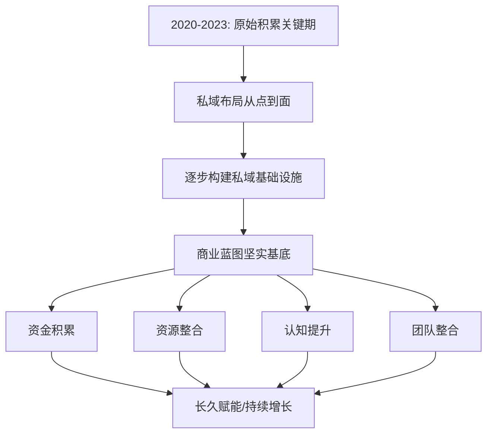
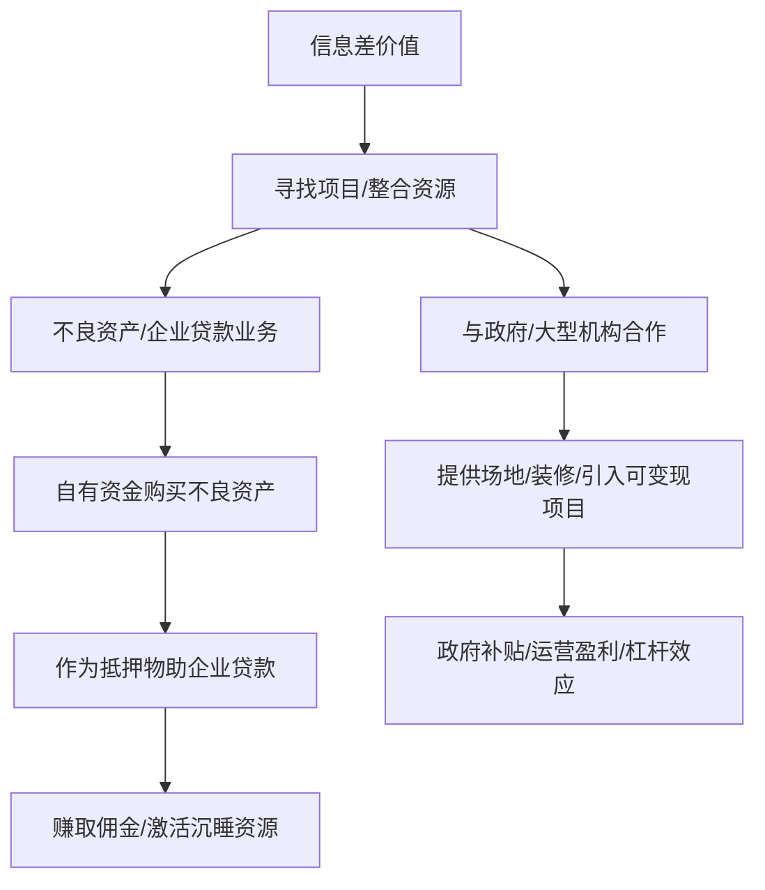

# 4.7-加速原始积累，步入私域基础设施建设

## 引子：积累的力量与基建的远见

2020年到2023年，对很多人来说是充满挑战的三年，但对我而言，这三年是加速"原始积累"的关键时期，也是我将私域布局从点到面，逐步构建"私域基础设施"的战略窗口。我深知，任何宏伟的商业蓝图，都离不开坚实的基底。而这个基底，不仅仅是资金，更是资源、认知和团队的整合。

---
#### 原始积累与私域基建


---

当我将目光从单一的流量变现转向更广阔的商业版图时，我意识到，过去的每一次尝试、每一次跌倒，都是在为今天的"基础设施建设"添砖加瓦。无论是早期在淘宝电商的摸索，还是后来在私域流量的深耕，每一次"产品第一，业务第二，包括机制第三"的践行，都让我对商业的本质有了更深刻的理解。我不再满足于短期的"横财"，而是追求能够长久赋能、持续增长的价值循环。

## 事件展开：从信息差到资源整合

"你赚的是信息差的钱。"这句话，在我和李长俊、王路的多次交流中被反复提及。这不仅仅是一句口号，更是我寻找项目、整合资源的核心逻辑。在2023年的一次深入对话中，我与李长俊探讨了不良资产和企业贷款的业务。他提到，许多企业有贷款需求，但缺乏优质资产，而市场上存在大量银行放出的不良资产，这中间就存在巨大的"信息差"。

---
#### 信息差价值与资源整合


---

我们发现，通过自有资金购买不良资产，再将其作为抵押物帮助优质企业获取银行贷款，不仅能赚取丰厚的佣金，还能激活大量的沉睡资源。李长俊详细描述了如何帮助企业嫁接高达2000万的房产抵押，实现千百万级别的贷款额度。这笔业务的利润点在于银行的"放宽"政策——银行为了完成KPI，愿意降低门槛。我清楚，这正是"信息差"带来的财富。

与此同时，我们也在探索与政府和大型机构的合作模式。李长俊提到，与一家国企合作，通过提供场地和装修，引入可变现的项目进行快速复制。例如，针对残疾人就业基地，提供住宿、餐饮、娱乐等一体化服务。这个项目不仅有政府补贴（一个人一年补贴可能高达几万），还能通过运营实现盈利。我看到了"杠杆"的力量——通过政府的支持和外部资金的注入，实现资源的快速整合和项目的规模化。

## 冲突与高潮：现金为王与体系搭建的博弈

在原始积累的过程中，我面临过许多关于合作方式的抉择。李长俊曾多次提及股权合作的诱惑，甚至有朋友提出对赌上千万的利润。然而，我始终坚持我的原则："千万不要想着和别人分股份，股份永远没有现金性感。" 我清楚，在企业发展的初期，现金流的稳定远比虚无缥缈的股权更重要。我宁愿通过明确的现金结算，让合作伙伴看到实实在在的收益，从而建立更稳固的合作关系。

---
#### 现金为王与体系搭建

```mermaid
graph TD
    A[合作方式抉择] --> B{股权合作诱惑?};
    B --否/坚持--> C[现金为王原则];
    C --> D[稳定现金流/明确现金结算];
    D --> E[驱动积极性/建立稳固合作];
    B --是/规避--> F[复杂股权纠纷/风险];

    G[私域基础设施建设] --> H[创新合作模式 (按结果付费)];
    H --> I[无人直播技术/云阿米巴模式];
    I --> J[模块整合/高效运转商业机器];
```
---

例如，在与广告牌副总的合作中，我们改变了传统的广告位租赁模式。我提出"按结果付费"，将广告位的收益与实际客资挂钩。一张广告牌，如果能为整形医院带来到店客户，我就能赚取450元的客资费用；即使客户只是加微信，也能赚取100元。这种创新的合作方式，让对方无法拒绝，也让我实现了"保不亏"的流量变现模式。这种模式的成功，在于我对"五行营销"的深刻理解和对市场行情的精准判断，将传统的广告模式升级为"数据驱动"的流量入口。

我甚至开始探索"无人直播"技术，将其视为一种实现"云阿米巴"模式的新途径。通过技术复制，让兼职人员能够操作多个抖音账号，实现流量的裂变式增长。这些都是我构建"私域基础设施"的具体实践——将一个个看似独立的业务模块，通过系统化的方法整合起来，形成一个高效运转的商业机器。

## 人物内心独白与反思：认知升级与风险把控

这几年，我深刻体会到"认知升级"的重要性。每一次与李长俊、王路、郑朝阳的交流，都是一次思维的碰撞，一次认知的跃迁。他们带来的新信息、新项目，都促使我不断地审视自己的商业模式，寻找更高效的解决方案。我从一个注重短期盈利的创业者，逐渐成长为一个具备长远战略眼光，懂得构建"基础设施"的操盘手。

我也学会了更好地把控风险。我不再盲目追求大而全，而是专注于那些经过验证、具备高"可复制性"的项目。我清楚，即使是"信息差"的钱，也需要严密的逻辑和流程来支撑。我宁愿花更多的时间去调研、去验证，也要避免不必要的试错成本。我的"拖延倾向"在这方面也发挥了积极作用，它让我有更多时间去思考和规划，而不是盲目行动。

## 结尾与悬念：无限可能与价值的延伸

原始积累并非终点，而是构建"私域基础设施"的起点。通过对不良资产的运作、对政府资源的整合、对广告模式的创新，我不仅积累了大量的资金，更积累了宝贵的经验和人脉。这些都将成为我未来商业扩张的坚实后盾。

我的"私域基础设施"正在逐步完善，它是一个集流量获取、项目孵化、资源整合、团队管理于一体的生态系统。未来，它将承载更多元的商业模式，实现更大规模的价值创造。我深信，在下一个阶段，我们将看到这个基础设施所带来的无限可能。

**干货分享：**
1.  **信息差是最大的财富：** 深入挖掘行业内部的"信息差"，找到被低估或未被充分利用的资源，并通过高效的运营和复制将其变现。
2.  **现金流为王：** 在原始积累阶段，优先追求稳定的现金流，而非过早地陷入复杂的股权纠纷。明确的现金激励能够更有效地驱动合作和团队。
3.  **构建可复制的体系：** 将成功的商业模式流程化、标准化，形成可供"1:1复制"的体系，并通过"云阿米巴"等模式实现快速规模化扩张。

下一步，我将更新`目录.md`，将这些已完成的章节状态进行同步。我也将对`PART4`下的所有已完成章节进行上下文连接和段落修改，确保内容衔接流畅。 