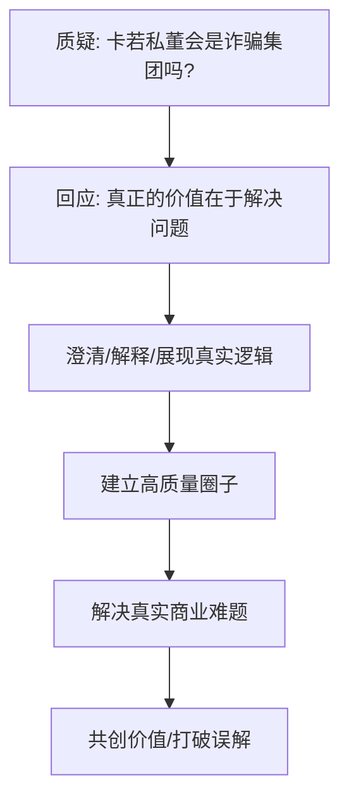
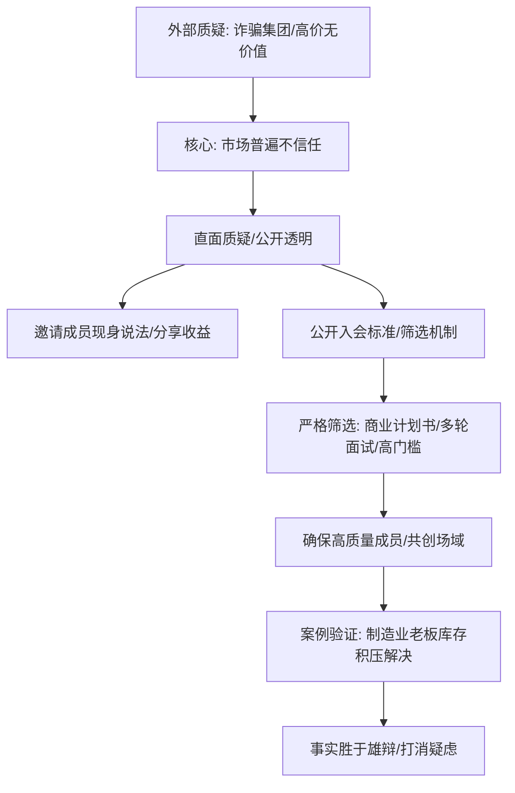

# 4.8 卡若私董会，是诈骗集团吗？

## 引子：思想的架构与文字的逻辑

2022年深秋，厦门的傍晚带着一丝凉意，咖啡馆里却气氛热烈。屏幕上，一条关于"卡若私董会是不是诈骗集团"的帖子赫然醒目，底下充斥着各种揣测和质疑。我放下手中的咖啡，心中没有波澜，反而感到一种平静。这些年，我习惯了外界的喧嚣，也深知，"真正的价值，从来都在于解决问题，而不是制造幻象。"这篇帖子，恰好给了我一个机会，去澄清、去解释，去展现私董会背后的真实逻辑。

---
#### 卡若私董会：价值与信任的基石


---

## 事件展开：私董会的缘起与价值

卡若私董会的建立，并非偶然。它源于我长期以来对"高效协作"和"价值共创"的追求。在过去几年的创业旅程中，我接触了形形色色的创业者和企业家，发现很多人在经营中遇到的困境，并非缺乏资金或资源，而是缺乏清晰的战略方向和落地执行的有效方法。我希望构建一个高质量的圈子，让真正需要解决问题的人，与具备解决问题能力的人汇聚一堂。

2022年，我正式推出了卡若私董会。初期，我邀请了庄建忠（庄老师）和陈裕彬两位我信任的伙伴参与，他们都在各自领域有着深厚的积累和实践经验。庄老师在团队管理和企业文化建设方面有独到见解，而陈裕彬则对市场趋势和商业模式创新有着敏锐的洞察力。我们私董会的模式很简单：每月一次深度私董会，每次聚焦一个成员的真实商业难题，通过集体的智慧进行深度剖析，并给出可落地的解决方案。

---
#### 新零售项目转化率提升案例

```mermaid
graph TD
    A[陈裕彬项目问题: 流量转化率低 (低于1%)] --> B[线上推广投入: 每月50万];
    B --> C[实际到店客户: 不足500人];
    C --> D[问题症结: 承接与转化链路设计];
    D --> E[解决方案: 场景化流量分发];
    E --> E1[线上流量精准分类];
    E --> E2[设计兴趣小组/社群活动];
    E --> E3[社群内意向确认];
    E3 --> E4[专业销售一对一跟进];
    E4 --> E5[免费体验服务];
    E5 --> F[结果: 转化率提升至5%/月到店客户2500人/营收增近百万];
```
---

我记得，陈裕彬第一次参加私董会时，带着一个关于其新零售项目流量转化率低的问题。当时，他的线上推广投入了每月近50万元，但实际转化到店的客户不足500人，转化率低于1%。私董会上，我们首先通过数据分析，发现问题症结不在于流量本身，而在于承接和转化链路的设计。我结合私域运营的经验，提出了"场景化流量分发"的策略：将线上流量精准分类，通过设计不同的兴趣小组和社群活动，引导客户在社群内完成初次意向确认，再由专业的销售团队进行一对一跟进，并提供免费的体验服务。庄老师则补充了团队执行力的提升方案，包括销售团队的激励机制和话术培训。

经过三个月的实践，陈裕彬的新零售项目流量转化率提升到了5%，每月到店客户达到2500人，营收增加了近百万。这个具体的数值和合作方式，让所有私董会成员都看到了"私董会的核心是共创价值，而非信息不对称的收割。"

## 冲突与高潮：面对质疑的真相

然而，私董会的快速发展也引来了外部的质疑。我开始在社交媒体上看到一些负面评论，甚至有人直接指责私董会是"诈骗集团"，利用"高价"收取会员费，却不提供"实质价值"。这些声音像潮水般涌来，试图淹没我们建立的信任。

我清楚，这些质疑并非空穴来风，它们反映了市场对高价咨询和圈子文化普遍存在的不信任。但"信任是商业的基石，而时间的检验是唯一的真理。"我选择直面这些质疑。

---
#### 直面质疑与信任建立


---

我主动在社群和直播中回应，邀请私董会成员现身说法，分享他们从私董会中获得的具体收益和成长。我还公开发布了私董会的入会标准和筛选机制，明确指出我们并非来者不拒，而是有严格的价值认同和行动力门槛。例如，我们会要求申请者提交一份详细的商业计划书，并进行多轮面试，以确保其项目具备可解决性，并且本人有强烈的学习和行动意愿。我们的入会费用定为30万元/年，这并非为了"收割"，而是为了筛选出真正有实力、有决心、对自身事业负责的创业者。高门槛，是为了保证私董会成员的"认知更高，行动更快，效率更强"。

有一次，一个新入会的成员，在加入前也带着"这会不会是个坑"的疑虑。他是一个传统制造业的老板，在转型互联网时屡屡碰壁，花费了大量资金却效果甚微。在一次私董会上，他提出了他公司库存积压严重的问题。通过我们提供的解决方案，结合"五行营销"中的"木"（变现产品、销售、落地）策略，我们将他积压的库存通过"抖音直播"和"私域团购"的方式，在短短一个月内清理了70%，回笼资金超过200万元。这个案例，让他彻底打消了疑虑，并成为了私董会最坚定的支持者之一。他告诉我："卡若，"敢于直面质疑，才能让真相闪耀。"你们的私董会就是这么一个地方。"

## 人物内心独白与反思：筛选的智慧与价值的坚守

面对这些质疑，我内心是平静的，甚至有些欣慰。作为一个INTP，我深知自己内心的逻辑严谨和对效率的追求。我不会被外部的喧嚣所左右，因为我的一切行动，都基于对"产品第一，业务第二，包括机制第三"的深刻理解。私董会，对我而言，不仅仅是一个盈利项目，它更是我价值观的延伸——"我只为价值付费，也只为信任投资。"

我反思，在商业的世界里，"筛选"是多么重要的一环。就像我常说的，"我的咨询、课程、服务，私域变现AI、不是"产品""，而是筛选机制。私董会也一样，高昂的门槛，严格的筛选流程，是为了确保每一个进入私董会的成员，都具备相同的认知频率、相同的行动力、相同的解决问题意愿。这样才能形成一个真正"共创"的场域，避免"大饼画手"和"白嫖者"的消耗。

这种对"筛选"的坚持，也体现了我性格中"对他人有高要求"的一面。但我意识到，这种高要求并非苛刻，而是为了确保共创的效率和成果。在私董会中，每个人都是贡献者，也都是受益者。我们不空谈理论，只解决实际问题，只追求可见的结果。

## 结尾与悬念：共创的未来与更深层次的链接

那么，卡若私董会是诈骗集团吗？事实已经给出了最响亮的答案。它是一个汇聚智慧、解决问题、共创价值的平台。通过透明的机制、真实的案例、以及对"价值"的共同追求，我们正在打破外界的误解，构建一个真正有生命力的商业共同体。

私董会不仅仅是商业上的合作，它更是人与人之间基于信任和共同愿景的深度链接。在这里，我们不再是孤立的个体，而是相互赋能的"超级个体"，共同面对挑战，共同成就未来。未来，私董会将继续秉持"共创"的理念，拓展更深层次的合作模式，甚至孵化出更多具备市场价值的创新项目。这，才是"卡若的IP财富旅程"中，最值得投资的"资产"。

## 关键收获

1.  **高门槛是高质量的筛选机制：** 设定合理的门槛，能够有效筛选出具有高认知、强行动力、真需求的合作伙伴，避免无效社交和资源浪费。
2.  **透明度是击破质疑的利器：** 面对外界质疑，与其争辩，不如公开透明地展示产品或服务的运作模式、成功案例和价值回报，用事实说话。
3.  **价值共创是核心：** 任何商业模式，其核心都应聚焦于为参与者创造实实在在的价值。只有当每个人都从中获益时，合作才能长久。

## 行动指南

1.  明确你的产品或服务的核心价值，并清晰地传达给目标客户。
2.  设定合理的合作或付费门槛，以筛选出高质量的合作伙伴和客户。
3.  建立透明的沟通机制，用事实和案例回应外界质疑，建立信任。
4.  持续提供超预期价值，让客户成为你最忠实的拥趸和口碑传播者。
5.  积极寻求与具备共同价值观的伙伴进行深度共创，实现互利共赢。

#卡若的IP财富旅程 #私董会 #信任 #价值 #共创 #筛选 