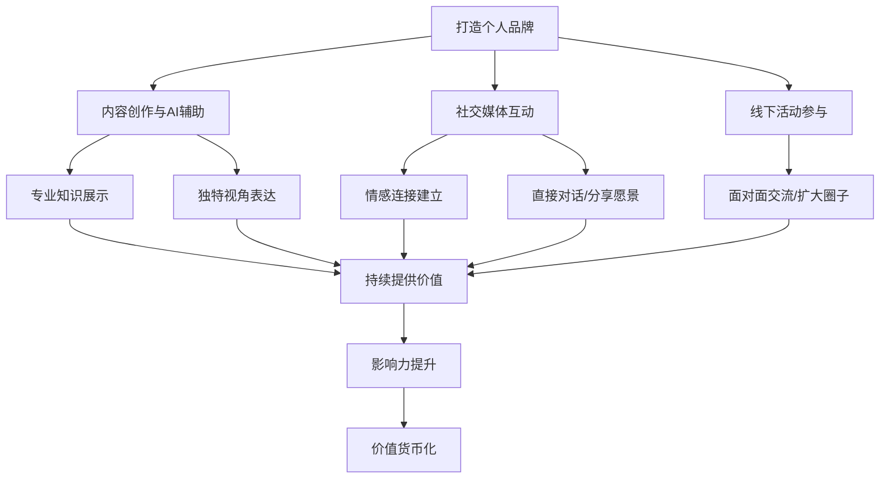
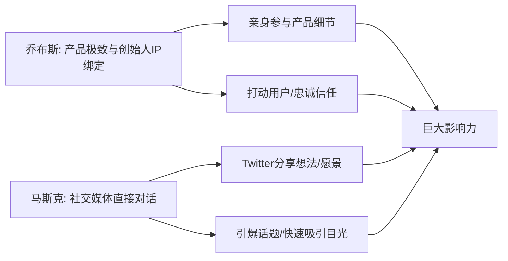
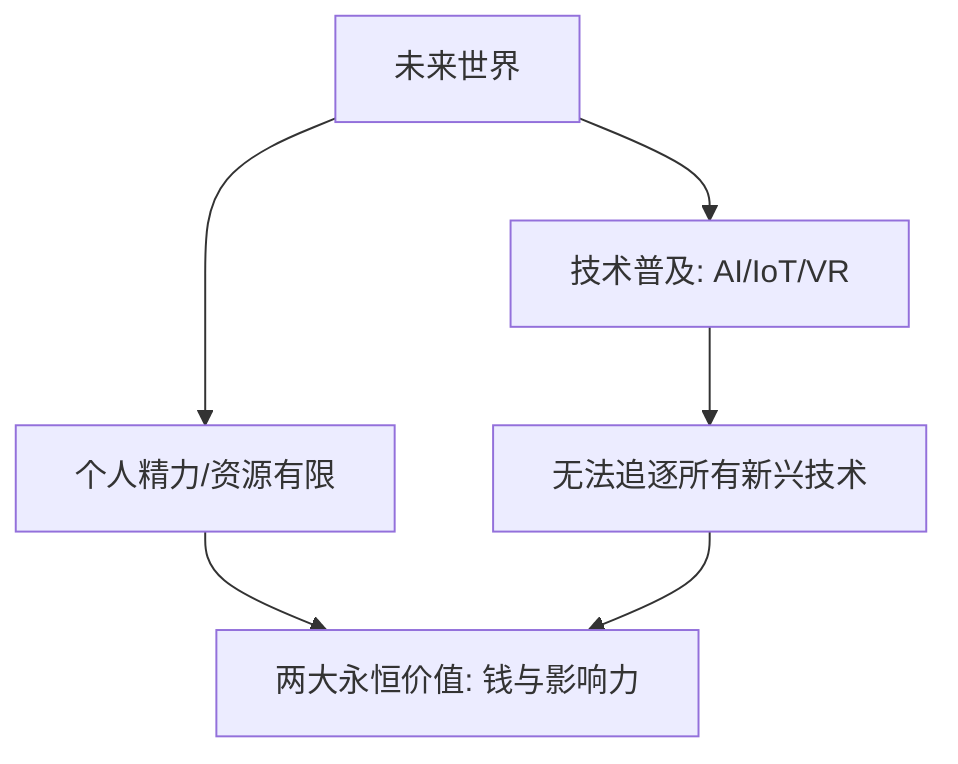

# 4.2 影响力是未来货币：打造个人品牌

## 内容概要

本章探讨了在当今互联网时代，个人影响力如何成为具有核心价值的"未来货币"，以及如何系统化地打造个人品牌。通过对比分析乔布斯、马斯克等成功人士的品牌塑造策略，阐述了打造个人品牌的核心方法论。内容涵盖了从内容创作、社交媒体互动到线下活动的全方位个人品牌建设路径，强调了持续提供价值和建立情感连接的重要性。文章以第一人称视角展现了我与团队在探索个人品牌打造道路上的思考与实践。

---
#### 个人品牌打造核心策略

---

## 正文

夜色降临，城市的霓虹灯闪烁，我站在公司的窗前。

今天的厦门格外繁华，街道上的车流如同流动的星河。

这一刻，我思绪万千，想到未来的无限可能性。人工智能、物联网、虚拟现实，这些新兴技术已经在改变世界的每一个角落。

而我们，正站在这个时代的前沿，必须思考着如何在构建私域"互联网地产"的基础上，进一步利用影响力，成为未来货币的掌控者。

天还没亮，产品会议室里聚集了公司的小伙伴，气氛凝重而充满期待。

我打开会议电视，展示了一张张数据图表，开始了今天的讨论：

"各位，今天我们要讨论的是如何打造一个有力的产品赋能有能力的人提升个人品牌影响力，在未来的市场中占据一席之地。"

[图片]

### 向成功者学习：个人品牌的典范

乔布斯在苹果的成功不仅仅是技术上的突破。他不仅仅是一个技术天才，更是一个营销大师。

他对产品的每一个细节都精益求精，坚信"细节决定成败"。

---
#### 乔布斯与马斯克的品牌策略对比

---

例如，iPhone的每一代发布，他都会亲自参与，从设计到功能，再到发布会的每一个环节。他深知，只有真正打动用户，才能获得他们的忠诚和信任。

超级的产品交付和创始人IP的绑定，使得乔布斯获得巨大的影响力。

马斯克则是通过社交媒体打造个人品牌的典范。

他善于利用Twitter，与粉丝和公众直接对话，分享他的想法和火星愿景。

无论是SpaceX的火箭发射，还是特斯拉的新车发布，他都能通过简短的推文引爆话题，迅速吸引全球目光。

他的每一次发言，都是一次精准的品牌营销。

### 未来影响力的核心价值

"未来的主流技术将是人工智能、物联网、虚拟现实等，这些技术将像今天的电脑和智能手机一样普及。"

"但每一个人的精力和资源是有限的，我们无法追逐每一个新兴技术。

---
#### 未来核心价值要素

---

然而，有两样东西是我们可以掌控并在未来永远值钱的：钱和影响力。"

会议中，小伙伴们纷纷发表意见。

一位小伙伴提出了一个尖锐的问题："卡若，资源有限的情况下，一个人如何在短时间内扩大自己的影响力？"

"这正是我们今天要解决的问题。"我回答道。

### 打造个人品牌的系统方法

"具体该怎么做？"另一位合伙人问道。

"我们可以从两方面入手，"我解释道，"首先，通过AI协助IP内容创作，展示个人专业知识和独特视角，在短视频上与粉丝互动，建立情感连接。

其次，咱们需要一个产品协助生产矩阵账号、以及私域AI自动化，提升个人的曝光，获得影响力。"

[图片]

关于提升个人影响力，小伙伴有人提议提升演定要聚焦在一个平台和领域的投入，有人建议吸引粉丝到线下参与活动，但如何权衡投入与产出，如何确保每一步都能最大化个人影响力，成为了讨论的焦点。

讨论逐渐激烈，每个人都希望找到最有效的途径。

### 从战略到战术：个人品牌的全面布局

会议结束后，我一个人留在会议室里，望着窗外的夜景，反思今天的讨论。

乔布斯的成功不仅依赖于他的技术，更在于他的个人品牌影响力。

马斯克利用社交媒体，塑造了一个勇于探索未来的形象。雷军则通过个人魅力，带动了小米的成长。

[图片]

我知道，影响力的本质在于持续不断地提供价值，与观众建立深度的情感连接。

这不仅仅是一个营销策略，更是一种长期的承诺和责任。

夜深了，我的思路逐渐清晰。

未来，我们将打造一款产品，通过一系列创新策略，从AI矩阵化的内容输出到社交媒体互动，再到线下活动，全方位提升个人品牌影响力。

这将是一个持续不断的过程。

[图片]
[图片]

### 影响力货币化：从品牌到变现

个人品牌影响力的最终目的，是实现价值的货币化。这不仅仅是简单的带货或广告，而是创造一个完整的商业生态系统。

通过构建个人品牌，我们能够吸引更多的受众，建立更深的信任关系，从而实现更高效的商业转化。无论是知识付费、咨询服务、还是产品销售，都能够在个人品牌的加持下事半功倍。

正如我在会议中强调的那样，"影响力是未来货币"，谁拥有了影响力，谁就拥有了未来的竞争优势。而打造个人品牌，正是积累这种影响力的最有效途径。

## 关键收获

1. **影响力是未来货币** - 在技术飞速发展的时代，个人影响力将成为稀缺且宝贵的资产
2. **个人品牌三要素** - 专业知识展示、情感连接建立、价值持续交付
3. **内容矩阵策略** - 利用AI辅助进行多平台、多形式的内容创作，提高品牌曝光度
4. **社群运营闭环** - 从公域流量到私域转化，再到线下活动，形成完整的粉丝培养体系
5. **品牌价值货币化** - 打造个人IP的最终目的是实现商业价值，创造可持续的收入来源

## 行动指南

1. 梳理个人核心竞争力，找到自己的专业领域和独特价值主张
2. 建立内容创作计划，确定主要发布平台和内容形式
3. 开发AI辅助工具，提高内容创作效率和质量
4. 设计私域引流和运营策略，将公域粉丝转化为私域资产
5. 制定品牌价值变现计划，探索多元化的收入渠道

#卡若的IP财富旅程 #个人品牌 #影响力变现 #IP打造

