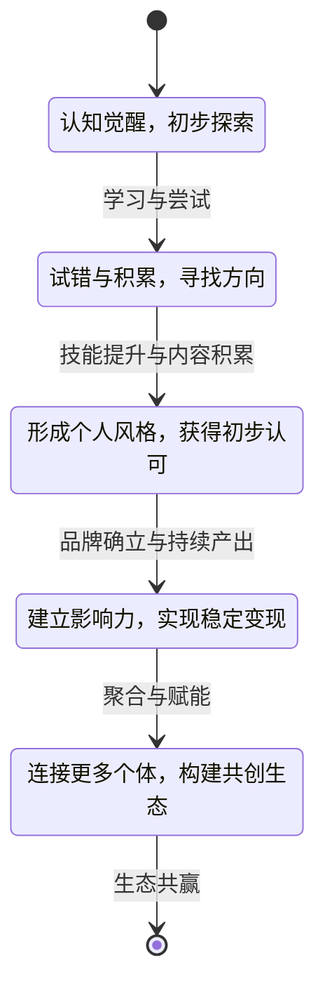
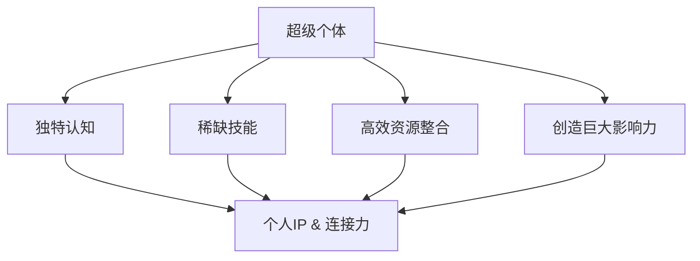
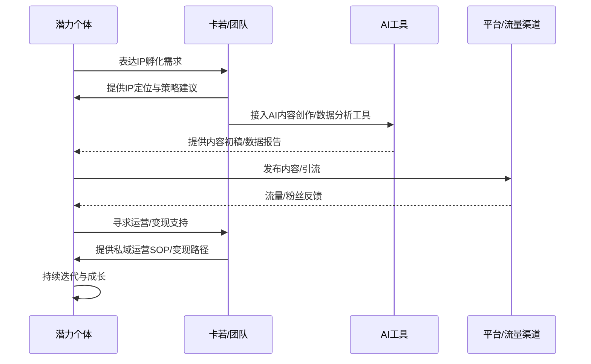
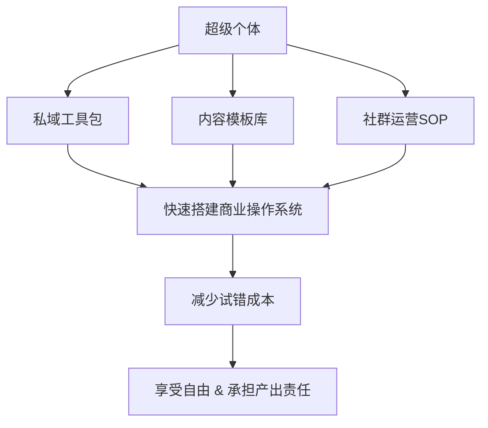
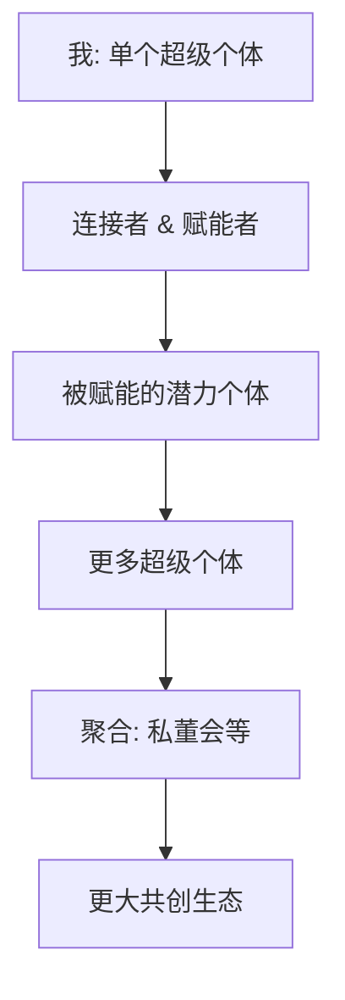
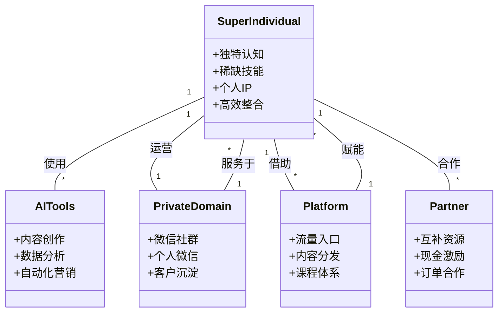
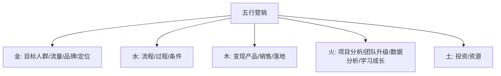
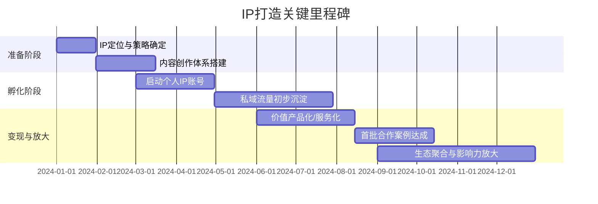

# 5.1 超级个体

## 引子：个体崛起的时代浪潮

2023年，站在厦门环岛路的沙滩上，海风吹拂着我的脸庞，思绪却飞向了更远的未来。过去几年，我见证了互联网从流量红海到私域深耕的转变，也亲身实践了如何构建数字资产，如何通过私董会实现价值共创。然而，在这些探索的背后，我逐渐意识到一个更深层次的趋势正在悄然兴起——"超级个体"的时代。

---
#### 超级个体成长状态图

---

这不再是传统意义上的"自由职业者"或"斜杠青年"，而是那些拥有独特认知、稀缺技能，并能够高效整合资源、创造巨大影响力的个体。他们不再依附于大型组织，而是凭借个人IP和连接力，在数字世界中开辟自己的领地。正如我常说的，"个体崛起的时代，认知决定你的高度，链接决定你的广度。"这不仅仅是一种趋势，更是一种必然，也是我在IP财富旅程中，对未来商业形态的深刻预判。

---
#### 超级个体特征

---

## 事件展开：从团队赋能到个体孵化

我的"云阿米巴模式"在过去几年中取得了显著成功，通过将大团队拆分为小单元，实现了高效运营和利润共享。但在实践中，我发现了一些更有趣的现象：那些表现最突出的小团队负责人，他们不仅能完成既定任务，还能主动思考、积极创新，甚至开始构建自己的小影响力圈子。这让我意识到，传统的管理模式虽然有效，但如何进一步激发个体的潜能，让他们从"螺丝钉"变成"引擎"，才是未来的关键。

2023年中，我与李长俊进行了一次深度交流。他当时正在为一个内容创作团队的效率瓶颈而烦恼。我向他分享了我的"写作即编程"理念，并提出了"赋能个体，构建IP"的策略。我建议他，与其仅仅关注内容的量产，不如帮助团队中的优秀写手打造个人IP，让他们成为各自领域的KOL。例如，一个擅长情感文案的写手，可以帮助他规划个人抖音账号，分享写作技巧，积累粉丝，从而实现从"写手"到"情感导师"的升级。我们还探讨了如何利用AI工具，为这些个体提供内容创作、数据分析、用户运营等方面的支持，让他们能够更高效地进行创作和变现。

---
#### IP孵化与AI赋能流程

---

我与陈华宇（樊登陈总）的合作也印证了"超级个体"的巨大潜力。樊登读书本身就是一个强大的内容IP平台，其庞大的用户群体和知识体系为个体提供了肥沃的土壤。我与陈总探讨了如何将樊登读书的优质内容与我的私域流量运营经验相结合，帮助更多知识付费领域的讲师、咨询师打造个人品牌。例如，一位在樊登读书有课程的老师，通过我的私域引流和社群运营方案，将其课程用户沉淀到自己的微信社群，再通过每周一次的线上直播答疑、每月一次的线下沙龙，将普通学员转化为高粘性粉丝，甚至成为其付费咨询的客户。这种合作，让个体在平台的赋能下，实现了价值的倍增。

---
#### 模块化赋能解决方案

---

## 冲突与高潮：自由与责任的博弈

然而，"超级个体"的崛起并非没有挑战。我曾观察到一些追求极致自由的个体，他们在获得巨大影响力的同时，也面临着自我管理、持续产出和风险抵抗的巨大压力。他们享受着"真正的自由，是掌控自己的时间，创造无限的价值"的快感，但有时也会陷入缺乏团队支持、资源匮乏的困境。这让我反思，如何才能让"超级个体"在自由生长的前提下，也能拥有持续发展的韧性。

在一次与黄鹭的对话中，她提到了一个案例：一位曾经风光无限的个人IP，因为内容更新频率降低、与粉丝互动减少，导致影响力迅速下滑。黄鹭强调，"你的IP，就是你在这个世界的通行证，也是你最稳固的资产。"但这资产需要持续的维护和投入。这让我意识到，虽然强调个体自由，但"超级个体"同样需要一套严谨的系统和机制来支撑。这就像编程一样，一个再强大的程序，也需要不断的迭代和维护，才能避免崩溃。

我开始思考，如何将我的"产品第一，业务第二，包括机制第三"的理念，应用于"超级个体"的孵化。我提出了"模块化赋能"的解决方案：为超级个体提供标准化、可复制的"私域工具包"、"内容模板库"、"社群运营SOP"等。例如，我的"存客宝"AI私域工具，就可以帮助超级个体高效管理私域流量，进行自动化营销；我的抖音账号矩阵运营经验，可以转化为可供个体学习和实践的流量获取方法论。这些工具和方法，就像编程语言和开发框架，让个体能够快速搭建起自己的商业操作系统，减少试错成本，从而在享受自由的同时，也能承担起持续产出的责任。

---
#### 从"我"到"我们"的聚合

---

## 人物内心独白与反思：效率与共情的融合

作为一个INTP，我对效率和逻辑有着天生的偏执。我深知，在"超级个体"的赛道上，效率是生命线。然而，我也不断提醒自己，在追求效率的同时，不能忽视"共情能力"的提升。因为"超级个体"的成功，不仅仅是技术和策略的胜利，更是与用户建立情感连接、获得深度信任的胜利。

我反思，在过去的某些时刻，我可能因为过于追求效率而显得"不够霸气，有些书生气"，甚至在与人交流时显得"不够注意外在形象"。这些都是我在"超级个体"道路上需要不断磨砺的方面。真正的"超级个体"，是能够在理性与感性之间找到平衡的。他们既能用数据和逻辑驱动决策，也能用真诚和温度赢得人心。

我逐渐认识到，"从'我'到'我们'，超级个体的力量在于聚合与赋能。"我不再仅仅是输出者，更是连接者和赋能者。我将我的经验、我的资源、我的工具，开放给那些有潜力的个体，帮助他们成为"超级个体"，再通过私董会等形式，将这些"超级个体"聚合起来，形成一个更大的共创生态。这，就是我在IP财富旅程中，对"放大影响力"的最新实践。

---
#### 超级个体生态关系图

---

## 结尾与悬念：无限聚合与生态共赢

"超级个体"的崛起，正在重塑商业世界的版图。他们不再是产业链的末端，而是价值创造的核心。通过自我IP的构建、高效的资源整合、以及系统化的运营，他们正在证明，一个人也可以撬动巨大的商业杠杆。这是一种新的商业范式，也是我在未来十年将持续深耕的领域。

那么，当这些"超级个体"进一步聚合，他们又将形成怎样的组织形态？传统的"公司"概念是否会被颠覆？在下一个篇章中，我将深入探讨"超级企业：构建生态化的组织"，揭示当"超级个体"的力量被无限聚合时，我们将如何构建一个开放、共赢、持续进化的商业生态系统。

## 关键收获

1.  **超级个体的核心竞争力：** 独特认知、稀缺技能、高效资源整合能力。
2.  **IP是超级个体的通行证：** 持续打造个人IP，是建立信任、获取影响力的关键。
3.  **系统化赋能而非简单管理：** 为超级个体提供标准化工具和方法论，帮助他们高效产出。
4.  **平衡自由与责任：** 享受个体自由的同时，也要承担持续产出和风险抵抗的责任。
5.  **从个体到生态的聚合：** 超级个体的力量在于聚合与赋能，形成更大的共创生态。

---
#### 卡若的五行营销模型

---

---
#### IP成长里程碑

---

## 行动指南

1.  审视自身核心能力与优势，明确个人IP的定位和发展方向。
2.  学习并运用AI工具，提升内容创作、运营管理、数据分析的效率。
3.  主动连接行业内的优秀个体和资源，构建高质量的社群和协作网络。
4.  设定明确的个人产出目标和行动计划，培养持续学习和迭代的习惯。
5.  尝试将个人能力产品化、服务化，探索多元化的变现路径。

#卡若的IP财富旅程 #超级个体 #个人IP #赋能 #协作 #未来趋势 