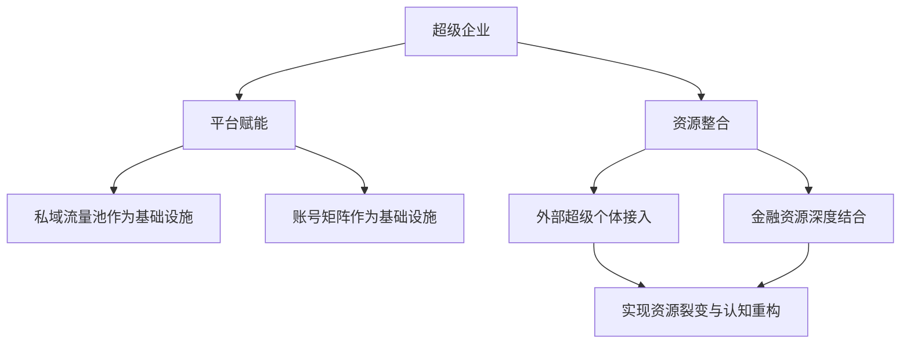
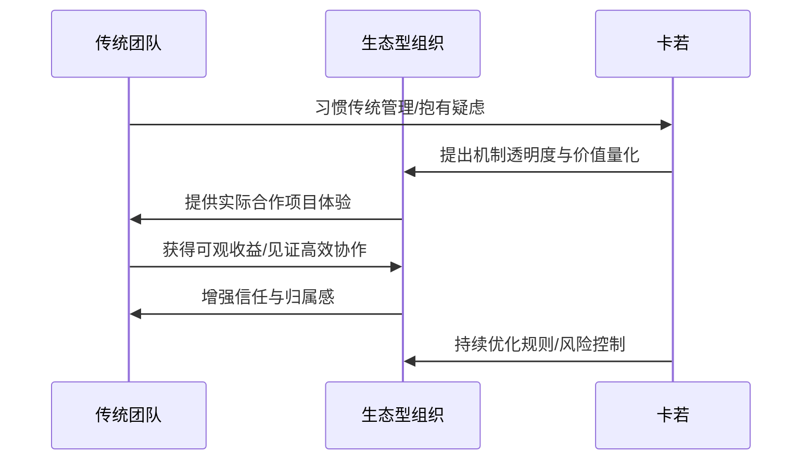
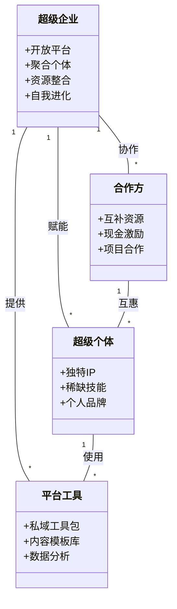

# 5.2 超级企业：构建生态化的组织

如果说"超级个体"是未来商业世界中不可或缺的细胞，那么"超级企业"则是我对这些细胞无限聚合、共生共荣的终极构想。当我凝视着窗外这座充满活力的城市，脑海中浮现的不再是传统企业僵化的组织结构，而是如同自然生态系统般开放、动态、自进化的商业有机体。这不仅是我对未来商业模式的深层思考，更是我在IP财富旅程中，从掌控流量到构建生态的必然演进。正如我所言，"未来的企业，不再是层级森严的金字塔，而是开放、共生的生态系统。"

---
#### 平台赋能与资源整合模型

---

## 事件展开：平台赋能与资源整合

在构建"超级个体"的同时，我深知，单一个体的力量终究有限。如何将这些拥有独特IP、稀缺技能的"超级个体"聚合起来，形成远超单体之和的"超级企业"，是我2024年以来持续探索的核心命题。这并非简单的并购或合作，而是通过搭建一个开放的平台，实现资源的裂变与认知的重构。

我与杨红的多次交流，让我对"平台赋能"有了更深刻的理解。杨红在行业内拥有广泛的资源和深厚的人脉。我们探讨了如何将我的"私域流量池"和"账号矩阵"作为基础设施，向外部的"超级个体"开放。例如，一家在抖音上拥有百万粉丝的探店博主，如果缺乏私域运营的经验，我们可以提供"存客宝"AI私域工具、专业的私域运营SOP、以及兼职团队的支持，帮助她将粉丝沉淀到私域，实现更高的商业转化。杨红则负责对接更多像这样的优质个体，扩大平台的合作广度。

与王诚鹏的合作，则更多地体现在"资源整合"层面。王诚鹏在金融、不良资产处置领域拥有丰富的经验和资源。我们计划将我们的私域流量与他的金融产品进行深度结合，实现流量的金融化变现。例如，通过我的抖音短视频和私域社群，筛选出有资金需求的企业主，然后将这些需求精准匹配到王诚鹏手中的金融产品或不良资产。这不仅拓宽了我的变现路径，也为王诚鹏提供了源源不断的精准客户。王诚鹏曾说："当个体力量无限聚合，企业的边界将消融，价值将无界延伸。"这句话，完美诠释了我们对"超级企业"的共同愿景。

我们甚至开始尝试"去中心化"的协作模式。与李冰（木子）和吉咪宇（小吉）的合作，不再是传统的雇佣关系，而是基于项目合作的"合伙人"模式。他们各自负责一个独立的项目模块，拥有高度的自主权和分润机制。例如，李冰负责内容孵化，吉咪宇负责技术开发。我只提供核心的私域基础设施、数据分析工具和战略指导，让他们像独立的"插件"一样，在我的"生态系统"中自由生长，并共享生态带来的价值。这让我看到了"只有让每个参与者都能找到自己的价值，生态才能生生不息"的真谛。

## 冲突与高潮：去中心化的挑战与信任的构建

然而，构建这样一个"生态化组织"并非没有挑战。最大的挑战在于"信任"的构建和"去中心化"管理。传统的企业，通过层级和制度来约束员工，而生态型组织则更依赖于共同的愿景、清晰的规则和强大的信任。我曾与陈鹭明（明哥）探讨过这个问题，他是一位在传统企业管理方面经验丰富的资深人士。他提醒我，在去中心化模式下，如何确保信息的透明、利益的公平分配，以及如何避免"搭便车"现象，是必须解决的难题。

我清楚，这些挑战如同编程中的"Bug"，需要不断地测试、修复和迭代。我将我的"产品第一，业务第二，包括机制第三"的理念进一步深化，强调"机制的透明度"和"价值的量化"。例如，我们开发了一个内部协作平台，清晰记录每个"超级个体"或项目团队的贡献，并实时同步分润数据。这样，每个人都能看到自己的付出如何转化为实际收益，从而增强对生态的信任和归属感。明哥也提出了一些关于风险控制和法律合规的建议，这些都被我纳入了生态系统的规则设计中。

---
#### 去中心化协作挑战与信任构建流程

---

最让我印象深刻的是一次与一个外部团队的磨合。他们习惯了传统企业的管理模式，对"去中心化"和"共创"抱有疑虑。我没有强行灌输我的理念，而是通过一个实际的合作项目，让他们亲身体验"生态协作"的优势。在这个项目中，他们负责一个垂直领域的流量获取和内容创作，而我提供私域承接和转化方案。项目成功后，他们不仅获得了可观的收益，更重要的是，他们看到了另一种高效的商业协作模式。这让我更加坚信，"我的终极财富，不是金钱的数字，而是不断进化的共创生态。"

## 人物内心独白与反思：边界的消融与认知的拓宽

作为一个INTP，我天生对复杂系统的构建充满热情。从早期的网站建设到私域流量池，再到"超级个体"的孵化，我的每一次探索，都是在不断拓展商业的边界，重构我对"企业"的认知。我反思，过去的我可能过于关注"我"的成就，而如今，我更愿意看到"我们"的崛起。我的拖延倾向，在这方面也起到了积极作用，它让我有更多时间去思考和规划，而不是盲目行动，从而让每一次决策都更具战略性。

我意识到，真正的"超级企业"不再是一个封闭的实体，而是一个开放的平台，它能够不断吸纳外部的优秀个体和资源，实现自我进化。这就像一个无限生长的"代码库"，每个"超级个体"都是一个独立的"模块"，他们可以自由地组合、连接，创造出无限可能的产品和服务。我不断提醒自己，要保持"谦逊"和"开放"，因为未来的商业世界，是一个充满不确定性但也充满无限可能的世界。

---
#### 超级企业生态系统

---

## 结尾：生态的未来与无限的价值

"超级企业：构建生态化的组织"，是我对未来商业形态的终极答案。它不仅仅是一种商业模式，更是一种哲学理念——关于自由、协作、信任和无限价值的哲学。通过搭建开放的平台，赋能"超级个体"，实现资源的无缝整合与价值的裂变，我们正在打破传统企业的壁垒，构建一个真正能够适应未来、引领未来的商业生态。

这个生态，将不断生长、自我修复、持续进化。它不会被单一的领导者所定义，而是由每一个参与其中的"超级个体"共同塑造。我的IP财富旅程，也将在这个生态中，找到最广阔的舞台，实现最深远的价值。这不仅仅是我的故事，更是未来商业的故事。

## 关键收获

1.  **从"超级个体"到"超级企业"的跨越：** 将具有独特IP和技能的个体聚合，通过平台赋能实现价值倍增。
2.  **构建开放、共生的生态系统：** 突破传统企业边界，通过共享资源、透明机制实现共赢。
3.  **去中心化协作与信任管理：** 依赖共同愿景、清晰规则和强大信任，而非层级制度来管理生态。
4.  **机制透明与价值量化：** 确保每个参与者的贡献和回报清晰可见，增强生态的凝聚力。
5.  **持续进化与自我修复：** 生态系统如同代码库，需要不断迭代、修复，以适应市场变化。

## 行动指南

1.  识别并链接更多具有"超级个体"潜力的合作伙伴，共同拓展市场。
2.  持续优化并开放你的核心资源和平台工具，为外部个体提供赋能。
3.  探索并实践去中心化协作模式，建立基于信任和透明的合作机制。
4.  重视生态系统的健康发展，定期评估各方价值贡献，并及时调整策略。
5.  保持开放心态，持续学习，适应未来商业模式的演变。

#卡若的IP财富旅程 #超级企业 #生态组织 #去中心化 #共创 #未来商业 