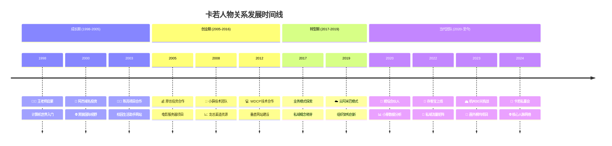
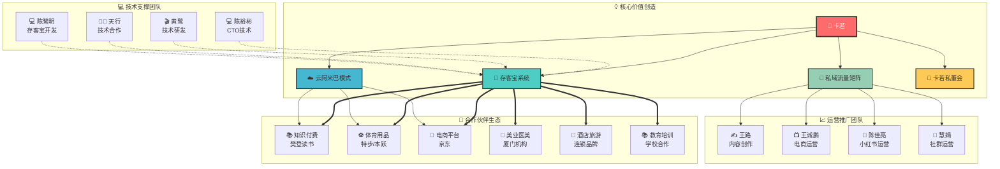
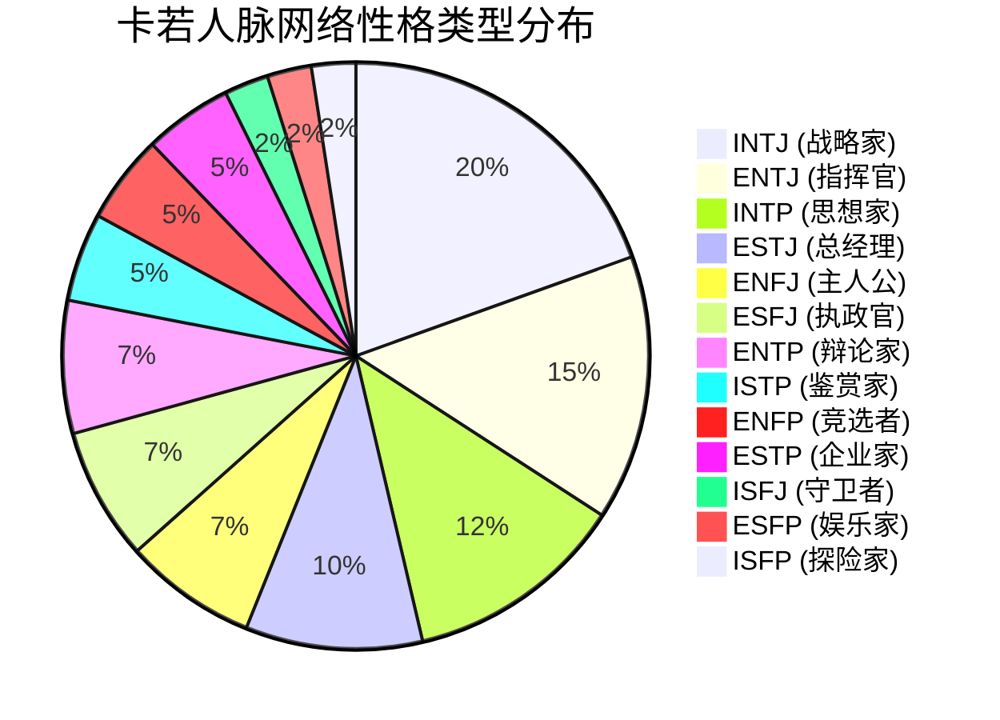

# 《卡若的IP财富旅程》人物关系图

> **文档说明**：本文档记录了卡若在26年创业历程中的重要人物关系网络，按时间线和关系类型进行分类整理。
> 
> **使用指南**：在写作中使用人物时，应先阅读此人物关系图，确保人物特性、关系和背景的一致性。

---
## 📋 目录导航

- [主角档案](#主角档案)
- [家庭成员](#家庭成员) 
- [成长期人物(1998-2005)](#成长期人物1998-2005)
- [创业期人物(2005-2016)](#创业期人物2005-2016)
- [当代核心团队(2020-至今)](#当代核心团队2020-至今)
- [重要企业合作伙伴](#重要企业合作伙伴)
- [杭州30天挑战团队](#杭州30天挑战团队)
- [关键概念与项目](#关键概念与项目)
- [人物关系网络统计](#人物关系网络统计)

---

## 主角档案

### 🎯 卡若（核心主角）
- **背景**：出身海军家庭，母亲来自鎏金雕刻艺术家族。
- **性格**：自律，坚持。外在形象不够注意，不够霸气，有些书生气。浪漫程度高，喜欢制造惊喜，但在确定关系之前不会先付出。
- **性格测试结果**：
  - MBTI：INTP (I=56.3%, N=61%, T=36.8%, P=41.2%)
  - PDP：老虎29分+孔雀23分
  - DISC：力量21分+活跃8分+和平4分+完美7分
- **擅长领域**：五行营销，私域运营，编程（c#、Java、React、私域系统架构）
- **资源情况**：拥有30个抖音本地创业者账号，日播放量>10000，厦门本地创业者为核心受众；团队架构：2名开发+1名运营+30名兼职+5个合伙人；服务10家企业使用"私域银行"；独创"云阿米巴"模式。
- **健康状况**：2018年6月查出糖尿病，2024年查出肝硬化。

## 👨‍👩‍👧‍👦 家庭成员

### 👴 爷爷
- **身份**：水电行业公务员，村里少有的"干部"
- **性格类型**：ENTJ（理性、善于观察、擅长协调）
- **影响**：以理性分析、引导思考为主，经常带卡若观察社会现象，鼓励独立思考和逻辑推理，尊重个体差异。

### 👨 父亲
- **身份**：海军出身，后在电力公司工作
- **性格类型**：ENTP
- **特点**：为子女教育付出很多，尊重卡若的独立性格。

### 👩 母亲
- **背景**：鎏金雕刻艺术世家
- **职业**：家庭主妇
- **性格类型**：ESFJ（温和、细腻、支持型）
- **特点**：鼓励卡若做自己喜欢的事，尊重其兴趣。

### 👴 外公
- **身份**：鎏金佛像手艺人
- **性格类型**：INTJ（专注、安静、追求极致）
- **影响**：以工艺精神和专注力影响卡若，鼓励钻研和创新。

## 🌱 成长期人物（1998-2005）

### 👨‍🏫 王老师
- **身份**：中学计算机老师
- **性格类型**：ENFJ（启发型、善于引导）
- **关系**：卡若的启蒙老师，引导他接触计算机
- **影响**：不仅教授基本计算机操作，还帮助卡若获得了网吧兼职机会
- **重要事件**：让卡若免费使用学校电脑房，为他开启了计算机世界的大门

### 💼 阿杰
- **身份**：域名投资人
- **性格类型**：ENTJ（果断、商业头脑）
- **关系**：通过老王认识
- **影响**：带卡若参加北京互联网创业交流会，开阔眼界
- **重要交易**：将一个域名从8000元卖到3.8万元

### 🌐 "黑狼"（昵称）
- **身份**：互联网创业者，在美国工作
- **性格类型**：INTJ（前瞻、创新）
- **特点**：有国际视野，了解前沿技术和商业模式
- **关系**：通过网络论坛认识
- **影响**：向卡若介绍国外互联网发展趋势，引导他关注域名投资、内容付费等领域
- **作用**：为老王联系美国买家，帮助E123.COM域名卖出1万美金

### 👨‍💻 陈亮
- **身份**：计算机协会会长，比卡若高两届
- **性格类型**：ESTP（实干、热情）
- **项目**："校园生活助手"网站
- **影响**：给卡若提供了第一个实际项目参与机会，让他的技术得到实践

### 🎓 小李
- **身份**：卡若的大学室友
- **性格类型**：ISFJ（传统、稳重）
- **特点**：按部就班，追求传统成功路径
- **关系**：与卡若的价值观和人生选择形成对比

## 🚀 创业期人物（2005-2016）

### 💰 廖总
- **身份**：上海投资人
- **性格类型**：ENTJ（果断、战略）
- **贡献**：投资100万做电影服务器项目
- **关系**：通过网吧老板陈总认识
- **特点**：有眼光，即使项目失败也能理解创业常态

### 🔧 小薛
- **身份**：项目团队成员
- **性格类型**：ISTP（执行力强、实用主义）
- **职责**：负责服务器硬件采购和配置
- **贡献**：与本地电影资源提供商建立合作，确保新片更新

### 🎮 小廖
- **身份**：网吧管理员
- **性格类型**：ESFP（务实、亲和）
- **特点**：熟悉网吧运营，了解用户需求
- **贡献**：协助卡若实施网吧项目，解决一线问题

### 📈 龙总
- **身份**：桌面推广业务合作伙伴
- **性格类型**：ESTJ（组织、管理）
- **业务**：负责网吧桌面推广
- **关系**：电影服务器项目的重要合作方
- **特点**：拥有丰富的网吧资源和渠道

### 💻 "WDCP"
- **身份**：业内朋友，一起做电影网站
- **性格类型**：INTP（技术型、理性）
- **贡献**：为卡若提供了垂直网站建设建议
- **观点**：认为垂直网站建立信任最关键
- **合作**：与卡若一起做电影网站

## 🏢 当代核心团队（2020-至今）

### 🧠 婼瑄（小吉或阿猫或吉咪宇）
- **身份**：合伙人
- **性格类型**：INFJ（哲理、总结）
- **特点**：善于总结，有哲理
- **贡献**：分享"青花瓷和报纸"的故事，帮助卡若认识团队管理问题
- **观点**："有些人错了，不知道自己错了。智慧的人往往自知者明，自胜者强。"

### 📊 小廖
- **身份**：团队成员，负责数据分析
- **性格类型**：INTP（理性、分析）
- **特点**：擅长数据和逻辑推理，常为团队提供独特见解

### 🌟 广西团队成员
- **身份**：团队骨干，负责渠道拓展
- **性格类型**：ESTJ（执行、管理）
- **特点**：执行力强，善于资源整合，是团队不可或缺的支柱

## 🌐 核心人脉网络（2024年更新）

### 👩‍💼 夏茜
- **身份**：重要合作伙伴
- **性格**：INTJ
- **关系**：业务合作
- **特点**：在品牌管理上有丰富经验

### 👩‍💻 杨红
- **身份**：HRBP合作伙伴
- **性格**：ESTJ
- **关系**：项目合作
- **特点**：业务能力强

### 📺 王诚鹏
- **身份**：电商运营专家，品牌直播BP、播不停和久一坊的联合创始人
- **性格**：ENTJ
- **关系**：商务合作伙伴，运营负责人

### 🤝 章卫国
- **身份**：重要合作伙伴
- **性格**：ESTJ
- **关系**：商业合作
- **特点**：执行力强，商业经验丰富

### 📱 陈佳亮
- **身份**：小红书运营专家
- **性格**：INTJ
- **关系**：老朋友，业务合作伙伴
- **特点**：执行力强，对电商平台算法和用户心理有深入理解

### ⏰ 李冰（木子）
- **身份**：碎片时间合作伙伴
- **性格**：ESTJ
- **关系**：项目合作
- **特点**：项目管理能力强

### 👥 慧娟（拉多）
- **身份**：侠侣网社群运营合作伙伴
- **性格**：ESFJ
- **关系**：运营合作
- **特点**：运营经验丰富

### 💻 陈裕彬
- **身份**：技术专家，侠侣网CTO
- **性格**：INTP
- **关系**：存客宝技术合作伙伴，系统开发负责人
- **特点**：技术实力强，精通敏捷开发

### 💰 陈雪融
- **身份**：财务合作伙伴
- **性格**：ESFJ
- **关系**：业务合作
- **特点**：细心，财务管理能力强

### ✍️ 王路
- **身份**：内容创作合作伙伴
- **性格**：INTJ
- **关系**：战略合作
- **特点**：矩阵引流专家，内容创作能力强
- **重要贡献**：在"写作即编程"和内容创作方面提供重要指导

### 🎬 黄鹭
- **身份**：技术研发专家
- **性格**：INTJ
- **关系**：技术合作伙伴，「存客宝」系统联合开发者
- **特点**：技术能力强，专长于IP拍摄、业务流程化、厦门本地资源丰富

### 👨‍🏫 庄建忠（庄老师）
- **身份**：导师级合作伙伴、商业咨询运营专家
性格:intp
- **关系**：指导合作
- **特点**：行业经验丰富，指导能力强

### 🔗 李长俊
- **身份**：资源整合专家，萌娃集团、尚盟集团2019年云阿米巴模式推广的关键引荐人
- **性格**：INTP
- **关系**：商业合作伙伴，资源引荐人
- **特点**：商业嗅觉敏锐，在厦门本地拥有丰富的线下资源和创业者网络
- **重要贡献**：通过引荐帮助卡若结识多位厦门本地拥有线下资源的创业者，推动云阿米巴模式的实践和验证

### 📚 陈华宇（樊登陈总）
- **身份**：樊登读书运营总监
- **性格**：EsFJ
- **关系**：重要客户合作伙伴
- **特点**：教育培训领域专家
- **重要合作**：樊登读书私域运营项目，转化率提升40%

### 🤝 骆剑峰
- **身份**：招商合作伙伴
- **性格**：ENTP
- **关系**：技术合作
- **特点**：技术创新能力强

### 💻 陈鹭明（明哥）
- **身份**：技术合作伙伴、存客宝开发者、公司员工
- **性格**：ISFP
- **关系**：本地合作
- **特点**：厦门本地影响力大，技术能力强

### 📊 李嘉柔（嘉柔）
- **身份**：私域运营专家、公司员工
- **性格**：ISTP
- **关系**：业务合作
- **特点**：细致认真，执行力强，私域运营经验丰富

### 👨‍💼 天行
- **身份**：技术合作伙伴
- **性格**：ESTJ
- **关系**：项目合作、艺施
- **特点**：团队管理能力强

## 🏔️ 杭州30天挑战团队（2023年12月）

### 🌟 亮哥
- **身份**：阿里高管，画外桐坞项目引荐人
- **性格**：ENFP
- **关系**：杭州项目合作伙伴
- **特点**：拥有丰富的阿里资源，对艺术庄园项目有深度理解
- **重要贡献**：引荐卡若参与画外桐坞艺术庄园项目

### 小易
- **身份**：杭州团队成员，来自阿里
- **性格**：ESTP
- **关系**：30天挑战项目合作
- **特点**：执行力强，细致认真

### MINDY
- **身份**：杭州团队成员，来自恒生电子
- **性格**：intj
- **关系**：30天挑战项目合作
- **特点**：创意思维活跃，善于沟通

### 孙阳
- **身份**：杭州团队成员，来自阿里
- **性格**：isfj
- **关系**：30天挑战项目合作
- **特点**：行动力强，善于解决实际问题

### 段公子
- **身份**：杭州团队成员，来自恒生电子
- **性格**：IsTJ
- **关系**：30天挑战项目合作
- **特点**：战略思维清晰，技术背景深厚

### 舒婷
- **身份**：杭州团队成员，来自阿里
- **性格**：ESFJ
- **关系**：30天挑战项目合作
- **特点**：团队协调能力强，善于维护团队氛围

### 乔妹
- **身份**：天使投资人，30天挑战发起人之一
- **性格**：ENTP
- **关系**：投资合作伙伴
- **特点**：投资眼光敏锐，支持创新项目
- **重要贡献**：为30天挑战提供天使投资支持

## 🏢 重要企业合作伙伴

### 🏠 荟享生活馆
- **性质**：高端生活用品零售企业
- **合作时期**：2020年早期
- **合作内容**：私域运营，线下客户转线上
- **合作成果**：复购率提升30%

### 🏡 庄氏家居
- **性质**：专业家居装饰公司
- **合作时期**：2020年早期
- **合作内容**：客户管理体系建设
- **合作成果**：客户满意度大幅提升

### ⚽ 特步
- **性质**：知名体育用品品牌
- **合作时期**：2022年下半年
- **合作内容**：会员管理体系，O2O闭环运营
- **合作成果**：成功将线下客户导入线上

### 🏃‍♂️ 本跃体育
- **性质**：新兴体育用品公司
- **合作时期**：2022年下半年
- **合作内容**：用户标签系统，个性化推荐
- **合作成果**：实现千人千面的精准营销

### 🛒 京东
- **性质**：电商巨头
- **合作时期**：2022年下半年
- **合作内容**：商家赋能，私域运营解决方案
- **合作成果**：帮助平台商家提升私域运营能力

### 🍽️ 点了码
- **性质**：餐饮行业数字化服务商
- **合作时期**：2022年下半年
- **合作内容**：餐厅会员和订单管理
- **合作成果**：提升餐饮企业数字化运营水平

### 💰 铸远
- **性质**：专业投资公司
- **合作时期**：2021年-2022年
- **合作内容**：商业模式认可和资金支持
- **合作成果**：为商业发展提供资金和战略支持

## 🚀 新兴科技与创新项目

### 🎮 玩值电竞
- **性质**：电竞相关项目
- **合作时期**：2015年-2017年
- **合作内容**：电竞酒店合作、游戏主播培训
- **商业模式**：客房分润+知识付费产品销售
- **产品定价**：游戏主播课程19,800元

### 🎯 老坑爹
- **性质**：游戏相关IP项目
- **合作时期**：2011年-2014年
- **特点**：游戏领域的内容创作和流量运营
- **应用场景**：与电竞酒店项目形成协同效应

## 💄 美业医美合作伙伴

### 💅 厦门最大美业机构
- **性质**：医美连锁机构
- **合作时期**：2025年
- **用户规模**：10万美业用户，全部打完标签和消费记录
- **合作模式**：数据中台对接，私域运营赋能
- **年流水**：合作方2个亿流水

### 👁️ 跨视界视力修复机构
- **性质**：儿童视力修复专业机构
- **合作时期**：2023年
- **产品**：儿童视力修复疗程方案
- **流量入口**：公众号推广，一分七毛钱一个关注
- **目标人群**：妈妈群体，精准垂直

## 🛍️ 零售电商合作伙伴

### 💎 水晶摆件供应商
- **性质**：高端水晶产品供应链
- **合作时期**：2023年
- **产品类型**：水晶灯、水晶摆件、水晶保健品
- **价格区间**：400-800元
- **目标人群**：40-80岁女性高端用户
- **特点**：过年节庆需求，高价值用户群体

### 💄 化妆品供应链合作方
- **性质**：美妆产品供应链整合商
- **合作时期**：2022年-2023年
- **产品类型**：面膜、洗面奶、祛痘精华、祛斑霜等
- **目标人群**：17-35岁女性用户
- **流量来源**：天猫、抖音、京东
- **特点**：品类丰富，从低端到高端全覆盖

## 📚 教育培训合作伙伴

### 🎓 学校合作项目
- **性质**：教育机构招生合作
- **合作时期**：2023年
- **合作内容**：快速收集客资，招生系统
- **技术支持**：存客宝系统，AI客服
- **合作模式**：学生兼职+视频分发+客资收集

### 📊 注册会计师培训网校
- **性质**：财会类在线教育平台
- **合作时期**：2023年
- **合作模式**：直播学习+资料分享+网校导流
- **变现方式**：与网校合作分成60%
- **特点**：零成本启动，纯流量变现

## 🏨 酒店旅游合作伙伴

### 🏨 连锁酒店品牌
- **性质**：连锁酒店品牌
- **合作时期**：2023年
- **合作模式**：酒店房间作为展厅，销售家居用品
- **产品类型**：枕头、家居用品等
- **理念**：住房是门槛，消费是目标

### 🎮 电竞酒店合作方
- **性质**：电竞主题酒店
- **合作时期**：2022年-2023年
- **合作内容**：客房销售+游戏培训
- **分润模式**：客房5%分润+知识付费产品销售
- **特点**：差异化产品组合，避免直接竞争

## 💼 财税服务合作伙伴

### 📋 财税咨询机构
- **性质**：专业财税服务提供商
- **合作时期**：2023年
- **目标客户**：创业5年内小企业老板、增长型企业
- **服务内容**：政策申报、内控代账、财税咨询
- **产品包定价**：总包28,900元
- **服务模块**：政策监控、高新申请、公司注册、财税咨询

## 🚗 汽车服务合作伙伴

### 🏎️ 高端4S店
- **性质**：豪华汽车品牌经销商
- **合作时期**：2023年
- **合作目标**：高净值客户获取
- **合作模式**：门闸付款数据+私域导流
- **应用场景**：为医美等高客单价项目导流

### 🚙 小米汽车案例研究
- **性质**：新能源汽车品牌
- **研究时期**：2024年
- **研究重点**：产品发布策略、用户画像分析
- **核心发现**：抓住女性决策者、防晒需求、智能助手
- **应用价值**：为其他项目提供营销策略参考

## 💡 重要概念

### ☁️ 云阿米巴模式
- 卡若独创的组织管理模式
- 借鉴稻盛和夫的阿米巴经营
- 适合互联网企业和远程协作
- 每个小团队是相对独立的经营单位
- 通过云计算技术实现高效协同

### 💾 存客宝
- AI私域运营系统
- 公司核心产品，2022年正式上线
- 功能包括：用户管理、内容管理、社群管理、数据分析、营销自动化
- 服务客户：樊登读书、特步、本跃体育、京东、点了码等500+企业
- 营收突破1000万元（2022年底）

### ⏰ 碎片时间
- 整合兼职人员资源的项目
- 公司核心资产之一

### 🌊 私域流量池
- 卡若的核心商业模式
- "平台流量如租房，私域流量如买房"
- 30个抖音账号矩阵，总粉丝100万+，日均播放量10万+
- 包括"鹭岛创业者联盟"、"私域运营交流群"、"卡若成长营"等
- 2022年实现规模化运营

### 🎨 画外桐坞艺术庄园
- 2023年12月30天挑战项目
- 政府投资建设的艺术村庄，150位全国知名艺术家
- 产品包：民宿、中式婚礼、西式婚礼、团建、艺术家IP、艺术品拍卖、西湖龙井茶
- 联合众创模式，团队成员按贡献分润
- 体现"一个人可以走很快，一群人可以走很远"

### 🤝 卡若私董会
- 2024年创立的企业家圈层组织
- 年费5万元，严格成员筛选
- 服务内容：季度线下聚会、月度线上交流、一对一咨询、资源对接
- 三期成员30多人，涵盖各行各业
- 争议与价值并存的商业模式创新

## 📊 **人物关系网络统计**

### 👥 **核心人物数量**
- **技术合作伙伴**：15+人（王路、陈裕彬、天行等）
- **商业合作伙伴**：20+人（李长俊、夏茜、杨红、王诚鹏、章卫国等）
- **杭州挑战团队**：8人（亮哥、小易、MINDY、孙阳、段公子、舒婷、阿猫、乔妹）
- **企业合作伙伴**：15+家重要企业
- **新兴项目合作**：10+个创新项目合作方

### 🏢 **合作企业分类**
- **知识付费**：樊登读书、铸远等
- **体育用品**：特步、本跃体育等
- **电商平台**：京东、点了码等
- **生活服务**：荟享生活馆、庄氏家居等
- **新兴科技**：宁德时代、玩值电竞、老坑爹等
- **美业医美**：厦门美业机构、来宁视力修复等
- **零售电商**：水晶摆件、化妆品供应链等
- **教育培训**：学校合作、会计师培训等
- **酒店旅游**：雅朵酒店、电竞酒店等
- **财税服务**：财税咨询机构等
- **汽车服务**：高端4S店等

### ⏰ **时间分布**
- **2019-2020年**：早期合作建立期
- **2021-2022年**：产品化合作期
- **2022-2023年**：规模化扩张期
- **2023-2024年**：生态化创新期

### 🌍 **地域分布**
- **厦门本地**：30+重要合作伙伴
- **杭州团队**：8人核心挑战团队
- **全国合作**：20+家企业客户
- **行业覆盖**：18个垂直领域

### 💰 **合作价值**
- **直接商业价值**：数千万级别合作规模
- **技术价值**：AI私域运营生态构建
- **资源价值**：跨行业资源整合能力
- **品牌价值**：行业影响力和口碑建立

---

**备注：此人物关系网络涵盖了卡若从1998年到2024年26年创业历程中的重要合作伙伴，体现了从技术创业到商业生态的完整人脉发展轨迹。**

## 🔍 关键人际关系

### 🤝 合作伙伴
- 婼瑄：重要合伙人，提供管理智慧
- 小薛：技术合作伙伴，负责硬件采购和配置
- 廖总：投资人，提供资金支持
- 龙总：网吧桌面推广合作伙伴，提供渠道资源
- 小廖：网吧一线管理，贴近用户需求

### 👨‍🏫 导师与引路人
- 王老师：启蒙导师，引导进入计算机世界
- "黑狼"：视野拓展者，提供国际化视角
- 阿杰：商业导师，展示域名投资等商业模式

### ⚔️ 对手与竞争者
- 团队中认为自己是核心价值的成员：如"报纸"一样的角色，没有正确认知自己定位
- 离开自立门户的员工：忽视平台、团队和历史积累的重要性

## 🌐 商业网络

- 上海投资人廖总：投资100万电影服务器项目
- 网吧老板陈总：早期合作伙伴，引荐廖总
- 美国互联网圈人脉：通过"黑狼"认识，提供全球视野
- 网吧资源网络：通过龙总和小廖构建的网吧渠道体系

## 📈 人物关系图特点

- 强调导师引路型人物对卡若成长的关键影响（王老师、"黑狼"、阿杰）
- 突出合作伙伴与卡若的互补性（婼瑄的管理智慧、小薛的技术能力）
- 反映卡若成长过程中不同阶段的关键人物（成长期、创业期、当代团队）
- 展现人物关系如何促成商业机会（如廖总的投资、"黑狼"的国际视野）
- 体现渠道资源的重要性（龙总的网吧桌面推广、小廖的网吧管理）

## 🧠 卡若与人物的性格匹配分析

### 🤝 与合作伙伴的性格互补
- **卡若 + 婼瑄**：卡若的INTP性格（分析思考型）与婼瑄的总结能力和哲理性思维形成互补，使团队既有创新思路又有系统性总结
- **卡若 + 小薛**：卡若的战略思维与小薛的执行力形成良好搭配，一个负责方向，一个负责落地
- **卡若 + 龙总**：卡若的技术创新能力与龙总的渠道资源整合能力形成互补，一个提供解决方案，一个提供市场落地渠道
- **卡若 + 小廖**：卡若的宏观视角与小廖的一线实操经验相结合，确保项目既有战略高度又有实施细节

### 🎯 与导师的性格共鸣
- **卡若 + 王老师**：卡若的求知欲与王老师的指导风格高度契合，王老师识别出卡若的潜力并给予机会
- **卡若 + "黑狼"**：两人对前沿技术和创新商业模式的共同兴趣，形成了跨国界的思想共鸣

### ⚠️ 性格差异带来的挑战
- **卡若 + 团队离职成员**：卡若的长远战略思维与某些成员的短期利益导向产生冲突，导致团队分裂
- **卡若 + 小李**：大学时期，卡若的非传统发展路径与小李的传统成功观念形成鲜明对比

### 👑 领导风格与团队互动
- **老虎+孔雀型领导风格**：卡若的PDP测试结果反映了他既有决断力（老虎）又有感染力（孔雀），这种组合使他能够在做出决策的同时，获得团队情感认同
- **力量+活跃的DISC特征**：这种组合让卡若能够既推动项目前进（力量），又能维持团队活力和创造性（活跃）

---

## 🕸️ 人物关系可视化图表

### 核心人物关系网络图

```mermaid
graph TD
    A[🎯 卡若<br/>核心主角] --> B[👨‍👩‍👧‍👦 家庭成员]
    A --> C[🌱 成长期人物<br/>1998-2005]
    A --> D[🚀 创业期人物<br/>2005-2016]
    A --> E[🏢 当代核心团队<br/>2020-至今]
    A --> F[🌐 核心人脉网络<br/>2024年更新]
    A --> G[🏔️ 杭州30天挑战团队<br/>2023年12月]
    A --> H[🏢 重要企业合作伙伴]
    
    B --> B1[👴 爷爷<br/>ENTJ 理性引导]
    B --> B2[👨 父亲<br/>ENTP 海军背景]
    B --> B3[👩 母亲<br/>ESFJ 艺术世家]
    B --> B4[👴 外公<br/>INTJ 工艺精神]
    
    C --> C1[👨‍🏫 王老师<br/>ENFJ 启蒙导师]
    C --> C2[💼 阿杰<br/>ENTJ 域名投资]
    C --> C3[🌐 黑狼<br/>INTJ 国际视野]
    C --> C4[👨‍💻 陈亮<br/>ESTP 项目实践]
    
    D --> D1[💰 廖总<br/>ENTJ 投资人]
    D --> D2[🔧 小薛<br/>ISTP 技术执行]
    D --> D3[📈 龙总<br/>ESTJ 渠道资源]
    D --> D4[💻 WDCP<br/>INTP 技术合作]
    
    E --> E1[🧠 婼瑄<br/>INFJ 合伙人]
    E --> E2[📊 小廖<br/>INTP 数据分析]
    E --> E3[🌟 广西团队<br/>ESTJ 渠道拓展]
    
    F --> F1[👩‍💼 夏茜<br/>INTJ 品牌管理]
    F --> F2[📺 王诚鹏<br/>ENTJ 电商运营]
    F --> F3[💻 陈裕彬<br/>INTP 技术专家]
    F --> F4[✍️ 王路<br/>INTJ 内容创作]
    F --> F5[👨‍🏫 庄建忠<br/>INTP 商业导师]
    
    G --> G1[🌟 亮哥<br/>ENFP 阿里高管]
    G --> G2[👨‍💼 小易<br/>ESTP 阿里团队]
    G --> G3[💡 MINDY<br/>INTJ 恒生电子]
    G --> G4[💰 乔妹<br/>ENTP 天使投资]
    
    H --> H1[📚 樊登读书<br/>知识付费]
    H --> H2[⚽ 特步<br/>体育用品]
    H --> H3[🛒 京东<br/>电商平台]
    H --> H4[💄 美业医美<br/>垂直领域]
    
    style A fill:#ff6b6b,stroke:#333,stroke-width:3px,color:#fff
    style B fill:#4ecdc4,stroke:#333,stroke-width:2px
    style C fill:#45b7d1,stroke:#333,stroke-width:2px
    style D fill:#96ceb4,stroke:#333,stroke-width:2px
    style E fill:#feca57,stroke:#333,stroke-width:2px
    style F fill:#ff9ff3,stroke:#333,stroke-width:2px
    style G fill:#54a0ff,stroke:#333,stroke-width:2px
    style H fill:#5f27cd,stroke:#333,stroke-width:2px,color:#fff
```

### 时间线发展图

### 合作价值网络图

### 性格类型分布图

---

**注意**：在写作中使用人物时，应先阅读此人物关系图，确保人物特性、关系和背景的一致性。提及新人物前，应当将其添加到此文档中。