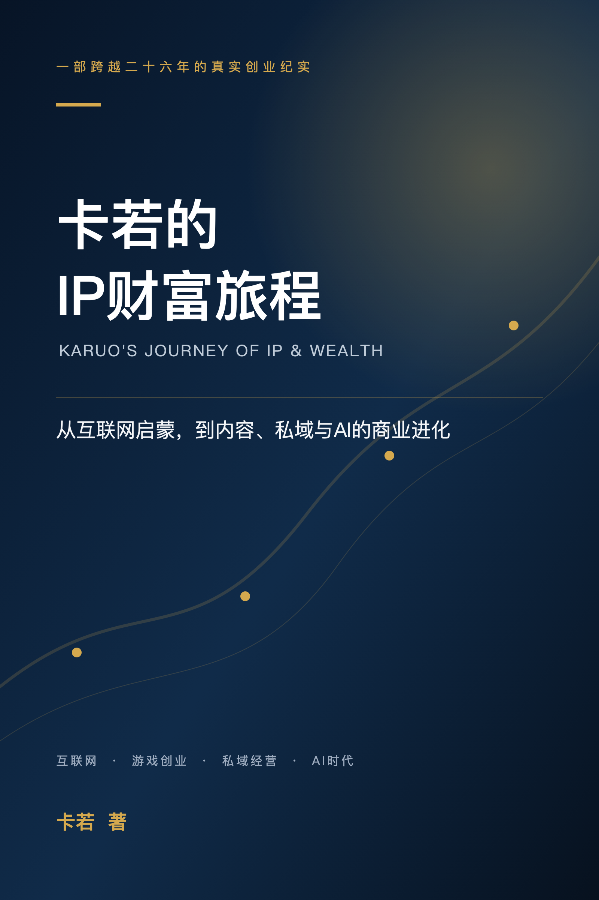

# 《卡若的IP财富旅程》

> 一个私域创业者26年的真实经历：从互联网启蒙，到内容、私域与AI的商业进化。

## 作者序：我为什么要把这些经历写下来

我不想把这本书写成一套看起来很完整、但离真实生活很远的道理。

我更愿意把自己走过的路摊开：小时候第一次接触电脑，后来做网站、做游戏、做电商，再到做私域和AI。这里面有赚到钱的时候，也有判断失误、团队离开、公司倒下之后重新开始的时候。

这些经历没有一条可以直接复制。能留下来的，是我在一次次真实交易、真实合作和真实关系里，慢慢确认的几个问题：客户为什么愿意相信你？流量为什么留不住？一个人怎样借助工具做出过去一个团队的产出？组织如何在分钱、交付和信任之间跑稳？

所以，这不是成功学，也不是项目说明书。它是一份创业者的长期记录。你可以把它当成故事读，也可以把每一章当成一次复盘：先看现场，再看判断，最后决定哪些动作值得放到自己的生活里试一次。

## 阅读提示

书中的时间、项目和数据以现有书稿、项目记录和作者回忆为基础；不同章节的案例证据强度不同，阅读时请把作者经验与普遍规律分开。涉及投资、医疗、法律和平台规则的内容，不构成专业建议。

## 目录

# PART 1：互联网启蒙——从好奇到第一次交易（1998—2005）

## 1.1｜我的童年

1984年夏天，我出生在福建泉州的一个小村庄。那时候的农村，白天鸡鸣狗吠，夜晚虫鸣蛙叫，空气中总是飘着泥土和庄稼的气息。

我家住在村子内，一座朴素的土砖房，屋后有一片池塘和一片菜地，种着各种青菜。

记忆中的夏夜，凉席上是星光和暑气，蚊香的烟在黑暗中画着圈，我常躺在竹床上，听看着当年的电视。

父亲在当地电厂工作，是个海军退役军人。他热情开朗，喜欢与人交流。退伍后分配到电厂，和大部分人一样工作辛苦。

"屋里经常有人笑，那是有福的人家。"村里的老人常这么说。

而我家确实常常笑声不断，父亲工作之余经常会邀请同事和朋友到家中，他那爽朗的笑声和精彩的故事总能让家里充满欢声笑语。

母亲出身于一个传统工艺家庭。和大部分的母亲一样专注照顾家庭

我的外公是一位鎏金佛像手艺人。

每逢节假日，我都会去外公家。他住在城里的老街区，狭窄的巷道两旁是斑驳的老房子，空气中弥漫着香料和木材的气味。

外公的工作室就在一楼，窗子很小，但光线却很好。

"外公，这是怎么做出来的？"五岁的我好奇地问道，指着一尊刚完成的小佛像。

外公会蹲下来，耐心地向我解释鎏金的过程："先要把铜雕刻成形，然后涂上水银和金粉的混合物，再用火烤，水银蒸发后，金就附在铜上了。"

还记得他说这话时的神情，认真而专注，仿佛在讲述一件神圣的事。

外公的工作室充满了木材和矿物的味道，一种特殊的气息混合着焦煤和松香。

我常常在那里一坐就是几个小时，看着外公如何将普通的木头变成闪闪发光的艺术品。

"做工艺跟做人一样，要有耐心，一丝不苟。"外公一边雕刻一边说，"看似不重要的细节，往往决定成败。"

从外公那里，我学到了专注和坚持。八岁之前，我经常会去外公的工作室

在那里，我接触到了各种传统工艺和艺术形式，也懂得了细节的重要性。

我的爷爷在水电行业做公务员，是村里少有的"干部"，也是家族中的顶梁柱。

与父亲的直接热情和外公的内敛专注不同，爷爷擅长构建关系网络，协调各方关系，解决复杂问题。

八十年代中期的农村，干部是备受尊敬的，也是村里人遇到问题时首先想到的"救星"。

记得村里修水渠时，几个生产队为水量分配争执不下，是爷爷出面调解，既照顾了上游村民灌溉的需求，又保证了下游村民有足够的水用，最终平息了纠纷。

"做事靠能力，成事靠人脉。"这是爷爷经常挂在嘴边的一句话。

爷爷在当地有着广泛的人脉关系，从公社到大队，从粮站到学校，他似乎认识每一个能帮上忙的人。

更重要的是，他懂得如何维护这些关系，让它们在需要时能够派上用场。

有一次，我初中时想参加市里的美术比赛，但当时报名已经截止。

爷爷通过他认识的朋友，不仅为我争取到了一个参赛名额，还安排了专门的老师为我进行赛前指导。

"人和人之间，没有过不去的坎。"爷爷对我说，"关键是你要找到正确的人，用正确的方式沟通。"

爷爷还经常带我去拜访他的各路朋友，让我从小就学会了如何与不同背景的人相处。

每次拜访前，他都会教我该如何称呼对方，该说些什么，甚至如何根据对方的反应调整谈话内容。

"观察比说话更重要，"爷爷说，"你要学会看懂别人眼神里的想法。"

我记得有一次，村里要通电，爷爷带着几袋家里种的水果，去拜访电力局的朋友。

他没有直接提要求，而是先关心对方家人，谈天气谈收成，等到氛围轻松了，才不经意地提到村里通电的事。

不出一个月，我们村成了周围最早通电的村子之一。

这些社交智慧的训练无形中培养了我敏锐的观察力和适应不同场合的能力，这在我后来的创业道路上帮了大忙。

搬到城里，是因为家里希望我能有更好的学习环境。其实所谓"更好"，也只是离家近、方便照顾。

那时候的实验小学很普通，校门口是两棵老榕树，操场是水泥地。

实验小学没有什么特别的地方，教室里总是有粉笔灰的味道，桌椅有些破旧。

老师很严格，作业多，考试频繁。

刚进城时，我有些不适应。城里的同学说话快，见识广，喜欢讨论各种新鲜事。

我更喜欢安静地看书，或者一个人画画。每次班级活动，我总是最后一个发言，但老师发现我画画不错，就让我参加了学校的画画比赛。

在一中，我最喜欢画画室和仙都楼外的篮球场。

第一次参加市里的绘画比赛。虽然没得奖，但老师鼓励我："你画得很有想法。"

后来又有几次机会，参加了校内外的绘画比赛，慢慢地，我有了属于自己的小圈子。

除了画画，体育课是我最喜欢的时间。学校的篮球场虽然不大，但每到课间和放学，总有一群同学在打球。

我个子高，跑得快，很快就被拉进了班级篮球队。我们参加过几次校内比赛，那种拼搏和协作的感觉让我很享受。

在这些活动中，渐渐适应了城市的生活节奏。虽然我依然喜欢独处，但也学会了在团队中找到自己的位置。

每次比赛、每次演出，都是一次新的尝试和成长。

童年的时光就在这样的日子里慢慢流逝。没有太多轰轰烈烈的故事，更多的是日常的坚持和探索。

回头看，那些安静的午后、操场上的汗水、画室里的颜料味、篮球场的协作，都是我成长路上最真实的印记。

## 1.2｜我的第一台电脑

初中二年级那年，家里迎来了第一台电脑——一台装有赛扬CPU和Windows 98操作系统的组装机。

尽管它当时没有联网，甚至在很长一段时间内都没有实现联网，但这并没有阻止它成为童年中最珍贵的宝藏。

这台电脑开启了对未知世界的探索之旅，成了"魔法盒"，也为日后构建数字资产、打造个人IP埋下了最初的种子。

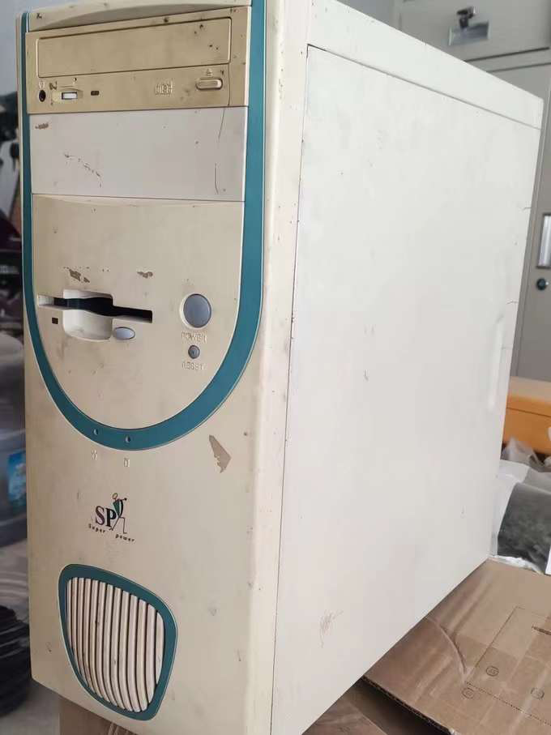

电脑带来的不仅仅是学习的工具，更多的是游戏的乐趣。

沉迷过《红色警戒》、《暗黑破坏神》和《三国志》等游戏，它们带来了策略与智慧的快感。

为了能够玩这些游戏，甚至向父母保证，能控制自己不沉迷于游戏，并且保证学习。

这种早期培养的自律，成了日后创业的重要支撑。

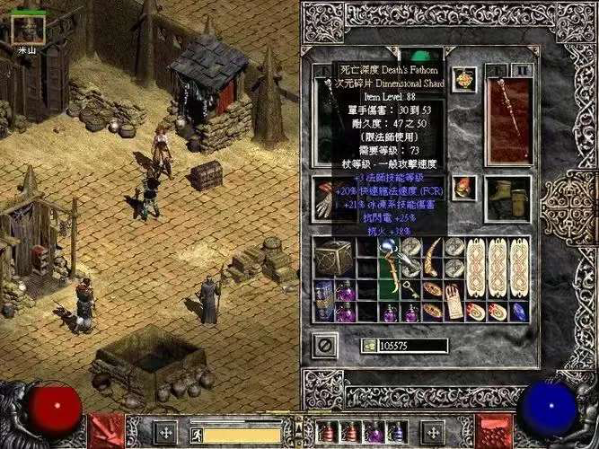

随着时间的推移，把仅有的10元零花钱，用于购买游戏光盘。

小镇上有两家专卖游戏光盘的小店，最大的乐趣就是在那些光盘中挑选喜欢的游戏，然后带回家安装。

每张光盘里都有几个游戏安装包，安装完毕后，光盘就失去了用处。

由于零花钱有限，想出了一个小策略：安装完游戏后，找店主说游戏装不上，请求换另一张光盘。

这个方法屡试不爽，直到店主识破了小把戏。

虽然只是一个孩子气的小聪明，但这其中也蕴含着早期对"资源最大化利用"和"突破规则"的萌芽，为后来的商业嗅觉和创新思维奠定了基础。

还有一次，尝试安装新游戏时，不小心让电脑中了病毒，导致系统崩溃。

面对这一挑战，没有放弃，而是开始寻找解决方案。

这次经历让人懂得面对困难不退缩，在技术的世界里，问题和挑战是常态，解决问题才是核心能力。

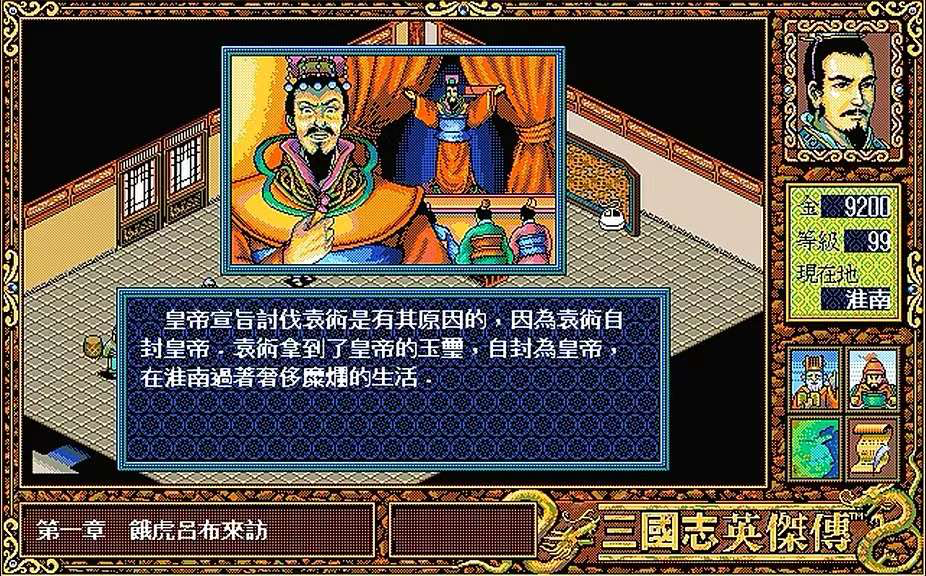

然而，随着时间的推移，单机游戏已经无法满足好奇心。

渐渐渴望探索更广阔的世界，渴望与人进行交流。

通过同学的介绍，听说可以用ADSL电信号码充值上网。

第一次成功连接到互联网的那一刻，那种激动的心情仿佛打开了新世界的大门。

成了"新世界的第一批互联网原住民"，这比同龄人更早地看见了数字时代的无限可能，也奠定了日后在互联网领域深耕的底气。

镇上第一家网吧"千喜龙"的出现，打开了另一扇通往互联网世界的大门。

第一次走进网吧，被那里的电脑屏幕和键盘敲击声深深吸引。

那种氛围，像一个未来世界的缩影，让人对数字世界的渴望更加强烈。

回顾与第一台电脑的旅程，不仅仅是一次对互联网魅力的体验，更是一次学习、探索和坚持的过程。

那台装有赛扬CPU的电脑，不仅是成长过程中的重要工具，也是青春记忆中不可磨灭的一部分。

## 1.3｜网吧里的巨大诱惑

2000年秋天，我刚升入高一，那是一个互联网刚刚在中国兴起的年代。

学校对学生管理很严格，晚上10点熄灯后不允许外出。

但对于我这样对新鲜事物充满好奇的少年来说，学校围墙外那个神秘的"网吧"世界，有着巨大的吸引力。

那是一个月黑风高的夜晚，宿舍熄灯后，我和室友小张、小李开始密谋我们的"越狱计划"。

"听说学校下面新开了一家网吧，里面有最新的游戏。"小张压低声音说。

"《红色警戒》你们玩过吗？听说可以多人联网对战！"小李眼中闪着兴奋的光芒。

我们三个人蹑手蹑脚地来到宿舍楼后面的围墙边。

围墙大概有2米高，对于我们这些十六七岁的少年来说，并不算什么障碍。

"我先上去探路。"我自告奋勇，踩着小张的肩膀翻过了围墙。

那一刻，心跳如鼓，既紧张又兴奋。

翻过围墙的瞬间，仿佛整个世界都变得不同了，一种前所未有的自由感涌上心头。

我们沿着小路摸黑走了大概10分钟，终于看到了那家传说中的网吧——"飞宇网络"。

推开门的那一刻，我被眼前的景象震撼了：几十台电脑整齐排列，屏幕上闪烁着各种游戏画面，键盘敲击声此起彼伏，空气中弥漫着烟味、方便面的香气，还有一种说不出的电子设备的味道。

"三位同学，要上网吗？2元一小时。"网管是个二十多岁的年轻人，看起来很和善。

我们找了三台相邻的电脑坐下。

当我第一次点击桌面上的"红色警戒"图标时，心情无比激动。

游戏加载完毕，我选择了"多人游戏"模式。

很快，我就和小张、小李以及网吧里的其他玩家组成了一个8人对战房间。

"这局我选苏联，造天启坦克！"我在聊天框里打字。

"我选美国，爱国者导弹防空！"小张回复。

那种多人实时对战的刺激感，是我从未体验过的。

每一次建造建筑、训练士兵、发动攻击，都需要与其他7个真实玩家进行策略博弈。

我第一次理解了什么叫"网络效应"——参与的人越多，游戏就越有趣。

这一玩就是整整一夜。

当我们意识到时间时，天已经快亮了。

"糟了！马上要查房了！"小李惊呼。

我们匆忙结账，沿着来路狂奔回学校。

翻墙进入宿舍楼时，我的心跳得比刚才玩游戏时还要快。

第二天早上，果然被班主任王老师发现了。

"卡若，你昨晚是不是没睡好？"王老师看着我困倦的样子问道。

我站在教室门口，困得直点头，但心里却还在回味昨晚游戏的精彩瞬间。

从那以后，开始思考如何"规避风险"——什么时候去网吧不容易被发现，如何安排时间既能玩游戏又不影响学习。

没想到，这种风险评估的思维，后来成了我商业决策中的重要能力。

几个月后，网吧里开始流行一种新的应用——语音聊天室。

那是一个周末的下午，我在网吧里发现了一个叫"碧海银沙聊天室"的软件。

出于好奇，我点击进入了一个名为"青春校园"的房间。

"大家好，有人在吗？"我试探性地在麦克风前说道。

"你好，你是哪个学校的？"一个清脆的女声传来。

"我是泉州一中的，你呢？"

"我是泉州三中的，我叫小雨。"

我们开始聊起各自的学校生活、兴趣爱好。

令我惊讶的是，我们有很多共同话题——都喜欢看《还珠格格》，都喜欢听周杰伦的歌，都对计算机很感兴趣。

聊了大概一个小时后，小雨突然问："你是不是叫卡若？"

"是啊，你怎么知道？"我很惊讶。

"我是林小雨啊！初中时我们是同班同学！"

那一刻，我简直不敢相信自己的耳朵。

林小雨是我初中时暗恋过的女生，没想到在这个虚拟的网络空间里重新相遇了。

这次偶遇让我深深震撼。

意识到，互联网不仅仅是一个游戏平台，更是一个能够连接人与人的神奇世界。

它可以跨越时间和空间的限制，让失散的朋友重新相聚，让陌生的人成为朋友。

这不就是我后来一直在做的"私域连接"的雏形吗？

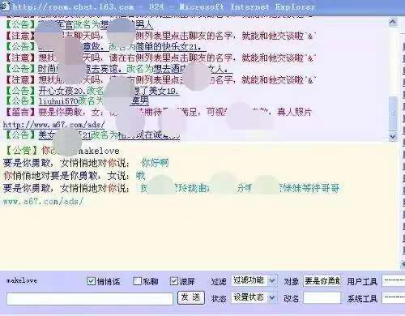

但是，沉迷网吧也带来了严重的后果。

期中考试成绩出来后，我的排名从班级前10名跌到了30名开外。

父亲看到成绩单后，脸色铁青。

"卡若，你最近是怎么了？成绩怎么下降这么多？"

母亲也很担心："是不是学习压力太大了？还是身体不舒服？"

我不敢告诉他们真相，只能含糊地说："可能是最近学习方法不对。"

班主任王老师也找我谈话："卡若，你是个聪明的孩子，但最近的状态让我很担心。你要知道，高中三年很关键，不能因为一时的放松而影响了前途。"

那一刻，我内心充满了愧疚和自责。

意识到，诱惑就像沼泽，陷进去容易，爬出来难。

开始反思自己的行为，并制定了一个"平衡计划"：

每周只去网吧一次，每次不超过3小时。

去网吧前必须完成当天的作业。

将在网吧学到的计算机知识应用到学习中。

这个计划的执行并不容易，但它教会了我一个重要的道理：自律不是完全拒绝诱惑，而是学会控制和平衡。

几个月后，我的成绩逐渐回升，同时我对计算机和互联网的理解也越来越深入。

现在回想起来，那段在网吧的日子，虽然看似是青春的叛逆，但实际上却是我人生中极其重要的启蒙阶段。

## 1.4｜沉迷网络游戏：少年挥洒的激情岁月

2001年夏天，那是一个让所有家长谈"网"色变的年代。

网吧在那个时候还是新鲜事物，但对于我这样对计算机着迷的少年来说，却像是发现了新大陆。

记得第一次走进网吧时，那种震撼至今难忘。几十台电脑整齐排列，屏幕上闪烁着各种游戏画面，键盘敲击声此起彼伏，空气中弥漫着烟味和方便面的香气。

"小伙子，会玩CS吗？"坐在我旁边的一个大学生模样的人问道。

我摇摇头，但眼神中充满了好奇。

那是我第一次接触CS，一款风靡全球的第一人称射击游戏。看着屏幕上激烈的枪战场面，我的心跳加速，手心出汗。

"来，我教你。"那个大学生很热心，"这个游戏需要反应速度和团队配合。"

从那天开始，我就像着了魔一样，每天放学后都会跑到网吧。起初只是为了玩CS，但很快发现，这里有一个完全不同的世界。

同时期有一本叫《学习的革命》的书对我影响巨大。

"如果我能把这个方法用到游戏中会怎样？"突然有了一个大胆的想法。

当时最火的网络游戏是《幻灵游侠》，一款3D MMORPG游戏。游戏中有复杂的地图、技能树和装备系统，正好可以用来实践记忆宫殿的方法。

开始有意识地将游戏中的每个场景、每个NPC的位置、每个任务的流程都构建成记忆宫殿的一部分。令我惊喜的是，学习的革命让我在游戏的过程中，建立了记忆宫殿，学习便变成简单。

不仅游戏技能提升很快，连学校的功课也变得轻松了。我能够快速记住历史年代、地理位置、英语单词，成绩反而比以前更好了。

通过专注在幻灵游侠中打蝴蝶，在论坛晒图片，我建立了游戏玩家觉得我的东西很专业的形象。

很快，我就成了服务器里小有名气的"蝴蝶专家"。每天都有玩家私聊我，请教打法，甚至有人愿意付费让我代练。

但更重要的发现是，开始理解什么叫"专业化"和"差异化竞争"。

在一个所有人都在做同样事情的环境中，如果你能找到一个独特的角度，深入研究并做到极致，就能建立起自己的优势。

这个道理不仅适用于游戏，也适用于学习和未来的工作。

网管小廖看到我在论坛上的表现后，很是惊讶。

"卡若，你这个思路很有意思。你有没有想过，可以把这种专业化的思维用到其他地方？"

"比如呢？"我问。

"比如帮其他网吧搭建论坛，或者做游戏攻略网站。现在网络游戏越来越火，对攻略的需求很大。"

小廖的话让我眼前一亮。开始思考，如何将在游戏中积累的经验和技能，转化为真正的价值。

有一天，一个经常来网吧的大学生找到我。

"卡若，我们学校的计算机协会想搭建一个游戏交流论坛，你能帮忙吗？我们可以付费。"

这是我第一次有人愿意为我的技能付费。虽然只有200元，但那种被认可的感觉让我兴奋不已。

我花了一个周末的时间，帮他们搭建了一个功能完整的游戏论坛，包括用户注册、发帖回帖、积分系统等功能。

"太专业了！比我们想象的还要好！"那个大学生很满意。

更重要的是，开始理解一个道理：真正的价值不在于你玩游戏有多厉害，而在于你能否将自己的专长转化为对别人有用的服务。

那段沉迷网络游戏的日子，表面上看是在"玩物丧志"，但实际上却为我打开了一扇通往互联网世界的大门。

我学会了：
- 如何搭建和维护网络社区
- 如何通过专业化建立个人品牌
- 如何将兴趣转化为技能，将技能转化为价值
- 如何在虚拟世界中建立真实的人际关系

最重要的是，发现了自己对互联网技术的真正热爱，以及在这个领域的天赋。

当其他同学还在为考试焦虑时，我已经开始思考如何在这个新兴的数字世界中找到自己的位置。

那些日日夜夜，那些在游戏中挥洒的激情岁月，看似是青春的叛逆，实际上却是我人生中最重要的启蒙教育。

它让明白，学习不一定要在课堂上，成长不一定要按照传统的路径。

只要你有足够的热情和专注，任何领域都可能成为你的舞台。

## 1.5｜沉迷网游后的创业萌芽：第一次做虚拟物品交易

说说那段迷恋网游的时代

那是一个寒冷的冬天，大年三十的晚上，家里因为一些琐事，父母吵得不可开交。实在受不了这种压抑的氛围，索性离家出走，跑到市中心的网吧上网。那时在玩《幻灵游侠》这款游戏，每天都会在上面花费大量的时间。

离家出走之前，在网吧，认识了一个叫小廖的朋友，他当时在一家网吧当网管，游戏里的装备和虚拟货币多得让人眼红。有一天，小廖说，他通过卖游戏里的虚拟物品赚了不少钱。听后非常惊讶，也非常心动。

“你是怎么做到的？”迫不及待地问他。

小廖笑了笑，说：“很简单，只要你有值钱的装备和宠物，就能在游戏论坛或者QQ群里找到买家。人是逐利的动物，只要有市场，就不愁卖不出去。”

当时离家出走，身上只有最后5块钱车费，《幻灵游侠》里已经积累了一些不错的宠物，并且长期在幻灵论坛里晒属性，索性决定卖掉一些换点零花钱。于是在游戏论坛上发布了一条出售虚拟物品的帖子，很快就有隔壁网吧的李总联系。

为了赚这笔钱，不得不走几公里路去见他。一路上心情复杂，既兴奋又紧张，毕竟是第一次做虚拟物品交易。

见面后，李总检查了游戏宠物，确认无误后，他当场给了700元现金。那一刻，感到无比的兴奋和成就感。这次交易不仅赚到了钱，也看见了通过游戏赚钱的可能性。

回到家后，把这700元藏了起来，心里暗暗决定要继续做这件事。于是开始专注于只打蝴蝶这种宠物。放学后，研究游戏的市场行情，在论坛内晒图片寻找更多的买家。

在这个过程中，逐渐意识到，专注和坚持是一个IP形成的基础。只有不断提升技能和积累资源，才能在这个市场上立足。为了赚更多的钱，甚至开始学习一些基本的编程知识，尝试自己开发一些游戏工具。

然而，这条路并不容易。有一次，交易过程中遇到了一个骗子，对方拿了装备却没给钱，并且盗了号。那次损失非常痛苦，但没有放弃，而是更加谨慎地选择交易对象，并且学会了如何保护自己的利益。

回顾这段经历，还是很开心的。那时虽然年纪小，却是第一次出现创业的萌芽。通过一次虚拟物品交易，不仅赚到了钱，还学会了坚持和聚焦一件细致的事情很容易带来成功。这段经历对后来的创业产生了深远的影响。

有时候会想，如果没有那次大年三十的离家出走，是否还能走上创业路？或许，正是那次经历让人看见了潜力，也明白了一个道理：无论遇到什么困难，只要坚持下去，就一定能找到解决的办法。

## 1.6｜校园聊天室：第一次用电脑技术赚到钱

一股冷风吹过，键盘前聚精会神地练习五笔输入法。

那段时间住在姨妈家，每天晚上练习五笔和学习编程到12点，只为了在游戏里快速沟通，找到更多客户。这份对技术的痴迷和对"客户"的早期认知，为日后构建数字产品和私域体系埋下了伏笔。

当时计算机A级考试是学校的必考项，身为班里的电脑积极分子，学校在计算机方面有什么活动或比赛，都会踊跃参加。

每当老师布置一个电脑任务，都会最积极地完成，因为希望大家都知道这里是"电脑高手"。这种渴望被认可、被视为"专业人士"的心理，正是后来打造个人IP、构建影响力的最初动力。

但睡上铺的"黄鼠狼"也自称是"电脑高手"，经常互相较劲，比拼电脑实力。

然而，"黄鼠狼"有一个优势：他的学习成绩更好，老师更喜欢他，所以在老师口中，他是班上的电脑代表人物。

这让人非常气愤。最后由于共同的兴趣爱好，还在一起做了些事情。

学编程的过程中，找了网上的一个聊天室代码，并取名字叫"校园聊天室"，邀请学校里有上网的同学都到里面。

学校一个年级有10个班级，共5000多名同学，努力向同学散播着聊天室内校花等几个女生也经常在里面聊天。

并把网址贴在了学校的篮球架下面，虽然中间被撕了几次，但是很快聊天室的成员就达到了1000多人，相当于学校1/5的学生。第一次真切地感受到了"美女是流量密码"的威力，以及如何通过制造"稀缺性"和"好奇心"来迅速聚拢人群。这种早期对用户心理的洞察，成了后来在私域运营中精准引流的重要经验。

聊天室非常活跃，大家课余时间经常在聊天室里讨论八卦消息和哪里有好玩的地方。不仅提供了一个沟通的平台，更满足了大家潜藏的社交和信息需求，而这种"满足需求"的本质，就是商业的起点。

一个叫嫦娥的女生是班里的英语委员，她是校园里的校花。

为了引起她的注意，更加努力地管理和推广聊天室，期待她也可以进到里面来。

一次聊天室里突然爆发了激烈的争论，甚至出现了"塞林木"等不雅的言辞。非常愤怒，决定开始踢人，花了好几个晚上盯着这个事情，并写了好几版的公告。这次危机让人明白了"管理"的重要性，任何一个流量池，都需要规则和秩序来维护其价值。

由于实在忙不过来，设立了管理员权限，制定了一系列规则，规范聊天言行。

有些同学为了成为管理员，私底下请人吃饭。敏锐地捕捉到了"付费意愿"和"价值认可"的信号。

黄鼠狼提议，"我们可以增加一个管理员收费功能，让那些有兴趣的同学成为管理。"这个提议，第一次将"技术服务"与"商业变现"联系起来，看见了通过提供增值服务来获取收益的可能性。

后面，聊天室内增加了30元包月就可以成为管理员的功能，管理员很快达到了10几个人。聊天室逐渐步入正轨，成员数量不断增加，附近城市的学生也开始在用这个聊天室，最后在线会员竟然达到了5000多人。这笔收入虽然不多，却是人生中第一次通过"电脑技术"和"商业模式"获得的收益，也看见了"产品第一，业务第二，包括机制第三"的雏形——聊天室是"产品"，管理员收费是"业务"，而收费机制则是"机制"。

这成了学校里名副其实的"电脑高手"，也为后来的发展打下了基础。这段经历，不仅仅是技术的学习，更是早期商业思维、流量运营和社群管理能力的全面启蒙，为未来在互联网领域深耕IP财富奠定了坚实的基础。

## 1.7｜E23.COM域名为什么能卖1万美金：圈子的重要性

2000年，读高中的一个周末下午，我和几个同学在学校篮球场上打完一场酣畅淋漓的球赛，正坐在场边休息。小关从书包里掏出一份《泉州晚报》，随意地翻阅着。

"嘿，你们看这个。"小关突然指着报纸上的一条新闻，"E23.COM域名以1万美金成交，卖给了一家美国公司。"

这个数字立刻吸引了我的注意——1万美金，按当时的汇率大约是8万多人民币，对于我们这些学生来说简直是天文数字。

"一个网站的域名怎么可能值这么多钱？"我不禁脱口而出。

更让我惊讶的是，小关指着那条新闻补充道："卖家好像是咱们隔壁的老王。"

老王是我们经常一起打篮球的学长，比我们高两届，在校内小有名气，因为他自学了不少编程技术，经常帮同学们解决电脑问题。

第二天，我在食堂偶遇老王，忍不住上前询问那则新闻的真实性。

"是真的，"老王笑着承认，"不过媒体总是夸大其词，实际成交价不到1万美金，但也有7000多了。"

"你怎么会想到注册域名的？更重要的是，怎么找到买家的？"我好奇地问道。

老王放下手中的筷子："说来话长。去年我在BBS上认识了一个网名叫'黑狼'的人，他在美国留学，懂这些互联网的新玩意。

是他告诉我，好的域名就像黄金一样值钱，尤其是那些简短、好记的。"

老王的话让我陷入思考。一个简单的网址名称居然能卖出这么高的价格，这似乎是一个隐藏的商机。

几天后，我在学校的计算机中心找到老王，希望能了解更多关于域名交易的信息。

老王带我认识了他的另一个朋友——阿杰，一个研究生，据说也因为域名交易赚了不少钱。

"E23.COM能卖这么贵，是因为它简短、好记，而且全是字母数字组合。

"阿杰在校园咖啡厅解释道，"现在好的域名越来越少，尤其是这种短域名，所以价格只会越来越高。"

"那你也炒过域名吗？赚了多少？"我好奇地问。

阿杰笑了笑，打开他的笔记本电脑，调出一个表格给我看。上面密密麻麻地记录着各种域名和价格。

"去年一年，净赚1.5万人民币。"阿杰的语气里带着一丝得意，"最成功的一次是买了个域名，只花了500元，三个月后3500元卖出。"

作为一个每月生活费只有400元的学生，我被这个收益率震惊了。"我也想做这个，可以教我吗？"我急切地问道。

阿杰看了我一眼，微微摇头："不是我打击你，这行没那么容易。首先，你需要资金；其次，更重要的是，你需要圈子和人脉。"

"什么意思？"我不解地问。

"因为好的域名信息往往在公开前就被圈内人知道并抢注了。

而且，你怎么判断一个域名值多少钱？怎么找到买家？老王能卖掉那个域名，是因为'黑狼'帮他联系了美国的买家。

在国内，域名交易的氛围还没有形成。"阿杰解释道。

我陷入沉思。阿杰说的确实是我没有考虑过的问题。

见我陷入思考，阿杰放缓了语气："这样吧，下个月北京有个互联网创业交流会，会有不少做域名交易的人参加。

你有兴趣可以一起去开开眼界。你只需要负担自己的路费和住宿，其他的我可以帮你安排。"

这个提议对当时的我来说既诱人又有些遥不可及。北京，对于从未出过福建的我来说简直是另一个世界。

而且，来回的火车票和住宿至少要花掉600元，这是我一个半月的生活费了。

我犹豫了几天，最终咬牙同意了。

为了筹集这笔钱，我省下了两个月的钱，还向小关借了200元。

旅程开始得并不顺利。第一次坐长途火车的我不适应硬座，到达北京时已经腰酸背痛。

更糟的是，我住的旅舍条件极差，六人间的小房间拥挤不堪，晚上还有人打呼噜。

但第二天的交流会完全改变了我的感受。

会场设在一所大学的会议厅，虽然不算豪华，但气氛热烈。

阿杰似乎认识不少人，不断有人过来与他打招呼，交换名片。

我则像个局外人，默默地观察着这一切。

"来，我给你介绍几个朋友。"阿杰拉着我走向几个正在交谈的人。

在交流会上，我了解到域名市场有着自己的规则和行情，而这些信息在国内很少有人知道。

比如，某些行业关键词域名在国外的价值远超普通域名；

国际品牌进入新市场时往往会高价收购相关域名；

有些看似普通的数字组合在特定文化背景下价值连城。

更重要的是，意识到国内的域名市场还处于萌芽阶段，而国外尤其是美国的域名交易已经相当成熟。这种信息差，恰恰是商机所在。

午餐时，我被阿杰邀请参加了一个小型聚会。

在一家普通餐馆的包间里，几位互联网创业者边吃边聊，气氛轻松随意。

聊天中，我听到一位眼镜男说道："最近有个国外投资者收购了一批中文域名，平均每个出价4000美金。"

"这只是开始，随着中国互联网的发展，这些域名的价值会越来越高。"另一位西装男回应道。

"对了，阿杰，你那个教育类域名还留着吗？"一位中年男子突然问道。

"当然，这可是我的宝贝。"阿杰笑着回答。

"有兴趣出手吗？我们正在筹建一个在线教育平台，这个域名很合适。"中年男子直截了当地说。

"看价格咯。"阿杰眨了眨眼。

"3万怎么样？"中年男子报出了一个价格。

"少了点吧，这个域名我半年前就有人出价2.5万了。"阿杰摇摇头。

"3.8万，不能再高了。"中年男子略显无奈地说。

"成交！"阿杰爽快地答应了。

我目瞪口呆地看着这一幕——一个域名的买卖就这样在饭桌上轻松达成，交易额高达3.8万元，相当于当时普通上班族四年的工资。

更让我震惊的是，事后阿杰告诉我，他当初只花了8000元购买这个域名。

回程的火车上，我的思绪久久不能平静。

这次北京之行，我花掉了近700元，几乎是我两个月的全部生活费。

但我获得的却是金钱无法衡量的知识和人脉。

"所以，E123.COM能卖1万美金，不仅仅是因为它本身的价值，更是因为进入了正确的圈子，找到了愿意付这个价格的美国买家。

"回到学校后，我对小关说出了我的领悟。

小关似懂非懂地点点头："所以你准备去炒域名了？"

"不，"我摇摇头，"我领悟到的不只是域名交易的门道，而是互联网行业的一个重要真相——在这个信息爆炸的时代，优质信息和资源往往掌握在特定圈子手中，而进入这些圈子的门票，就是你的专业能力和人际关系。"

这次北京之行后，开始有意识地扩展自己的人脉网络。

我加入了几个互联网行业的线上论坛和QQ群，定期参加技术讲座和创业沙龙。

通过这些渠道，我获取了许多宝贵的行业信息和实习机会。

正如阿杰所言，在互联网这个快速变化的行业，圈子和人脉的价值有时候甚至超越了技术本身。

E23.COM能卖出1万美金的高价，不仅是因为它是一个优质域名，更是因为卖家通过圈子获取了信息优势和交易机会。

## 1.8｜暑假社会体验后的重要决定

2002年暑假，身边的同学都在讨论着各种暑期活动和补习班。

大多数人选择了参加各种辅导班或者在家复习，我对那种循规蹈矩的安排毫无兴趣。

和几个经常一起打篮球的伙伴——小廖、小亮和阿宏——凑在一块儿商量：与其把时间耗在刷题上，不如去社会上摸一圈真实经验。

「暑假去泉州打工吧，」篮球场上休息时我抛出这个想法，「既能赚点钱，又能看看课本外的世界。」

「泉州？怎么突然想到那里？」小亮有些意外。

「我表哥在那边开了家服装店，说暑假需要临时工，」小廖接话，「一个月给800块钱。」

我心里快速算了一笔：800元，两个月就是1600元。就算扣掉食宿，也比闷在家里划算。最吸引我的甚至不是钱，而是能暂时脱离那条被安排好的直线轨道。

于是四个高中生，顶着家里的疑虑，选了一条不太一样的暑假路线。

没细说要去干什么，只含糊说是参加「社会实践」。

清楚记得父母那种既不理解又无奈的表情，但我主意已经定了：按自己的节奏来。

到泉州第一天，现实就闷头一棒。

小廖表哥的店确实缺人，但只能塞下两个岗位，而且每天只干上午九点到下午四点。更糟的是，所谓「管吃住」其实只有一顿午饭，晚上住哪儿得自己想办法。

「这和说好的不太一样啊，」平静地指出来，倒也不算意外，「得重新排个表了。」

四个人在离商业街不远的地方租了一间小屋，每人每月200元房租。

第一晚躺在窄床上，重新盘点收支：进账不够、开销在涨，再不想办法，这次「社会实践」可能要赤字收场。

「得同时接几份工，」跟其他三人摊牌，「早、中、晚拆开排满，时间才卖得出去。」

按这个思路，第二天一早就分头找活。

找到一家牛奶站，肯收早上五点到七点送奶，每人每天35元。

晚上则凭我在学校机房练出来的那点电脑底子，说服一家网吧老板，让四个人轮流值夜班网管，晚七点到凌晨一点，每人每天60元。

一天就这样被切成碎片：凌晨四点半起，五点送奶，七点扒两口饭赶去服装店，下午四点下班眯一会儿，晚上七点进网吧干到半夜。

粗算下来，每人每天能落到一百四十五元上下。

数字好看，身体和精神却在发出另一种信号。

早上送奶时，我常常打量小区里那些早出晚归的上班族：行色匆匆，脸像被抽干了表情，像被什么看不见的东西推着走。

有一次，一位中年男士接过递上去的牛奶，疲惫地说：「年轻人，好好读书吧，别像我们这样一辈子给别人打工。」那句话在脑子里停了很久。

在服装店站柜台时，我更直观看见消费里的非理性：标价、折扣、赠品，全是话术堆出来的「便宜感」。

「这件衣服原价198元，现在只要58元，再送一条围巾！」——我按店长教的话术喊，心里却在拆那套数字游戏：所谓「原价」多半是虚的，成本也许不到二十块，顾客却愿意为「占了便宜」掏钱。

那种心理学把戏，反而比课本更有意思。

网吧夜班最轻松，也最适合旁观：有人为游戏通宵，有人在聊天软件里烧时间，有人只是躲进烟雾和屏幕里逃避白天。

科技、娱乐和人到底怎么互相塑造——那两个月里，这个问题比任何暑假作业都更具体。

认识的人不少，真正能聊下去的极少。例外是同店打工的小雯，比大伙儿大一岁，说话有条理，目标也清楚。

偶尔会聊书、聊音乐、聊社会新闻和未来打算。有一次休息区里我一时冲动，越界去试了一下，被拒得干干脆脆。

「你很聪明，但太理性了，」她直说，「像在解一道题一样解人际关系。」

这评价并不冤枉：我习惯用分析代替投入，连感情也先拆成变量。

被拒那次没有想象中垮掉，反而逼着我想清楚：和别人打交道，不能永远站在「观察者」的位置。

暑假后半段，日子变成机械循环：数字在涨，疲惫和厌倦也在涨。有时会怀疑，这种纯粹为钱填时间的方式，尽头在哪里。

一个难得的休息日，几个人拉上小雯去爬清源山。山顶上风很大，远处是城市和海岸线。

小亮说毕业就想挣钱；小廖说会接家里的生意；阿宏说边走边看。

轮到我时，沉默了一会儿。两个月里见了太多活法，却没有一种让我想原封不动抄进人生。

「还在想，」我最后只答了这么一句，「世上的路大多是设计好的，但不一定非要按印刷体走。」

小雯看了一眼：「你想得太多，有时得先动。」

那句话戳中了要害：擅长想，擅长质疑，却在「做」上常常缩半步——大概是性格里自带的出厂设置。

快开学时，钱包厚了，问号也多了。

将近五千元留在手里，在当年高中生里算一笔「巨款」。我没有按大多数人期待的那样上交或原封存定期，而是拆成两块：一块买了台二手笔记本，另一块买了一堆书——心理学、经济学、计算机，杂七杂八，没有一本是应试大纲里的。

想搞懂的，是世界大致怎么运转、人为什么会那样选择。

回到学校，我的状态确实变了，但不是那种「浪子回头」的剧变。我对体制里某些规则和教法多了质疑，更愿意自己排课表：该考的照考，课余却往真正好奇的方向钻。

那个暑假之后才慢慢想通：社会比课本复杂得多，人的选择也远不是「理性模型」一笔画得出的。找到自己的尺，比盲目跟着默认路径走，要紧得多。

## 1.9｜新环境的“化学反应”：人脉资源的意外链接

2002年，我怀揣着高中的积累，踏入了大学的校门。

初秋的阳光洒在厦门的海面上，芙蓉湖畔凤凰花开得正艳，远眺白城沙滩，聆听海浪声与钟声交织，一种莫名的兴奋与憧憬在胸中涌动。

这个环境让我这个初来乍到的新生既感震撼，又充满期待，仿佛站在了人生新篇章的起点。

"新生宿舍在前面左转，记得去芙蓉隧道旁的报到处登记。"

一位穿着红色志愿者马甲的学长热情地为我指路。我道谢后，沿着满是凤凰花的小路，拎着行李走向思明校区的学生公寓。

推开宿舍门，发现已有三位室友提前到了。

我们互相打了招呼，各自整理着床铺和物品。

当我从背包里拿出二手笔记本电脑时，名叫小李的室友惊讶地说："哇，你带了电脑来！"在2002年，大学新生中能带电脑入学的还是少数。

"暑假打工攒钱买的二手本，希望能用它多学点东西。"我简单回答，没有过多炫耀。

但内心深处，知道这台电脑对我的意义远不止于此。

高中时期，我就一直在思考一个问题：为什么我们一定要走传统的学习路径？

大多数人挤在应试教育的独木桥上，依靠刻苦记忆和重复练习，争取考上名校。

但我内心对这条路径始终存有疑问。

创新思维是我的优势，为什么要在我最不擅长的应试领域与他人竞争？

我站在湖畔，看着人头攒动的招新现场，内心再次陷入挣扎。

大多数新生争相加入学生会、文艺部和体育类社团，那些被视为未来"精英"必经之路的组织。

我拿到了几个传统社团的宣传单，却迟迟没有填写。

"你不去报名吗？"小李一边收集着各种社团表格，一边问我。

"我还在想。"我敷衍地回答，但内心已有决定。

第二天，当舍友们都在为如何能进入学生会而忙碌时，我径直走向了计算机协会的招新摊位。

这不是一时冲动，而是一个经过深思熟虑的选择——我决定不再重蹈覆辙，不再强迫自己适应主流，而是走一条真正符合我兴趣和天赋的路。

"对计算机感兴趣？"摊位前的学长问道。

"是的，特别是网站开发和互联网应用。"我回答，语气中透露着久违的自信。

"不错，"学长递给我一份表格，"填一下基本信息，下周二晚上有协会的见面会。"

填表时，我注意到协会会长的名字是陈亮，计算机系大三学生。

据说他不仅在校内技术圈有名，还与几家互联网公司保持着密切联系。

第一次见面会在南光三楼一间小教室举行。

三十多名新成员挤在一起，聆听协会介绍。陈亮是个戴着黑框眼镜的瘦高男生，说话时带着几分理工男特有的直率和热情。

"我们计算机协会不只是学习理论知识的地方，更是实践技术、交流经验的平台。"

他介绍完基本情况后，话锋一转，"今天想给大家展示一个我们的实际项目。"

他打开电脑，演示了一个名为"校园生活助手"的网站。

这个平台整合了校内食堂菜单点评、二手物品交易、课程资源共享等功能。

虽然界面简陋，但功能实用，据说已有300多名学生用户。

"我们正缺人手开发新功能，有兴趣的同学可以来参与。"陈亮最后说道。

那一刻，我感到一种莫名的激动。这正是我想要的，实际项目、真实问题、有意义的工作，而不是枯燥的课本理论或者毫无创新的习题练习。

会后，当大多数新生纷纷离开，我主动留下与陈亮交流。

"我对你们的项目很感兴趣。虽然我的编程基础不够扎实，但我愿意从最基础的工作做起，慢慢学习。"

"你叫卡若是吧？"陈亮看了看我的表格，"我记得你填表时提到会一些HTML和CSS？"

"是的，高中时自学过网页设计，做过一个简单的校园聊天室。"

"那太好了！"陈亮眼睛一亮，"我们网站的前端界面确实需要优化。

明天下午有空来计算机楼206实验室，我给你详细讲讲？"

就这样，我加入了"校园生活助手"项目组，开始了大学的第一个技术实践。

每天上完必修课，我会直奔计算机楼实验室，跟着陈亮和其他学长学习网站开发。

短短一个月内，我不仅掌握了更多前端技术，还接触到了后端数据库基础。

但与此同时，我的专业课成绩却开始下滑。

发现自己无法像其他同学那样，对着教材，长时间保持专注。

不是因为我不够努力，而是那些内容对我来说太过枯燥和脱离实际。

我又一次陷入了高中时期那种矛盾——当你发现一条道路与你的天性相悖，你是应该硬着头皮走下去，还是另辟蹊径？

"成绩又挂科了？"舍友小李看着我，有些不解，"你不是挺聪明的吗？"

"可能吧，"我苦笑，"但我更喜欢实际写代码、解决问题的感觉。"

"那你将来毕业怎么办？"

这个问题我思考过很多次，但在那个阶段，我选择了相信自己的直觉——我必须找到自己真正的优势，而不是在劣势上与别人竞争。

如果传统的学习路径无法带我走向成功，那么我就必须设计一条属于自己的道路。

与此同时，发现了学校的BBS论坛——"海韵社区"，这个在校园网内部运行的平台是师生交流的重要渠道。

我注册了ID"夜风"，经常浏览技术版块的讨论，发表自己对网络技术和互联网未来的看法。

一个深夜，我在BBS上发了关于网站加载速度优化的问题，很快收到了ID为"黑狼"的用户回复。

他不仅详细解答了问题，还分享了当时国内鲜少人知的前沿Web技术。

"你的思路有创意，有兴趣深入交流吗？"黑狼在私信中问我。

我加了他的QQ，才知道他原来是本校大四学长，目前在美国一家创业公司实习。

通过与黑狼的交流，我第一次了解到了国外互联网发展的最新趋势，以及那些在国内尚未流行的商业模式。

"国内互联网还处于起步阶段，很多国外已经成熟的模式在中国市场还没出现。

"黑狼在一次深夜聊天中说，"比如域名投资、内容付费、社区电商，这些领域都有巨大潜力。"

"但这些需要很多专业知识吧？"我有些犹豫地问。

"卡若，我问你，你觉得学校里教的那些东西，有多少是真正能用在实际工作中的？"黑狼反问我。

这个问题如同一记重拳击中我的心灵。

确实，那些为了考试而记忆的知识点，那些为了学分而完成的作业，它们中的大部分在我看来都与实际工作脱节。

"其实很多领域，只要你敢想敢做，学习能力强，完全可以通过自学和实践掌握。

"黑狼继续说，"课本上的东西迟早会过时，但解决问题的能力和创新思维却是永远不会过时的。"

这段对话让我如梦初醒。

突然意识到，我并非不适合学习，而是不适合传统的学习方式。

我喜欢实践，喜欢通过解决实际问题来学习，而不是被动地接受知识灌输。

受到黑狼的启发，开始在BBS上分享一些见解。这引起了陈亮的注意。

但我内心深处有个声音在说：你已经选择了一条不同的路，就要敢于走到底。如果总是按照传统思维评判每一个决定，那你永远无法突破。

之后，我在"校园生活助手"项目中的表现也得到认可。陈亮甚至提议让我接手网站的部分管理工作。

"你比我想象的学得更快，"他评价道，"而且你有一种商业意识，知道用户真正需要什么。这在技术人员中很少见。"

下学期，在陈亮推荐下，我获得了校内一个大型活动的网站建设项目，这是我第一次获得的"项目收入"——800元。

虽然金额不大，但这代表着技能向价值的转化，让我看到了另一种可能性。

这段经历让我想起高中时的一个场景。

老师曾对我说："卡若，你这样下去，将来怎么办？

"那时的我无言以对，但如果现在重返那个教室，我会自信地回答："老师，我会走一条属于自己的路，而不是挤在千军万马的独木桥上。"

学期末，发现自己的社交圈已完全改变。我不再只是一个普通大一新生，而是成为了活跃在技术圈和创业圈的"连接者"。

我的QQ好友列表中，有计算机协会的核心成员，有研究生学长，甚至有几位校外创业者。

"理论知识在课堂上可以学到，但实际经验只能在项目中积累，"黑狼在一次视频聊天中建议，"你应该考虑提前做一些实习项目。"

于是，通过阿杰介绍，我加入了一个创业团队，负责一个小型电影网站的开发。

这个项目虽然最终没有商业成功，但让我积累了宝贵的团队协作经验。

第一学年结束时，当同学们为期末考试和奖学金忙碌时，我在思考另一个问题：如何将这一年积累的人脉资源和技术经验，转化为更具体的创业项目？

我已经确信，我不应该把宝贵的青春浪费在追逐那些与我内心不符的目标上，而应该勇敢地设计属于自己的人生路径。

回顾这一年，我从一个普通高中毕业生，转变为拥有初步创业思维和技术能力的大学生。

这种转变不是源于课堂教育，而是来自于我在新环境中主动寻求的"化学反应"——正是计算机协会、BBS论坛、陈亮、黑狼、阿杰这些元素的组合，催化了我从学生到准创业者的蜕变。

最令我感慨的是，这一切的起点，是那个看似微小的选择——用暑假打工的钱购买二手笔记本电脑，而不是把钱交给父母或存起来。

正如蝴蝶效应，这个决定为我打开了一扇通往更广阔世界的大门。

它让明白，人生不必只有一条路，成功也不只有一种定义。

正如黑狼所说："在信息时代，人脉资源就像互联网节点，每一个新的连接都可能带来意想不到的机会。

重要的不是你认识多少人，而是你连接了哪些关键节点。

每个人都有自己的优势和劣势，真正的智慧是找到属于自己的战场，而不是在别人的赛道上苦苦挣扎。"
1. 不盲从主流，找准自己的赛道 - 大学环境中，主动选择加入符合个人发展方向的圈子，而非随大流加入传统组织
2. 线上线下融合的人脉构建 - 通过BBS论坛的虚拟交流与实验室的现实协作相结合，形成立体社交网络
3. 将兴趣和技能转化为价值 - 从志愿参与项目到获得第一笔项目收入和投资收益，逐步实现了能力的价值转化

## 1.10｜发现隐形冠军：互联网创业的启蒙时刻

2004年，我正在为学校的课题发愁。

计算机系的老师要求做一个实际的项目，而我选择的题目是"基于Web的信息管理系统"。

为了找到合适的参考资料，我在网上搜索了很久，大部分网站要么内容太浅显，要么就是纯理论的学术论文。

就在我快要放弃的时候，我偶然点进了一个看起来很不起眼的网站。

网站的域名很简单，页面设计也很朴素，甚至可以说有些简陋。

但当我仔细浏览内容时，却被深深震撼了。

我那时就明白，真正的宝藏，往往藏在最不起眼的地方。

这个网站的首页没有花哨的动画，没有炫目的图片，只有密密麻麻的文字链接。

但每一个链接背后，都是极其专业和深入的技术文章。

我随便点开一篇关于"数据库优化"的文章，发现作者不仅详细解释了理论原理，还提供了大量的实战案例和代码示例。

更让我惊讶的是，文章的评论区非常活跃，很多业内专家在这里进行深度的技术讨论。

"这些内容的质量比我们学校图书馆里的教材还要好！"我心里暗暗感叹。

我继续浏览，发现这个网站涵盖了软件开发的各个领域：

数据库设计、网络编程、系统架构、项目管理……

每个领域都有大量高质量的原创文章。

更重要的是，这些文章都非常实用，不是纸上谈兵，而是来自一线开发者的真实经验。

我那时就明白，这不是一个普通的网站，而是一个专业人士的聚集地。

在深入浏览这个网站的过程中，我注意到了一些有趣的细节。

网站的右侧有一个不太显眼的广告栏，投放的都是技术类书籍和培训课程的广告。

我好奇地点击了其中一个广告，发现是一本关于Java编程的专业书籍，售价36.8元。

"一本书就要36.8元？"我有些吃惊，要知道当时我一个月的生活费也就300元。

但更让我吃惊的是，这本书的销量显示已经卖出了2000多本。

我快速计算了一下：36.8×2000=？！

仅仅一本书就有这多的销售额！

开始仔细观察这个网站的其他广告：

一个在线培训课程，售价580元，报名人数显示800+。

一套开发工具软件，售价1200元，下载量显示500+。

一个技术咨询服务，按小时收费200元，预约已经排到了下个月。

"这个网站一个月的广告收入得有多少？"开始好奇这个网站背后的商业逻辑。

我那时就明白，专业的内容，能够吸引专业的用户，而专业的用户，往往有更强的付费能力。

为了验证我的猜测，开始深入调研这个网站。

我在网站的"关于我们"页面找到了一些信息：

这个网站成立于2001年，创始人是一个叫老王

网站的注册用户超过5万人，其中付费会员3000多人。

每天的独立访客数量在8000-12000之间。

"5万注册用户，3000付费会员！"这个数字让我震撼。

我继续挖掘，发现了更多有趣的信息：

网站的付费会员每年需要支付200元会员费，可以下载所有的技术资料和参加在线培训。

按照3000个付费会员计算，仅会员费一项，网站每年就有60万元的收入。

再加上广告收入、图书销售分成、培训课程收入等，这个网站的年收入很可能超过100万元！

"一个看起来不起眼的网站，竟然有这么大的商业价值！"开始重新审视互联网的商业潜力。

我那时就明白，在互联网上，内容就是金矿，专业的内容更是价值连城。

为了更深入地了解这个网站，我决定主动联系网站管理员。

我在网站的联系页面找到了一个QQ号，抱着试试看的心态加了好友。

没想到，对方很快就通过了我的好友申请。

"你好，我是这个网站的管理员小张，"对方很友好地打招呼，"看你的资料是大学生，有什么可以帮助你的吗？"

"你好，我是计算机系的学生，"我如实回答，"我在写课题的时候，发现你们网站的内容质量很高，想了解一下网站是怎么运营的。"

"哈哈，你很有眼光，"小张似乎很高兴，"我们网站虽然看起来不起眼，但在业内还是有一定影响力的。"

"能不能请教一下，你们是怎么做到的？"我好奇地问道。

"其实很简单，就是专注和坚持，"小张说，"我们只做技术内容，而且只做高质量的原创内容。虽然用户群体不大，但都是精准用户。"

"精准用户是什么意思？"

"就是真正需要这些内容的专业人士。他们不在乎网站好不好看，只在乎内容有没有价值。而且他们有付费能力，愿意为优质内容买单。"

小张的话让我茅塞顿开。

我那时就明白，做生意不一定要追求大而全，小而精也能创造巨大价值。

通过与小张的深入交流，逐渐理解了这个网站的商业逻辑。

这就是一个典型的"隐形冠军"：

在一个细分领域深耕，虽然知名度不高，但在专业圈子里有很强的影响力。

用户数量不多，但用户质量很高，付费意愿强。

不追求流量最大化，而追求价值最大化。

通过专业内容建立信任，然后通过相关产品和服务变现。

"这种模式太有意思了！"开始思考，是否可以在其他领域复制这种模式。

我想到了我熟悉的游戏领域。

当时《传奇》、《MU》等游戏非常火爆，有大量的玩家需要攻略、技巧、装备信息。

如果我能做一个专门的游戏攻略网站，是不是也能成为游戏领域的"隐形冠军"？

我那时就明白，机会，往往就在你最熟悉的领域里。

受到这个网站的启发，开始构思自己的第一个商业计划。

我的想法是做一个专业的游戏攻略网站：

目标用户：游戏爱好者，特别是那些愿意为游戏投入时间和金钱的核心玩家。

内容策略：提供高质量的原创攻略，不是简单的复制粘贴，而是深度的分析和指导。

变现模式：
- 付费会员制：高级攻略只对付费会员开放
- 游戏装备交易：提供安全的交易平台，收取手续费
- 代练服务：连接有时间的玩家和没时间的玩家
- 相关产品推荐：游戏周边、硬件设备等

竞争优势：我对游戏很熟悉，而且有技术背景，可以开发一些实用的工具。

虽然这个计划还很粗糙，但这是我第一次系统地思考商业模式。

我那时就明白，想法很重要，但更重要的是把想法变成现实。

为了验证我的想法，我决定先做一个简单的原型。

我利用课余时间，开始开发一个游戏攻略网站。

虽然我的编程水平还不够专业，但基本的功能还是能实现的：

用户注册和登录系统

文章发布和管理系统

简单的会员权限控制

基础的交易信息发布功能

经过一个月的努力，我的网站初具雏形。

我邀请了几个同宿舍的室友来测试，他们的反馈还不错。

"这个网站做得不错，比那些复制粘贴的攻略站强多了。"室友小李说道。

"如果内容再丰富一些，我愿意付费成为会员。"室友小王也表示支持。

虽然网站还很简陋，但我看到了希望。

我那时就明白，再好的想法，也需要通过实践来验证。

就在我专心开发网站的时候，一个意外的机会出现了。

小张知道我在做游戏攻略网站后，主动联系我：

"我们网站想增加一个游戏频道，你有兴趣合作吗？"

"怎么合作？"我很感兴趣。

"你负责提供游戏相关的内容，我们负责发布和推广。如果有广告收入，我们五五分成。"

这个提议让我很兴奋。

开始为他们的网站写游戏攻略文章，每篇文章都经过精心准备，力求专业和实用。

没想到，这些文章很受欢迎，点击量和评论数都很高。

一个月后，小张给我结算了第一笔收入：380元。

虽然钱不多，但这是我第一次通过互联网内容创作赚到钱，意义重大。

我那时就明白，优质的内容，永远是稀缺资源

2004年底，我坐在宿舍里，回顾这几个月的经历。

从偶然发现那个不起眼的网站，到深入了解"隐形冠军"的商业模式，再到自己动手实践，我感觉自己的眼界被彻底打开了。

开始明白，互联网不仅仅是一个信息平台，更是一个巨大的商业机会。

在这个新兴的领域里，传统的商业规则正在被重新定义。

你不需要有大量的资金，不需要有显赫的背景，只要你有好的想法，有执行力，就有可能创造奇迹。

更重要的是，我找到了自己的兴趣所在：通过技术和内容创造价值。

开始憧憬毕业后的生活。

我不想去大公司上班，我想要创造属于自己的事业。

我要在这个充满机遇的互联网时代，找到属于自己的位置。

# PART 2：从0到1——网站、游戏与第一桶金（2005—2016）

## 2.1｜建成第一个网站：从0到1的探索之路

2004年，我白天上课，晚上在厦门国贸大厦三楼的网吧里。

这是我舅投资的网吧，由我和我表弟运营。

那年圣诞节，我坐在网吧办公室的桌旁边，手指冻得有些僵硬。

网吧老板陈总说，有个业务可以赚钱想找我聊聊。

我看了看他的电脑，发现他的电脑屏幕上显示着一个简单的WAP页面，上面写着"欢迎访问我的彩玲网站"。

以及他给我看了后台的收益。

"如果我能做一个WAP网站，用户通过手机就能订阅短信服务和下载铃声..."我喃喃自语，思绪如春潮般汹涌。

2004年正是中国移动增值业务黄金时期，手机铃声和短信内容服务爆发，各种"笑话短信"、"情感短信"和"和弦铃声"十分流行，市场规模已达几百亿元。

为了了解整个行业的运作机制，我花了一周时间研究当时的SP/CP模式。

在这个模式下，产业链分为三层：

运营商（中国移动、中国联通）位于顶端控制着计费通道。

SP（Service Provider，服务提供商）位于中间拥有接入运营商网络的资质。

CP（Content Provider，内容提供商）位于底端负责内容制作和获取用户。

我决定从CP角色切入这个市场。

为了给网站一个好记的名字，我注册了51313.com这个域名。

在那个年代，数字域名非常受欢迎，尤其是谐音域名更是抢手货。

51313，读起来像"我要想你"，非常适合做铃声和短信内容业务。

经过两周的自学和无数次失败尝试，我终于在一个周日的凌晨两点，完成了第一个能够正常运行的WAP页面。

它简陋得可怜——只有几个黑白文字链接和一个简单的提交表单。

但当我用诺基亚手机成功访问并下载了一段铃声时，那种成就感无可比拟。

最初的想法很简单：用户通过WAP网站订阅内容服务或下载铃声，按照当时流行的"包月"或"按条"两种收费形式支付费用。

"包月"一般收费5-10元，用户可以一个月内无限接收某类短信。

"按条"则是每条信息收费0.5-2元不等。

但问题在于，作为一个没有SP资质的个人创业者，我无法直接接入运营商的计费系统。

后来我拖了认识了一位在当地SP公司工作的朋友黄总。

通过她，我了解到一个重要的分成模式：运营商与SP按15:85的比例分成，而SP再从自己所得的85%中给CP分成30-50%。

也就是说，如果一条短信收费1元，运营商拿走0.15元，SP拿走0.425-0.595元，CP能获得0.255-0.425元。

但要成为CP仍然需要与SP签署正式合作协议，这对刚起步的我来说门槛依然不低。

机会往往在绝境中出现，我在一次偶然的机会中走进了陈总经营的网吧。

"你知道吗？网吧每天有几百人次流量，如果能利用起来..."陈总一边调试着网吧的电脑，一边随口说道。

那一刻，灵感如闪电般击中了我。

"网吧用户基数大，而且都是年轻人，正是铃声和短信内容的目标用户群体，如果将WAP服务与网吧主页和桌面结合..."开始在纸上勾勒想法。

陈总的网吧有30台电脑，这个规模在当地校园周边算中等。

经过一番详谈，我提出了合作方案：我开发一个定制版内部主页和桌面快捷方式，嵌入短信业务和铃声下载的推广页面，用户在上网过程中可以方便地订阅各类短信服务或下载铃声。

最关键的是，我们将这个系统与网吧的收银系统集成，用户可以直接用上网账户余额支付，无需使用手机话费，这大大降低了消费门槛和信任壁垒。

实际操作流程是这样的：用户在网吧浏览我们的页面，选择想要的短信服务或铃声。

通过网吧收银系统支付费用。

我们记录用户的手机号码和订购信息。

然后我通过与黄总所在SP公司的合作通道，将用户订单批量提交，由SP公司执行实际的短信发送或铃声下载。

这种模式中，网吧收取30%，我拿走40%，SP公司获得剩余的30%。

这个模式巧妙地解决了几个关键问题：

一是绕过了用户对移动增值业务的不信任（当时行业内乱收费现象较多）。

二是规避了我没有SP资质的障碍。

三是为网吧创造了额外收入来源，增强了合作粘性。

2004年底到2005年初，这个项目迅速扩展。

我开发了更丰富的内容，包括校园笑话、情感短信、流行歌曲铃声等，精准匹配网吧年轻用户群体的喜好。

第一个月，系统仅产生了300元的收入。

第三个月，收入突破了2000元。

半年后，当系统推广到附近3家网吧后，月收入稳定在5000元左右。

用户可以通过三种方式使用我们的服务：

一是在网吧直接用上网费支付下载铃声或订阅短信内容。

二是回到家后，通过手机WAP浏览器访问51313.com进行下载和订阅。

三是通过短信指令直接订阅服务。

"这个系统最大的价值在于什么？"某天，一位刚接触互联网创业的大学同学李冰问我。

"解决了信任问题，"我不假思索地回答，"在2004年，大多数人对通过手机支付还很陌生，担心被扣费。但通过网吧这个场景，用户可以用看得见的上网费余额进行消费，大大降低了心理门槛。"

这个项目持续了近一年，直到2005年底，铃声和短信内容业务逐渐饱和。

一方面是由于监管部门开始整顿SP乱收费问题，另一方面是随着竞争加剧，SP与CP的分成比例不断下降。

2005年7月，信息产业部发布了《关于同意电信业务经营许可证》，进一步规范了增值业务市场，对没有资质的CP来说，生存空间越来越小。

2005年初，我将51313.com域名转手卖给了一家做相关业务公司，这也为我的第一个创业项目画上了一个圆满的句号。

回首这段经历，我常常感慨：第一个项目就像人生的第一次恋爱，不一定完美，却永远难以忘怀。

它带着青涩与热情，带着无数的试错与调整，但正是这些，构成了宝贵的成长资产。

这次经历让我学到了几个重要的道理：

场景化消费模式的价值——将服务嵌入网吧这一用户自然聚集的场景中，能显著提高转化率和降低信任门槛。

技术与商业模式的有机结合——将WAP技术与当时流行的手机增值服务结合，找到了适合的商业模式。

分成模式中的位置选择——在运营商-SP-CP的产业链中，找到自己适合的切入点比盲目追求高比例更重要。

用户痛点与信任问题的解决——通过网吧收银系统解决了当时移动支付不发达带来的障碍。

把握时代机遇的敏锐性——在2004年手机铃声和短信内容服务爆发期，快速切入并从中获利。

## 2.2｜解决需求更重要：一段网吧的经历

2005年，魔兽世界的市场份额已经超过了CS，成为了全球最受欢迎的游戏之一。

为了吸引更多的玩家，可口可乐和魔兽世界联名推出了广告业务，为网吧带来了大量的广告收入。

2万广告预算刚刚到账，这个月整个网吧的软装换成联名活动的广告，每周所有桌面都要更换三张不同的壁纸，这本该是一件值得高兴的事情。

但是……

"卡若，这边的电脑又恢复原样了！，我刚换了50多台电脑"其中一个网管焦急地喊道。

"怎么又这样...又没关掉还原精灵？"我叹了口气，这已经是今天第三次遇到这种情况了。

看着眼前的400台电脑，内心充满了烦躁。

对于2005年来说，这是一笔不小的收入。但问题是，换网吧软装容易，但是....我们要如何高效地更换这些壁纸？

"我受够了！"在一次因为还原精灵没关闭，导致100多台电脑壁纸恢复原样后，我终于爆发了。

一周的时间里，我和两个网管每天都在重复着枯燥的换壁纸工作。

这时，突然想到：为什么不写个程序解决这个问题？

花了一些时间，我开发了一个小软件：服务端只有28K，客户端7K。它能自动关闭还原精灵，一键同步所有电脑的壁纸。

"这个创意不错！"可口可乐的经理看到演示后很兴奋，"我们可以把预算提高一倍。

你帮我想想有没有其它的扩展广告效果的广告"

那天夜里我看着，窗外的车水马龙，思考着一个问题。

网吧每天都要面头疼的问题：硬件损耗。耳机，键盘跟鼠标是高消耗品最让人崩溃的。

每个耳机成本30，看似不高，但每天都有2-3个耳机线被扯断或者接触不良。

用户一般不会轻拿轻放，有时候起身就直接拽着耳机走。一个月下来，光是耳机的更换成本就要2000多元。

键盘和鼠标的情况也好不到哪去。

有些玩CS、和劲舞团的客人，情绪激动时会狠拍键盘或者用力甩鼠标。

一个键盘坏了几个按键就得整个换掉，一个月至少要换20多套键鼠套装。

- 耳机月损耗：约2000元
- 键鼠月损耗：约1500元
- 维修时间成本：也不低

一年下来，仅这些小设备的维护成本就要5-6万。这还不算存货和备用设备的成本。

对于一个网吧来说，这简直就是一个无底洞。

但是1家网吧这三大件实际批发成本，1年只要1万不到，就代表我每家网吧一个月只要不到1000元的成本就可以拿到他们的桌面授权。

我找到了龙总和小陈几个好朋友，他们负责市场推广，艺州和小薛负责网吧的管理，小陈负责电子城耳机键盘鼠标三大件的配送。

我们用一个创新的模式：

免费提供耳机、鼠标和键盘的维护服务，换取网吧的桌面广告权。

"你们每个月在耳机损耗上要花多少钱？"我问其他网吧老板，"我帮你们解决这个问题，只要把桌面广告的权限给我。"

到年底，我们已经覆盖了厦门大部分的网吧，将近5700个屏幕。每天平均每台电脑使用时长2-3小时，广告效果比公交广告还好。

我们的模式很简单：
- 为网吧提供免费的硬件维护
- 通过广告收入覆盖成本
- 用技术提升效率
- 用服务建立信任

"有时候，机会就在眼前，"我常常这样告诉团队，"关键是你要有解决问题的心态，而不是一味地抱怨。"

年轻时的一段经历，带来了意想不到的机会。这不是结束，而是另一个开始。

## 2.3｜电影服务器100万的投资：流量变现的冒险

2005年初夏，办公室里坐着一位来自上海的投资人廖总。这次会面并非偶然，而是一个月前的一次意外所促成的。

廖总来厦门出差时，在我们合作的一家网吧上网。

当他看到网吧桌面上我们的广告系统时，他对此产生了浓厚兴趣。"这么多年轻人盯着这些广告，流量价值不容小觑。

"他告诉网吧老板。网吧老板陈总是老朋友，他立即联系这边，并促成了与廖总的会面。

廖总先是参观了我们覆盖的几家网吧，对我们的网吧桌面广告覆盖率印象深刻。

一周后，他来到办公室，开门见山地说："卡若，我愿意投资100万，帮你把这个电影服务器项目做起来。"

这笔投资的用途很明确：为100家网吧配置100台电影服务器。

廖总看中的并不只是这些硬件，而是我们所拥有的网吧渠道和精准用户流量。

根据我们的数据，每家网吧每天约有200名用户，

100家网吧意味着每天有2万人长时间盯着同一个广告，——这是一个极其宝贵的深度接触机会。

"现在网吧看视频太痛苦了，"向廖总解释当时的痛点，"网络带宽有限，用户想看个电影总是卡顿，体验极差。"

拿出一张草图展示解决方案："我们可以在每个网吧放一台服务器，同步2TB的影视内容，用户通过局域网观看，完全不卡。

商业模式很简单：我们免费提供服务器，内容更新服务和技术支持，与网吧按观影收入五五分成。"

廖总点点头，他明白这既解决了用户痛点，又创造了新的收入来源。

投资敲定后，我们召集了几个人，迅速组建了一个五人小团队。

小薛负责服务器硬件采购和配置，亲自带队开发服务器同步和内容管理系统。

每台服务器配置不菲：Intel P4处理器、2GB内存，最关键的是4块500G组RAID的2TB存储空间，足以存储数上千部高清电影。

系统开发过程中最大的挑战是电影更新问题。我们不可能每次有新片时就跑到100家网吧手动更新。

把之前合作过的WDCP一起做的电影网站重新拿出来二次开发，

团队设计了一个自动同步系统——服务器在凌晨网络空闲时自动连接我们的国贸三楼中央服务器，增量下载新内容，确保各网吧的电影库保持最新且一致。

2005年下半年，我们采购的第一批服务器陆续进驻厦门的网吧。

当时正是《七剑》、《功夫》和《头文字D》热映的时期，周星驰、周杰伦等明星的作品特别受欢迎。

《无极》上映后，很多年轻人因为票价太高而选择在网吧通过系统观看。

2006年初，成龙的《神话》、李连杰的《霍元甲》和周杰伦的《满城尽带黄金甲》也成为我们系统中最受欢迎的影片。

在小薛的努力下，我们与本地电影资源提供商建立了合作，确保新片能在上映后的短时间内出现在我们的系统中，这极大提升了用户黏性。

用户只需支付少量费用，便能在网吧享受接近影院的观影体验。

"你们这个真方便！"一位网吧常客对网吧老板说，"以前在宿舍看电影卡得要命，下载还慢，现在几块钱就能看高清大片。"

与网吧老板的合作模式很简单：我们免费提供和维护服务器，用户付费观影，收入五五分成。

对网吧来说，这是一笔不错的额外收入；对我们来说，则创造了一个全新的收入来源。

项目最初几个月运行顺利，我们的服务器覆盖了厦门多家网吧，每天平均有6000多用户通过我们的系统观看电影。

然而，互联网的发展速度超出了我们的想象。2006年底，优酷、土豆等视频网站相继出现，网络带宽也在快速提升。

用户开始习惯在线看视频，不再需要依赖局域网服务器。

"卡若，你有没有注意到最近用我们系统看电影的人少了？"小薛一天晚上在办公室说。

点点头："是的，注意到了。互联网变化太快，优酷这样的平台已经开始蚕食市场。"

"那我们的项目怎么办？"小薛忧心忡忡。

"变化是必然的，但我们获得的经验和资源是宝贵的。"看着窗外想了一会儿，"这些网吧渠道和用户流量仍然价值连城，得想想怎么转型。"

2007年初，我们的电影服务器项目最终被迫终止。投入的100万元大部分用于了硬件购置，只收回了部分成本。

廖总对此表示理解，这是互联网创业的常态。

"卡若，这次项目虽然没成功，但你的应变能力让我印象深刻，"廖总在最后一次会面时对我说，"任何行业都会有起伏，关键是你从中学到了什么。"

## 2.4｜我抓住的机会（上）：一个游戏漏洞

2012年2月份的一个下午，我和游戏中的好友“若天”在语音频道里讨论战术。

作为一名狂热的《魔兽世界》玩家，我在游戏中结识了许多志同道合的朋友，也通过游戏发现了不少商机。

然而，那个周末注定不普通，因为发现了一个让我赚了一粒金的游戏漏洞。

若天是个知名资深玩家，技术很强。我们经常组织打游戏比赛，有一次组织打评级战场，我们突然提到一个最近发现的BUG，可以在短时间内快速提升评级。
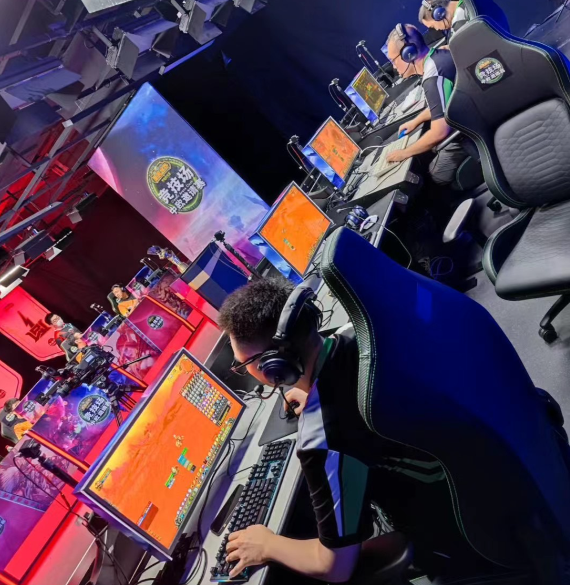
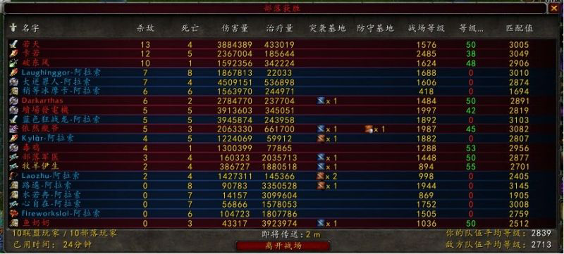
“卡若，你知道吗？现在有一个BUG，可以在3小时内完成2400评级战场，而正常情况下，这需要打一周的时间。”若天的语气中带着一丝兴奋。

“真的吗？那怎么操作？”立刻来了兴趣。

随后，我们花了很大的精力一起研究里面的规律，一天只睡三四个小时。

我们通过研究发现，这个方法是将服务器的时间错开一部分，只要按照这样操作便可以让一个玩家快速实现他的等级提升：
1. 准备工作：需要20个游戏账号，其中包括10个高评分账号和10个低评分账号，每个对立方各5个
2. 进入战场：首先，10个高评分的账号进入战场，这些账号的评分会被系统记为整个团队的评分。
3. 错开时间：在高评分账号进入后，延迟一段时间，再让部分低评分账号逐个进入战场。
4. 评分计算：系统会根据已经进入战场的账号评分进行平均计算。由于高评分账号先进入，整体评分较高。后续进入的低评分账号不会显著影响平均值。
5. 完成任务：低评分账号迅速完成战场任务，获得战场的评分便可以迅速提升，从而实现快速提升评级。

意识到这是一个巨大的机会。

正常情况下，玩家需要花2000多元请代练，并且要花1周的时间和精力才能达到2400评级，而通过这个BUG，只需要3小时就能完成。

这意味着我们可以为其他玩家提供服务，帮助他们快速提升评级，并从中赚取收入。

我们决定立即开始行动。

首先，我们需要找到足够的游戏账号来进行操作。

然而，问题随之而来，当时找不到20个游戏账号，并且每个能打比赛的账号价格昂贵，一个约三四千块，20个账号需要6万块的投入。

同时我和若天在淘宝上发布了“宝贝”，价格定在400元一次，仅有市场价的1/6。没想到，短短几小时内，就有十几名玩家联系我们，表示愿意购买我们的服务。

通过这种方法，我们可以在短时间内为客户完成高难度的评级等级任务。

然而，事情并没有我们想象的那么顺利。当我们按照计划进行操作时，突然游戏更新了评级规则，导致我们无法完成任务。

客户们纷纷表示不满，有的甚至要求退款。

“卡若，我们该怎么办？”若天有些慌乱地问道。

“别急，我们再试一次。如果还是不行，就先暂停服务，找到问题的根源再说。”我冷静地回答。

那一晚，我躺在床上，脑海中不断回想着白天发生的一切。虽然遇到了一些困难，但我坚信这个机会是值得抓住的。

第二天，我和若天再次尝试，终于找到了新的游戏规则，只要修改进场的顺序，就可以成功解决这个问题。

我们重新启动了服务，并在论坛和淘宝上发布了成功案例的截图，虽然账号在论坛上被封了，但是吸引了更多的客户。

随着业务的扩大，意识到单靠我和若天两个人，无法满足越来越多的客户需求。

于是，我决定组建一个团队，专门负责操作和客户服务，并且开始做知识付费。

很快，其它几个排名很高的淘宝卖家，月光竞技等也过来咨询这个业务，他们在天猫的流量也是很不错的，同时也是一名精明的商人。

他们听说了我们的操作方法，并对此非常感兴趣，提出了一个合作建议。

“卡若，我听说你们有一套操作方法可以快速完成2400评级战场，我觉得这是一个很好的商机。

你有没有兴趣把这套方法整理成教程，卖给我们 ” 月光说道。

虽然当时只是想着找更多合作伙伴，也没意识到知识付费其实是一个筛选的人才并且有收入的好生意。

但是我们还是花了些时间开始整理我们的操作方法。

详细地记录了每一步操作，从如何找到高评分账号、如何错开时间进入战场、如何计算评分等，制作成了一套完整的教程。

开始针对一些懂行的卖家以1万元的价格出售。

这份“评级战场”的课程不仅为我们带来了额外的收入，还让我们的影响力进一步扩大，链接了不少同行。

随着业务的扩大，意识到单靠我和若天两个人，无法满足越来越多的客户需求。

于是，我们决定组建一个团队，专门负责操作和淘宝客户服务。

一部分人是在游戏中招募的比较认同我们的玩家，从一开始团队散乱到后面一点点解决和淘汰，到后面制定了详细的合作规则。

每个团队成员经过培训，掌握操作流程，并签订合作协议，我们才算走上正轨。

我们的业务逐渐走上正轨，收入也越来越稳定。然而，我并没有满足于现状。

知道，世界上还有许多未被发现的商机，只要我们不断探索和创新，就能抓住更多的机会。

“卡若，你有没有想过，除了评级战场，还有哪些地方可以利用？”若天问道。

“当然有，我已经在研究下一个项目了。”我微笑着回答。

未完待续……

## 2.5｜我抓住的机会（下）：抓住机遇，乘势而上

2012年秋，在魔兽世界评级战场BUG业务逐渐稳定后，开始思考如何将这种商业模式复制到其他领域。

评级战场的成功让意识到游戏经济中蕴含着巨大的商机，而这些机会往往被主流商业所忽视。

"卡若，你有没有注意到魔兽世界的金币交易市场？"

一天，若天提出。"那里的交易量比评级代练大多了，而且更稳定。"

若天的观察让我产生了兴趣。通过初步调研，发现魔兽世界的金币交易确实存在巨大的市场空间。

一些玩家有大量的游戏时间但缺乏现金，而另一些玩家则有充足的现金但缺乏游戏时间。

这种差异创造了交易的可能性，而且比起评级战场的一次性服务，金币交易可以形成持续的业务模式。

我的业务模式相对简单：从有大量游戏时间的玩家（通常是学生或低收入人群）那里低价收购游戏金币，然后以更高的价格卖给有钱但没时间的玩家（通常是白领或商人）。

差价就是我的利润。

为了扩大交易规模，开始关注5173、比加气等游戏交易平台。

这些平台聚集了大量的游戏交易需求，提供了便捷的交易渠道。

我每天都会监控这些平台上的价格波动，寻找套利机会。

"在不同的服务器之间，同样的游戏金币价格可能差异高达30%，"我在笔记本上记录道，"这就是套利空间。"

为了进一步提高效率，我开发了一个简单的价格监控工具，可以追踪多个游戏服务器上的金币价格变化。

当某个服务器的金币价格异常低时，系统会自动提醒我进行大量收购。

这种"套利"模式为我带来了可观的额外收入。

除了自己操作外，我还看到了另一个商机——为游戏工作室提供工具和渠道。

很多小型游戏工作室专门从事"打金"业务，即大量生产游戏金币，但他们缺乏稳定的销售渠道。

2012年底，我偶然发现了一款名为"魔兽兄弟"的德国软件，这是一套专为游戏工作室设计的自动化工具，可以大幅提高金币生产效率。

我立即联系了开发者Bossland，希望代理这款软件在中国的销售。

最初的沟通非常困难，因为我认为Bossland只会说德语，而我只懂英语和中文。我们只能通过谷歌翻译勉强交流。

"那时候每次交流都像是在破解密码，"我后来回忆道，"但商业语言是通用的，我们很快就达成了合作。"

通过代理"魔兽兄弟"软件，我不仅获得了销售佣金，更重要的是建立了与众多游戏工作室的合作关系。

我为他们提供工具提高效率，同时成为他们生产的金币和装备的主要收购商。这种双向的商业模式大大扩展了我的业务规模。

随着业务的扩大，我找了几个得力助手帮我处理日常事务，但核心决策和操作仍然由我亲自把控。

相比于构建一个庞大的团队，我更倾向于保持小而精的运作模式，这使我能够快速响应市场变化，也减少了管理成本。

2012年5月15日，暗黑破坏神3（简称暗黑3）正式发布。与以往的游戏不同，暗黑3引入了一个革命性的功能——暗黑3拍卖行，官方允许玩家使用暗黑3交易游戏内物品和金币。
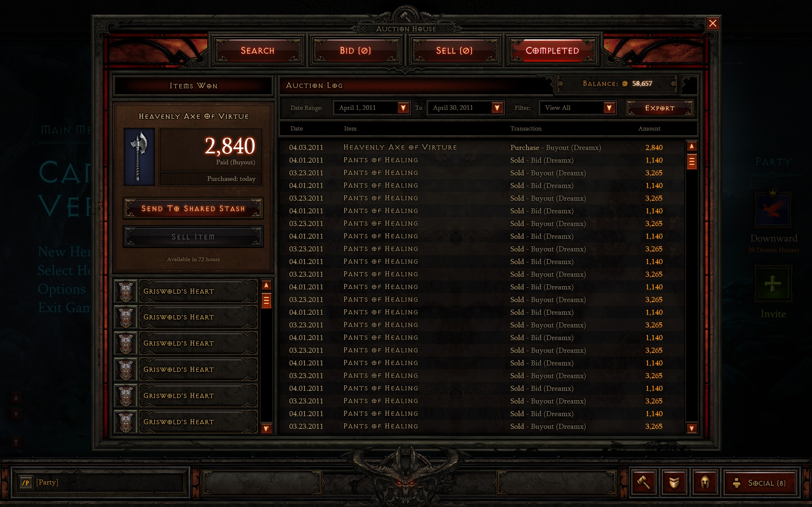
这在游戏史上是一个重大突破，也为我提供了全新的机会。

"这是个游戏规则的革命性变化，"我对自己说，"官方认可的交易意味着我可以从灰色地带走向阳光下的生意。"

在暗黑3发布后的第一个月，我密切关注着游戏内经济的发展和拍卖行的价格走势。

我注意到一个有趣的现象：不同地区服务器之间的物品和金币价格存在显著差异。

特别是亚洲服务器（包括台湾）和欧洲服务器之间的价格差异有时高达30%以上。

这引发了我的灵感——如果能够在低价区购买，然后在高价区出售，岂不是可以赚取差价？

于是，开始研究如何在不同区域的服务器之间进行交易。

第一个挑战是账号问题——暗黑3的账号是区域锁定的，亚洲账号只能在亚洲服务器玩，欧洲账号只能在欧洲服务器玩。

经过调研，发现英国市场存在特殊优势。

首先，当时英国没有加入欧元区，英镑相对于其他欧洲货币有一定优势；

其次，英国玩家的购买力较高，但暗黑3打工玩家相对较少，导致英国服务器上的物品普遍定价较高。

2013年初，开始执行这个跨国套利计划。

首先，我委托在英国的朋友帮我办理了英国手机号和信用卡，用于注册英国区的暗黑3账号和银行卡

同时，我在台湾服务器上也维持了活跃账号。

我的运作模式如下：
1. 在台湾服务器上收购低价的优质装备和金币
2. 将购买的物品和金币在英国服务器上出售，获得英磅（通过官方拍卖系统）
3. 将资金通过PayPal提现到中国账户   

整个操作周期约需2-4小时，而我每天可以完成多次这样的循环。通过优化操作流程，发现每次循环能够获得约15%的毛利润。

虽然PayPal和货币兑换会收取约5%的手续费，但仍然能保证每次操作10%左右的净利润。

"这就像是在虚拟世界中进行国际贸易，"我在日记中写道，"我实际上是在利用不同市场之间的信息不对称和价格差异。"

在暗黑3英国市场，我几乎没有遇到竞争对手，整个市场仿佛是为我一个人准备的。

这种垄断地位让我能够更加灵活地控制价格和交易时机。

选择合适的交易标的也非常重要。

通过数据分析，发现某些特定类型的装备在不同区域的价格差异特别大，而且流动性好。

我将资金集中投入到这些高回报的项目上，进一步提高了资金利用效率。

2013年底，我的暗黑3跨区套利业务每月净利润已经很高了，而且操作风险远低于之前的魔兽世界金币交易。

由于是官方认可的交易模式，我不必担心账号被封禁的风险。

然而，好景不长。2014年3月，暗黑3的2.0更新上线，游戏开发商宣布将在几个月内关闭暗黑3拍卖行。

这个消息对我的业务模式是一个沉重打击。

"市场永远在变化，我也必须随之调整，"我对自己说，"现在是时候思考下一步了。"

2014年6月，暗黑3拍卖行正式关闭。我在拍卖行关闭前的最后几个月里加速运营，尽可能地提取利润，同时也开始寻找新的商业机会。

回顾这段从魔兽世界到暗黑3的跨游戏套利之旅，我总结了几点收获：

1. 市场空间识别 - 游戏虚拟经济中存在大量主流商业忽视的市场机会
2. 跨区域套利思维 - 同一产品在不同市场的价格差异可以创造持续的利润空间
3. 工具与效率 - 合适的工具和自动化系统可以大幅提高操作效率
4. 渠道建设 - 建立稳定的上下游渠道比单纯的交易更有价值
5. 变革意识 - 游戏市场政策随时可能变化，需保持敏感度并及时调整策略

这些年的游戏经济套利经历不仅为我积累了可观的资金，更重要的是，锻炼了我捕捉市场机会、建立交易系统的能力，为我后续的创业之路奠定了坚实基础。

## 2.6｜讨厌的羊毛党：淘宝80%利润被仅退款

2013年，我琢磨着怎么把暗黑3金币的生意再折腾折腾。

你想啊，多一条路子总是好的。

于是，我就把目光投向了淘宝这个大平台，想着在这上面卖金币，应该能有不少客户。

货源这块儿，我还是有几招的。

有时候直接从那些肝帝玩家手里收，他们时间多，打出来的金币想换点零花钱；

有时候呢，就去5173这种游戏交易平台转转，看到价格合适的就扫一批货。

我还给一些小规模的打金工作室提供点便利，比如一些能提高效率的小工具、小插件什么的。

他们打出来的金币，我就按商量好的价格，稳定回收一部分。

这样一来，金币来源七七八八也就凑得差不多了，就等着在淘宝上卖出去赚钱了。

因为自己当时淘宝店已经用在其它地方了，我就想到了朋友 "袜子"。

他手头正好有个闲置的淘宝店铺，信誉还行。我跟他一说，他挺仗义就把店借我用了。

拿到店之后，我琢磨着怎么才能让咱们的金币商品在淘宝上更容易被人瞧见。

那时候我捣鼓的时候发现淘宝一个挺有意思的"特性"，或者说是个可以利用的空子：

一个商品的链接，如果浏览的人多，它的搜索排名就蹭蹭往上涨。

这不就有操作空间了嘛！

我立马就折腾起来，搞了一堆虚拟机，写了些自动化脚本。

这些脚本能自动换着IP地址，模仿真实用户那样去访问我们店铺里金币的商品页面，这里点点，那里看看，整个过程看起来就像是很多独立的真人在浏览一样。

这一通自动化、模拟真人的操作下来，效果那是立竿见影。我们金币商品的排名很快就冲到前面去了。

排名靠前，能看到的人自然就多，买的人也就跟着多了起来。这销量一上来，又进一步巩固了排名。

这么一来，我们的商品基本上就稳定在搜索结果的头部位置了。

刚开始，因为这排名和流量带动的，一切都还挺顺当。

订单一个接一个，看着支付宝里数字往上涨，心里那叫一个美滋滋啊。

那时候我还挺乐观，觉得这生意能搞头不小。

可好景不长，麻烦事儿很快就找上门了。

"卡若，你看这个订单，买家说没收到货，申请'仅退款'了！"有一天，袜子急匆匆地跟我说这事儿，他帮我看着店后台。

我一听就蒙了，点开一看，那是一笔"几千块钱"的金币订单。我这边明明有清晰的发货记录，游戏里的截图也证明买家账号确实收到了金币。

我让袜子把这些证据都提交给淘宝客服，心想这肯定是误会，解释清楚了就行。

哪知道，这只是噩梦的开始。

接下来，各种各样的"仅退款"申请就没停过。"没收到货"、"数量不对"、"卖家你这是骗人的吧"……理由五花八门，一个比一个离谱。

我天天就忙着整理各种截图、交易记录，有时候还专门录下发货过程的视频，就为了证明自己没坑人。

可这些证据，在淘宝小二眼里，好像没啥大用。

他们处理这种虚拟物品的纠纷，十次有八次都是向着买家说话，"保护消费者权益"嘛！

结果就是，买家申请退款，平台就给退，根本不管你卖家是不是真的发了货。

我们辛辛苦苦收来的金币，真金白银地发给了买家，结果人家收到东西，转脸就申请退款，钱退回去了，金币人家可不还你。

这跟明抢有啥区别？平台还变相地给他们撑腰！

我记得特别清楚，有个买家，在我借来的袜子的店里拍了笔大额的金币，也是几千块。收到货后没过几个小时，就点了"退款"。

我们把所有能证明清白的证据都提交了，结果呢？淘宝客服轻飘飘一句"支持买家"，钱就没了。

那段时间，真是焦头烂额。

年底粗略一算，因为这些"仅退款"，我们损失的利润高达80%！几万块钱就这么眼睁睁地没了，心里那个疼啊。

因为这些破事儿，袜子那个店也受到了影响，各种纠纷、差评，店铺权重直线下降。我都不好意思再麻烦他了。

折腾到最后，这淘宝卖金币的路子，算是彻底给我堵死了。真是赔了夫人又折兵。

栽了这么大个跟头，虽然肉疼，但也确实让我长了不少记性，看清了很多以前没看清的东西。

## 2.7｜第一个盈利模型的建立

2013年，深度地复盘了以往几年的经历。

最初的项目是WAP短信和铃声下载网站。注册51313点c0m e域名，和网吧老板陈总合作，把服务嵌入网吧主页。

第一个月收入只有300元，半年后稳定在5000元。那时我还不懂什么叫"盈利模型"，只知道哪里有需求，哪里就有机会。

1、
2005年，我把注意力转向网吧广告和三大件（鼠标、键盘、耳机）合作。

用28K的小程序解决壁纸自动更新问题，免费为网吧提供耳机、键盘、鼠标维护，换取桌面广告权。

到年底，覆盖厦门5700个屏幕，广告收入和渠道资源成为新资产。

同年，获得廖总100万投资，做电影服务器项目。

我们用"免费硬件+内容分成"的模式，快速铺开100家网吧。

那时我以为，只要有流量、有资源，闭环就能跑通。

但现实很快给了我一记重击。

视频网站的崛起让本地服务器模式迅速失去竞争力，100万投入几乎打水漂。团队士气低落，合作伙伴分歧加剧。

那段时间，我反复问自己："为什么有流量、有用户，却无法持续获利？"

开始梳理过往所有项目，发现无论是虚拟物品交易、域名投资，还是网吧广告、电影服务器，都缺乏一个系统化的商业闭环。

于是，通过和"黑狼"、龙哥等一些好朋友深度地交流和学习几个国外营销大师的成功经验进行复盘、我试图用"引流-漏斗-变现-迭代-裂变"来梳理自己的思路：

- "引流"：网吧桌面、主页、广告，精准获取目标用户流量。
- "漏斗"：设计高效的用户转化路径，从广告到点击、注册、消费，每一步都要简洁顺畅。
- "变现"：广告分成、内容付费、服务佣金，多元化收入分散风险。
- "迭代"：每月根据数据反馈优化产品和服务。
- "裂变"：让网吧老板、用户自发推荐，形成网络效应。

但再完美的东西，也抵不过外部环境的剧变。

视频网站的冲击、用户习惯变化，让意识到：闭环不是万能的，市场变化和团队协作同样重要。

这些年，视频网站的崛起、用户习惯的变化，更加深刻地体会到：真正优秀的是，能够不断适应环境、引领团队、激发创新。每一次变化，都是一次升级和自我成长的机会。

2、
2008年，虚拟物品交易市场迅速崛起。我和游戏好友“若天”在一次《魔兽世界》评级战场中，意外发现了一个可以极大提升效率的漏洞。

正常情况下，玩家要花一周时间、2000多元请代练才能完成2400评级战场任务，而我们通过错开账号进场顺序，仅需3小时就能完成。

这一次，我用它来约束每一个环节：

- “引流“：通过淘宝、游戏论坛、淘宝SEO、网吧用户导流，精准吸引目标客户。
- “漏斗“：优化服务流程，从咨询、下单到交付，极致简化每一步。
- “变现“：不仅提供代练服务，还开发知识付费教程，拓展增值收入。
- “迭代“：根据用户反馈和市场变化，持续优化操作流程和团队分工。
- “裂变“：客户转介绍、同行合作，形成行业影响力和网络效应。

我们在淘宝上发布服务，定价仅为市场价的1/6，短短几小时就有十几名玩家下单。

团队规模迅速扩大，涵盖操作、客服、售后等多个岗位。我们将操作流程系统化，制定详细分工和合作协议，确保每个环节高效协作。

随着业务的扩大，越来越多的同行找上门来，希望购买我们的操作方法。

我们顺势将经验整理成详细教程，以几万元的价格卖给其他淘宝卖家，正式开启了系统性复制的模式。

这不仅带来了额外的现金流，也让我们的影响力在行业内迅速扩大。

但市场环境依然在变。平台规则调整、用户需求变化，每一次外部冲击都倒逼我们复盘和创新。

3、
我们不断优化它，最终实现了从单一服务到多元化产品的转型。

随着这个"引流-漏斗-变现-迭代-裂变"它的成熟和多次验证，意识到，要让它更高效地运转，并且能够规模化复制，光靠人工和零散的工具是不够的，必须要有系统化的工具来支撑。

这个想法驱动开始投入系统开发。

最先切入的就是社群管理。

当时微信群和QQ群是主要的用户池，但管理起来非常繁琐，尤其是在客户量逐渐增多的时候。

于是，我们开始着手开发一个微信与QQ社群的聚合管理系统。

这个系统的核心目标，就是解决客户精细化管理的问题，并帮助我们更好地落地各个环节，特别是"漏斗"的转化和"变现"的效率。

我们把它作为系统的底层逻辑，开发配套的客户管理、内容分发、数据追踪等功能模块。

可以说，这个聚合管理系统的开发，就是我后来"私域系统"的雏形。它不仅仅是一个工具，更是我它思想的系统化、产品化体现。

从一个经过验证的它，到配套的系统工具，再到解决实际运营中的痛点，这一系列动作，为我后续在私域领域的深耕打下了坚实的基础。

这两次经历让我深刻体会到，它不是一成不变的公式，而是一种持续成长、动态优化的底层思维。

它要求我们在每一次实践中复盘、在每一次失败中升级。

- "模型的本质"：不是简单的闭环，而是能适应变化、驱动团队协作、激发创新的系统。
- "失败的意义"：每一次挫折都是更好进化的催化剂，只有不断复盘、调整，才能真正具备生命力。
- "团队与数据"：分工明确、数据驱动，是持续进化的关键。
- "系统化支撑"：成熟的体系是需要系统化工具来提升效率和规模化复制，这是关键一步。

这不仅是对过去的总结，更是对未来的宣言。每一次创新、每一次突破，都是优化和再创造。

## 2.8｜资产倍增的投资：比特币

2013夏天，天气格外炎热。那天，刚刚签署了新房的购房合同。泉州房子的全款支付让手头只剩下7000元，但这并未感到焦虑。反而，因为知道只要坚持聚集做一件事，未来的生活中一定会有新的机会在等待着。

没过多久，中央电视台的新闻节目报道了比特币。这个新奇的数字货币第一次进入了我的视线。作为一个长期活跃在互联网世界的人，我立即闻到了商机。我打开百度指数，发现比特币的搜索量呈爆炸式增长，新闻的曝光让比特币成为街头巷尾的热门话题。

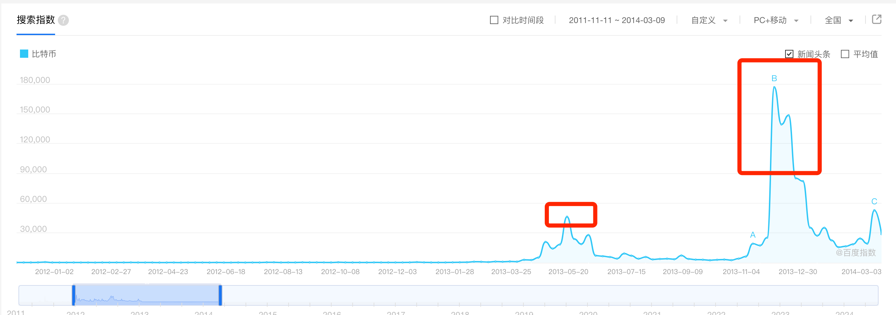

"这是一个机会。"我心想，"央视的曝光将会吸引大量的新参与者，必然会推动比特币价格上涨。"

于是疯狂地研究比特币的原理和机制。这次决策很快，把手头仅有的钱全部投入到比特币中。当时一个比特币的价格还不到600元，买入了12个。

仅仅一周后，我的比特币总价就翻了七倍！达到了4万多元。我感到一阵狂喜，每天都在火币网上关注比特币的价格动向，并不断学习投资技巧和市场分析。

然而，市场的不确定性让我也感到一丝不安。虽然价格在不断上涨，但我无法预测何时会出现崩盘。就在我犹豫是否要卖出时，央视和其他媒体再次报道了比特币。价格再次暴涨，这次涨了五倍，投入的资产变成20万元。

"炒币最重要的是圈子，做任何生意一定要找到核心的小圈子，分享心得，获得信息差。"这也是现在我一直坚守的事情。为了获取更多信息，我花了一笔钱加入了一个比特币高手聚集的QQ群，结识了一群志同道合的朋友。其中"大清"和"小新"给我留下了深刻的印象。

通过与这些已经拿到结果的小伙伴交流，逐渐意识到，投资比特币不仅仅是资金的投入，更重要的是信息和人脉的积累。大清、小新和群里的小伙伴分享了他们的投资心得和市场分析，这些信息对我而言是无价的。

"如果没有这些朋友的帮助，我很可能在价格波动中迷失方向。"

回想一下当时胆子真的很大，多次全部投入了所有资产到一个项目上，放到现在我绝对不可能这么做，风险一定会把握在可控的范围内。

这次比特币的投资经历，不仅仅是账户数字的快速增长，更重要的是让我对"信息差"、"圈子价值"以及在机遇面前"快速学习、果断决策"的重要性有了脱胎换骨般的认知。这为我后续的投资理念和商业决策打下了坚实的基础，也让明白了在变幻莫测的市场中，除了勇气和运气，持续的学习和高质量的链接是多么不可或缺。

## 2.9｜资产倍增的投资：圈子

2007年春天，我第一次真切地感受到“圈子”这玩意儿，到底有多他妈的值钱。

那天，阳光正好，我正准备去球场打球。

突然，一个消息像炸弹一样在我耳边炸开。

听说学长老王把一个域名 E123.COM 卖了。

一口气，赚了 1万美金。

1万美金！

我当时直接懵了。

“域名也能卖这么多钱？！”

那个数字，像一道闪电，瞬间击穿了我对财富的认知。

那晚我彻夜未眠，脑子里反复转着一个念头。

他是怎么做到的？

第二天，我通过朋友介绍，约见了做域名圈子的阿杰。

那是个阴沉的下午，天空中飘着细雨。

我们在图书馆后门那家卖绿豆汤的小摊边坐下，空气里弥漫着潮湿和甜腻的味道。

我还没开口，他就先说话了。

“别想太简单。”

他的语气很平静，但带着一种不容置疑的笃定。

“域名这事，光靠你一个人操作是不够的。”

我愣了一下，心里有些不服气。

他说：“你得有圈子。”

“你得知道哪种米（域名）值钱，谁在收，谁刚退出，哪种行业正在爆。”

他顿了顿，喝了口绿豆汤，补了一句。

“好米从来都不是公开卖的，早就在圈子里内部消化掉了。”

那一刻，我才真明白，原来赚钱的第一步，不是产品，不是技术，而是你在哪个信息场里。

从那个下午开始，开始琢磨。

怎么进圈？

我的生活费一个月才800块。

这笔钱，连买几本书都得掂量半天。

但我还是咬牙，把两个月的钱凑起来，足足1600元。

我用这笔钱，报了一个北京的互联网创业大会。

车票买的是硬座，一路上腰酸背痛。

住的是几十块的青年旅社，六人间，晚上还有人打呼噜。

一到北京就下雨，我连伞都舍不得买，只能顶着雨跑。

但就是这次“挤”出来的旅行，彻底打开了我的认知边界。

我第一次见到了活跃在互联网早期的站长、米农、搞SEO的各路大神。

他们谈项目像吃饭一样自然，动不动就是。

“上个月手头有个米，出掉了，38K。”

我当时听得目瞪口呆。

当晚吃饭时，我亲眼看着阿杰现场用电话，把一个8000块收来的教育类域名，以 3万8的价格卖出。

一通电话，一顿饭，一单生意。

整个过程行云流水，仿佛他们不是在做生意，而是在进行一场愉快的交流。

回来的路上，他跟我说。

“生意啊，靠的早就不只是你卖什么，而是你认识谁，你信谁，谁信你。”

那趟北京行，我没学会怎么卖域名。

但我学到了一件事。

信息差=机会差=财富差。

而“信息差”的根源，不是技术壁垒，而是圈子门槛。

你在那个圈子里，就能第一时间听到机会，就能提前部署，就能找到资源互补的人。

你不在圈子里，连什么是机会都不知道。

这句话，在2013年夏天被再次验证。

那年我刚刚付完泉州房子的尾款，银行卡里只剩下 7000块。

我当时心里一点都不慌，因为知道，只要聚焦，机会总会来。

某天夜里，央视突然播了个关于“比特币”的节目。

主持人语气很谨慎，听起来像在警告。

但我听出了“风声”。

作为一个长期混迹互联网的人，我敏锐地察觉到，这东西，要火。

第二天，我干脆直接把剩下的7000块全部换成了比特币。

当时一个比特币大概 580块，我买了 12个。

仅仅一周后，比特币暴涨，账户里的数字变成了4万多。

我坐在宿舍里，盯着屏幕上跳动的数字，突然就不知道该怎么办了。

“现在该卖吗？全卖？留点？继续买吗？”

我连夜刷帖子、看博客，但一个比一个说得玄乎。

有的说“马上会归零”，有的说“未来100万一个”。

这时，突然想起阿杰那句话。

“你要找到核心圈子里的那几个人。”

于是我干了个狠事。

我花了 2000块钱，加入了一个收费的比特币QQ群。

这笔钱，在当时来说不算小数目，但我决定赌一次。

事实证明，这是我人生花得最值的2000块。

这个群门槛设置得刚刚好。

外面那些瞎扯淡、炒作割韭菜的进不来，里面是几位真懂的——有做金融分析的大清，盘感一流；也有搞底层技术的小新，把区块链的原理讲得像讲故事一样清晰。

大清说。

“比特币不是赌，它是金融系统的叛徒。”

“你要理解背后的结构，而不是盯着短期价格。”

小新接话。

“它的底层共识机制决定了它不可能完全归零，但也不适合短线操作。”

我跟他们每天聊天，看他们分析，听他们讲技术和趋势，就像每天上了几节贵族私塾。

听了建议，我在比特币涨到 5000元一个的时候，先卖出了一半。

回了本，心里也踏实。

剩下的，我分批卖出。

到 2014年初，比特币价格飙到接近三万块一个，我总共赚了近 20万。

从7000到20万，不是靠运气。

而是靠信息+判断+行动力+圈子。

我不是最早入局的人，也不是技术最强的，但我做了两个关键动作。

一个是进圈，一个是请教。

你发现没有？

我们普通人能看到的，往往都是“结果”。

“他做域名赚了10万”“他比特币翻了几十倍”

但结果背后，是看不见的——是他提前听到的信息，是有人点拨的认知，是在对的圈子里做出的选择。

这些东西，没法用教程教给你。

只能靠你自己用时间、资源甚至是钱，换取入场资格。

不是说你一定得花钱才能进圈。

而是舍得投入的人，才会被那个圈子接受。

有一次我问小新。

“你怎么会愿意在群里讲这么多？”

他笑。

“我讲，是因为知道你们听得懂，也真的在做。”

“讲给对的人听，是种回报。”

这才是真正的圈子——不是“资源置换”，而是“互相认可”。

大家理念相近，节奏一致，说话有效率，做事有配合。

这跟加个微信群、混个论坛、蹭个饭局完全不是一回事。

很多人一谈圈子，就说“这人脉不值钱”“交朋友不能功利”。

但在我看来。

真正的圈子，不是你主动“经营”的，而是你主动“精进”后，吸引来的。

你变强，才配得上那个圈子。

你愿意投入，那个圈子才容得下你。

你若始终在圈外，那些好项目、好机会、好认知，都会错过。

你不是没能力，只是没站对位置。

所以说啊，别老想着省那几百块、几千块，反而把几十万的机会拦在门外。

一个圈子，能不能帮你少赔，我不知道。

但知道，它可能是你赚更多的唯一捷径。

## 2.10｜资产倍增的投资：自己

投资自己，是用二十多年血泪和汗水总结出的唯一真理。

不是鸡汤，是血淋淋的现实。

2006年到2018年，这十二年，是真正开始系统性投资自己的关键时期。

每一分钱，每一分钟，都精准地投向了一个目标：让自己变得更值钱。

渐渐看清一点：世界上最好的投资标的，就是你自己。

股票会跌，房价会降，但能力、认知、人脉，只要方法对了，永远只会增值。

那几年，把自己当作一家公司来经营。

CEO、股东、员工，都是同一个人。

要让这家"卡若公司"的估值，每年都翻倍增长。

2007年，做了人生第一个重要的自我投资决定：学习Java编程。

当时在厦门一家小公司做网站维护，月薪2000块。

看着那些Java程序员月薪上万，心里痒得不行。

培训费要8000块，对当时来说，简直是天文数字。

咬咬牙，借了钱，报了培训班。

每天下班后，别人在打游戏、看电视，这边对着屏幕敲代码。

周末别人在逛街、约会，照旧敲代码。

三个月后拿到Java认证。

半年后，月薪从2000涨到了8000。

这8000块的投资，带来了400%的年化收益。

比任何理财产品都牛逼。

2008年，第二个重要投资：学英语。

很多技术文档都是英文的，很多好项目也在国外。

语言，就是和更大世界之间的桥梁。

报了英语培训班，每天早上6点起床背单词。

地铁上听英语，吃饭时看英文技术博客。

一年后已经能流利地和外国客户沟通，接到了第一个海外项目。

项目收入，是当时月薪的三倍。

投资语言能力，直接把收入天花板掀开了。

2009年，把更多精力投在人脉网络上。

技术再牛，如果没有人脉，也很难做大事。

开始参加各种技术聚会、创业沙龙。

每次聚会，主动认识至少5个新朋友。

回家把他们的信息整理成表格，定期保持联系。

这些人脉，后来成了创业路上最宝贵的资源。

有的成了合作伙伴，有的成了客户，有的成了投资人。

人脉就是钱脉，这话一点都不假。

2010年，投资健康。

那时候经常熬夜写代码，身体越来越差。

有一次连续加班一周，差点晕倒在电脑前。

身体是革命的本钱。没有健康，再多的钱也没用。

办了健身卡，请了私人教练。

每周至少运动三次，严格控制饮食。

一年后体重从180斤降到了150斤。

精神状态好了，工作效率也提高了。

再也没有因为身体原因耽误工作。

健康投资的回报，是无法用金钱衡量的。

2011年，投资形象。

在商务场合，第一印象非常重要。

花钱定制了几套西装，学习了商务礼仪。

还专门请形象顾问设计发型和穿搭。

这些投入让客户面前更有自信，谈判成功率也提高了。

外表投资，带来的是内在自信的提升。

2012年，补财商这一课。

会赚钱和会理财是两回事。

开始读投资理财方面的书，量很大。

还参加了一些投资培训课程。

学会了如何分析财务报表，如何评估投资风险。

这些知识让后来在创业中，能更好地管理现金流，做出更明智的投资决策。

2013年，补管理能力。

随着团队扩大，管理跟不上。

报了MBA课程，学了系统的管理理论。

还请管理顾问梳理公司的组织架构和流程。

学会了如何激励员工，如何制定战略，如何控制风险。

管理技能上来以后，公司运营效率大大提升。

2014年，补心理素质。

创业路上，压力和挫折是家常便饭。

抗压能力还不够强。

开始学心理学，参加一些心理训练课程。

学会了如何调节情绪，如何面对失败，如何保持积极心态。

这些心理技能，让后来在创业低谷里，能坚持下来。

2015年，拓宽视野格局。

格局决定结局。

开始大量阅读，每年至少读50本书。

还经常参加高端论坛，和行业大佬交流。

甚至花钱参加了一些昂贵的商学院课程。

思维更开阔了，能看见更多商业机会。

2016年，往专业深度里扎。

在某个领域做到极致，比什么都懂一点更有价值。

选了私域运营这个方向，深度钻研。

读了所有相关的书，研究了所有成功案例。

还亲自实践，不断试错和优化。

最终成了这个领域里能站得住的人。

专业深度，让竞争中多了一张牌。

2017年，补创新能力。

在快速变化的时代，创新能力是核心竞争力。

学设计思维，参加创新工作坊。

还经常和年轻人交流，了解最新趋势和想法。

能不断推出新的产品和服务。

保持在市场中的领先地位。

2018年，投资影响力。

有影响力的人，赚钱更容易。

开始写文章，做演讲，参加媒体采访。

还做自媒体，分享经验和观点。

建立了个人品牌，扩大了影响力。

影响力带来了更多商业机会。

回顾这十二年的自我投资历程，几条规律越来越清晰：

第一，投资自己的回报率，远远超过任何其他投资。

在身上投入的每一分钱，都获得了几倍甚至几十倍的回报。

第二，自我投资要系统化，不能东一榔头西一棒子。

要根据目标和现状，制定清晰的投资计划。

第三，自我投资要持续化，不能三天打鱼两天晒网。

学习是长期过程，需要持之以恒。

第四，自我投资要多元化，不能只押一个方面。

技能、健康、人脉、形象、财商、管理、心理、视野、专业、创新、影响力，都很重要。

第五，自我投资要实用化，不能为了学习而学习。

要学以致用，把知识转化为实际能力和收入。

到了2018年底，算了一笔账。

这十二年在身上投入了大概100万元。

年收入从2006年的2万多，增长到了2018年的200多万。

投资回报率超过了1000%。

更重要的是，获得了持续赚钱的能力。

这种能力，任何人都拿不走。

常常对年轻人说：

如果现在没钱，不要急着去投资股票、房产。

先投资自己。

让自己变得更值钱，比让钱变得更多更重要。

只要足够值钱，钱自然会来找你。

如果不值钱，即使有钱，也会很快失去。

投资自己，是这个世界上最稳赚不赔的买卖。

这是用十二年时间、100万真金白银验证的真理。

## 2.11｜第一个一百万的意义

2013年泉州市的夏天像个巨大的蒸笼，柏油路被晒得冒油。我攥着刚交完新房尾款的收据，银行卡余额只剩下7000.42元。空调外机在窗外嗡嗡作响，把客厅的空气搅得更加燥热。

"咔嗒"一声，电视突然切换到财经频道。屏幕上那个戴着金丝眼镜的分析师正语速飞快地说着什么"去中心化"、"点对点传输"。我本来想换台，却被画面角落那个跳动的数字吸引——"神秘数字货币突破600元关口"。

那天下午，我把自己关在书房。浏览器开了23个标签页，从白皮书到论坛帖子，手指在键盘上敲得发烫。当夕阳透过百叶窗在地板上投下斑驳光影时，我做了一个让后来的自己都后怕的决定：全仓买入。

"叮铃铃——"

深夜三点，特别提示音突然炸响。我一个激灵坐起来，摸过手机。那个花2000块大洋才挤进去的VIP群正在疯狂刷屏，头像亮着的都是些平时只在财经新闻里见过的ID。

"@全体成员 政策风向变了，准备下车"

发消息的是"大清"，群里公认的消息通。我盯着屏幕上那条消息，后背沁出冷汗。账户里的数字还在疯长，但那些红色的涨幅数字突然变得刺眼。

"小若，还记得我们说的止盈线吗？"小新的私信弹了出来，附带一个咧嘴笑的表情包。

我深吸一口气，点开卖出按钮。窗外的天开始泛白，楼下早点摊传来滋滋的煎油条声。当确认按钮变成灰色时，手机显示余额：204,681.57元。

2015年夏天，我坐在环岛路的咖啡馆里，看着海浪一次次拍打着礁石。桌上摊着三张纸：左边是比特币投资的交割单，中间是域名交易记录，右边是游戏工作室的流水账。当三个数字加起来突破七位数时，咖啡已经凉透了。

"这不是终点。"我在笔记本上写下这句话，笔尖划破纸面。玻璃倒影里的自己穿着洗得发白的T恤，眼睛里却有了以前没有的光。

隔壁桌传来谈笑声，几个年轻人正在讨论新出的手游。突然想起四年前那个在网吧通宵打金的自己，那时以为卖掉一把虚拟武器赚500块就很了不起。

"卡若，这是廖总。"阿杰把我拉到一个穿着亚麻西装的男人面前。酒会的水晶灯晃得人睁不开眼，我下意识地扯了扯皱巴巴的衬衫。

"听说你那个量化模型做得不错？"廖总递过来一杯威士忌，手指上戴着枚低调的百达翡丽。

接下来的三个小时，我们从市场周期聊到认知维度。当他说到"财富的本质是认知的变现"时，突然明白：那7000块能变成一百万，不是因为运气，而是因为每次关键决策前，我都找到了对的人问了对的问题。

现在我经常坐在那个能看见海的办公室里，看着屏幕上跳动的K线。桌上的相框里，是2013年那个夏天的自己——穿着人字拖，抱着机箱从电脑城走出来，汗湿的T恤贴在背上。

有人问我一百万意味着什么？我总会想起那个清晨，当卖出按钮变成灰色时，不是狂喜，而是一种前所未有的平静。那一刻知道：真正的财富自由，不是想买什么就买什么，而是想不做什么就不做什么。

## 2.12｜我的第一个量化交易系统：上帝之眼

2015年，我决定亲手做这件事。

你有没有想过，为什么大部分人在股市中总是赚不到钱？

是不是你也曾经历过这样的瞬间：刚买进去就暴跌，刚卖出去就暴涨，像是被盯梢了一样？

你以为你在交易，其实你只是情绪的奴隶。

我也是从一次又一次的“崩溃”中，才明白一件事。

炒股这件事，本质上不是技术问题，而是人性问题。

当时是为了参加腾讯炒股大赛，我搭建了第一个完整的量化交易系统。那时我没钱没资源，唯一能依靠的，是我的脑子和对人性的深度不信任。

我给它起了个名字：“上帝之眼”。

这个系统并不复杂，甚至在现在看来有些粗糙。但它却第一次真正意义上，在股市里“看懂了人”。

它能干什么？

1.  它能爬取全网几千只股票在东方财富、和讯网等各大平台上的评论数据，捕捉关键词热度；

2.  它能分析每支股票在不同时段的舆情变动，生成“热度雷达”；

3.  它还能进行自动拆分账户、自动化下单交易，用机器代替人来执行决策。

听起来像个工具，其实是一个信仰。

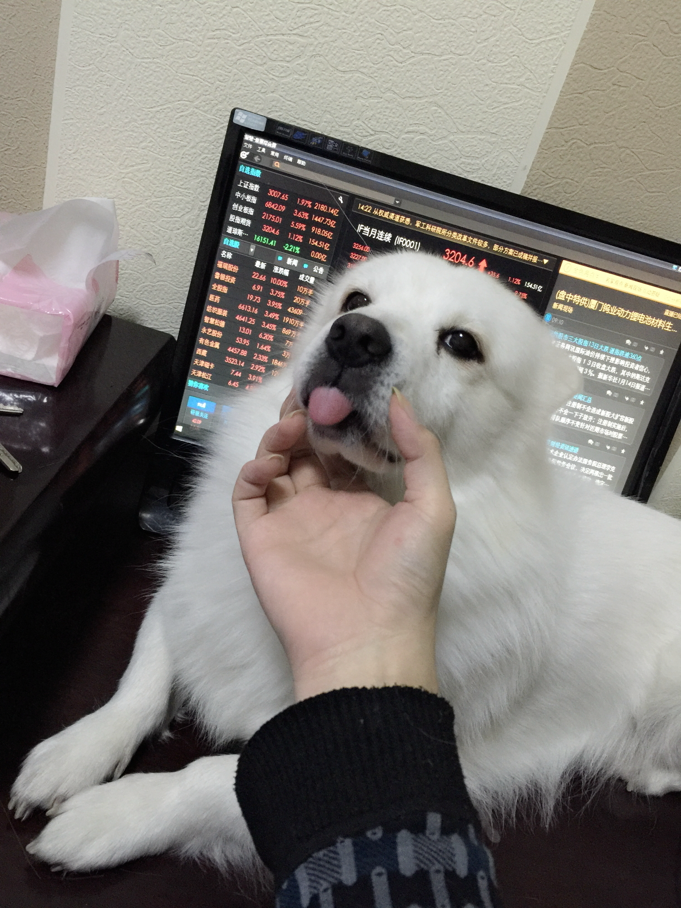

股市不是靠逻辑赚钱，而是靠认知赚钱。

我曾经问过自己一个问题：

“如果你能看到别人都在看什么，那你是不是就能抢在他们之前动手？”

答案是肯定的。股票市场的本质，是博弈，而不是预测。你不是要预测未来，而是要判断别人将怎么行动，然后提前一步。

“上帝之眼”的原理就这么简单。

谁热，谁涨。谁先知道谁热，谁就能先涨。

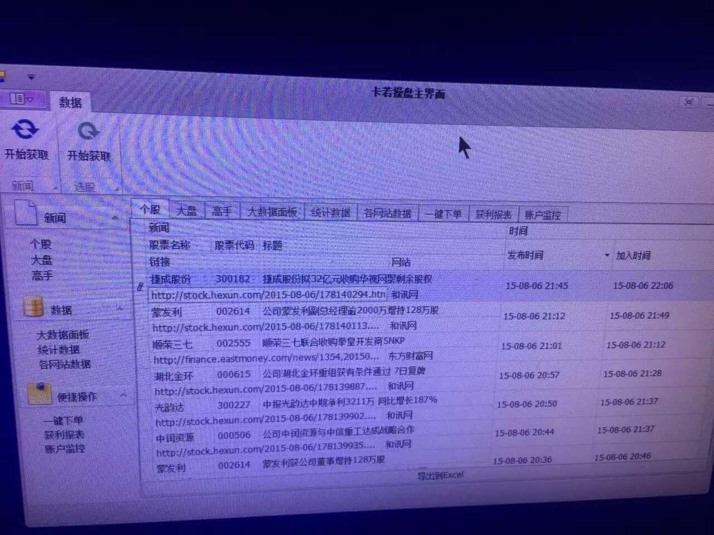

举个简单的现象，具体的操作，我设置了两个时间节点：

-   早上11：30收盘：第一轮舆情采集，查看上午的涨幅与关键词，根据关键字去全网的网站搜索查看量及评论量。

-   12：30：检测分析日内情绪沉淀与以往发生过事件的预期；

-   13：00，开盘——程序自动操作，多账户执行策略。

我人不在市场里，但系统早就帮我埋伏好。

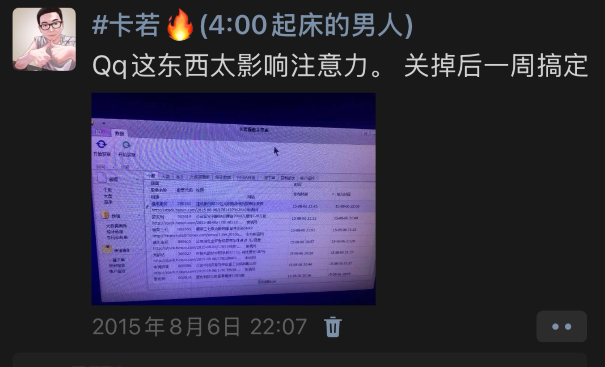

而那几年，我每天只干一件事：复盘当天数据，优化“热度判断逻辑”。

逐渐发现：舆情波动往往领先股价1-2小时，甚至更早。而散户，是被情绪带进坑里的那一批人，而不是带动情绪的那一批人。

我不需要猜大盘，我只需要预测情绪。

人性的弱点，是最大的信息。

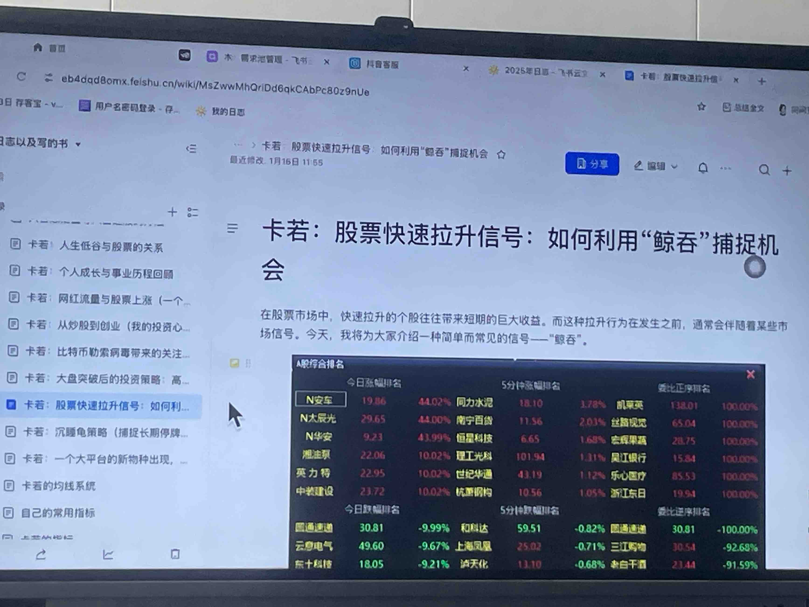

最让我震撼的一次，是在某一支医药股暴涨前。

那支股票其实基本面很一般，没有业绩爆点。但“上帝之眼”系统显示，在几小时内关于“中药+股权激励”的关键词频繁出现，评论量暴增 400%。甚至有大量“专业KOL账号”发布相关言论。

马上意识到，有人可能在“放烟雾”。

我没有犹豫，让系统执行了入场动作。两天后，这支股票直接封板。

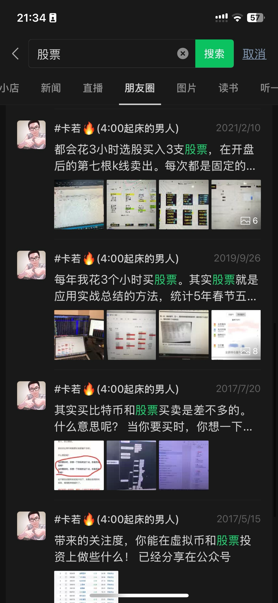

而我的账户，提前三小时布局，在情绪爆发前已经吃下红利。

这让我彻底明白：炒股的本质，不是信息差，而是情绪差。

你不是不知道它会涨，而是你在它还没涨的时候不敢动手。

你之所以不敢，是因为你没有逻辑的确定性，只有直觉的不安全感。

而系统，就是让我把“判断”变成了“执行”的关键。

这个系统，第一次真正理解了一句话：你不是在预测市场，你是在预测人。

市场是人组成的，人性的弱点是永恒的。谁能在情绪失控的瞬间保持系统执行，谁就能在股市里占有先机。

"上帝之眼"给了我的，不是什么神奇公式，而是一种清醒——让我能够在人声鼎沸的市场里，始终记得自己是在做什么、为什么这样做。

## 2.13｜和行业大佬的下午茶

2015年的一个下午，一通电话从上海打来——知名投资大佬廖总，约下午茶，聊行业未来和趋势。机会难得，我心里清楚：这场对话可能影响往后几年的路。

约在万达的一间茶室。廖总开门见山：「卡若，你觉得未来个人的影响力和流量的关系会如何发展？」

稍作停顿，答道：「在未来，会越来越难把流量囤在平台手里，用户会更多握在个人端。影响力就是钱，有了影响力，才有交易和变现的筹码。」廖总点头，示意往下说。

又补了一段：以个人为中心的玩家、游戏主播正在起来。据我侧面了解，去年不少斗鱼游戏主播年收益已在五十万量级，当年还在放大。廖总微笑，表示赞同。

廖总忽然问：「你有没有想过，除了电竞、除了一个人往前冲，还能在哪些方向放大影响力？」

这话把思路拽向更宽处。我那几年视线几乎全在游戏圈里，团队协作与利益分配想得少，别的可能性几乎没排进日程。廖总看出迟疑，接着说：「游戏明星不只等于电竞。直播、短视频这些新媒体，都能承载 IP，把粉丝和流量做起来。」

像被拨亮了一盏灯——长期局限在一个小圈子里，外面的天地一直没认真排过优先级。

散场回家，廖总那几句仍在脑子里转：为什么我没早一步把「影响力」当成独立变量？曾经以为，在电竞里做到顶，就能定义成功；现在看，成功需要更宽的影响半径和更多元的变现路径。

于是业务线开始往外铺：不再只锁在游戏代练，而是往直播、短视频伸手，用内容把粉丝聚起来，同时链接更多游戏主播，慢慢搭品牌。

几个月里，各大直播与短视频平台都开了账号，分享行业里的实战经验，粉丝涨得很快。又和几位头部主播、KOL 联动，一起推游戏知识付费产品。

与知名主播的合作：决定往外扩之后，我联系了一位狼人杀圈里的知名主播「法拉利」。双方在直播里联动，对方推电竞教程，也顺带介绍其他合作方的内容。这一波带来了一大波新用户。
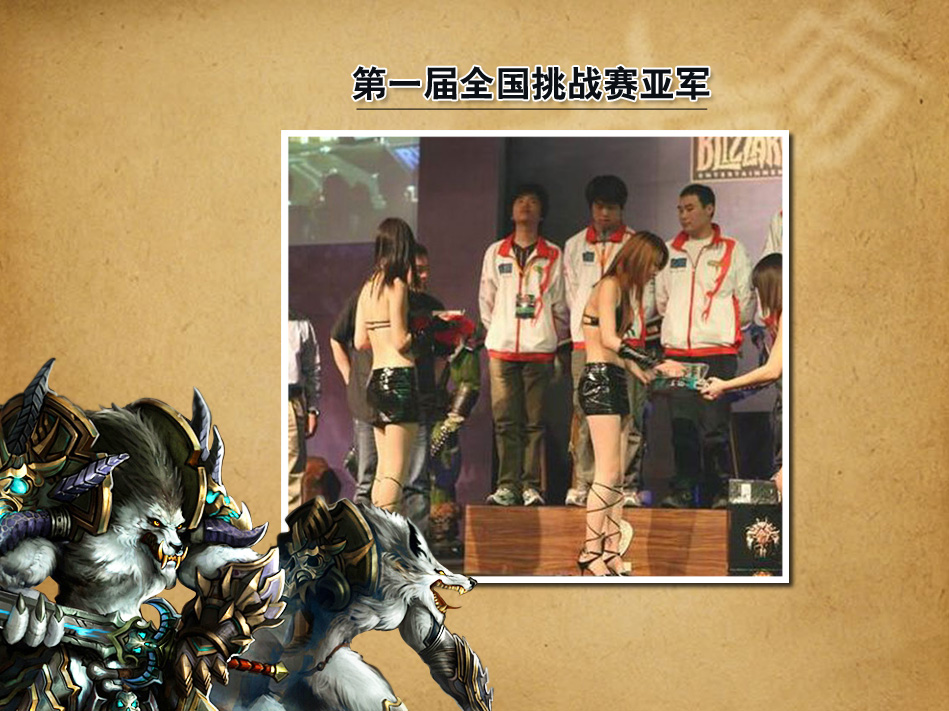
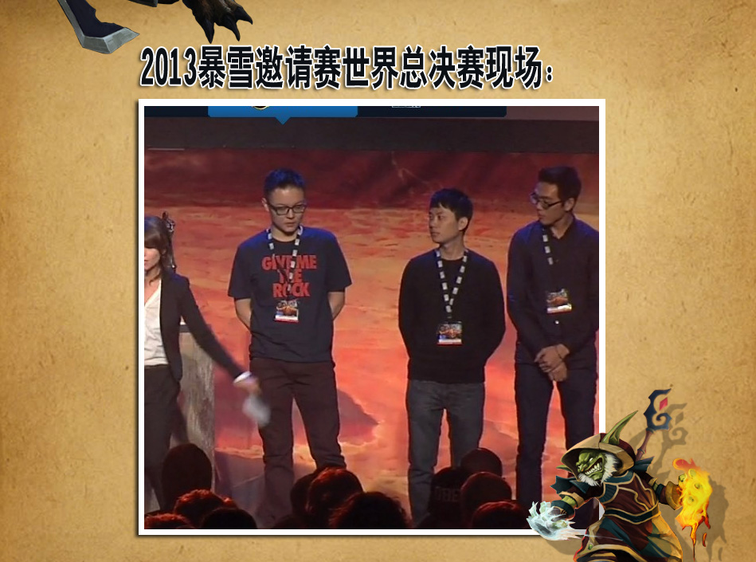

游戏技巧分享课：又召集一批主播，在多平台开「技巧分享」固定档，每周直播聊心得。有一场专门演示《魔兽世界》里长年累月练出来的技术与段位思路，在线观众过万，当场卖出三百多份课。
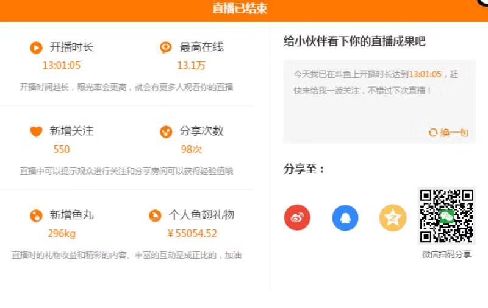

粉丝和收入一起往上走。影响力与钱的关系，在那几年里越来越具象：有了声量，商业机会会自己找上门。

然而，那只是更大版图里的第一圈。

## 2.14｜游戏行业的最后一个项目（上）：知识付费

2016年，那时淘宝店给一群以打游戏为生的玩家派发代练代打订单，也拿过不少国内外的奖项。

有一天，一个朋友问：“卡若，我们就这样一直打下去吗？”

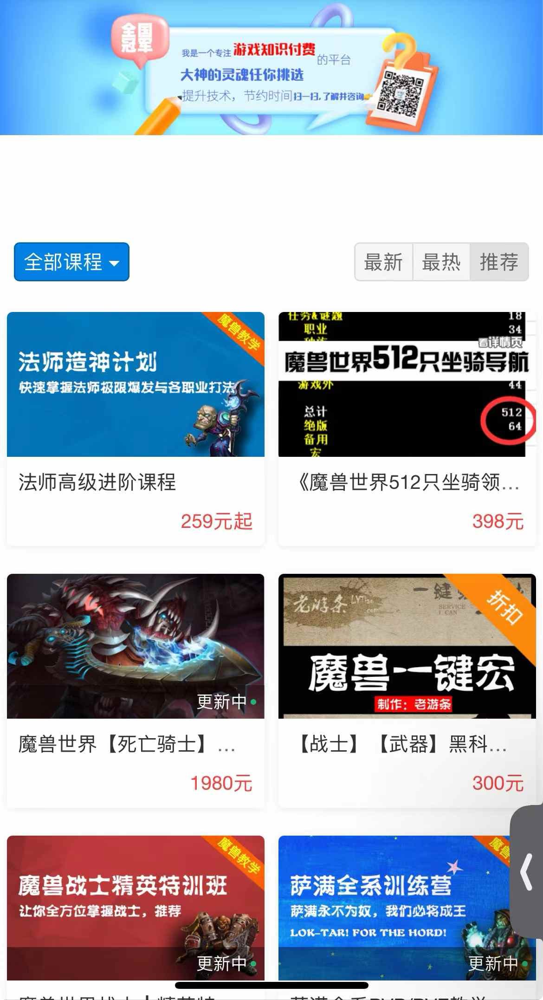

愣在原地，心里涌起一股迷茫。成绩虽然有了，但这真的是想要的生活吗？

后来渐渐发现，有些玩家渴望提升技术，想在游戏里证明自己。

有个玩家，玩了好几年却一直玩不好，总抱怨队友。

走过去说：“你不能只怪队友，也许还差一些知识与小技巧。”

他疑惑：“真的吗？”点点头：“可以教你一些。”

从那以后，试着教一些玩家游戏技术。

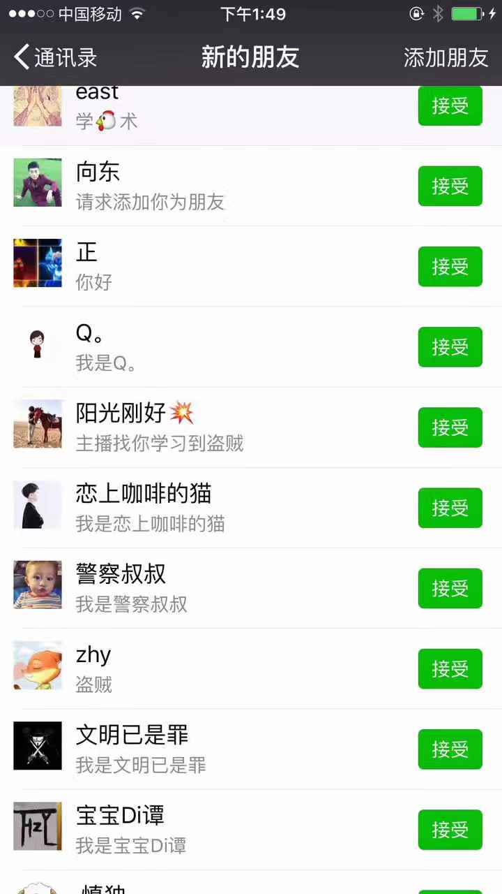

然而，这种行为引起了一些人的质疑。

有人说：“玩游戏还要学习？这不是搞笑吗？”

还有人说：“不就是打个游戏，找个代练不就行了。”

无奈又生气，回他们：“你们错了，那不是自己的技术，这样会让游戏变得不健康。”

他们并不听解释。一次比赛里，有个请代练的玩家，表现得很糟糕，被对手打得落花流水。

他的对手嘲笑他：“角斗士也不过如此嘛，我也可以，只怪队友太坑，找个代练打上去。”

这更坚定了做游戏教学的决心。

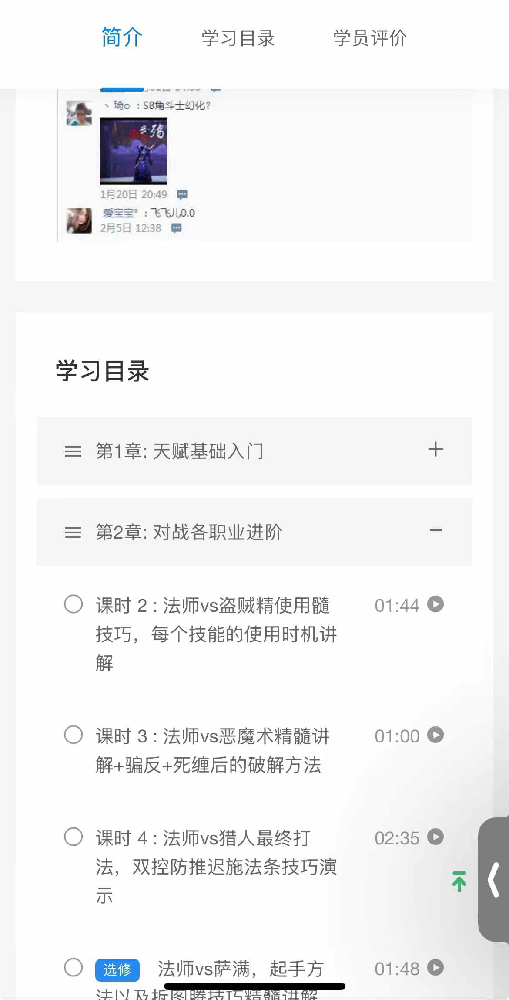

有时会想，为什么要做游戏教学？是为了赚钱吗？

还是为了满足虚荣心？

后来渐渐明白，是为了让那些热爱游戏的人，真正提升技术，在游戏里找到乐趣和成就感。

路还很长，困难和挫折不会少。只要坚持下去，总能靠近当初想做的事。

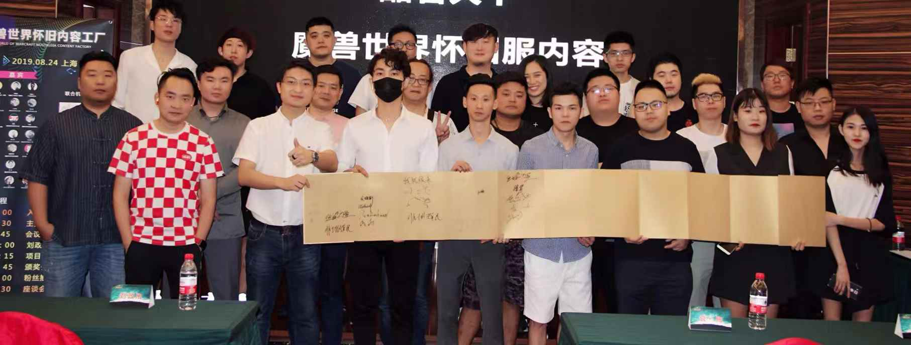

## 2.15｜游戏行业的最后一个项目（下）：为梦想画上圆满句号

2016年，厦门的海风带着一丝暖意，我坐在办公室里，看着墙上贴满的数据图表。

经过前期的摸索和验证，我们的游戏知识付费项目已经初见成效。

但我心里清楚，单纯的课程销售只是开始，真正的价值在于构建一个完整的生态系统。
暂时无法在飞书文档外展示此内容
我要做的，不仅仅是卖课程，而是要打造一个从"星探发现"到"粉丝变现"的完整闭环。

我那时就明白，生态，才是最大的护城河。

 从单点突破到系统构建：生态思维的觉醒

回想起我之前总结的盈利模型："引流-漏斗-变现-迭代-裂变"2.7《第一个盈利模型的建立：找到通往成功的钥匙》，意识到，这个模型不仅适用于传统业务，更适用于我们正在构建的游戏明星生态。

但游戏行业有其特殊性，我需要对这个模型进行深度改造。

开始重新梳理整个业务链条：

第一环：星探系统（引流升级版）
- 不再被动等待优秀玩家，而是主动出击寻找潜力股
- 建立游戏明星孵化标准和评估体系
- 构建多渠道发现机制

第二环：培养体系（漏斗精细化）
- 从技术培训到个人IP打造的全方位培养
- 建立阶梯式成长路径和考核机制
- 形成标准化的明星孵化流程
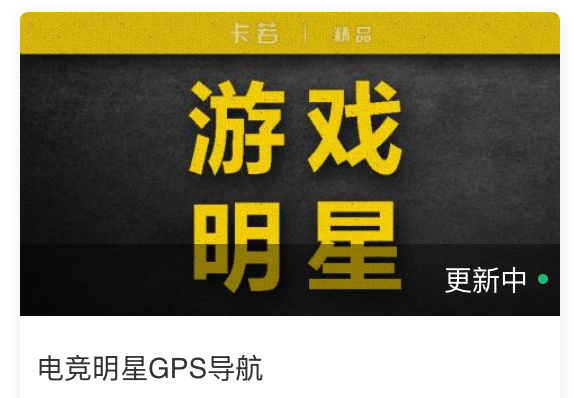

第三环：粉丝运营（变现多元化）
- 不仅仅是课程销售，更包括社群运营、周边产品、赛事组织
- 建立粉丝分层管理和精准营销体系
- 实现从免费用户到付费会员的转化

第四环：产品供应链（迭代系统化）
- 整合游戏装备、周边产品、定制服务等供应链资源
- 建立产品开发和质量控制体系
- 形成持续的产品创新能力

第五环：自循环机制（裂变生态化）
- 让成功的游戏明星成为新的"星探"和"导师"
- 建立利益分享机制，激发生态内部活力
- 实现从线性增长到指数级增长的跨越

我那时就明白，组织，比单点更有力量。

 星探系统：从被动发现到主动孵化

我们的第一步，是建立专业的"星探系统"。

我招募了5名专职的游戏星探，他们的任务就是在各大游戏平台、论坛、直播间寻找有潜力的玩家。

我给他们制定了明确的寻找标准：

技术维度：
- 游戏操作水平达到服务器前10%
- 对游戏机制有深度理解和独特见解
- 具备教学和分享的基础能力

个人维度：
- 表达能力清晰，具备基本的沟通技巧
- 有一定的个人魅力和感染力
- 愿意投入时间进行系统化学习和提升

潜力维度：
- 在某个细分领域有独特的优势或创新
- 具备持续学习和自我提升的动力
- 对成为游戏明星有强烈的意愿

我记得，我们发现的第一个"璞玉"是一个叫小龙的玩家。

他在《魔兽世界》的PVP领域有着惊人的天赋，但由于性格内向，一直默默无闻。

我们的星探在一次服务器比赛中发现了他，被他精妙的操作和独特的战术思路所震撼。

"这个人，有成为顶级游戏明星的潜质。"星探兴奋地向我汇报。

我那时就明白，发现，比培养更重要。

我们主动联系了小龙，向他介绍了我们的游戏明星孵化计划。

最初，他有些犹豫，担心自己不够优秀，也担心这是否靠谱。

但当我们展示了血染等成功案例，以及详细的培养计划和收益分成方案后，他被打动了。

"我愿意试试但我不知道自己能不能做好。"小龙有些忐忑地说。

"没关系，我们会全程支持你。你只需要专注于提升自己，其他的交给我们。"我坚定地回答。

我那时就明白，信任，是合作的基础。

 培养体系：从技术高手到全能明星

有了优质的"原材料"，接下来就是系统化的培养。

我们为每个签约的潜力玩家制定了个性化的成长计划，包括：

技术提升模块：
- 一对一的高级教练指导
- 定期的实战训练和复盘分析
- 与顶级玩家的交流学习机会

个人IP打造模块：
- 个人形象设计和包装
- 内容创作能力培训
- 直播和演讲技巧训练

商业认知模块：
- 游戏行业趋势和商业模式分析
- 个人品牌建设和粉丝运营
- 财务管理和投资理财知识

小龙在我们的培养体系中快速成长。

三个月后，他不仅技术水平有了显著提升，更重要的是，他开始具备了明星的气质和魅力。

我们为他在斗鱼开设了直播间，第一次直播就吸引了超过5000名观众。

"小龙的操作太精彩了！"
"这个战术思路太牛了，我要学！"
"小龙老师，能不能出个教学视频？"

弹幕里的赞美和请求让小龙信心大增。

我那时就明白，成功，是最好的激励。

我们趁热打铁，为小龙制作了一套《24小时提升PVP进阶秘籍》的系列课程。

这套课程不仅包含技术教学，更融入了小龙的个人经历和成长感悟。

课程一经推出，就受到了热烈欢迎，首月销售额就达到了8万元。

"我从来没想过，打游戏还能赚这么多钱！"小龙激动地说。

我那时就明白，价值，是最好的回报。

 粉丝运营：从单纯消费到深度参与

有了优质的内容和明星，接下来就是精细化的粉丝运营。

我们建立了完整的粉丝分层体系：

第一层：免费用户（观众）
- 通过直播、视频等免费内容吸引
- 提供基础的游戏资讯和简单教学
- 目标是建立认知和初步信任

第二层：付费用户（学员）
- 购买课程和教学服务的用户
- 提供系统化的技能提升方案
- 享受专属的学习群和答疑服务

第三层：核心用户（粉丝）
- 深度认同明星理念和风格的用户
- 参与各种线下活动和专属聚会
- 享受定制化服务和优先权益

第四层：超级用户（合伙人）
- 愿意深度参与和投入的核心粉丝
- 可以成为助教、代理或合作伙伴
- 分享明星成长和商业成功的收益

我们为每一层用户都设计了不同的服务内容和转化路径。

例如，免费用户可以通过参与互动、分享内容等方式获得积分，积分可以兑换付费课程的优惠券。

付费用户在学习过程中表现优秀的，可以获得成为助教的机会，不仅能够深度学习，还能获得额外收入。

核心粉丝可以参与明星的商业决策，甚至成为某些项目的合伙人。
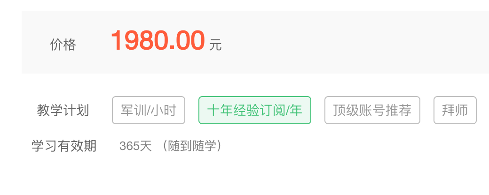
我那时就明白，参与感，比消费更重要。

我们还建立了完善的社群运营体系。

每个游戏明星都有自己的专属社群，由专门的运营人员负责日常维护。

社群内不仅有技术交流，更有生活分享、情感互动、线下聚会等丰富内容。

我们发现，那些在社群中活跃度高的用户，往往也是付费意愿最强、忠诚度最高的用户。

小龙的粉丝群在半年内就发展到了3000多人，其中付费用户占比超过30%。

更重要的是，这些粉丝不仅是消费者，更成为了小龙品牌的传播者和推广者。

我那时就明白，粉丝，是最好的营销。

 产品供应链：从虚拟服务到实体商品

随着粉丝规模的扩大，我们开始探索更多元化的变现方式。

除了课程和服务，我们还整合了游戏相关的实体产品供应链：

游戏装备和道具：
- 与游戏官方和第三方供应商合作
- 为粉丝提供优质的游戏装备和稀有道具
- 享受批发价格，获得丰厚利润

定制周边产品：
- 设计制作明星专属的周边产品
- 包括T恤、鼠标垫、手办、签名照等
- 满足粉丝的收藏和纪念需求

硬件设备推荐：
- 与硬件厂商合作，推荐优质的游戏设备
- 包括鼠标、键盘、耳机、显示器等
- 获得销售佣金和品牌合作费用

线下活动和培训：
- 组织线下的游戏比赛和交流活动
- 提供面对面的培训和指导服务
- 收取活动费用和培训费用
暂时无法在飞书文档外展示此内容
我那时就明白，情感，是最强的购买力。

我们还与当时刚刚兴起的阿瓦隆矿机厂商建立了合作关系。

随着比特币的火热，很多游戏玩家也开始关注数字货币挖矿。

我们的游戏明星通过直播和社群，向粉丝介绍挖矿的基本知识和设备选择。

由于粉丝对明星的信任，矿机销售异常火爆。

仅仅三个月，我们就帮助厂商销售了价值超过200万元的矿机设备。

按照合作协议，我们获得了30%的销售佣金，也就是60万元。

更重要的是，那些购买了矿机的粉丝，在挖矿收益中还会分给明星一部分作为"推荐费"。

这种模式让我们的收入来源更加多元化和可持续。

我那时就明白，信任，是最好的生意。

 自循环机制：从线性增长到指数级扩张

随着业务的发展，开始思考如何让这个系统实现自我循环和指数级增长。

我设计了一个"明星孵化明星"的机制：

成功明星成为星探：
- 那些已经成功的游戏明星，可以推荐和发现新的潜力玩家
- 他们比我们更了解什么样的玩家有潜力
- 推荐成功的明星可以获得新明星收益的分成

明星互相合作：
- 不同领域的明星可以互相合作，推出联合课程
- 粉丝可以通过一个明星了解和关注其他明星
- 形成明星矩阵，扩大整体影响力

粉丝成为合伙人：
- 优秀的粉丝可以成为明星的助教或代理
- 他们可以在自己的圈子里推广明星的课程和产品
- 获得相应的佣金和分成

区域化扩张：
- 成功的模式可以复制到其他游戏和其他地区
- 培养本地化的明星和运营团队
- 形成全国性的游戏明星网络

血染就是这个自循环机制的最佳案例。

在我们的培养下，他不仅成为了顶级的游戏明星，更成为了优秀的"星探"和"导师"。

他推荐的几个新人，在他的指导下也快速成长起来。

更重要的是，这种成功案例极大地激励了其他明星，让他们也积极参与到新人培养中来。

我那时就明白，共赢，是最好的激励。

这个系统已经开始自我循环，不再需要我们投入大量的人力和资源去维护。

我那时就明白，这就是生态的力量。

 圆满的句号：从梦想到现实的完美闭环

我们用三年时间，构建了一个完整的游戏知识付费生态系统。

我们培养了一批优秀的游戏明星，他们在各自的道路上继续发光发热。

我们验证了"引流-漏斗-变现-迭代-裂变"这个盈利模型的有效性，为我后来的私域流量业务奠定了基础。

更重要的是，我们证明了"生态思维"的强大力量。

一个好的商业模式，不应该是零和游戏，而应该是多方共赢的生态系统。

游戏行业的最后一个项目，为我的梦想画上了圆满的句号。

但人生的故事，才刚刚开始。

# PART 3：代价与重启——从流量生意到公司经营（2016—2020）

## 3.1｜从流量沉淀到新赛道选择：新的旅程

2016年春天，我站在厦门的海边。海风吹得有点冷，心里更冷。刚刚签完游戏公司被收购的最后一份合同，银行卡里多了一笔钱，可我却高兴不起来。

7年了，从一个人在宿舍里熬夜写代码，到后来30个人的团队日夜奋战。现在一切都结束了。那种空虚感，就像突然失去了人生目标一样。

我记得签约那天，律师递过来厚厚一叠文件。每一页都代表着我过去7年的心血。当我在最后一页签下名字的时候，手竟然有点抖。不是因为激动，而是因为不舍。

收购方是一家大游戏公司xx，他们看中的是我们的技术积累和用户数据。但对我来说，这些冰冷的数字背后，是无数个通宵达旦的夜晚，是团队一起攻克技术难题时的兴奋，是第一次看到用户数据暴涨时的狂欢。

我拿出手机，想发个朋友圈，又放下了。

说什么呢？

说我成功了？还是说我失去了？

其实我自己都不知道。

那天晚上，我一个人坐在办公室里。

看着墙上那些奖状和合影，想起刚开始的时候。

2010年，我和几个兄弟挤在一个小房间里。

每天对着电脑十几个小时，眼睛都熬红了。

那时候真的是"赚卖白菜的钱，操卖白粉的心"。

但我们有梦想啊，觉得自己在做一件很牛的事情。

想起2013年那波比特币大涨，我用仅有的7000块钱买了比特币。当时央视刚报道，我看百度指数从几百暴涨到几万，就知道机会来了。

那时候比特币还是个新鲜事物，身边的人都觉得我疯了。"虚拟货币能值什么钱？"朋友们这样说。但我相信数据不会骗人，百度指数的爆炸式增长说明了一切——大众的关注度就是最好的风向标。

我记得很清楚，买入价格是800多元一个，卖出时已经涨到了8000多。那一波操作，让我赚到了人生第一桶金——将近10倍的收益。更重要的是，这次经历让我明白了一个道理："信息差就是财富，而数据是最诚实的信息。"

现在呢？

钱是赚到了，可游戏行业变了，我也变了。

我在纸上写下几个字："一个阶段的结束，往往是另一个阶段的开始。"

写完就撕掉了，觉得太矫情。

但我不能一直这样下去。

第二天，我约了几个老朋友吃饭。

其中有个做电商的朋友，老陈。

他看我这样子，直接说："卡若，你这是怎么了？"

"游戏公司卖了，不知道下一步该干什么。"我老实说。

"那你有什么优势？"他问。

我想了想，说："技术吧，这些年开发了不少工具。"

"什么工具？"

我跟他说了说，自动化脚本啊，数据分析啊，多账号管理啊。

他眼睛一亮："这些东西在电商里很有用啊！"

那一刻，我突然明白了。

这些技术的底层逻辑是通用的！

完全可以应用到更广阔的商业领域。

"信息差就是财富。"我在心里默念着这句话。

开始将目光投向电商领域。

接下来的几天，我开始深度研究电商。每天带着小乖在厦门到处转，一边观察这个城市的商业变化，一边在手机上研究淘宝天猫的规则。

我发现了一个巨大的机会。大多数商家对平台算法的理解还停留在表面——他们以为刷单、刷评价就能获得流量，完全不懂什么是权重分配、什么是标签匹配。

我花了整整一周时间，分析了上千个店铺的数据。发现传统的运营方式已经越来越难获得流量，平台的算法越来越智能，简单粗暴的方法已经行不通了。

而技术驱动的精细化运营，却很少有人在做。比如通过数据分析找到最佳的上架时间、通过用户行为分析优化商品详情页、通过A/B测试找到最有效的推广策略。这些在游戏行业已经很成熟的技术，在电商领域却还是蓝海。

这不就是信息差吗？我兴奋得整夜睡不着觉。

我继续研究，发现了一个有趣的现象。智能手机普及率已经超过90%，配件市场需求巨大。特别是手机壳，这是一个刚需市场——每个人都要用，而且更换频率很高。

我做了详细的市场调研。发现手机壳不仅要保护手机，更重要的是要彰显个性。年轻人平均3-6个月就会换一个新手机壳，就像换衣服一样。这意味着复购率很高，客户生命周期价值很大。

更让我兴奋的是，我发现了一个巨大的信息差：这个市场看起来门槛不高，但利润空间很大。一个成本5元的手机壳，可以卖到30-50元。而大多数厂商还在线下卖，对线上流量获取和精准营销根本不懂。

我在淘宝上搜索了几百个手机壳店铺，发现大部分都是传统的运营方式：靠刷单提升排名，靠低价竞争获取流量。没有一家在做精准的用户画像分析，没有一家在做个性化推荐。

这就是我的机会！技术驱动的精细化运营，在这个传统行业里就是降维打击。

我租了个新办公室，是个废弃的仓库。

花了几天时间收拾，变成了工作空间。

那天下午，阳光透过窗户洒进来，特别亮。

我坐在那里，心情突然好了起来。

感觉又有事情可以干了。

我知道，这一事情不能一个人干了。

需要找几个靠谱的人一起做。

我开始到处找人，运营的、团队管理的、技术的。

"你的圈子决定你的高度。"这话说得对。

和优秀的人一起，才能做出更大的事情。

很快，我找到了几个关键的合作伙伴。第一个是做电商运营的老王，他在淘宝摸爬滚打了5年，对平台算法的理解比官方客服还深。他能准确预测哪些操作会被系统识别为作弊，哪些策略能够有效提升权重。

另一个是搞团队管理的小姗，她有着惊人的组织能力，擅长快速组建和扩展团队。更重要的是，她懂得如何激发团队的积极性，让每个人都能发挥最大的价值。

我们三个人坐在那个简陋的办公室里，制定了详细的三个月作战计划：

第一个月：组建核心团队，搭建技术系统，确定产品线；
第二个月：测试运营策略，优化转化流程，积累种子用户；
第三个月：规模化推广，扩大团队，建立供应链体系。

每一步都充满不确定性，但我们都很有干劲。因为我们知道，这不是在赌博，而是在用技术和数据降低风险。

我跟他们说："抓住机会，快速行动最关键。"

市场不等人，想好了就要马上干。

我们的目标不只是赚钱。

而是要真正解决用户的问题。

给他们提供好的产品，保护手机，还能彰显个性。

这样才能赚到钱，而且赚得心安理得。

同时，我也在思考怎么把以前的技术优势用到新业务里。那些自动化工具和数据分析能力，完全可以用在电商运营上。

比如，我可以开发一套自动化的商品上架系统，根据数据分析结果，在最佳时间上架最合适的商品。我可以建立用户行为分析模型，精准预测哪些用户更可能购买哪些产品。我还可以开发智能客服系统，提高客户服务效率。

如果能把这些技术手段和传统电商运营结合起来，不就能创造巨大的竞争优势吗？这个想法在我心里越来越清晰，越来越兴奋。

回想起以前那些不眠不休的日子，为了一个技术难题，连续三天不吃不睡；为了一个项目，忙到半疯。当时觉得很苦，现在才明白，这些经历都是宝贵的财富。

这些经历让我明白，"一切发生过的事情，都是好事情。"无论成功还是挫折，都是成长路上的养分。正是那些"赚卖白菜的钱，操卖白粉的心"的日子，磨砺了我的意志，让我对风险和机遇有了更深的理解。

更重要的是，我学会了如何在不确定性中寻找确定性。市场会变，技术会变，但用户的需求不会变——他们永远需要更好的产品和服务。而数据，永远是最诚实的向导。

那天晚上，我站在办公室的窗前，看着厦门的夜景。这座城市正在快速发展，到处都是机会。我知道，新的篇章刚刚开始，前方有无限可能。

但这一次，我不再是一个人在战斗。我有了更清晰的方向，更强大的团队，更成熟的思维。最重要的是，我有了一套可复制、可扩展的方法论。

"信息差就是财富，技术就是杠杆，团队就是放大器。"我在心里默念着这句话，这将是我接下来几年的行动指南。

#卡若的IP财富旅程 #厦门重启 #手机壳市场 #信息差 #团队建设 #商业转型

## 3.2｜迷茫中的抉择：垂直市场的深度挖掘

2016年之后，开始逐步离开游戏行业。虽然确定了要做电商，但具体做什么产品，我还是很迷茫。机会太多了，反而不知道该抓哪一个。

那段时间，我经常一个人在办公室里发呆。桌上摆着厚厚一叠项目资料，从服装到数码，从美妆到家居，算M，画F、易经全了解了。每个行业都有机会，每个赛道都有成功案例。但越是这样，我越不知道该选哪个。

有时候会拿起笔，在纸上写："选择比努力更重要，但选择也是最难的。"写完又划掉，觉得自己太矫情了。但这确实是我当时最真实的感受——站在十字路口，每条路都可能通向成功，也都可能通向失败。

为了找到合适的切入点，开始到处跑市场看看别人怎么做的。不是坐在办公室里想，而是真正到一线去看、去感受、去分析。

我制定了一个详细的市场调研计划：每天至少要找3个业内的人聊天，每个月要分析100个成功案例。

有时候去SM城市广场、万象城这些高端商场，看消费者怎么买东西，他们的购买决策过程是什么样的。发现，年轻人买东西越来越注重个性化，他们愿意为"与众不同"付出更高的价格。

有时候去其他电商公司了解项目情况，学习他们的运营模式和管理经验。发现，成功的电商公司都有一个共同点：他们都非常重视数据分析，每一个决策都有数据支撑。

有时候就在街头观察人们的生活习惯。我会坐在咖啡厅里，观察路过的行人，看他们用什么手机，用什么手机壳，多久会换一次。

经过两个月的深度调研，发现了一个有趣的现象：几乎每个人都在用智能手机，而且换得越来越快。iPhone 6刚出来，大街上就到处都是；华为、小米、OPPO、vivo也在快速崛起。

更重要的是，人们对手机配件的需求也在快速增长，特别是手机壳。我做了一个简单的统计：在我观察的1000个手机用户中，超过80%的人都在使用手机壳，而且平均3-6个月就会换一个新的。

手机壳这个市场，表面上看起来很简单，但我深入分析后，发现了巨大的机会。

我花了整整一个月时间，分析了这个市场的各个维度：

首先是市场规模。智能手机普及率已经超过90%，手机壳已经从可有可无的配件变成了刚需。按照我的调研数据，每个手机用户平均每年会购买2-4个手机壳，客单价在30-100元之间。仅厦门市场，年销售额就超过5000万。

其次是复购特性。手机壳不像手机，用坏了才换。很多人是因为看腻了、想换个心情、或者看到更好看的款式就会买新的。这意味着复购率极高，客户生命周期价值很大。

最重要的是竞争格局。发现，大多数传统厂商还在线下卖，主要渠道是手机店、数码城、小商品市场。他们对线上流量获取和精准营销根本不懂，还在用最原始的方式做生意。

而线上的竞争对手，大部分都是小卖家，没有系统的运营策略，更没有技术优势。他们的做法很简单：找个爆款，然后刷单刷评价，靠低价竞争。

这不正是我一直在找的"信息差"机会吗？我有技术优势，有数据分析能力，有系统化的运营思维。在这个传统行业里，我就是降维打击。

知道，真正的机会往往隐藏在被大众忽视的角落。大家都在追逐那些看起来很炫酷的新兴行业，却忽略了这些看起来"不起眼"但实际上利润丰厚的传统市场。

这段时间，我接触了各种各样的项目。

从餐饮到零售，从传统行业到新兴互联网模式。

我参加了无数场电商交流会，与不同领域的人深度沟通。

每一次交流，都是对"圈子"的再定义。

"你的圈子决定你的高度。"

与那些真正有洞察力、有执行力的伙伴交流，才能更快地拨开迷雾，找到正确的方向。

我注意到，大街上几乎人手一部智能手机。

而手机壳作为手机的"第二层皮肤"，其更新速度和多样性令人咋舌。

人们不仅需要它保护手机，更将其视为彰显个性和时尚态度的重要载体。

开始深入研究这个细分市场。

从产品的成本、团队的效率、到用户的需求偏好，每一个环节都进行了细致的分析。

发现，虽然手机壳市场看起来门槛不高，但其中的利润空间却远超我的预期。

尤其是那些设计独特、品质上乘的产品。

更重要的是，开始思考如何在这个传统市场中建立技术壁垒。

回想起以前开发的那些工具，完全可以应用到电商领域。

这个发现，让我心中的迷茫逐渐消散。

我看到了清晰的路径。

"抓住需求和机遇，快速行动非常关键。"

市场不等人，一旦确定了方向，就必须以最快的速度将其变为现实。

我迅速启动了项目，开始寻找可靠的供应商。

并着手组建一支能够将我的想法变为现实的团队。

这次，我更看重团队的协作能力和执行力。

因为相信，"一流的点子，三流的执行力，远不如三流的点子，一流的执行力。"

同时，我也开始着手技术方案的设计。虽然具体的实现还需要时间，但基本的框架已经在我脑海中形成。这套系统将是我们的核心竞争力。

第一个模块是智能化运营系统。通过多IP代理技术模拟不同地区的用户访问，让平台算法认为我们的店铺有着真实的全国性流量。同时，利用自动化脚本优化商品信息和店铺运营，比如自动调整价格、自动回复客服消息、自动处理订单等。

第二个模块是数据分析系统。实时监控市场趋势和竞争对手动态，分析哪些款式最受欢迎、哪些价格区间转化率最高、哪些推广渠道效果最好。这些数据将指导我们的产品选择和营销策略。

第三个模块是用户画像系统。通过分析用户的购买行为、浏览轨迹、评价内容等，建立精准的用户画像，然后进行个性化推荐。比如，喜欢简约风格的用户推荐纯色手机壳，喜欢个性化的用户推荐印花手机壳。

这套技术方案的核心思想是：用技术手段提升运营效率，用数据分析指导商业决策，用个性化服务提升用户体验。在传统的手机壳行业里，这就是绝对的技术壁垒。

那天晚上，我在办公室里画了一张图：技术驱动的商业模式。中心是用户需求，外围是技术手段，连接两者的是商业逻辑。这张图后来成为了我们整个团队的行动指南。

意识到，成功并非偶然，而是对市场深刻理解、对团队高效协作以及对自身优势持续转型的必然结果。更重要的是，要有勇气在不确定性中做出决策，然后用执行力把决策变成现实。

"选择比努力更重要，但选择之后的执行更重要。"我在心里默念着这句话。现在，是时候把想法变成行动了。

## 3.3｜厦门新篇章：新业务的爆发与团队崛起

"在风口到来之前动手，是赌命；在风口到来之后动手，是割肉。"

2017年初，我正式从北京回到厦门。

2016年，厦门。海风依旧带着湿咸味，但空气里却弥漫着另一种气息——机会的味道。

办公室刚租下没多久，窗帘还没挂齐，桌椅是拼凑的，但那种"随时可以点燃"氛围，比任何豪华装修都昂贵。我们瞄准了手机壳这个赛道，像离弦之箭一样冲了出去。没有试错，没有犹豫，只有一个信念：抓住趋势，必须快。

我记得第一天搬进这个办公室的时候，整个空间还散发着装修的味道。墙上贴着我手写的几句话："速度决定生死"、"执行力就是竞争力"、"用技术重新定义传统行业"。这些话后来成为了我们团队的行动准则。

我的核心团队并没有延续上一段旅程的老搭档。一是节奏不对，二是信心未齐。新来的几位却极具爆发力——

第一位是运营高手老王，对电商平台算法如数家珍，能精准猜到用户每一步的心理动线。他曾经在某知名电商公司工作过3年，对淘宝天猫的规则变化了如指掌。更重要地是他有一套完整的数据分析方法论，能够通过数据发现问题、解决问题。

另一位专精团队管理，叫小姗，把那些让人头疼的人员招聘、团队建设、绩效管理变成标准化的执行模型。她有着惊人的组织能力，能够在最短时间内搭建起高效的团队架构。更难得的是，她懂得如何激发每个人的潜能，让团队的战斗力最大化。

我们三个人配合得异常默契，就像一台装配完整、没有一丝缝隙的机器。我始终坚信，"圈子决定高度"，一个能力强又目标一致的圈子，就是最好的商业杠杆。

我们没选择从零开淘宝店、熬口碑、等流量。直接收购淘宝上优质底层老店，快速拿下原有信用评分和访客基数，这一手被称为"拿命换时间"。

这个决策看起来很冒险，但实际上是经过深思熟虑的。我们分析了上百个成功案例，发现新店要想获得平台信任，至少需要6-12个月的时间。而收购老店，虽然成本高一些，但能够立即获得平台权重，这就是"聪明执行"的体现。

我们一共收购了5个老店，每个店铺都有2年以上的经营历史，信用等级在4钻以上。收购成本总计15万元，但这15万元为我们节省了至少半年的时间成本。

很快，我们将这些老店整合、改版、重新定位为手机壳分发平台，一边跑流量一边测试产品线。

这时候，我想起了之前在游戏代练时期积累的技术经验。那些用来自动化游戏操作的技术，完全可以应用到电商领域。

"我们为什么不把运营做得更智能化一些？"我对老王和小姗说道。

当时市面上还不太理解"算法"和"标签权重"这些概念。但知道，"信息差就是财富"。我们团队用了大量的"技术性策略"，从以下几方面彻底打通平台通路：

- **行为模拟**：模拟真实用户的点击路径、页面停留、收藏加购等，提高商品权重。我们开发了一套智能脚本，能够模拟不同类型用户的购买行为，让平台算法认为我们的商品受欢迎度很高。

- **IP轮换**：使用多个IP地址模拟不同地区的用户访问，这是我们从游戏代练时期继承下来的核心技术。我们建立了覆盖全国主要城市的IP池，确保流量来源的真实性和多样性。

- **时段爆破**：掌握平台刷新频率和审核机制，在特定时段进行精准流量投放。通过数据分析，我们发现晚上8-10点是用户活跃度最高的时段，这个时间段的转化率比其他时段高出30%。

- **关键词联动**：根据搜索趋势优化标题、属性词，提升自然搜索曝光。我们建立了一套关键词监控系统，实时跟踪热门搜索词的变化，及时调整商品标题和描述。

- **内容组合**：自研图文模板系统，大幅提升转化率。我们分析了上千个高转化的商品详情页，总结出了一套标准化的内容模板，让每个商品都能有专业级的展示效果。

有一阶段，我们天猫旗舰店的日均访客达到5万人，日订单过万单，这个数字几乎是当时中腰部品牌的极限。

很多朋友问我怎么做到的，其实说穿了：一是经验压缩成底层模型，二是执行压成流程细节，三是人压上线，不留情面。

手机壳本质是"低频非标+轻决策"的产品，价格区间一般集中在9.9~39元，利润靠的是量。但我们团队没有用"走量思维"来定义这件事。

我们围绕"个性表达+社交属性"做内容包装：

- **针对情侣市场**：我们定制了一批"对话式文字壳"，一对壳能配出5种文案。比如"你是我的"和"小可爱"，"想你了"和"抱抱"等。这个系列一上线就成为爆款，单月销量超过10万套。

- **针对潮玩群体**：我们引入二次元授权，主推限定IP图案系列。与几个知名动漫IP合作，推出限量版手机壳，每次发售都能在几小时内售罄。

- **针对办公室白领**：我们做了轻奢风路线，搭配手机支架、背带等联动产品，主打"实用+高级感"。这个系列的客单价比普通手机壳高出50%，但销量依然很好。

客户在我们这，不仅买手机壳，更像是购买一种生活方式的声明。我们不是在卖产品，而是在卖情感价值和身份认同。

很多外部合伙人看到我们增长后想进来，但我很清楚：不是产品好、不是渠道强，是我们整个团队"压强"极高。

那段时间，小姗展现了她在团队管理上的天赋。业务快速增长，我们急需扩展团队。她提出了一个经典的挖人策略："比市场价多20%的工资。"

"卡若，我们要快速组建团队，就不能按常规套路来。"他在会议上说道。"比别人多20%的工资，能挖到最优秀的人才。短期看是成本增加，长期看是效率提升。"

我觉得这个策略很有道理。于是我们开始大规模招人，运营、客服、美工、仓储，每个岗位都比市场价高20%。

结果效果惊人，一个月内团队从十几个人扩展到了五十多人。而且来的都是各个公司的骨干，执行力极强。这些人不仅技能过硬，更重要地他们有着强烈的成就欲望，愿意为了更高的目标而努力。

双十一前的那几天，每个人都睡在公司，包装区贴满了备货SKU的打印图，贴单、拣货、发货流程几乎像流水线工厂一样精确。

我们提前一个月就开始准备，从商品备货到系统压测，从客服培训到物流协调，每一个环节都做了详细的预案。我们甚至租了一个临时仓库，专门用来存放双十一的备货。

最终，2017年双十一当天，我们销售额突破700万，直逼八位数。服务器崩了3次，客服组累倒了6个员工。我看着后台的实时销售数字往上涨，脑袋却是一片空白。

那一刻明白，真正能带来安全感的，不是利润，而是团队的执行力。当所有人都在为同一个目标而拼命的时候，没有什么困难是克服不了的。

有人说，卖手机壳不过是"卖白菜的钱，操白粉的心"。我认。但我也知道，没有这些苦不堪言的"代价感"，我们根本摸不到商业的底层纹理。

而那一段，我不只是学会了如何做电商，更学会了如何打造战斗型组织。我们从信息差中开路，从执行中取胜，从"没资源"中榨出"高产出"。每一次回头看，都像一场从泥里拔出来的硬仗。

这个过程让明白了几个重要的道理：

第一，技术优势在任何行业都是稀缺资源。即使是看起来很传统的手机壳行业，如果你能用技术手段重新定义运营模式，就能获得巨大的竞争优势。

第二，团队的执行力比任何战略都重要。再好的想法，如果没有强有力的执行，都只是空中楼阁。而要打造高执行力的团队，就必须舍得在人才上投资。

第三，差异化不是产品层面的差异化，而是价值层面的差异化。我们卖的不是手机壳，而是个性表达和情感价值。

2016到2017，只不过一年多。但我们却完成了从0到1的转型，从"困局后的突围"到"新赛道的占领"。这个过程中，我始终牢记三句话：
- "信息差就是财富"；
- "圈子决定高度"；
- "执行力决定成败"。

我们用一场漂亮的手机壳之战，打出了属于自己的财富密码。最重要的是，我们证明了技术驱动的商业模式在传统行业中的巨大潜力。

## 3.4｜互联网创业最火的时候到了

2017年到2018年，是整个互联网创业最火的一段时间。

"风口来了，猪都能飞起来。但只有真正有翅膀的，才能飞得更高更远。"

2017年春天，当我看着手机壳业务的销售数据一路飙升时，内心充满了前所未有的兴奋感。那段时间，中国的互联网创业市场如同被注入了兴奋剂，处处涌动着热钱与激情。我深感自己正站在时代的风口浪尖，周围的一切都充满了无限机遇。

那是一个神奇的时代。共享单车、外卖平台、短视频、直播带货，各种新兴商业模式如雨后春笋般涌现。每天都有新的独角兽诞生，每天都有新的融资消息刷屏。整个创业圈都弥漫着一种"万物皆可互联网化"的狂热氛围。

我记得那时候，厦门的创业咖啡馆里总是人满为患，每个角落都有人在讨论BP、融资、估值。我经常在那里遇到各种各样的创业者，有做O2O的，有做人工智能的，有做区块链的。每个人都觉得自己的项目能改变世界，每个人都在寻找下一个风口。

手机壳业务的成功，不仅仅是销售额的飙升，更重要地让我对"流量"和数据有了更深刻的理解。发现，"信息差就是财富"这句话在互联网时代体现得淋漓尽致。

当同行还在为获取流量而苦恼时，我们通过对淘宝和天猫平台底层算法的深入研究，以及早期在自动化技术上的沉淀，能够以更低的成本获取到更精准的流量。

那段时间，我几乎把所有时间都花在了研究平台规则上。我会仔细分析每一次算法更新对我们业务的影响，会深入研究竞争对手的运营策略，会不断测试新的流量获取方法。

我们团队能通过模拟真实用户行为，巧妙地提升商品权重。这些看似"黑科技"的手段，实则都是对数据规律的深度挖掘和应用。

具体来说，我们建立了一套完整的流量获取体系：

**关键词挖掘系统**：我们开发了一套自动化的关键词挖掘工具，能够实时监控热门搜索词的变化趋势。通过分析用户搜索行为，我们发现了很多长尾关键词的机会。比如"苹果X透明手机壳"这样的精准词汇，竞争度低但转化率高。

**用户行为分析**：我们追踪用户从进入店铺到完成购买的完整路径，发现了很多有趣的规律。比如，用户在晚上8-10点的购买意愿最强，周末的浏览时长比工作日长30%，女性用户更喜欢粉色系的产品等等。

**竞争对手监控**：我们建立了一套竞争对手监控系统，实时监控竞争对手的价格、销量、评价等关键指标。一旦发现竞争对手有新的动作，我们能够在第一时间做出应对。

**市场趋势预测**：通过大数据分析，我们能够预测市场需求的变化趋势。比如，我们提前预测到了iPhone X发布后对透明手机壳的需求激增，提前备货，抢占了市场先机。

那段时间，我们开发了一套完整的数据分析系统，这套系统成为了我们最核心的竞争优势。

我记得有一次，我们通过数据分析发现，某个特定时间段的转化率特别高。深入研究后发现，这个时间段正好是用户下班后的休闲时间，他们更愿意花时间浏览和比较商品。

基于这个发现，我们调整了广告投放策略，将更多预算集中在这个时间段，结果转化率提升了30%。这个案例让我深刻认识到，数据不仅仅是数字，更是用户行为的真实反映。

我们建立了一套完整的数据驱动决策体系：

**每日数据复盘**：每天晚上9点，团队都会进行数据复盘。我们会分析当天的关键指标：访客数、转化率、客单价、退款率等。每个指标的异常波动都会被深入分析，找出背后的原因。

**周度策略调整**：每周一早上，我们会根据上周的数据表现调整运营策略和广告投放。如果某个产品的转化率下降，我们会立即分析是价格问题、图片问题还是描述问题，然后快速调整。

**月度业务优化**：每月底，我们会进行深度的业务分析和优化。我们会分析整个月的数据趋势，找出业务增长的驱动因素和制约因素，制定下个月的优化计划。

**季度战略规划**：每季度，我们会基于数据趋势制定下一阶段的战略规划。比如，通过数据分析，我们发现情侣手机壳的市场需求在快速增长，于是我们加大了这个品类的投入。

我们不仅仅是获取流量，更关注如何将流量转化为实实在在的价值。每一个点击、每一次转化，我们都会进行详尽的数据分析，从中提炼出用户行为模式，不断优化我们的产品策略和营销方案。

我常说，**"钱非赚得，乃解决他人问题之回报。帮人多寡，决定财富多少。"** 我们的成功，正是源于我们精准地解决了用户对手机保护和个性化的需求。

在这个过程中，我们的技术优势得到了充分的发挥。那些在游戏代练时期积累的自动化技术，在电商领域展现出了巨大的威力。

**自动化运营系统**：我们开发了一套自动化运营系统，能够自动调整商品价格、自动回复客户咨询、自动处理订单等。这套系统大大提高了我们的运营效率，让我们能够以更少的人力管理更多的商品。

**智能推荐算法**：我们基于用户的浏览和购买历史，开发了一套智能推荐算法。这套算法能够为每个用户推荐最适合的产品，大大提高了转化率。

**动态定价系统**：我们开发了一套动态定价系统，能够根据市场需求、竞争对手价格、库存情况等因素，自动调整商品价格，实现利润最大化。

在这个过程中，团队的力量再次凸显。深知，单枪匹马再厉害，也无法与一个高效协作的团队相匹敌。

我们几位核心伙伴，在运营、团队管理、技术等领域各有所长，互相补位，确保了业务的顺利推进。这种紧密的协作关系，让我们在面对激烈的市场竞争时，能够迅速做出调整，保持领先地位。

我深切体会到，**"你的圈子决定你的高度。"** 和优秀的人在一起，你才能看得更远，走得更稳。

那段时间，我们建立了高效的团队协作机制：

**每日晨会**：每天早上9点准时开始，分享昨天的数据和今天的计划。这个晨会不超过15分钟，但信息密度很高，每个人都要汇报自己负责模块的关键数据和重要事项。

**周度复盘**：每周五下午进行深度复盘，总结经验教训。我们会分析这一周的成功案例和失败教训，提炼出可复制的经验和需要避免的坑。

**月度团建**：每月组织团队活动，增强团队凝聚力。我们会选择一些有挑战性的活动，比如密室逃脱、户外拓展等，在游戏中增进彼此的了解和信任。

**季度培训**：每季度组织专业培训，提升团队能力。我们会邀请行业专家来分享最新的趋势和技术，也会组织内部分享，让每个人都能学到新的知识和技能。

同时，我也开始敏锐地关注到新的流量入口正在悄悄崛起，特别是短视频平台。

2017年，抖音刚刚兴起，很多人还没有意识到它的巨大潜力。但我凭借多年的流量敏感度，预感到这将是下一个"流量池"的战场。

我在团队会议上说："我们不能只盯着淘宝天猫，要开始布局新的流量平台。短视频是未来，我们必须提前布局。"

我们开始思考如何将手机壳业务的成功经验复制到这些新兴平台，并进一步构建属于我们自己的"私域流量"体系。这是一种转型的思考，也是对未来商业模式的提前布局。

我不再满足于依赖单一平台，而是希望能够掌握用户，拥有更自主的运营空间。这个想法当时还很超前，但后来的发展证明了这个判断的正确性。

**短视频内容策略**：我们开始尝试制作手机壳相关的短视频内容。比如，手机壳的创意使用方法、手机壳的保护效果测试、情侣手机壳的搭配技巧等。这些内容在抖音上获得了不错的播放量和互动。

**KOL合作模式**：我们开始与一些小众的KOL合作，让他们使用我们的产品并制作相关内容。这种合作模式的成本比传统广告低很多，但效果却很好。

**用户生成内容**：我们鼓励用户分享使用我们产品的视频和图片，并给予一定的奖励。这种UGC内容的真实性和感染力比我们自己制作的内容更强。

在手机壳业务取得成功的同时，我也在思考如何将我们的技术优势发挥到极致。

那些在游戏代练时期积累的技术能力，在电商领域展现出了巨大的威力。开始设想，如果能够将这些技术进一步优化和扩展，是否能够在更大的市场中获得更大的成功？

这个想法在我心中逐渐清晰，也为后续的技术突破埋下了伏笔。开始思考一个更大的问题：如何用技术重新定义传统行业？

**技术赋能传统行业**：发现，很多传统行业都存在信息不对称、效率低下的问题。如果能够用我们的技术能力去解决这些问题，市场空间将是巨大的。

**数据驱动的商业模式**：开始思考如何构建一个完全基于数据驱动的商业模式。在这个模式中，所有的决策都基于数据，所有的优化都通过算法实现。

**平台化的发展方向**：开始考虑将我们的技术能力平台化，为更多的商家提供技术服务。这样不仅能够扩大我们的影响力，还能够获得更多的数据和更大的收益。

回想起那些不眠不休的日子，为了优化一个技术细节，我曾连续三天不合眼；为了一个项目，我曾忙到半疯。但正是这些经历，更加坚韧，更加清醒。

明白，**"一切发生过的事情，都是好事情。"** 每一个挑战，每一次挫折，都成为了我成长路上的宝贵财富。

那段时间，我经常在深夜里思考：我们现在的成功只是开始，真正的挑战还在后面。如何将技术优势发挥到极致？如何在更大的市场中获得更大的成功？如何建立可持续的竞争优势？

这些思考让意识到，单纯的电商运营已经不能满足我的野心。我需要找到一个更大的舞台，一个能够充分发挥我技术优势的领域。

**技术创新的重要性**：在这个快速变化的时代，技术创新是唯一的护城河。只有不断地技术创新，才能在激烈的竞争中保持领先地位。

**数据资产的价值**：开始意识到，数据是最宝贵的资产。那些看似普通的用户行为数据，经过深度分析和挖掘，能够产生巨大的商业价值。

**生态化思维**：开始从生态化的角度思考问题。不再局限于单一的产品或服务，而是思考如何构建一个完整的生态系统，让各个环节相互促进，形成良性循环。

2017年的这段经历，为我后续的技术突破和商业模式创新奠定了重要基础。开始明白，真正的成功不是赚到多少钱，而是能够用自己的能力去解决更大的问题，创造更大的价值。

这种思考为我后续进入更大的技术领域，开发更复杂的系统，服务更多的客户，奠定了重要的思想基础。知道，更大的挑战和机遇正在前方等待着我。

## 3.5｜发现淘宝流量密码：浏览量和刷单

2017年，手机壳业务成功后，开始寻找更大的机会。那是一个普通的周末下午，我在技术论坛里闲逛，无意中看到一个自动化技术分享。

这个技术原本是为游戏自动化设计的，但我敏锐地发现，它的核心思路可以完美地应用到电商领域。"这不就是我一直在找的自动化解决方案吗？"我在心里暗自兴奋。

这不是偶然，而是我多年技术积累的必然结果。从最初的游戏代练，到后来的手机壳电商运营，我一直在思考如何用技术手段提升效率，降低成本。现在，机会终于来了。

我立即联系了几个技术能力很强的朋友，其中包括老陈，他是个技术高手，曾经在某知名互联网公司担任架构师。我们在办公室里连续讨论了三天三夜，最终确定了技术方案。

**基础架构设计**：
- 购买大量的云服务器分布在全国各地，模拟真实的地理位置分布
- 建立真实的代理池，覆盖全国主要城市的IP地址
- 开发智能脚本模拟真实用户的浏览、点击、购买行为
- 实时监控系统运行状态，确保稳定性和安全性

最初，我们尝试直接使用现有的技术方案，但很快发现它并不完全适合淘宝的环境。淘宝的反作弊系统比游戏服务器复杂得多，需要更精细的技术处理。

"我们必须自己开发。"老陈在测试了一周后说道。"淘宝的算法比我们想象的要复杂，我们需要从零开始构建一套完全适配的系统。"

接下来的两个月，我们几乎没有休息过。白天研究淘宝的算法机制，晚上编写和测试代码。我的办公室变成了一个24小时运转的实验室，墙上贴满了流程图和算法分析。

**核心技术突破**：

**智能行为模拟引擎**：我们开发了一套高度智能的行为模拟引擎，能够模拟真实用户的各种行为模式。这个引擎包含了数百种不同的用户行为模板，从浏览时间、点击路径到购买决策，都能做到高度仿真。

**动态IP管理系统**：我们建立了一个覆盖全国的IP池，包含超过2万个真实IP地址。系统能够根据访问频率、地理位置、时间段等因素，智能分配IP资源，确保每个访问都看起来来自不同的真实用户。

**反检测算法**：这是我们最核心的技术。我们深入分析了淘宝的反作弊机制，开发了一套多层次的反检测算法。这套算法能够实时调整系统参数，规避平台的检测机制。

在方案逐步成熟的同时，我们也在思考具体的业务方向。经过深入分析，我们选择了虚拟商品业务，原因如下：

**标准化程度高**：虚拟商品没有物流成本，交易流程简单，减少了很多不确定因素。

**复购率高**：用户需要持续充值，客户粘性强，能够带来稳定的重复购买。

**利润空间大**：虚拟商品的边际成本几乎为零，利润率可以达到30-50%。

**技术门槛高**：需要强大的自动化系统支撑，这正是我们的优势所在。

我们主要做游戏点卡、话费充值、Q币等虚拟商品的销售。这些商品的需求量大，市场稳定，而且用户对价格不是特别敏感，更看重的是购买的便利性和到账的速度。

2017年3月，我们的系统正式上线。那一刻，我看着监控屏幕上密密麻麻的数据流，心情无比激动。大规模的自动化系统同时工作，就像无数个真实用户在同时浏览和购买我们的商品。

系统的运行效果超出了我们的预期：

**第一个月：销售额8万元**
我记得那天晚上激动得睡不着觉。虽然8万元对于我们投入的成本来说还不算多，但这证明了我们的技术方案是可行的。更重要地，我们看到了巨大的增长潜力。

**第三个月：月销售额突破50万元**
团队士气空前高涨。我们开始意识到，这不仅仅是一个技术项目，而是一个真正的商业机会。我们开始加大投入，扩展服务器规模，优化算法效率。

**第六个月：月销售额达到150万元**
我们开始在行业内崭露头角。很多同行开始打听我们的运营秘诀，但我们严格保密技术细节。这个时候，我们已经成为淘宝虚拟商品类目的头部商家。

**巅峰时期：单月收入380万元**
这个数字至今还让我热血沸腾。我在办公室的白板上写下："从月收入8万到380万，这不是奇迹，而是技术与商业完美结合的必然结果。"

这些增长在当时的行业内是非常惊人的。我们的店铺在淘宝虚拟商品类目中排名前三，成为了行业的标杆。更重要的是，我们验证了"信息差就是财富"和"技术执行力"的重要性。

那段时间，我也开始用赚到的钱做一些投资。发现，做生意和投资有很多相似之处，都需要敏锐的判断力和快速的决策能力。

我形成了一套简单而有效的投资策略：每年国庆，我会花3个小时看股票数据，选3只买入，第7根K线就卖掉。这种简单的投资策略，让我在主业之外也有了额外收入。

发现，无论是做生意还是投资，核心都是数据分析和快速决策。那些看似复杂的市场波动，背后都有规律可循。关键是要有足够的数据敏感度和执行力。

为了维持这个庞大的系统，我们在技术细节上做了大量的优化工作：

**IP管理系统**：
- 实时监控2万个IP的状态，自动识别和替换被封的IP
- 根据地域分布优化访问路径，确保流量来源的真实性
- 建立IP信誉评级系统，优先使用高信誉的IP资源

**行为模拟算法**：
- 模拟真实用户的浏览时间，平均停留时间控制在2-5分钟
- 随机化点击路径和停留时间，避免机械化的行为模式
- 模拟真实的购买决策过程，包括比价、收藏、加购物车等行为

**风控对抗机制**：
- 实时分析淘宝的反作弊策略，及时调整系统参数
- 动态调整访问频率和行为模式，避免触发风控机制
- 建立多层防护机制，确保系统的稳定运行

**数据分析系统**：
- 实时监控系统运行状态，包括成功率、响应时间、错误率等关键指标
- 分析用户行为数据，优化商品推荐和定价策略
- 建立预警机制，及时发现和处理异常情况

在业务快速发展的同时，我也在思考这种模式的可持续性。虽然我们在技术上取得了巨大成功，但我也意识到这种模式存在一些问题：

**政策风险**：平台规则随时可能变化，我们需要不断适应新的规则和算法。

**技术军备竞赛**：需要持续投入研发对抗反作弊系统，技术成本越来越高。

**道德争议**：虽然在法律上没有问题，但可能存在道德争议，需要谨慎处理。

**市场饱和**：随着越来越多的竞争者进入，市场可能会逐渐饱和。

开始思考如何将这些技术能力应用到更加可持续的商业模式中。这种思考为我后续的转型奠定了重要基础。

这个项目的成功，很大程度上得益于我们团队的高效协作：

**老陈**：负责算法的开发和优化，他写的代码简洁而高效，几乎没有bug。他对技术细节的把控能力让我非常佩服。

**网络专家小李**：负责系统架构和网络优化，他搭建的服务器集群稳定性极高，即使在高峰期也能保持99.9%的可用性。

**我**：负责整体策略和商业运营，确保技术优势能够转化为商业价值。我的作用是把技术和商业连接起来，让技术真正为商业服务。

我们三个人的配合就像一台精密的机器，每个人都发挥着不可替代的作用。这种高效的团队协作，是我们能够在激烈竞争中脱颖而出的关键因素。

在那个阶段，我深刻体会到**"抓住需求和机遇，快速行动非常关键。"** 互联网的风口稍纵即逝，一旦发现机会，就必须以最快的速度去验证和执行。

当同行还在摸索流量的门道时，我们已经通过技术手段，牢牢抓住了淘宝流量的核心。这种对速度和效率的极致追求，让我们始终站在时代的前沿，享受着流量红利带来的巨大收益。

这段经历更加坚信，在互联网世界，技术创新并非旁门左道，它更多的是对平台规则的深度理解和对信息差的极致利用。而这种利用，需要敏锐的商业嗅觉、强大的技术支持，以及快速行动的决心。

**核心经验总结**：

第一，**技术优势是最大的护城河**。在信息时代，掌握核心技术就是掌握竞争优势。我们的成功不是偶然，而是多年技术积累的必然结果。

第二，**快速行动比完美计划更重要**。市场机会稍纵即逝，与其花时间制定完美的计划，不如快速行动，在实践中不断优化。

第三，**团队协作是成功的关键**。再强的个人能力，也比不上一个高效协作的团队。每个人都自己的专长，关键是要找到合适的人，并建立有效的协作机制。

第四，**数据驱动决策**。所有的商业决策都应该基于数据，而不是感觉或经验。数据是最诚实的，它能够帮助我们发现问题，优化策略。

第五，**持续学习和适应**。技术和市场都在快速变化，我们必须保持学习的心态，不断适应新的环境和挑战。

这个项目的成功，为我后续的创业奠定了重要的技术基础和商业理念。最重要的是，它让明白了技术与商业结合的巨大潜力，为我后续的转型和发展指明了方向。

## 3.6｜狗被偷了：意外收获与自我成长

2017年5月31日的傍晚，刚看完电影回家，满心期待着见到那只可爱的小乖。小乖是一只白色中型犬，它的前脚有些外八，那独特的走路姿势总是一眼就能认出。它不仅是宠物，更像是家人，陪伴着度过了许多孤独的夜晚。

可那天，推开家门，却没有听到它热情的迎接声，顿时感到一阵心慌。平时这个时候，小乖总是会第一时间冲到门口，摇着尾巴欢迎回家。但今天，家里静得可怕。

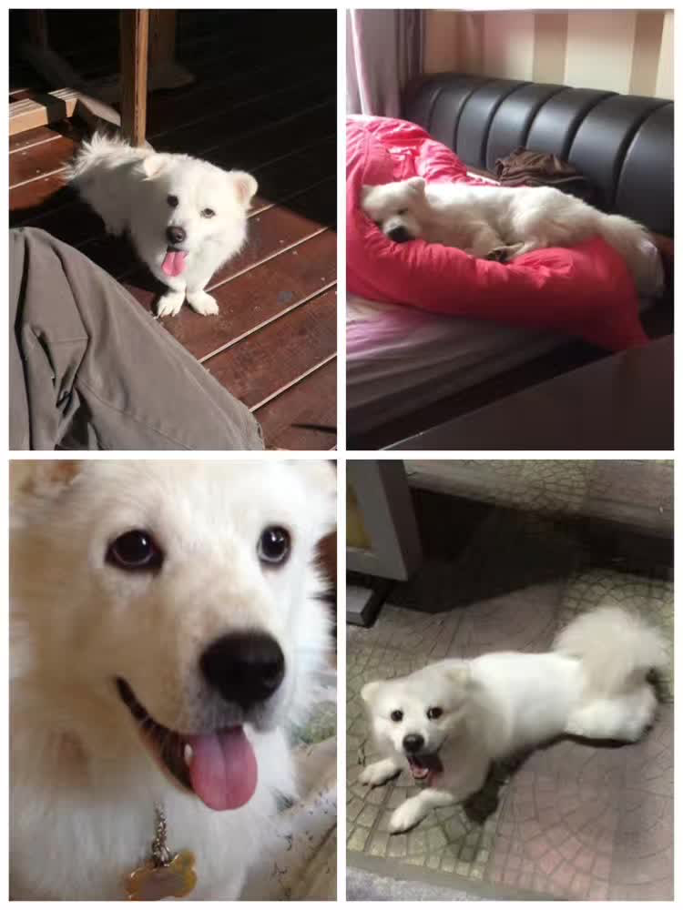

急忙在家里四处寻找，每个角落都不放过——卧室、厨房、阳台、甚至连储物间都仔细检查了一遍。一边找一边大声呼唤："小乖！小乖！你在哪里？"可最终还是不得不面对那个可怕的事实——小乖丢了。

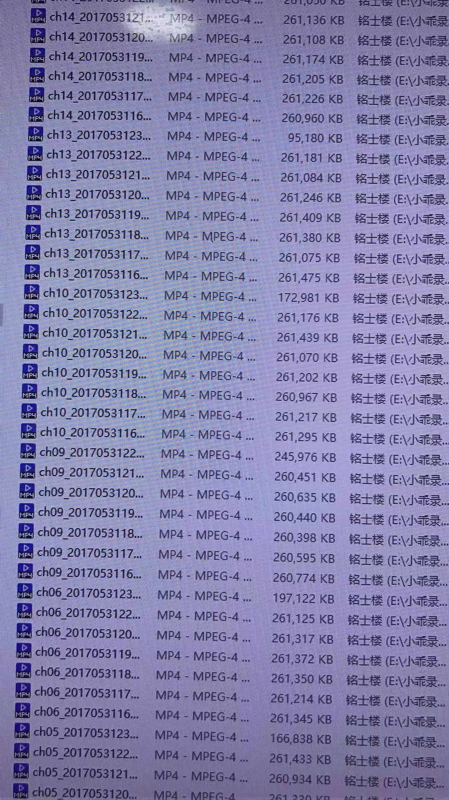

那一刻，世界仿佛瞬间失去了颜色，焦虑和不安如潮水般涌上心头。想起小乖刚来家时的样子，那么小，那么可爱，现在它会不会害怕？会不会饿着？这些想法让人更加焦虑。

立刻开始了疯狂的寻找。深知时间紧迫，每一分钟都可能决定能否找回小乖。先是跑到小区物业管理处，声音颤抖地向工作人员说明了情况，请求查看监控录像。

"师傅，麻烦您了，我的狗丢了，能不能让我看看监控？"几乎是哀求的语气。

物业管理员看到焦急的样子，立刻同意了请求。监控室里，灯光昏暗而寂静，只有监控画面闪烁着微弱的光。紧紧盯着屏幕，眼睛一眨不眨，快速地切换着各个摄像头的画面，害怕错过任何一个可能与小乖有关的瞬间。

从傍晚一直看到深夜，再从深夜看到第二天的傍晚，整整48个小时，几乎没有离开过监控室。眼睛又酸又涩，身体疲惫不堪，但始终没有放弃。物业的工作人员轮班了好几次，但一直坚持在那里。

"小伙子，你先回去休息一下吧，我们帮你继续看着。"值班的保安大叔心疼地说。

"不行，必须亲自看，万一错过了怎么办？"固执地摇头。

心里不断地默念："小乖，你在哪里？一定要找到你。"然而，一遍又一遍地查看，却一无所获，失望的情绪如乌云般笼罩着。但绝不甘心就此罢休。

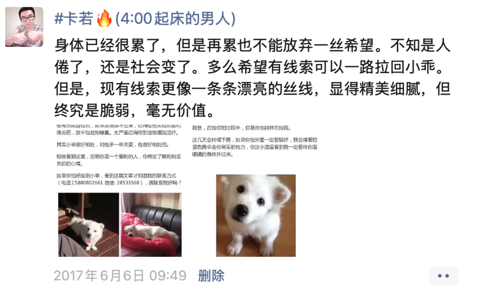

接下来的日子里，几乎没有合过眼，每天骑着平衡车穿梭在小区的每一个角落，去小乖常去的地方寻找。制定了详细的搜索计划：

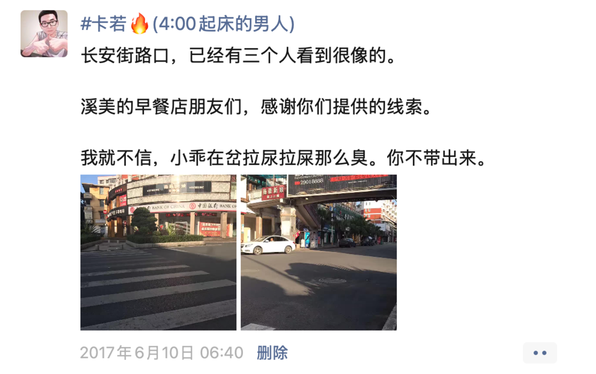

上午时段重点搜索小区内部，包括每栋楼的楼道、地下车库、绿化带。
下午时段扩大到小区周边，包括附近的公园、商店、菜市场。
晚上时段在小区门口守候，因为很多走失的宠物会在夜深人静时回到熟悉的地方。

仔细地查看每一片草丛、每一个角落，大声呼喊着小乖的名字，声音在空旷的小区里回荡，却始终没有得到回应。有时候，远处传来狗叫声，心脏就会猛地跳动，赶紧循声而去，但每次都是失望而归。

小区里的邻居们都认识了，看到骑着平衡车到处找狗，都会主动询问有没有什么进展。有位老奶奶每次见到都会说："小伙子，别着急，狗狗有灵性的，它会回来的。"

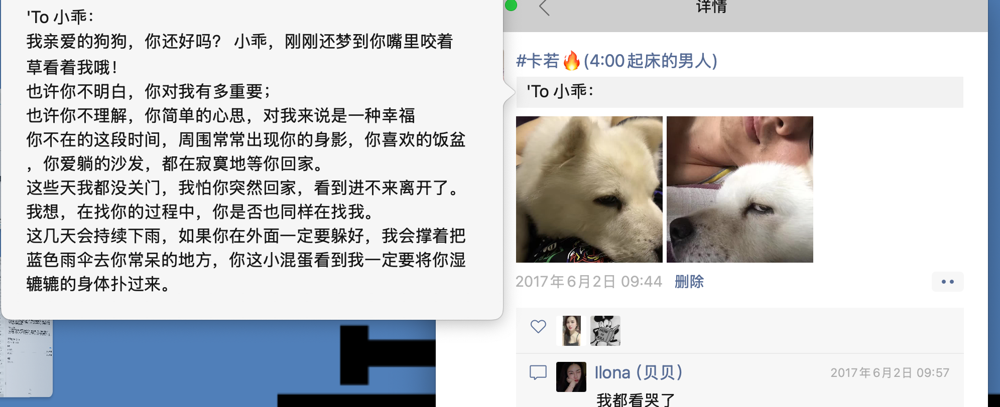

还在微博、朋友圈等社交平台上发布寻狗启事，详细地描述小乖的特征，附上它最可爱的照片，希望能借助网络的力量找到它。

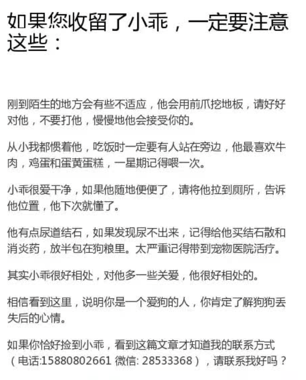

在朋友圈写道："我亲爱的狗狗，你还好吗？小乖，刚刚还梦到你，你每次吃饭都会叫我看，小混蛋，你知道已经找你多久了吗？"

这条朋友圈很快就收到了大量的点赞和评论，朋友们纷纷帮忙转发，评论区里充满了安慰和鼓励的话语：

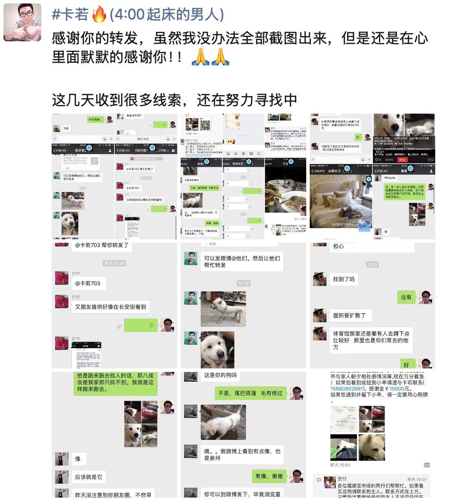

"加油，一定能找到的！"
"我也帮你留意一下！"
"小乖一定在某个地方等你呢！"

但小乖依旧没有消息。每天晚上，都会刷新朋友圈，希望能看到有人说发现了小乖，但每次都是失望。

为了扩大寻找范围，做了一个重要决定——印制大量的万元寻狗启事。这在当时是一笔不小的数目，但为了小乖，觉得值得。

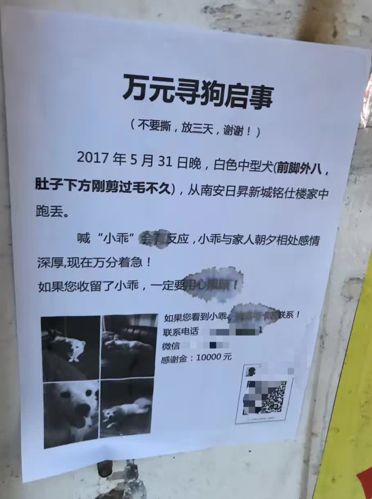

启事上醒目地写着："2017年5月31日17:30-22:30，白色中型犬（前脚外八）从日昇新城铭仕楼家中跑丢，如有线索，请联系我，必有重谢！悬赏金额：10000元！"

特意加上了微信号和电话号码，还印了小乖最可爱的照片。为了确保效果，选择了最好的纸张和最鲜艳的颜色，希望能够吸引更多人的注意。

在体育场、小区、超市、公交站台等人流量大的地方到处张贴。每贴一张，都会仔细选择位置，确保路人能够清楚地看到。有时候，还会主动向路人介绍情况，请他们帮忙留意。

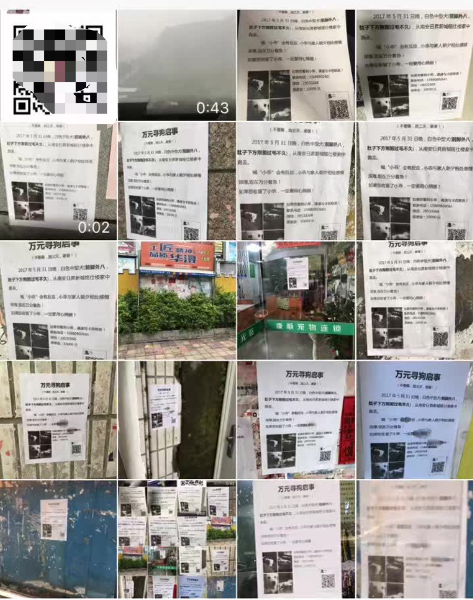

"师傅，麻烦您看一下，这是我家的狗，丢了好几天了，如果您见到了请联系我。"几乎对每个愿意停下来听说话的人都会这样说。

那段时间，手机铃声成了最期待又最害怕听到的声音。每次响起，都迫不及待地查看是不是有小乖的消息。

令人意外的是，很多人因为这个启事加了微信。起初，以为他们都是来提供线索的，但后来发现，很多人是被这份执着和爱心所感动，想要认识这个人。

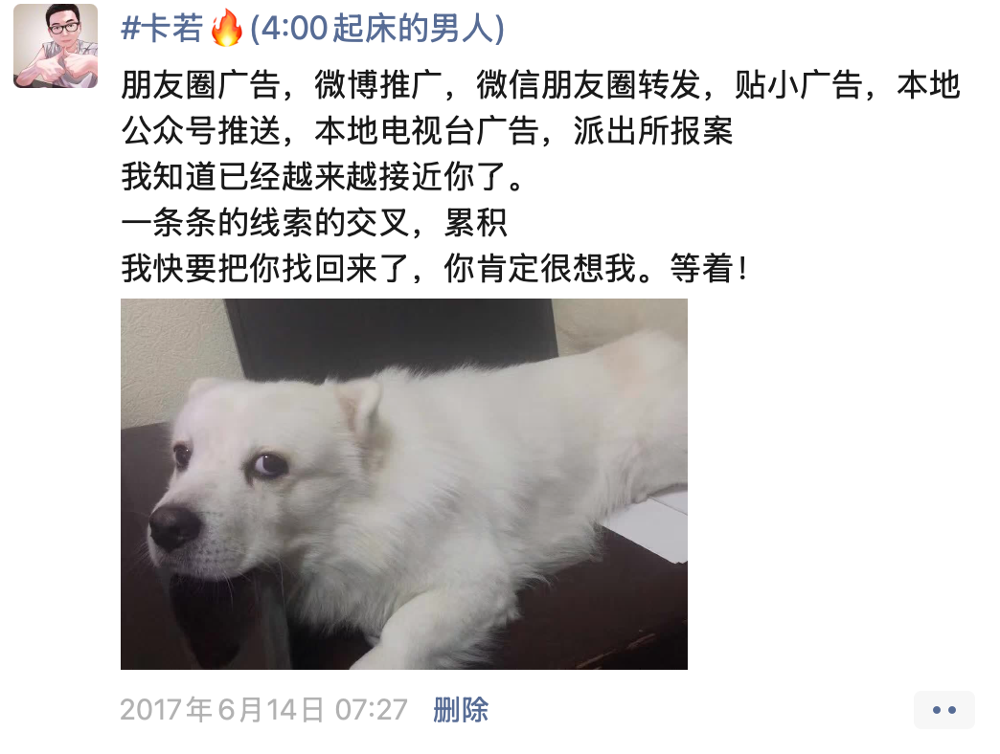

有个做生意的老板加微信后说："小伙子，你为了找狗这么用心，说明你是个有情有义的人，以后有什么生意可以合作。"

有个宝妈说："看到你这么爱你的狗狗，我觉得你一定是个很有爱心的人，我们可以做朋友。"

还有个大学生说："你的坚持让我很感动，我也想学习你这种不放弃的精神。"

短短几天时间，微信好友增加了五六百人，涵盖了各行各业：企业老板、宝妈、学生、公务员、医生、老师等等。这些人因为寻狗这件事走近了故事背后的人，也给对方贴上了"专注、有爱心、可靠"的标签。

随着寻狗启事的广泛传播，这件事引起了当地媒体的关注。南安商报的记者主动联系，想要进行采访报道。

那天，阳光透过窗户洒在客厅里，记者坐在对面，认真地听讲述小乖走失的经过。详细地介绍了小乖的特征、走失的时间地点、寻找过程，以及内心的感受。

"为什么愿意花这么多钱和精力去找一只狗？"记者问道。

"因为它不仅仅是一只狗，它是家人。"认真地回答，"不能想象没有它的生活。"

记者详细地记录着，还拍摄了小乖的照片和家中它的生活用品——它的小窝、玩具、食盆，每一样都承载着回忆。

采访结束后，文章很快就在报纸和微信公众号上发布了出来，标题是《为找爱犬悬赏万元，他的执着感动了整座城》。随后又被腾讯新闻、网易新闻等平台转载。

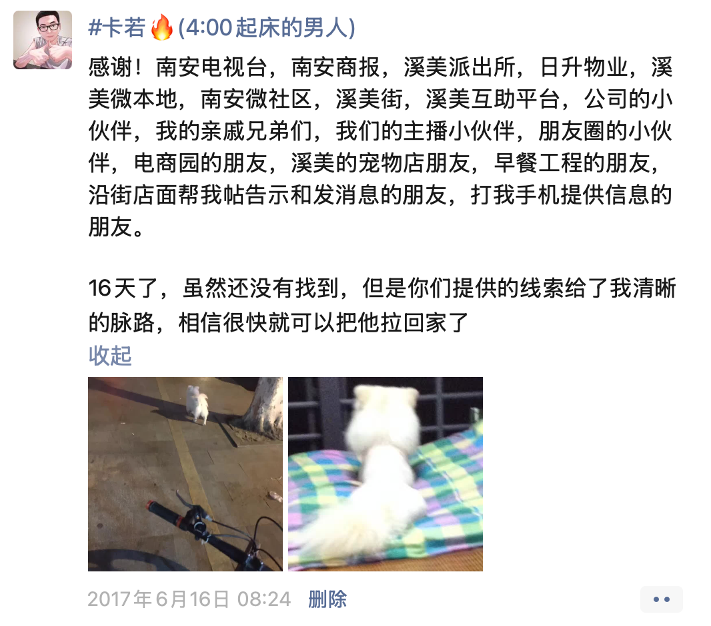

一时间，寻狗故事得到了大量的关注，阅读量不断攀升，最终达到了二十几万。许多人纷纷在评论区留言：

"这才是真正的爱！"
"希望小乖能早日回家！"
"这样的主人，狗狗一定很幸福！"
"我也要向他学习，对宠物负责！"

微信也不断收到好友申请，都是看到报道后想要提供线索或者表达关心的人。这股强大的力量让人重新燃起了希望，也深刻体会到了众人拾柴火焰高的道理。

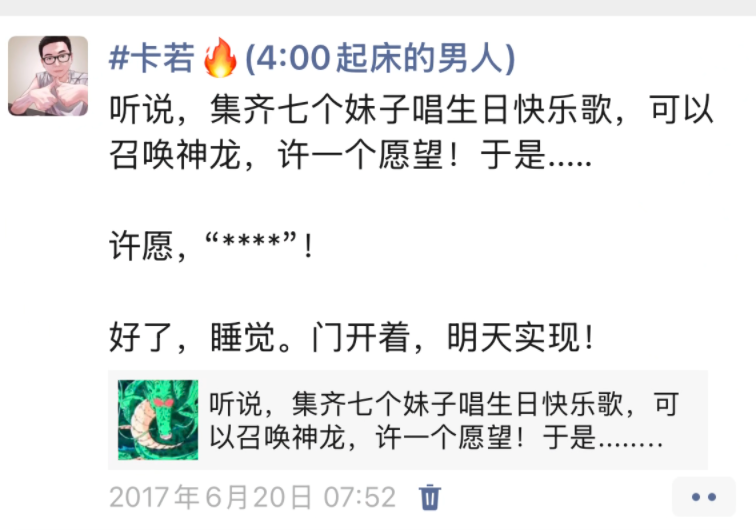

然而，日子一天天过去，小乖依然没有回来。每一个清晨醒来，第一件事就是查看手机有没有新消息；每一次路过小区门口，都忍不住四处张望，期待能看到那个熟悉的身影。

这种煎熬的日子持续到6月21日，生日那天。心情沉重地在朋友圈发了一条动态："今天是我的生日，最大的愿望就是小乖能回家。如果你看到这条朋友圈，请帮我转发一下，让更多人知道小乖的事情。"

没想到，这条朋友圈引起了朋友们的广泛关注，他们纷纷转发，还自发组织了一个"助力找狗"活动。有人建立了微信群，专门用来收集和分享线索；有人制作了更精美的寻狗海报；还有人联系了当地的宠物救助组织，请他们帮忙关注。

就在当天晚上10点多，奇迹发生了。突然接到小区保安的电话："小伙子，快来门口，我们发现了一只很像你家狗狗的狗！"

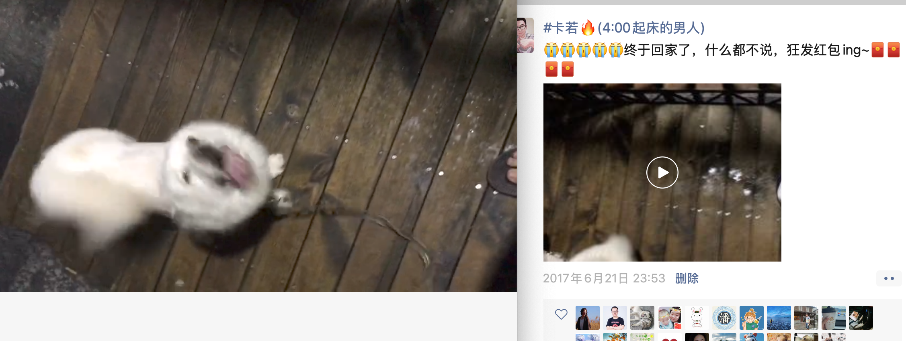

顾不上穿鞋，穿着拖鞋就冲了出去。一路上，心跳得厉害，既兴奋又紧张，害怕又是一场空欢喜。

当看到小乖的那一刻，泪水夺眶而出。它瘦了很多，毛发也有些凌乱，身上还有些脏，但眼神中依然透着熟悉的光芒。一见人，立刻摇着尾巴扑了过来，嘴里发出呜呜的声音，仿佛在诉说着这些天的遭遇。

紧紧地抱紧它，感受着失而复得的喜悦，那一刻，心情无法言语！小乖也紧紧地贴着，似乎害怕再次离开。

"小乖，你这个小混蛋，让人多担心知道吗？"一边哭一边笑，一边轻抚着它的毛发。

回到家后，给小乖洗了个澡，喂了它最爱吃的食物，看着它重新恢复活力，心情才真正平静下来。

那几天在监控室守了四十八小时，骑着平衡车找遍了整个小区，印了万元悬赏启事，在朋友圈发了寻狗帖子——这些行为本身，让一批素不相识的人看见了。做生意的老板说有情有义，宝妈说可靠，大学生说这份坚持感动了他。短短几天，微信多了五六百个陌生人，随后媒体采访、二十几万的阅读量……

当时只是想找回小乖。没想到，一个真实的情感故事，竟然比任何广告都更能打动人。

这件事给了一个清醒的认知：人与人之间最牢固的连接，不是利益，而是共鸣。当你真实地暴露自己的脆弱与执着，反而会让最多的人愿意靠近你、帮助你、信任你。

这，就是后来所说的"私域"的本质——不是把人装进一个池子，而是让人因为真实认识你而愿意留下来。

小乖找回来了。而那些因为寻狗而认识的人，也成了在厦门最早的一批真正的朋友和客户。

有时候，生活中最意外的失去，会带来最珍贵的收获。

## 3.7｜为自己的性格买单：公司倒闭

2018年6月的一个普通周二。

我坐在办公室里，看着电脑屏幕上跳动的数字。

那段时间，团队和业务正处于巅峰期。

自动化系统运转得如同精密的钟表。

每天都在为我们创造着可观的收入。

团队规模已经扩展到上百人。

办公室里人声鼎沸。

每个人都在为这个商业帝国的运转贡献着自己的力量。

但却感觉身体越来越不对劲。

说实话，那时候我根本没把这当回事。

觉得自己还年轻，身体应该没问题。

最初的症状很轻微。

我以为只是工作太累导致的。

经常感到口渴，总是想喝水。

但喝了水又频繁上厕所。

体重也在不知不觉中下降了十几斤。

朋友们都说我瘦了。

但我当时还挺高兴，以为是工作压力大自然减肥了。

现在想起来，真是太无知了。

更严重的是，开始感到极度疲劳。

以前可以连续工作十几个小时不觉得累。

现在坐一会儿就感觉精疲力尽。

有时候在电脑前工作，眼睛会突然模糊。

看不清屏幕上的字。

那种感觉很恐怖，但我还是不当回事。

"卡若，你最近脸色不太好，要不去医院检查一下？"

技术负责人陈裕彬有一天在会议室里关切地对我说。

"没事，可能是最近太忙了，等这个项目结束就好了。"

我随口回答，心里其实也有些担心。

但总是找各种理由推迟去医院。

男人嘛，总觉得自己身体好，不会有什么大问题。

直到症状越来越严重。

我才在团队成员的强烈建议下去了医院。

我才在团队成员的强烈建议下去了医院。

在医院的检查室里。

我做了一系列检查：血糖、尿糖、糖化血红蛋白。

每一项检查都让我的心情更加沉重。

"您的空腹血糖是13.2mmol/L，餐后血糖更是高达18.5mmol/L。"

医生看着检查报告，表情严肃地说道。

"糖化血红蛋白11.2%。"

"根据这些指标，可以确诊您患有2型糖尿病。"

"而且病情已经比较严重了。"

那一刻，我感觉整个世界都安静了下来。

糖尿病？

我才34岁，正值事业巅峰期。

怎么可能得糖尿病？

"医生，您是不是搞错了？"

我不敢相信地问道。

"我平时身体挺好的啊。"

"从您的各项指标来看，这个病可能已经发展了一段时间了。"

医生耐心地解释道。

"糖尿病的早期症状往往不明显。"

"很多人都是在体检或者出现并发症时才发现。"

从医院回到办公室后，我整个人都变了。

以前那个充满激情、精力充沛的我不见了。

取而代之的是一个情绪低落、焦虑不安的病人。

开始对一切都失去兴趣，包括那个曾经让我无比骄傲的商业帝国。

我在纸上写下："人生无常，健康才是最大的财富。"

写完就撕掉了。

那段时间，我经常一个人坐在办公室里发呆。

看着电脑屏幕上跳动的数据，心里却五味杂陈。

以前这些数字代表着成功和财富，现在却让人感到空虚和疲惫。

开始频繁地上网查阅关于糖尿病的资料，越看越害怕。

糖尿病的并发症包括心脏病、肾病、眼病、神经病变...

每一个都让我心惊胆战。

那段时间，连股票都不想看了。

以前每年国庆我都会花3个小时选股，现在连这点兴趣都没有了。

投资账户里的钱也在亏损，但我已经不在乎了。

快要死了，赚再多钱又有什么用？

我的情绪变化很快影响到了整个团队。

以前我是团队的精神支柱，总是充满正能量，能够激励每个人为共同的目标努力。现在的我变得沉默寡言，经常无缘无故地发脾气，对工作也失去了以前的热情。

团队成员开始感到困惑和不安。他们不明白为什么突然变了一个人，为什么以前那个充满激情的领导者现在总是愁眉苦脸。

更糟糕的是，开始对公司的未来产生怀疑。糖尿病让意识到生命的脆弱，开始思考：如果有一天我不能再工作了，这个完全依赖我个人能力的公司会怎么样？

这种不确定性很快传染给了团队。一些核心成员开始私下讨论公司的前景，有人开始寻找新的工作机会。

2018年下半年，离职潮开始了。

首先离开的是几个骨干，他们觉得公司的发展前景不明朗，决定另谋高就。接着是运营团队的核心成员，他们被其他公司高薪挖走。

每一次离职都像是在我心上插了一刀。这些人都是我亲手培养起来的，我们一起奋斗过，一起创造过辉煌，现在却要分道扬镳。

我试图挽留他们，提高薪资，改善待遇，但效果甚微。人心一旦散了，就很难再聚起来。

"卡若，不是钱的问题。"一个即将离职的核心成员对我说，"我们感觉公司失去了方向，你也不再是以前那个充满激情的你了。"

这句话深深地刺痛了我。意识到，问题的根源在我自己身上。

到了2018年底，曾经拥有上百人的团队只剩下了寥寥几个人。办公室里空荡荡的，以前热闹非凡的工作区域现在只有几台电脑在默默地运转。

最终，在2018年年底，我不得不做出一个痛苦的决定：关闭公司。

那一天，我坐在空旷的办公室里，看着墙上那些记录着我们辉煌历程的照片和奖状，心情五味杂陈。从月收入380万到公司倒闭，这种巨大的落差让人难以接受。

我曾经引以为傲的2万个IP技术和20万人的鱼塘、都在那一刻显得黯然失色。那一刻，我真切地体会到了"为自己的性格买单"的沉重代价。

然而，正如我一直坚信的："一切发生过的事情，都是好事情。" 即使是公司倒闭这样惨痛的经历，也成为了我人生中一次宝贵的反思和成长机会。

在那段最黑暗的日子里，开始深刻地审视自己的性格弱点：

健康管理的缺失：我过度透支身体，忽视了健康的重要性，最终导致糖尿病的确诊；

情绪管理的不足：面对健康危机时，我没有很好地控制自己的情绪，让负面情绪影响了整个团队；

团队管理的短板：我过于关注业务发展，忽视了团队成员的情感需求和职业发展；

风险意识的薄弱：我过度依赖个人能力，没有建立完善的风险防控机制。

意识到，"靠谱比能力重要"这句话不仅仅适用于合作伙伴，更适用于我自己。一个不靠谱的领导者，即使能力再强，也无法带领团队走向成功。

这次失败，更加成熟，也更加务实。开始理解，真正的成功不仅仅是财务上的成功，更是身心健康、团队和谐、可持续发展的综合成功。

这段惨痛的经历给我带来了深刻的启示：

1. 健康是一切的基础：再成功的事业也不能以健康为代价，身体是革命的本钱。

2. 情绪管理的重要性：领导者的情绪状态直接影响整个团队的士气和表现。

3. 团队文化的价值：一个健康的团队文化比任何技术优势都更重要。

4. 风险分散的必要性：不能把所有希望都寄托在一个人或一个项目上。

5. 可持续发展的思考：短期利益和长期发展需要平衡，不能为了眼前的成功而忽视长远的风险。

这次失败虽然痛苦，但它为我后来的重新崛起奠定了重要基础。我学会了如何在逆境中保持冷静，如何更好地管理团队，如何建立可持续的商业模式。

## 3.8｜破产之后旅程路上的思考

## 一把空椅子，和我重新开始的一年

请你先想象一把椅子。

不是会场里那种摆得整整齐齐的椅子。

是一间办公室里，一把空着的椅子。

2019年春天，我在厦门的办公室里看见了很多这样的椅子。

它们原来都坐着人。

那时候，公司最热闹的时候有上百号人。办公室里人来人往，电脑一直亮着，系统也一直在跑。我们做自动化运营、做流量生意，觉得事情会继续往上走。

后来，办公室只剩下三个人。

曾经坐满人的工位空着，屏幕黑着，桌上还有没来得及收走的文件。那一刻我才知道，生意塌下来，最先压住你的，不是报表上的数字，而是你每天一抬头就能看见的这些空椅子。

2018年，公司倒闭。

我背上了数百万元债务。

同一年，我被确诊为糖尿病。那时我的身体已经给过我很多提醒：口渴、疲惫、体重下降、眼睛发花。我一直把它们解释成“最近太忙”。直到检查报告摆到面前，才发现自己不是累，是把身体也拿去给事业垫资了。

说白了，很多创业者最容易犯的错，就是觉得自己可以一直硬扛。

业务出问题，扛。

团队出问题，扛。

身体出问题，还是扛。

可人不是机器。机器过载会报警，人过载，往往先假装没事。

那段时间，我最难接受的还不是没钱，而是一个问题：如果公司没了，我是谁？

过去，我习惯用规模、流水、团队和系统证明自己。可当这些东西一点点退场，我发现自己很容易把失败当成自己的全部。

后来我才明白，这两件事根本是两码事。

公司倒了，是一次经营结果。

人垮了，才是把一次结果判成了一辈子。

有一天，技术负责人看着我们还保留下来的能力，对我说：“我们的技术在行业里还是领先的。问题不是有没有东西，问题是这些东西接下来怎么用。”

这句话很轻。

但对当时的我来说，像有人把一把椅子重新推回到桌前。

我开始重新看自己手里还剩什么。

不是过去的光环。

是做系统的能力，是数据分析的能力，是对用户行为的理解，是这些年做项目留下来的经验。

以前我们把它们用在旧赛道上；旧赛道走不通了，不代表这些能力也失效。只是要换一个问题去解决。

于是，我们开始研究私域、社群、内容和短视频。

不再追着一个看上去很大的盘子跑，而是先找一个真实的人、一个真实的问题、一个能交付的结果。

后来有人问我，破产以后你最大的变化是什么？

我说，不再急着证明自己了。

以前我总想跑得更快，证明自己比别人强。后来我开始关心一件更实在的事：这件事能不能长期跑，团队能不能接得住，客户有没有真正拿到结果，我的身体还扛不扛得住。

**先跑稳，再放大。**

这句话不是后来想出来贴在墙上的标语，是被那一排空椅子逼出来的。

2019年到2020年，我暂停了大部分商业活动，带着小乖去旅行，也给自己留了一段重新思考的时间。

在北京的胡同、成都的茶馆、西安的城墙边、青海湖的日出里，我反复问自己：我这么拼，到底想得到什么？

是更多的钱？

是别人眼里的成功？

还是，我真能帮人把一个问题解决掉，让一件事从混乱变得清楚？

答案慢慢出来了。

我想做的，从来不只是赚一笔钱。

我更想把自己做项目、做流量、做系统时踩过的坑，整理成别人拿来就能少走一点弯路的东西。后来做私域、做内容、做存客宝，底层也是这件事：让关系、工具和交付真正连接起来。

所以，如果你现在也坐在一间空办公室里，或者正看着一个没做成的项目，先别急着给自己下结论。

你失去的，也许是一段路。

但你还可以盘点：手里还剩什么能力？谁还愿意相信你？你还能替谁解决什么问题？

别硬扛，也别把一次失败演成一辈子的身份。

把椅子拉回来。

坐下。

把能跑的那一小步，重新跑起来。

因为真正能让人走出低谷的，从来不是一句“加油”。

是你开始重新行动。

---

### 本章复盘

- **现场**：从上百人到只剩三人的办公室，让“公司倒闭”从数字变成可感知的画面。
- **判断**：一次经营失败不等于一个人的全部价值；健康、交付和现金流都要分开管理。
- **方法**：盘点仍然有效的能力，换问题而不是只换赛道；先用小规模验证，再决定放大。
- **边界**：债务、疾病和心理压力都不是靠硬扛解决的，必要时要及时求助专业人士。
- **行动**：写下你现在仍然拥有的三项能力，再找到一个真实问题，用一周时间做一次最小验证。

## 3.9｜做一家天塌下来都赚钱的公司（一）

在经历了那段至暗时刻后，开始思考一个问题：

让我对商业模式的理解产生了颠覆性的变化。

在破产的废墟之上，我思考的不再仅仅是如何赚快钱。

而是如何"做一家天塌下来都赚钱的公司"。

这个目标，促使开始构建企业的护城河。

那些能让竞争对手望而却步，确保企业在任何市场波动中都能保持持续盈利的核心竞争力。

深知，只有拥有强大的护城河，才能真正穿越周期，立于不败之地。

那段时间，我经常一个人坐在空荡荡的办公室里。

看着墙上那些曾经辉煌的奖状，心情五味杂陈。

失败的痛苦还在，但知道不能一直沉浸在过去。

必须要从失败中学到点什么。

我将目光重新聚焦到私域流量上。

经历过平台规则变动的洗礼，意识到将用户资产掌握在自己手中是多么重要。

因此，打造一个稳固的私域流量池，并辅以高效的数字化运营，成为了我的首要任务。

开始投入大量精力研发和优化私域流量运营系统。

目标是建立起一套自动化、智能化的流量管理与变现体系，形成强大的技术壁垒。

我主动联系了在技术研发方面有专长的黄鹭。

我们共同探讨如何将私域流量的运营流程标准化、自动化。

最初，我们投入了超过50万元用于技术研发和系统测试。

说实话，那时候压力很大，这50万几乎是我仅有的资金了。

但知道，不投入就没有未来。

最终成功搭建了「存客宝」私域运营系统。

这套系统不仅能帮助我自己的项目实现持续盈利。

也能作为一种服务，赋能给其他中小企业。

帮助他们摆脱对公域平台的过度依赖。

在这个阶段，"聚焦才能突破"成为了我的行动纲领。

我不再贪大求全，而是将所有资源和精力集中在私域流量运营这一核心业务上。

相信，只有将一个点做到极致，才能形成真正的核心竞争力。

开始与有相同愿景的伙伴进行深入交流，进行高效的资源整合。

因为深知："你的圈子决定你的高度。"

那些拥有资金、执行力、或独特资源的靠谱伙伴，成为了我重塑商业模式的关键。

通过老陈的引荐，我结识了几位在厦门本地拥有大量线下资源的创业者。

我们通过资源互换和项目孵化的方式，共同探索私域流量在线下场景的应用。

这进一步验证了"靠谱比能力重要"。

正是在这样的思考与实践中，我独创了"云阿米巴模式"。

这是一种基于结果导向的轻量化团队构建模式。

核心理念是"分钱一定要分不属于他的钱"和"创造多少价值分走多少钱"。

通过这种模式，我不再简单地依赖股权绑定。

而是通过提供稳定的流量和便捷的私域体系，让合作者在我的生态中能够持续创造价值并获得收益。

这种机制不仅解决了团队构建中的激励问题，也大大降低了运营成本。

形成了一种独特的商业模式护城河。

我们曾在一个月内，通过云阿米巴模式与5家企业达成合作。

共同运营他们的私域流量，每家企业在短短三个月内，都实现了至少20%的营收增长。

这充分证明了云阿米巴模式的高效性和可持续性。

从2018年到2020年，我将这些理念付诸实践。

专注于打造数字化运营体系，包括自动化工具、数据分析模型，以及贯穿用户全生命周期的私域运营流程。

这些努力，让逐渐建立起一个即使"天塌下来"也能稳定赚钱的商业模式。

因为它不再受制于外部平台的规则，而是建立在自身强大的核心竞争力和私域流量资产之上。

这三年，是对商业本质的重新理解，也是为未来更大发展奠定基础的关键时期。

我深信，"所有你付出过的时间、精力和金钱，都会在未来以另外一种形式回馈给你。"

这句话，成为了我重塑商业版图的坚定信念。

## 3.10｜做一家天塌下来都赚钱的公司（二）

在确立了打造"天塌下来都赚钱的公司"这一宏伟目标后，深知这并非一蹴而就。

更不是依靠单一能力就能实现。

它需要一套真正能够可持续发展的商业模式。

而这套模式的核心，在于深度融合私域流量、数字化运营与自动化。

这不仅仅是技术层面的突破，更是我商业哲学的一次全面升级。

从过去被动适应市场，到如今主动构建"护城河"。

那段时间，我经常在深夜里思考这些问题。

如何让公司在任何环境下都能生存？

如何建立真正的竞争优势？

如何让团队和合作伙伴都能获得价值？

开始推行"只做选择题"的理念。

这意味着我不再盲目追求每一个项目。

而是聚焦于那些经过审慎评估，符合我的商业模式、并且能够带来共赢机会的项目。

在2019年，我们接触到不少电商和游戏内的老板

他对私域流量充满兴趣，但缺乏系统的认知和操作经验。

在初次交流中，发现虽然是传统行业出身。

但他对新事物的接受度高，且有强烈的转型意愿。

我们评估了他的现有资源和市场潜力。

发现这是一个典型的可以运用"私域"系统赋能的客户。

我没有去说服他，而是直接展示了我们过往的成功案例和数据模型。

最终，主动提出与我们合作，这正是"只做选择题"的最好体现。

在选择合作伙伴时，我格外看重对方的靠谱程度和是否能产生价值交换。

我坚信："靠谱比能力重要。"

一个能力再强但不靠谱的伙伴，只会带来灾难。

而一个靠谱的伙伴，即使能力稍逊，也能通过共同学习和迭代优化，最终实现目标。

我不再为那些需要大量投入重资产的项目而分心。

而是选择那些能够实现轻资产运营，并且通过数字化运营大幅提升效率的项目。

私域流量依然是我商业模式的基石。

我投入大量精力研发和优化自动化工具。

让流量的获取、沉淀、用户画像、内容分发以及初期互动都能实现自动化。

通过"私域"系统，我们帮助将他的2万多名线下客户导入到微信私域。

通过AI机器人进行自动加粉、自动回复，甚至进行初步的用户筛选。

这不仅极大地降低了门店的人工成本。

从原先需要5名客服人员才能维护，到现在只需1名人员就能管理。

效率提升了5倍，同时也提高了运营效率和用户体验。

通过这些自动化工具，我能够将私域流量的运营成本控制在极低的水平。

实现轻资产的快速复制和扩张。

在不到三个月的时间里，门店的复购率提升了35%。

新增营收达到了20多万元，这得益于我们精准的内容推送和自动化运营。

数据分析在这套商业模式中扮演着至关重要的角色。

每一次用户互动、每一次内容分发，甚至每一个转化路径，都会被精细地记录和分析。

通过对数据的深入洞察，我能够不断地迭代优化我的运营策略、内容方向以及产品设计。

通过A/B测试不同的话术，能够显著提升转化率。

通过分析用户行为数据，能够更精准地推荐产品或服务。

我们发现，在的客户群体中，每周二下午三点的产品推荐转化率最高。

于是我们调整了推送时间，使得转化率在原有基础上又提升了10%。

这些基于数据的决策，让我的商业模式变得更加智能和高效，也更具可持续发展性。

"所有你付出过的时间、精力和金钱，都会在未来以另外一种形式回馈给你。"

即使是在公司破产的低谷，我也没有停止对商业模式的思考和对技术的投入。

这些沉淀，最终转化成了我今天可持续发展的商业模式。

通过轻资产、自动化、数字化运营和靠谱的合作伙伴。

我构建了一个能够抵御外部风险，持续创造价值的生态系统。

这三年，是对商业模式深层逻辑的探索，也是从实践中提炼出核心竞争力的过程。

# PART 4：私域与AI——把关系做成基础设施（2020—2024）

## 4.1｜私域觉醒：疫情下的机遇与挑战

2020年初，一场突如其来的疫情改变了整个世界。

当所有人都在恐慌的时候，却看见了前所未有的机会。

线下门店关闭，传统营销渠道断裂，企业主们开始疯狂寻找新的出路。

早在2019年底就开始布局的"私域流量"，突然成了香饽饽。

疫情不是灾难，是机会。

当所有人都在抱怨环境变化的时候，真正的创业者应该思考如何适应变化，甚至利用变化。

还记得2020年2月，一个又一个焦急的电话打来。

"卡若，我的店开不了，客户都联系不上，怎么办？"

"我们的销售团队不能出门拜访，业绩直线下降..."

"线上广告成本越来越高，ROI越来越低..."

这些声音说明，机会来了。

开始疯狂地研究私域流量的底层逻辑。

什么是私域？

简单来说，就是你能够自由触达、无需付费、可以反复利用的流量。

微信好友、微信群、公众号粉丝，这些都是私域。

相对于抖音、淘宝这些公域平台，私域的最大优势就是"自主可控"。

我的技术背景在这个时候发挥了巨大作用。

别人还在手工加微信、手工发朋友圈的时候，我已经在思考如何用技术手段实现自动化。

"如果能够自动加粉、自动回复、自动打标签，那私域运营的效率将提升10倍以上。"

这个想法一旦产生，就像种子一样在心里疯狂生长。

开始组建技术团队，着手开发私域运营系统。

当时市面上还没有成熟的私域工具，大部分企业都是靠人工运营。

这就是我的机会。

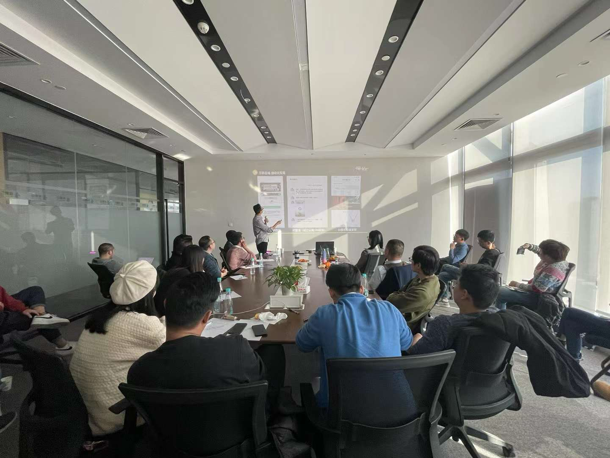

2020年3月，找到了第一批愿意尝试的客户。

其中一个是做美妆的电商老板。

她的淘宝店因为疫情影响，销量下降了60%。

"卡若，我现在每天都在亏钱，你的这套私域系统真的有用吗？"

很坚定地告诉她："给我3个月时间，如果没效果，我退还所有费用。"

开始帮她把淘宝的老客户导入微信。

通过包裹卡片、客服引导等方式，一个月时间就导入了5000多个微信好友。

然后通过朋友圈内容、社群运营、一对一聊天，开始做转化。

第一个月，通过私域成交了8万元。

第二个月，15万元。

第三个月，23万元。

她激动得不行："卡若，这简直是魔法！"

通过这个案例，总结出了私域运营的核心逻辑：

流量沉淀：把公域的流量导入私域，建立直接连接。

用户分层：根据用户行为和属性，进行精细化标签管理。

内容触达：通过朋友圈、社群、私聊等方式，持续输出价值内容。

转化变现：基于信任关系，进行产品推荐和销售转化。

复购裂变：通过优质服务，实现老客户复购和新客户推荐。

这套逻辑看起来简单，但执行起来需要大量的细节优化。

而技术，就是放大这些细节的最佳工具。

在帮助客户成功的过程中，发现了一个巨大的市场需求。

每个企业都需要私域运营，但大部分企业都缺乏技术能力。

如果能把私域运营的技术能力产品化，就能服务更多的企业。

"存客宝"这个名字就是在这个时候想出来的。

存客户，存关系，存价值。

宝贝一样珍惜每一个客户。

2020年下半年，开始全力投入存客宝系统的开发。

这不仅仅是一个工具，更是一套完整的私域运营解决方案。

疫情让人深刻理解了一个道理：

危机往往是最好的机会。

当所有人都在抱怨环境不好的时候，真正的创业者应该思考如何在变化中找到机会。

私域流量不是疫情的产物，而是商业发展的必然趋势。

疫情只是加速了这个趋势的到来。

那些能够提前布局、快速适应的企业，将在新的商业环境中获得巨大优势。

而那些固守传统模式、拒绝改变的企业，将被时代抛弃。

很庆幸，选了前者。

就在私域流量概念逐渐清晰的同时，还在探索另一个重要的认知：私域就是互联网地产。

2019年底，开始运营一个厦门本地的抖音账号。

短短几个月，粉丝就增长到了近2万人。

每天发布的短视频都能带来不错的流量。

曾经以为，这就是在互联网上的立足之本。

但随着对互联网生态的深入理解，逐渐意识到一个问题。

"平台流量就像租房子，而私域流量就像买房子。"

租房子每个月都要交租金，一旦不租了，房子就不是你的了。

但买了房子，你就能拥有长期的使用权，甚至可以转卖升值。

意识到，大部分做抖音、电商、和实体门店的创业者一直以来都在"租房子"。

而没有想过要"买房子"。

他们把大量精力投入到抖音内容创作、淘宝店铺运营、实体店铺装修等方面。

却忽略了将这些流量沉淀到自己的私域渠道中。

抖音账号虽然流量很大，但用户粘性不高，变现能力也有限。

一旦平台算法调整或者出现其他变故，流量就会受到很大影响。

曾亲眼目睹许多抖音账号因为违规或者算法调整而流量骤减。

甚至面临账号被封的风险。

这更加坚定了构建私域流量池的决心。

因为它承载着对"互联网地产"的向往和追求。

那么，具体如何构建私域流量池呢？

经过不断实践和摸索，总结出了三个关键策略：

第一步：精细化运营公域账号，提升用户粘性，打造个人IP。

第二步：引导用户加入私域社群，通过独家内容、福利、悬念引导。

第三步：精细化运营私域社群，用户分层、精准服务、活动组织。

仅仅在抖音上获得流量是远远不够的。

需要将这些流量引导到自己的私域渠道中。

为此，在视频和评论区中，引导用户添加微信号。

并拉他们进入私域社群。

为了吸引用户加入，在社群中定期分享一些独家内容和福利。

比如行业最新动态、实用干货、优惠活动等。

还会在抖音视频中埋下一些悬念。

告诉用户"完整版内容请关注微信公众号"。

或者"想了解更多细节请加微信"。

这样能够有效引导用户到私域渠道。

将用户引入私域只是第一步，更重要的是如何留住他们。

提升他们的活跃度和忠诚度。

根据用户的兴趣爱好，将他们细分为不同的社群。

并设置了一个门槛筛选用户，确保社群质量。

例如，有专门针对创业者的"鹭岛创业者联盟"。

有针对数字营销从业者的"私域运营交流群"。

还有针对个人成长爱好者的"卡若成长营"等。

在群内，提供更有针对性的内容和服务。

解答用户的问题，分享最新的行业动态和干货。

还定期组织一些线上线下活动，增强用户之间的互动和粘性。

例如，线上的知识分享会、案例分析会。

线下的创业者沙龙、私域运营峰会等。

花了半年多的时间，将私域社群运营起来。

惊喜的是，社群的转化率远远高于预期。

通过精细化运营和持续提供价值，在社群中建立了良好的口碑和信任度。

用户的活跃度和忠诚度也不断提升。

开始在社群中推广付费课程、咨询服务和孵化业务。

并取得了不错的收益。

更重要的是，通过私域社群，与粉丝建立了更深层次的连接。

影响力不再局限于抖音平台，而是延伸到其它平台，以及线下。

因此，还组织了"鹭岛企业家联盟"。

将线上社群的力量转化为线下的实际行动和商业合作。

一直认为，影响力就等于钱，链接认同的用户就是你的资产。

私域流量不是简单的加好友、拉群。

而是要用真心去换取用户的认可和信任。

只有当用户真正认同你的价值观，愿意与你建立长期稳定的连接。

你的私域流量池才能真正发挥作用，才能真正成为你的资产。

通过构建私域流量池，不仅实现了收入的增长。

更重要的是建立了一个可持续发展的商业模式。

无论是平台规则如何变化，还是市场环境如何波动。

都能通过私域流量池与用户保持稳定的连接。

持续为他们提供价值，实现商业目标。

正如常说的那样，"在互联网时代，谁掌握了私域流量，谁就掌握了未来。"

私域流量不仅是一种营销手段，更是一种商业思维和战略资产。

通过构建强大的私域流量池，我们能够在充满不确定性的互联网世界中。

拥有真正属于自己的"互联网地产"。

这个认知，为我后续的所有商业布局奠定了基础。

在这个过程中，也开始接触到一些重要的合作伙伴和项目。

**荟享生活馆：高端零售的私域转型**

2020年3月，荟享生活馆的老板找到我。这是一家专注于高端生活用品的零售企业，疫情期间线下门店客流量骤减80%。

"卡若，我们的客户都是高消费群体，但现在都不敢出门购物了。"

仔细分析了他们的客户结构：主要是30-50岁的中高收入女性，对品质生活有追求，消费能力强但对价格不敏感。

我们制定了三步走策略：

第一步：建立客户档案。我们把过去3年的客户购买记录全部整理出来，按照消费金额、购买频次、产品偏好进行分类打标签。

第二步：私域导流。通过店员一对一添加微信，以"疫情期间专属服务"为由，成功导入了2000多个高价值客户。

第三步：精准运营。针对不同标签的客户，推送个性化的产品内容。比如对喜欢护肤品的客户，我们会分享护肤知识和新品试用；对喜欢家居用品的客户，我们会分享居家美学和搭配技巧。

结果超出预期：通过私域运营，复购率从原来的15%提升到45%，客单价也从800元提升到1200元。更重要的是，即使疫情结束后，这些客户依然保持着高活跃度。

**庄氏家居：从装修到生活方式的转变**

同样在2020年，庄氏家居也面临着巨大挑战。作为一家专业的家居装饰公司，他们的业务严重依赖线下展厅和上门服务。

庄老板是个很有想法的人："卡若，我不想只做装修，我想做生活方式的引导者。"

这个想法很有意思。我们开始重新定义庄氏家居的价值主张：不是卖装修，而是卖美好生活。

我们帮他们建立了完整的客户生命周期管理体系：

**设计阶段**：通过微信群分享设计理念、案例展示，让客户参与到设计过程中。

**施工阶段**：每日工程进度图片分享，让客户实时了解装修情况，增强信任感。

**完工阶段**：提供居家生活小贴士，家具保养知识，延续服务价值。

**后续服务**：定期回访，节日问候，甚至帮客户介绍靠谱的保洁、维修服务。

最让人印象深刻的是，有个客户装修完3年后，还主动给庄老板介绍了5个新客户。她说："庄老师不只是帮我装修房子，更是帮我打造了理想的生活。"

这就是私域运营的真正价值：不是一次性交易，而是长期关系的建立。

通过这两个项目，更理解了私域运营的本质：

**不是技术问题，是信任问题。**

**不是流量问题，是价值问题。**

**不是短期收益，是长期资产。**

这些早期的成功案例，更让人坚信私域流量的价值，也为后续开发存客宝系统积累了宝贵的实战经验。

## 4.2｜影响力是未来货币

2021年，开始意识到一个重要的问题。

技术能力、产品能力、运营能力，这些都很重要。

但更重要的是，如何把这些能力系统化地表达出来。

如何让别人理解你的思维逻辑，认同你的价值观。

这就需要内容创作的能力。

我常常说，写作即编程。

这不是简单的比喻，而是我多年来实践与思考的结晶。

如同程序员用代码构建复杂的软件系统。

我用文字构建我的思想体系、我的商业逻辑。

每一个字、每一句话，都是我思维的最小单元。

它们被精心组织、逻辑严密。

最终形成一个能够自我运行、不断迭代的"操作系统"。

这个操作系统，就是我的"内核"。

2021年下半年，开始系统性地输出内容。

不仅仅是文字，还有视频。

发现，不同的媒介有不同的表达优势。

文字适合深度思考，逻辑严密。

视频适合情感传递，直观生动。

两者结合，才能构建完整的思想体系。

与李长俊和王路的多次深度交流，让我对"写作即编程"有了更深刻的理解。

我们探讨过内容创作的精髓，精准流量的获取，以及如何打造个人IP。

王路曾分享他对内容创作的看法。

强调了精准流量和IP打造的重要性，这与我的"五行营销"理念不谋而合。

他说："内容是载体，流量是血液，IP是灵魂。"

这更加坚信，优质的内容和清晰的逻辑，是吸引流量、沉淀用户的基石。

然而，光有流量和IP还不够。

我曾直言不讳地指出："产品第一，业务第二，包括机制第三。"

这句话，是我在无数次试错和复盘后得出的真理。

很多创业者只顾着追求流量，却忽略了产品的本质和业务的转化链路。

当产品无法提供超值的价值时，即使再大的流量池也难以留存用户。

最终只会陷入不断消耗时间与精力的困境。

清楚地记得，在一次与李长俊的对话中。

他提到一个项目方在获取大量客户后，因为没有完善的转化机制，导致客户流失严重。

这更加坚定了"产品第一"的信念。

我强调，所有的流量、所有的运营，都必须围绕着核心产品展开。

并且要有一个清晰、可量化的交付标准。

只有当客户真正从产品中获得了超值的收益。

他们才会成为你最忠实的拥趸，甚至主动为你进行"隐形裂变"。

在与李长俊探讨一个投资项目时，他提到一个创业公司缺乏"内核"。

他追问："什么是内核？内核就是只有我公司有的，别人都没有。"

我当时就指出，许多人所谓的"内核"只是空泛的概念。

无法带来实际的商业价值。

真正的内核，是独特的产品、是难以复制的运营模式、是深厚的行业认知。

如果一个公司没有自己的内核，就很难在激烈的市场竞争中立足。

我们谈到了抖音的商业生态。

我观察到，抖音上很多项目的营收和投流都变得非常透明。

这让我看到了一个巨大的机会："你赚的是信息差的钱。"

这不是简单的搬运，而是基于对行业规则、流量玩法、变现路径的深刻理解。

将成熟的、经过验证的项目模式进行"1:1复制"。

比如，找到抖音上已经成功变现的"二奢包包"、"宠物医生"、"茶叶大胸美女跳舞"等IP。

分析他们的朋友圈话术、视频内容、转化路径，然后进行像素级的复制。

这种复制，并不是简单的抄袭。

它需要你具备"数据驱动"的能力，能够快速识别爆款内容，分析用户反馈。

然后根据自己的资源优势进行放大和优化。

例如我拥有2000名兼职人员和完善的私域承接体系。

李长俊曾提到，这种模式下，连思考都变得多余。

只需要"傻白甜"地照抄朋友圈、照抄话术。

这就是我所说的"写作即编程"在实际应用中的体现。

通过结构化的思考和流程化的复制，将成功模式标准化，实现快速扩张。

深知自己内心的逻辑严谨和对效率的追求。

我习惯将复杂的问题拆解为最小单元。

然后通过编程式的思维，设计出最有效率的解决方案。

这种"自律"和"坚持"，成为了我构建思想体系的"内核驱动"。

即使面对"拖延倾向"，我也会努力通过这种结构化的思维方式来克服。

我反思，在创业的旅途中，我曾为自己的"高要求"买单。

也曾因"不够霸气、书生气"而错失一些机会。

但正是这些经历，更加坚定了对"产品第一"的信念。

也让意识到，真正的强大并非外在的张扬。

而是内在的"认知升级"和"持续学习"。

2022年，开始将这套思想体系应用到实际的商业实践中。

大量输出内容之后，逐渐摸索出一套内容的内在结构。单纯的"写文章""拍视频"只是动作，真正决定内容质量的，是内容有没有层次感。

我把它拆成五层。第一层是观点层：你到底相信什么、坚持什么。没有稳定观点，内容就会随热点漂移，用户也无法对你形成记忆。第二层是案例层：每一个观点，都要挂在真实的人名、场景和结果上，否则就是空话。第三层是方法层：把案例抽象成可复用的步骤，读者看完要知道"我拿回去怎么做"。第四层是工具层：能给到模板、表单、SOP，当内容能直接变成动作，影响力才会真正流向现金流。第五层是反馈层：追踪执行结果并反哺内容，哪些内容带来了咨询、成交、转介绍，就继续放大。

这五层跑通之后，内容就不再只是"表达欲"，而是真正的"生产力"。每一篇文章、每一个视频，都是这套思想体系的一个模块。

通过持续的内容输出，我不仅建立了个人品牌，更重要的是，吸引了一大批认同我价值观的用户，这些用户成为了我后续商业发展的基础。

在这个过程中，我也开始与更多的知名企业合作。

樊登读书是其中一个重要的合作伙伴。2022年初，樊登读书面临一个关键挑战：他们拥有庞大的用户基数，但用户活跃度和付费转化率却在下降。传统的推送方式已经无法满足用户的个性化需求。

我深入分析了樊登读书的用户数据，发现问题的核心在于内容推送的精准度不够。用户接收到的内容与他们的真实需求存在偏差，导致用户逐渐失去兴趣。

基于我的"写作即编程"理念，我为樊登读书设计了一套内容分发策略：

首先，我们将用户重新分层，根据阅读偏好、学习目标、职业背景等维度，将用户细分为12个精准标签。比如"职场新人成长型"、"企业管理进阶型"、"亲子教育关注型"等。

其次，针对每个用户标签，我们制定了个性化的内容推送策略。不再是千篇一律的书籍推荐，而是根据用户的学习路径，推送最适合的内容组合。

最关键的是，我们将每一次推送都当作一次"编程"过程。设定明确的触发条件、执行逻辑和反馈机制。比如，当"职场新人成长型"用户连续3天未打开APP时，系统会自动推送"5分钟职场小技巧"的轻量化内容，而不是厚重的管理学书籍。

经过3个月的优化，樊登读书的用户活跃度提升了40%，付费转化率提升了25%。更重要的是，用户的学习完成率从原来的15%提升到了35%。

这次合作让我深刻认识到，内容创作不仅仅是表达思想，更是一种精准的"用户编程"。通过结构化的内容设计，我们可以引导用户的行为，影响用户的决策，最终实现商业价值的转化。

铸远作为一家专业的投资公司，也成为了我的重要合作伙伴。2022年中，铸远的投资总监李总找到我，希望我能帮助他们优化投资项目的尽调流程。

传统的尽调方式往往依赖大量的财务数据和行业报告，但这些数据往往滞后，无法反映项目的真实潜力。李总希望我能用"内容分析"的方式，帮助他们更准确地评估项目价值。

我为铸远设计了一套"内容驱动的尽调模型"：

第一步，分析创始人的内容输出能力。我们会深度分析创始人的文章、演讲、社交媒体内容，评估其思维逻辑、表达能力和价值观体系。一个能够清晰表达商业逻辑的创始人，往往具备更强的执行力和团队凝聚力。

第二步，分析项目的"内容基因"。我们会评估项目是否具备持续的内容创作能力，是否能够通过内容建立用户心智，形成品牌护城河。

第三步，分析市场的"内容饱和度"。通过大数据分析相关领域的内容竞争情况，评估项目在内容层面的突围可能性。

这套模型帮助铸远成功识别了多个优质项目，投资成功率提升了30%。李总后来告诉我："你让我们看到了投资的另一个维度，内容力就是竞争力。"

这种认可，不仅仅是资金上的支持，更是对我思想体系的认同。

文字，不再仅仅是记录思想的工具。

它成为了构建财富、连接资源、影响世界的强大力量。

通过"写作即编程"，我将我的思想体系、我的商业模式、我的核心理念。

以最清晰、最有效的方式呈现出来。

这不仅让我的团队能够快速复制成功。

也让我的合作方能够清晰地理解我的价值主张。

更重要的是，这为我后续的存客宝产品化奠定了理论基础。

影响力，确实是未来的货币。

而内容创作，就是铸造这种货币的工厂。

## 4.3｜存客宝诞生：私域基础设施的构建

**把流量变成资产，靠的不是手搓朋友圈，而是一套能自己跑的私域银行。**

2022年初

我心里只剩一个问题：**私域这套打法，能不能变成产品，让别的人也用同一套底盘？**

不是再签几个操盘单。

是把「加人、分层、触达、复购」做成系统，让企业像开银行一样，把用户存进来、养起来、滚起来。

我把自己关在办公室整整一个月。

桌上是原型、需求、接口草图。

墙上就四个字：**私域银行**。

「存客宝」这个名字，是那时候定死的。

存客户，存关系，存价值。

宝贝一样珍惜每一个进池的人。

我心里想，该把刀磨成一套能卖、能交付、能复制的东西了。

那时候市面上的工具，多半只会「记」：谁加了好友、谁回了消息。

我要的是 **真实感**：自动通过、打标签、定时朋友圈、群发、分发给对的号。

人盯大屏，系统干脏活。

第一个版本的功能骨架，现在回头看，和后来 [存客宝官网](https://ckb.quwanzhi.com/) 讲的八大模块是同一条血脉——设备与微信、场景获客、流量池、分层、内容触达、社群、分销、数据中心。

当时对外只上了后台这一端。

设计稿里我已经画了三条线：存客宝指挥、触客宝聊天、AI 数智员工应答。

客户资产只沉淀一次，获客、应答、复购不断环。

那是后话。

2022 年先把「能跑」做出来。

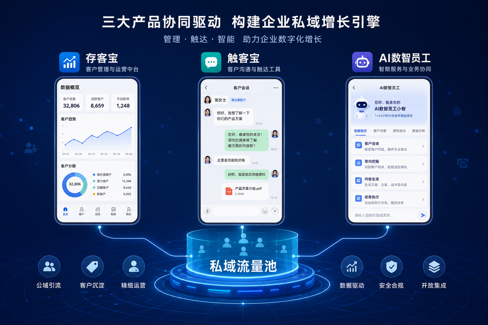

2022 年 3 月，第一个版本上线。

说实话，丑，慢，bug 多。

但它已经能干掉八成重复劳动。

种子用户里，第一家跑通的是做教育培训的：5 万多微信好友，转化一直抬不起来。

运营总监跟我讲：「每天手工发朋友圈、回消息，人不够用了。」

上系统之后，分层推送上去，人力空出来，转化也抬了一截。

那一单让我确信：**私域可以产品化，ROI 算得过来。**

---

下半年，我开始带着团队往外推。

不是等大平台来找。

是 **我们主动找场景、找合作方**，看哪条链路能把「用户进池」做成标准动作。

**樊登读书**是 8 月找上门来的。

知识付费头部，300 多万好友，互动率不到 2%，付费转化不到 1%。

陈总说得很直：「卡若，池子大，都是僵尸粉。」

我们干三件事：按阅读偏好和消费能力重打标签，内容按 12 类人群推，试听—体验—正价的漏斗拉清楚。

跑下来，朋友圈互动从 2% 抬到 15% 这一档，付费转化从 0.8% 到 3.2% 这一档。

陈总说：「存客宝不只是工具，是方法论落地。」

技术和维护若跟不上，策略会打折——这是后话。

2022 年那场现场，我们先证明 **分层和节奏** 有用。

**特步**是 9 月。

全国最大的新店开张，店里加了微信就没下文。

我们做的是门店引流、线上分层、数据打通、活动推送。

三个月后，加微率、私域复购、单店私域销售额，三条线都能写进总部周报。

后来的创业茶话会里，我还拿特步聊过品牌和私域能不能同屏——靠的是总部统一内容、门店本地执行，存客宝管的是这条纪律。

---

10 月，我带着团队，主动找到正在做 **地摊经济数字化**的朋友，重新合作。

厦门这边我们很早就占点位：SM、BRT、后铺， 政府给地、我们投餐车，摊主扫码付款那一刻，大屏上能看见真实流水。

一个地铁口摊位，月流水在 2 万到 6 万元之间，摊主利润约 8 千元到 1.8 万元——我们能算清每一个点位、每一个用户一年大概贡献多少消费。

**存客宝在这条链路里干的事很具体**：付款用户进私域池、打标签、做复购触达，后端再做「地摊版美团」那套分发和转化。

不是餐厅。

不是等谁上门谈平台赋能。

是我们自己跑点位、跑数据登记、跑合作方，把 **地摊这门又脏又累的生意**，用数字化和私域再接一层。

点了码这条线，在系统里也是用户资产视图，但 2022 年我对外讲的主场景，一直是 **地摊经济数字化**——政府要数据登记、我们要真实交易、摊主要能多挣、政府能就业能溯源。

存客宝是这条链路的私域底盘。

---

闭关那一个月，团队争得最凶的不是 UI，是算法。

RFM：最近消费、频次、金额，高价值客户优先触达。

健康分：矩阵号能规模化，前提是别封，每日加人跟着分数走。

流量分发、触达节奏、社群激活、裂变结算——能写进代码的，都别留给运营拍脑袋。

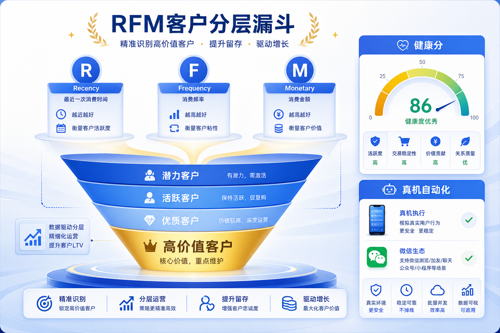

---

私域银行存的不是好友数，是 **能反复触达、能分层、能估值** 的资产。

真实的AI执行加健康分，解的是规模和安全这对矛盾。

RFM 解的是资源投给谁，不是全员群发。

行业案例只证明结构，不证明抄话术——模板在流程和算法，不在朋友圈文案。

2022 年底，存客宝服务 500 多家企业，全年营收过了 1000 万。

---

客户涨到几百家之后，新问题也来了：教育要分层，连锁要权限，地摊要场景和政务对接。

全定制，团队会累死；全标准，大客户不买账。

年底我们定死一条路：**标准化产品 + 模块化选配 + 大客户定制**。

樊登式分层、特步式 O2O、地摊式场景获客，进方案包，而不是每个客户重写一套系统。

站在 2022 年 12 月的办公室，我知道下一阶段不该只卖软件。

4.4 要讲矩阵怎么规模化，4.6 要讲基础设施怎么再升一级。

后面线下沙龙，天天有人问私域、问工具、问信任——我讲的还是同一句：**人先进池，池子才变成资产。**

这些合作、获客成本下降 45%、复购提升 3 倍，构成了这条线在当时的阶段性答卷。

根，就在 2022 年这场闭关和那一批真实现场里。

---

你问我这一年最重要的一条心得：

**流量会过期，关系会冷淡；进池、分层、节奏化触达之后，用户才进资产负债表。**

名字里有个「存」字——存住了，才是你的；存不住，永远是在给平台打工。

## 4.4｜账号矩阵：规模化运营的探索

2022年，存客宝系统已经相对成熟。

但开始思考一个更大的问题：如何实现规模化运营？

单纯依靠一个产品、一个账号，是无法实现真正的规模化的。

我需要构建一个账号矩阵，一个流量池的集群。

就像盖房子，只有地基打得牢，才能建造摩天大楼。

我的目标是建立一个多平台、多账号的矩阵。

将不同平台的流量引入我的私域池，再通过精细化运营实现转化和裂变。

这正是我的"私域布局"的核心策略。

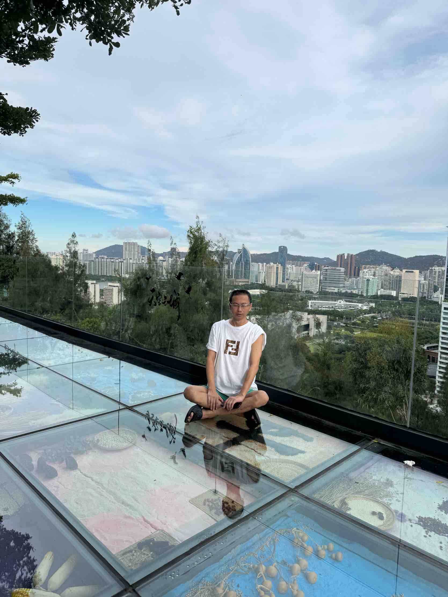

2022年上半年，开始大规模布局抖音账号。

从最初的1个账号，扩展到30个账号。这30个账号有一个共同的特点：都是厦门本地创业者IP。

为什么选择本地创业者这个定位？发现了三个关键洞察：

第一，本地创业者有天然的信任基础。同城的用户更容易产生共鸣，觉得"这个人就在我身边，他的经验更真实可信"。

第二，本地创业者的内容更容易产生互动。用户会主动评论"我也在厦门"、"我们可以线下见面聊聊"，这种互动率远高于泛娱乐内容。

第三，本地创业者更容易形成商业闭环。线上种草，线下成交，这是最短的转化路径。

每个账号都有明确的定位和内容策略：

"厦门卡若"主账号：专注私域运营干货，目标用户是有私域需求的企业主。

"厦门创业小王"：专注餐饮创业，分享开店经验，目标用户是想开餐厅的创业者。

"厦门地产老李"：专注房地产投资，分享买房心得，目标用户是有购房需求的本地人。

"厦门美业小美"：专注美容美发，分享变美技巧，目标用户是爱美的女性用户。

每个账号背后都有真实的创业者在运营，我提供技术支持和运营指导，他们负责内容产出和用户互动。这样既保证了内容的真实性，又实现了规模化运营。

但所有的账号都指向一个目标：将流量导入私域。

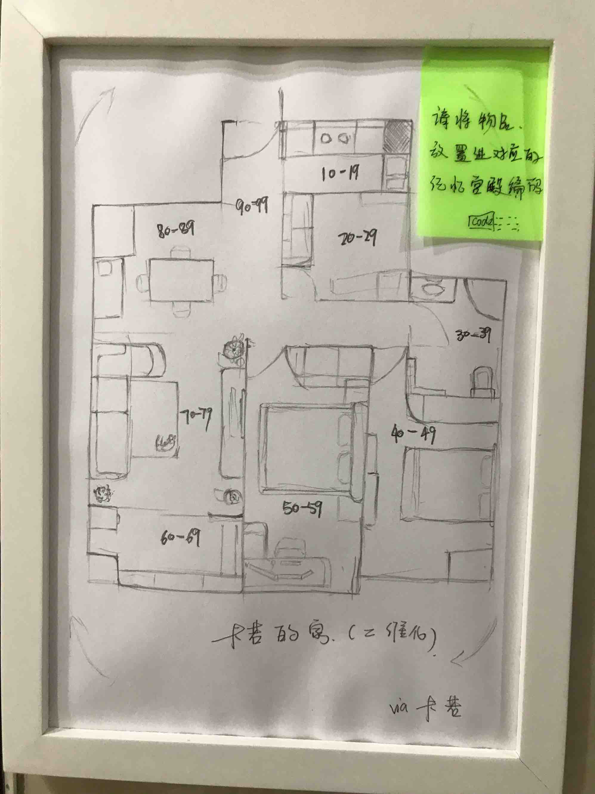

构建账号矩阵并非一蹴而就，它是一个从单点突破到全面复制的过程。

在与李长俊和王路的交流中，我们多次提及"复制"的重要性。

我曾提出，在抖音等平台上，许多成功的项目模式都具有极高的"可复制性"。

例如，通过对"二奢包包"、"宠物医生"等成功IP的深入分析。

我们可以提炼出他们的朋友圈话术、视频内容、转化路径。

然后进行"像素级复制"。

这个过程，我将其比喻为"1:1复制"。

这并非简单的抄袭，而是基于对"数据驱动"的深刻理解。

我们通过数据分析，快速识别出哪些内容能够带来流量。

哪些转化路径最为高效，然后将这些成功经验标准化。

并分发给我的"云阿米巴"团队。

这个团队，包括了30个抖音账号、我的开发团队、运营团队、兼职人员和合作伙伴。

他们就像一个个独立的作战单元，在我的指挥下，高效地执行复制任务。

还记得与李长俊讨论一个"素人IP"项目时。

他提到只要找到成功的模式，即使是"傻白甜"也能照抄朋友圈、照抄话术。

这恰恰印证了我的"写作即编程"理念。

通过流程化的设计和标准化的执行，将复杂的商业模式变得简单易行。

从而实现快速规模化。

为了支撑这个账号矩阵，我还建立了一套完整的内容生产体系。

包括内容策划、视频制作、文案撰写、数据分析等各个环节。

我们有专门的内容团队，负责产出高质量的原创内容。

也有专门的数据团队，负责分析各个账号的表现，优化内容策略。

更重要的是，我们有一套完整的SOP（标准作业程序）。

确保每个账号都能按照统一的标准进行运营。

这套SOP包括：

发布时间：每天固定的发布时间，确保最大化曝光。

内容类型：根据账号定位，确定内容的类型和风格。

互动策略：如何回复评论，如何引导用户关注。

引流话术：如何自然地引导用户添加微信。

转化流程：用户进入私域后的完整转化路径。

通过这套SOP，即使是新手也能快速上手，按照标准流程运营账号。

这大大降低了人力成本，提高了运营效率。

在账号矩阵运营的过程中，发现了一个重要的规律：

不同类型的内容，吸引的用户群体是不同的。

创业干货类内容，吸引的是有创业需求的用户。

私域运营类内容，吸引的是有营销需求的用户。

技术分享类内容，吸引的是有技术背景的用户。

通过精细化的用户画像分析，我们能够为不同的用户提供更精准的服务。

这不仅提高了转化率，也提高了用户满意度。

到2022年底，我们的30个抖音账号总粉丝数超过了100万。

日均播放量超过了10万，其中"厦门卡若"主账号单日最高播放量达到50万。

更重要的是，我们建立了一个稳定的流量导入机制。每天平均有200-300个新用户通过抖音账号添加我们的微信，进入私域流量池。

这些数据背后，是我们精细化运营的结果：

内容质量：我们的视频平均完播率达到65%，远高于行业平均的35%。这得益于我们对本地创业者真实故事的深度挖掘。

互动效果：我们的评论区互动率达到8%，其中70%的评论都是正向反馈。用户经常说"太真实了"、"我也想创业"、"能不能线下聊聊"。

转化效率：从抖音到微信的转化率达到15%，从微信到付费咨询的转化率达到8%。这意味着每1000个抖音粉丝，最终能转化为12个付费客户。

客户质量：通过抖音渠道获得的客户，平均客单价达到8000元，复购率达到40%。这些客户不仅付费能力强，而且忠诚度高。

每天都有大量的新用户通过抖音账号进入我们的私域。

这些用户经过精细化运营，转化为我们的付费客户。

账号矩阵的成功，让我看到了规模化运营的巨大潜力。

但同时也让意识到，规模化运营需要强大的基础设施支撑。

包括技术系统、运营体系、人才团队等各个方面。

这为我后续的商业发展奠定了坚实的基础。

在构建账号矩阵的过程中，我还发现了一个重要的商业机会：

很多企业都有做私域的需求，但缺乏专业的运营能力。

如果我能够将账号矩阵的运营经验产品化、服务化。

那就能够为更多的企业提供价值，同时也能够实现更大的商业价值。

这个想法，为我后续的咨询业务奠定了基础。

通过账号矩阵的实践，我不仅验证了私域运营的可行性。

更重要的是，我建立了一套可复制、可规模化的运营模式。

这套模式，成为了我后续商业发展的核心竞争力。

正如我常说的那样："在互联网时代，谁掌握了流量，谁就掌握了主动权。"

而账号矩阵，就是我掌握流量的核心武器。

## 4.5｜找我咨询1小时1万：来自抖音的粉丝

2022年底，随着存客宝系统的成熟和账号矩阵的成功运营。

开始收到越来越多的咨询请求。

有的是想了解私域运营的方法。

有的是想合作开发新项目。

还有的是纯粹想"聊聊"，看看有没有机会。

一开始，我都是免费回复，耐心解答。

但很快发现了一个问题：大部分人只是想白嫖信息。

他们问完问题，拿到答案后就消失了。

既不会付费购买服务，也不会真正去执行建议。

这让意识到，免费的东西往往不被珍惜。

开始思考一个问题：如何筛选出真正有价值的合作伙伴？

如何避免把时间浪费在无效的社交上？

答案很简单：设置门槛。

2023年初，我正式确立了咨询收费标准：1小时1万元。

这个价格一出，立刻引起了很大的争议。

有人说我太贪心，有人说我太狂妄。

但我很清楚自己在做什么。

这不是自抬身价，而是对自己价值的合理定价。

我能给到的，不仅仅是方法论，更是实战经验和资源对接。

我记得第一个付费咨询的客户，是一家传统制造业的老板。

他的工厂年营收5000万，但一直没有找到数字化转型的方向。

"卡若，我愿意付这个费用，但你能保证给我有价值的建议吗？"

我很坦诚地告诉他："我不能保证你一定成功，但我能保证给你最实用的方法和最直接的资源。"

在那一个小时的咨询中，我为他梳理了完整的私域转型路径。

从客户画像分析，到内容策略制定，再到转化流程设计。

我还直接把他介绍给了我的技术团队，帮他对接存客宝系统。

三个月后，他的私域营收就突破了500万。

他主动给我发了一条微信："卡若，这一万块花得太值了。"

这个案例更加坚定了收费咨询的价值。

真正有需求、有执行力的客户，是不会在乎这个费用的。

而那些只想白嫖信息的人，自然就被筛选掉了。

随着成功案例的增多，我的咨询业务也越来越火爆。

每个月都有十几个付费咨询的客户，2023年全年累计咨询收入超过200万。

他们来自各行各业：电商、教育、美业、餐饮、制造业等。让我印象深刻的几个案例：

厦门某连锁美容院老板娘，她有8家门店，但客户复购率一直很低。通过一小时咨询，我帮她设计了一套"美丽成长计划"的私域运营体系。将每个客户的美容过程记录下来，定期推送护肤知识和变美技巧。3个月后，客户复购率从30%提升到70%，单店月营收增长了50%。

福建某茶叶企业的二代接班人，他想把传统茶叶生意做成网红品牌。我为他制定了"茶文化+生活方式"的内容策略，教他如何用短视频讲好茶的故事。半年后，他的抖音账号粉丝突破50万，线上销售额占到总营收的40%。

厦门某教育培训机构的校长，她的机构面临激烈竞争，获客成本越来越高。我帮她设计了"家长成长社群"的模式，不仅服务学生，更服务家长。通过分享教育理念和亲子技巧，建立了强信任关系。结果转介绍率达到60%，获客成本降低了一半。

每个人的需求都不同，但都有一个共同点：他们都是真正想要改变的人。

在咨询过程中，我总结出了一套标准化的服务流程：

第一步：需求诊断。深入了解客户的现状、痛点和目标。

第二步：方案设计。基于客户的具体情况，制定个性化的解决方案。

第三步：资源对接。利用我的人脉和资源，为客户提供直接的帮助。

第四步：跟踪指导。在执行过程中提供必要的指导和调整建议。

这套流程确保了每个客户都能得到最大的价值。

也让我的咨询服务形成了良好的口碑。

很多客户都是通过老客户介绍来的。

这种口碑传播，比任何广告都更有效。

在做咨询的过程中，我也在不断学习和成长。每个客户的案例，都让我对不同行业有了更深的理解，这些经验反过来又提升了咨询的价值，形成一个正向的循环。

随着咨询场次越来越多，开始把交付过程标准化。一开始我以为一小时咨询就是"聊天"，后来才意识到它必须高度结构化，否则一小时很容易变成漫无目的的倾诉。

我把一小时拆成四段：前十分钟，快速诊断——确认行业现状、现金流、团队配置、当前最致命的瓶颈；中间三十分钟，给出一条最短的增长路径，不是十条建议，而是一条可以在三十天内验证的方向；后十五分钟，把动作落地——明确谁负责、何时开始、第一周交什么结果；最后五分钟，讲清风险提示——什么情况下继续投入，什么情况下应该立刻停。

慢慢地，来找我的人也变了。他们不再只是想问"怎么做私域"，而是带着非常具体的问题来——"我这个渠道的ROI下降了，问题出在哪里"，"我的团队执行力很弱，我应该从哪里切入"。这样的对话，才是真正有价值的交流。

我还发现，收费咨询不仅仅是一个商业模式。

更是一种价值观的体现。

它传递了一个重要的信息：专业知识是有价值的，时间是宝贵的。

这种价值观，也影响了我的团队和合作伙伴。

大家都开始更加重视自己的专业能力，更加珍惜彼此的时间。

到2023年底，我的咨询业务已经成为了一个重要的收入来源。

不仅带来了直接的经济收益，更重要的是建立了一个高质量的客户网络。

这些客户，后来很多都成为了存客宝的长期用户。

甚至有些成为了我的合作伙伴。

咨询收费这个决定，看似简单，实际上是一个重要的商业转折点。

它让我从一个技术专家，转变为一个商业顾问。

从提供产品，转变为提供解决方案。

这种转变，为我后续的商业发展奠定了重要基础。

正如我常说的："免费的东西往往是最贵的，因为它会浪费你最宝贵的时间。"

而付费咨询，则是对彼此时间和价值的最好尊重。

这不是傲慢，这是商业常识。

在一个信息爆炸的时代，真正有价值的不是信息本身。

而是对信息的筛选、整合和应用能力。

这正是我的咨询服务所提供的核心价值。

## 4.6｜私域基础设施建设：加速原始积累

2023年，是我商业发展的关键一年。

咨询业务的成功，让我看到了更大的市场机会。

但我也意识到，单纯的咨询服务是有天花板的。

我的时间是有限的，一天最多只能服务几个客户。

如果要实现真正的规模化，就必须建设更完善的基础设施。

让我的经验和方法能够服务更多的企业。

这就是我提出"私域基础设施"概念的背景。

我要做的不仅仅是一个产品，而是一个完整的生态系统。

让每个企业都能在这个生态中找到适合自己的解决方案。

2023年上半年，开始大规模投入基础设施建设。

首先是技术基础设施的升级。

存客宝系统经过两年的发展，已经积累了大量的用户数据和使用经验。当时系统已经服务了500家企业，日活跃用户超过10万，但单体架构已经成为瓶颈。

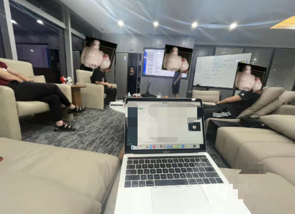

但要服务更多的企业，就需要更强大的技术架构。我记得那时候系统经常在高峰期出现响应延迟，有时候加载一个客户列表要等10秒钟，这对用户体验是致命的。

我们重新设计了整个系统架构，采用了微服务的设计理念。具体来说，我们将原来的单体应用拆分成了8个核心微服务：用户管理服务、客户管理服务、消息推送服务、数据分析服务、内容管理服务、营销自动化服务、支付服务和日志服务。

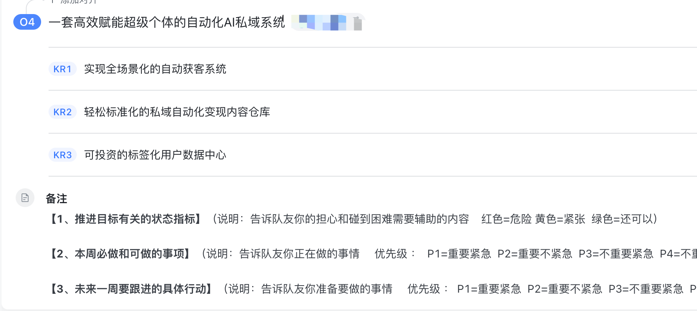

每个服务都可以独立部署和扩展，这样当某个功能模块压力大的时候，我们可以单独扩容，而不影响其他功能。比如双11期间，消息推送服务的压力特别大，我们就单独给这个服务增加了5台服务器。

让系统能够支撑更大的并发量，处理更复杂的业务场景。改造后，系统的并发处理能力从原来的1000提升到了10000，响应时间从平均3秒降低到了0.5秒。

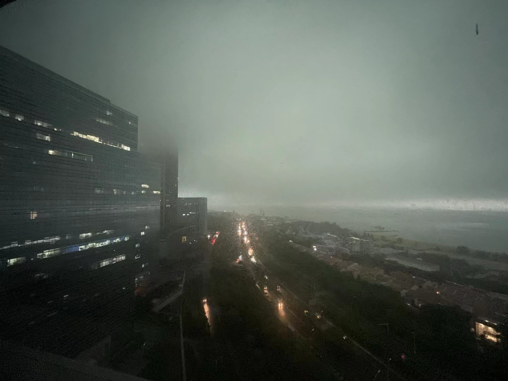

同时，我们还开发了更多的功能模块。

包括智能客服、数据分析、营销自动化等。智能客服模块基于我们积累的大量对话数据，能够自动回复80%的常见问题；数据分析模块可以实时展示客户的行为轨迹和转化漏斗；营销自动化模块支持根据客户标签自动发送个性化消息。

让企业能够在一个平台上完成所有的私域运营工作。从客户导入、标签管理、内容推送、数据分析到效果评估，整个私域运营的闭环都在我们的系统里完成。

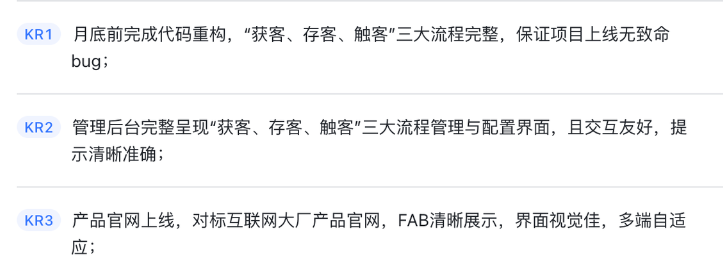

其次是服务基础设施的建设。

我组建了一个专业的服务团队，包括私域运营专家、数据分析师、内容策划师等。具体来说，我们的服务团队有15个人：3名私域运营专家（都有3年以上实战经验）、2名数据分析师（负责为客户提供数据洞察）、3名内容策划师（专门帮客户设计内容策略）、5名客户成功经理（负责日常服务和问题解决）、2名技术支持工程师。

这个团队不仅能够为客户提供技术支持。每个客户成功经理最多负责50家企业，确保能够及时响应客户需求。我们的技术支持平均响应时间是2小时，问题解决率达到95%。

更重要的是能够提供专业的运营指导。比如我们会根据客户的行业特点，为他们量身定制私域运营策略。餐饮行业我们重点关注复购率提升，教育行业我们重点关注转介绍，美业我们重点关注客户生命周期价值。

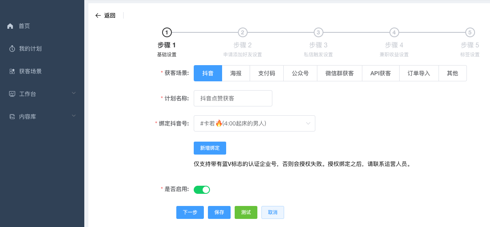

我们制定了一套完整的服务标准，确保每个客户都能得到高质量的服务。这套标准包括：新客户7天内完成系统部署，14天内完成团队培训，30天内看到初步效果，90天内实现ROI正向。

从需求分析、方案设计，到实施指导、效果评估，每个环节都有专人负责。我们还建立了客户成功评分体系，每月对客户的使用情况进行评估，主动发现问题并提供解决方案。

第三是内容基础设施的建设。

发现，很多企业虽然有了工具，但不知道如何创作内容。

于是我们开发了一个内容库系统，包含了各行各业的内容模板。

企业可以根据自己的需求，选择合适的模板进行个性化定制。

我们还建立了一个内容创作团队，定期产出高质量的原创内容。

供客户参考和使用。

第四是培训基础设施的建设。

我们开发了一套完整的在线培训课程，涵盖私域运营的各个方面。

从基础概念到高级技巧，从理论知识到实战案例。

企业的员工可以通过这些课程，快速掌握私域运营的技能。

我们还定期举办线下培训活动，让客户能够面对面交流学习。

在基础设施建设的过程中，我们也在不断优化商业模式。

从单纯的软件销售，发展为"软件+服务+培训"的综合模式。这个转变是基于我们对客户需求的深度理解：很多企业不缺工具，缺的是如何用好工具。

客户可以根据自己的需求，选择不同的服务包。

基础包：年费1.2万元，只包含软件使用权，适合有一定运营能力的企业。这类客户通常有专门的运营团队，他们需要的是一个好用的工具。

标准包：年费3.6万元，包含软件+基础服务，适合大部分中小企业。包括每月2次的运营指导、内容模板库使用权、在线培训课程等。这是我们最受欢迎的套餐，占客户总数的60%。

高级包：年费12万元，包含软件+全套服务+专属顾问，适合大型企业。专属顾问每周会与客户沟通一次，制定个性化的运营策略，还包括线下培训和定制化功能开发。

这种分层服务的模式，让我们能够服务不同规模、不同需求的企业。从年营收几百万的小企业到年营收几十亿的大集团，都能在我们这里找到合适的解决方案。

也让我们的收入结构更加多元化。软件收入占40%，服务收入占45%，培训收入占15%。这样的结构让我们的现金流更加稳定，也提高了客户的粘性。

2023年下半年，我们的客户数量快速增长。

从年初的500家，增长到年底的2000家。

营收也从1000万增长到了5000万。

更重要的是，我们建立了一个可持续发展的商业模式。

客户的成功率大大提升，续费率也达到了85%以上。

在基础设施建设的过程中，我还发现了一个重要的商业机会：

很多传统行业的企业，都有数字化转型的需求。

但他们缺乏专业的指导和工具。

如果我们能够为这些企业提供一站式的数字化解决方案。

那市场空间将是巨大的。

在这个过程中，开始系统性地布局私域领域。

深知，仅仅依靠单一平台或单一账号的流量是不可持续的。

就像盖房子，只有地基打得牢，才能建造摩天大楼。

我的目标是建立一个多平台、多账号的矩阵。

将不同平台的流量引入我的私域池，再通过精细化运营实现转化和裂变。

构建账号矩阵并非一蹴而就，它是一个从单点突破到全面复制的过程。

在与李长俊和王路的交流中，我们多次提及"复制"的重要性。

我曾提出，在抖音等平台上，许多成功的项目模式都具有极高的"可复制性"。

例如，通过对"二奢包包"、"宠物医生"等成功IP的深入分析。

我们可以提炼出他们的朋友圈话术、视频内容、转化路径，然后进行"像素级复制"。

这个过程，我将其比喻为"1:1复制"。

这并非简单的抄袭，而是基于对"数据驱动"的深刻理解。

我们通过数据分析，快速识别出哪些内容能够带来流量、哪些转化路径最为高效。

然后将这些成功经验标准化，并分发给我的"云阿米巴"团队。

这个团队，包括了30个抖音账号、我的开发团队、运营团队、兼职人员和合作伙伴。

他们就像一个个独立的作战单元，在我的指挥下，高效地执行复制任务。

在构建账号矩阵和拓展业务的过程中，我面临过许多合作机会。

其中不乏以"股权"作为吸引力的诱惑。

然而，我始终坚守一个原则："千万不要想着和别人分股份，股份永远没有现金性感。"

这句话，是我在无数次合作实践中得出的经验教训。

于是，我们开始拓展服务范围，不仅仅局限于私域运营。

还包括数字化营销、客户管理、数据分析等各个方面。

我们的目标是成为企业数字化转型的首选合作伙伴。

通过一年的基础设施建设，我们不仅实现了业务的快速增长。

更重要的是建立了强大的竞争壁垒。

我们的技术、服务、内容、培训等各个方面，都形成了完整的体系。

这让我们在市场竞争中占据了有利地位。

也为后续的发展奠定了坚实的基础。

正如我常说的："基础设施决定上层建筑。"

只有建设好了基础设施，才能支撑更大的商业目标。

这一年的投入，为我们后续的爆发式增长做好了充分的准备。

## 4.7｜团队背叛与青花瓷的故事

2023年，正当我的事业蒸蒸日上的时候，发生了一件让我至今难忘的事情。

那是一个普通的周三下午，我正在办公室里处理私董会的筹备工作。

突然，我的技术总监小陈敲门进来，脸色很凝重。

"卡若，我有件事要告诉你。"他的声音有些颤抖。

"什么事？"我放下手中的工作，看着他。

"老黄他们几个，准备离职创业，做和我们类似的产品。"

这句话如同晴天霹雳，让我愣在了那里。

老黄是我们的运营总监，跟了我三年多。

从存客宝的第一个版本开始，他就是核心团队成员。

我一直把他当作兄弟，给他股份，给他高薪，给他充分的信任。

没想到，他竟然要带着团队离开，还要做竞争产品。

"他们什么时候决定的？"我努力保持冷静。

"应该已经筹备了两个月了，我也是今天才知道。"小陈说。

"他们还挖了谁？"

"销售总监小王，产品经理小张，还有几个核心开发人员。"

听到这里，我的心彻底凉了。

这些人，都是我一手培养起来的。

我给他们机会，给他们平台，给他们成长的空间。

没想到，他们竟然选择了背叛。

那天晚上，我一个人坐在办公室里，看着窗外的夜景。

心情五味杂陈。

愤怒、失望、困惑、自责，各种情绪交织在一起。

开始反思，是不是我哪里做错了？

是不是我对他们不够好？

还是我的管理方式有问题？

第二天，老黄主动找到我，想要摊牌。

"卡若，知道你已经知道了。"他坐在我对面，有些尴尬。

"为什么？"我直视着他的眼睛。

"我们觉得，跟着你虽然能学到很多，但发展空间有限。"

"我们想要自己创业，做自己的事业。"

"那为什么要做和我们一样的产品？市场这么大，你们可以做别的啊。"

老黄沉默了一会儿，说："因为我们最熟悉这个领域，成功的概率更大。"

我苦笑了一下："你们有没有想过，这样做对我意味着什么？"

"我们会避免直接竞争，做差异化的产品。"老黄说。

但知道，这只是安慰的话。

在这个细分领域，根本没有什么差异化可言。

他们就是要做我的竞争对手。

那天的谈话，我们都很克制，没有撕破脸。

但知道，我们的关系已经回不到从前了。

接下来的一个月，是我创业以来最艰难的时期。

核心团队的离开，让公司的运营受到了很大影响。

很多项目都要重新安排人手。

客户服务也受到了影响。

更让我痛苦的是心理上的打击。

开始怀疑自己的判断力。

开始怀疑人与人之间的信任。

开始怀疑创业的意义。

就在这个时候，我想起了一个故事。

那是关于青花瓷的故事。

青花瓷的制作过程非常复杂，需要经过多道工序。

其中最关键的一道工序，是在高温下烧制。

在这个过程中，很多瓷器会因为各种原因而破裂。

但那些经受住考验的瓷器，会变得更加坚韧和美丽。

突然明白了，创业就像制作青花瓷。

在高温的考验下，有些东西会破裂，有些人会离开。

但那些留下来的，会变得更加珍贵。

开始重新审视这次团队背叛事件。

虽然痛苦，但它也让我看清了很多东西。

看清了谁是真正值得信任的人。

看清了什么是真正重要的。

看清了自己的不足和需要改进的地方。

开始调整自己的心态和策略。

首先，我重新梳理了公司的核心团队。

那些选择留下来的人，我给了他们更多的信任和机会。

我也开始更加重视团队文化的建设。

不仅仅是利益的绑定，更重要的是价值观的认同。

其次，我完善了公司的制度和流程。

避免过度依赖某几个关键人员。

建立更加完善的知识管理体系。

确保即使有人离开，公司的运营也不会受到太大影响。

第三，开始更加注重人才的培养和储备。

不再把所有的鸡蛋放在一个篮子里。

建立更加多元化的团队结构。

最重要的是，我重新定义了成功的标准。

不再只是追求规模和利润。

更重要的是建立一个有价值观、有文化、有温度的团队。

半年后，老黄他们的公司确实成立了。

也确实做了和我们类似的产品。

但结果并不如他们预期的那样。

由于缺乏完整的商业模式和客户资源。

他们的产品很快就遇到了困难。

一年后，他们的公司就倒闭了。

老黄还主动联系过我，想要回来。

但我拒绝了。

不是因为怨恨，而是因为信任一旦破裂，就很难修复。

这次团队背叛事件，虽然给我带来了很大的痛苦。

但也让我成长了很多。

我学会了如何在逆境中保持冷静。

学会了如何重新建立信任。

学会了如何让团队更加团结。

更重要的是，明白了一个道理：

真正的成功，不是避免所有的挫折和背叛。

而是在经历这些考验后，依然能够坚持初心，继续前行。

就像青花瓷一样，只有经过高温的考验，才能展现出真正的美丽。

这次经历，也让我对后续的私董会模式有了更深的思考。

如何建立真正的信任关系？

如何避免利益冲突？

如何让合作更加持久？

这些问题，都需要我在实践中不断探索和完善。

正是在这种反思中，逐渐形成了"云阿米巴"模式的核心理念。

意识到，传统的股权激励模式存在很大的问题。给股份看起来很诱人，但实际上容易产生各种纠纷和矛盾。股份的价值很难量化，分配也容易产生争议。更重要的是，股份会让合作方产生"主人翁"的错觉，反而可能导致更多的冲突。

于是我提出了一个颠覆性的观点："千万不要想着和别人分股份，股份永远没有现金性感。"

这个观点的核心逻辑是：

第一，现金是最直接、最透明的激励方式。每个月能拿到多少钱，一目了然，不会有任何争议。

第二，现金激励更加灵活。可以根据贡献的大小随时调整，不像股份一旦分出去就很难收回。

第三，现金激励避免了复杂的股权关系。大家都是合作伙伴，而不是股东，关系更加纯粹。

基于这个理念，我设计了"云阿米巴"模式的三大核心原则：

1. 分不属于对方的钱：只分我们共同创造的增量价值，不分我原有的存量收入。

2. 按创造价值分钱：根据每个人的实际贡献来分配收益，多劳多得，能者多得。

3. 用稳定流量+便捷私域体系绑定合作方：通过提供持续的流量支持和完善的工具体系，让合作方离不开我们的平台。

这种模式的好处是显而易见的：合作方能够立即看到收益，我也能够保持对核心资源的控制，双方都有持续合作的动力。

但相信，只要保持初心，坚持价值观，用现金而不是股份来激励合作伙伴，就一定能够建立起真正有价值的商业关系。

那次危机之后，我花了三个月时间重建团队，但我做的第一件事不是去招聘，而是补制度的漏洞。

所有核心流程、客户策略、关键文档，必须沉淀到组织层面，而不是锁在某一个人的脑子里。以前我以为把事情交给人就够了，却忽略了人是会走的，留下来的必须是组织的能力，而不是个人的记忆。

第二件事，是把所有模糊的"口头信任"升级成可执行的规则。边界是什么、权限是什么、收益是怎么分的、职责是怎么界定的，全部写下来，落成条款。关系越亲近，越要把话讲清楚。越模糊的边界，越容易成为裂缝。

第三件事，是调整了用人标准——先看价值观，再看能力。能力决定一个人能把事情做多好，价值观决定他在利益面前会怎么选择。我吃了这个亏，之后宁愿慢一点、团队小一点，也不再用价值观不一致的人。

青花瓷经过高温，破了的就破了，留下的才是真正的精品。这个道理，我是用真实的代价换来的。

## 4.8｜说走就走的旅行：30天挑战100万资产

2023年12月14日，我、阿猫和乔妹围坐在烧烤店。

空气中弥漫着烤肉的香味。

我和阿猫本打算进行0元30天挑战100万资产。

旁边的乔妹突然笑着说："我做你们的天使投资人，你们直接启动怎么样？"

"走吧，为什么不呢！"我笑着回应。

就这样，我们决定立即启程。

带上简单的行李和无限的挑战激情，踏上了前往杭州的路。

飞机14号凌晨12点起飞。

我们商量我走BOSS直聘路线、阿猫走相亲角和厦大校友会。

第二天一早，刚到杭州，发了条朋友圈我就收到了阿里高管亮哥的邀请：

"卡若，来画外桐坞看看吧，这里有一些机会你可能会感兴趣。"

我迅速赶往画外桐坞。

这是一个政府投资建设的村庄，拥有150位全国各地知名艺术家。

村庄四周环绕着翠绿的山丘，这里是西湖龙井的产地。

空气中弥漫着新鲜的泥土气息。

亮哥带我参观了一圈，我一瞬间就被这里的景色迷住了。

我心想："这里简直是个宝地，只要好好利用，一定能完成我们的目标。"

当晚回到住处，我对阿猫说："我们要在这里做点事。"

于是，我们开始构思如何盘活这个艺术村庄。

第三天，我们回来定义画外桐坞为"艺术庄园"。

这个定义不是随意的，而是基于我对这个村庄深度调研后的战略思考。画外桐坞有150位全国知名艺术家，这是天然的IP资源池。但问题是，这些艺术家各自为政，缺乏统一的品牌包装和商业化运作。

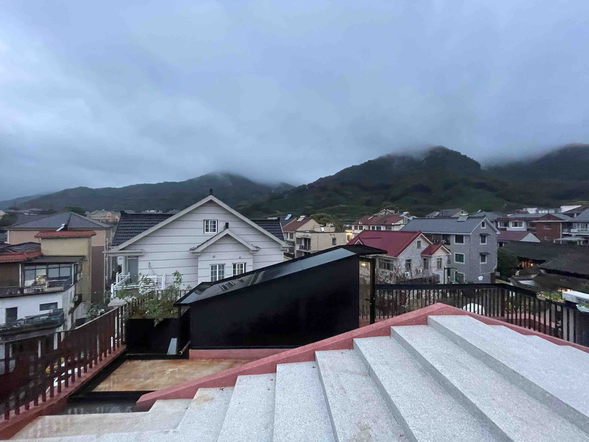

发现了三个关键机会点：

第一，艺术家们的作品质量很高，但缺乏有效的推广渠道。传统的画廊模式成本高、覆盖面窄，无法充分释放这些作品的商业价值。

第二，村庄的自然环境和文化氛围非常适合做体验式消费，比如艺术主题的民宿、婚礼、团建等，但缺乏系统的产品设计和运营。

第三，政府对这个项目的支持力度很大，这意味着我们有政策红利和资源倾斜的优势。

基于这些分析，我们成立了超级个体流量MCN，这不是简单的MCN机构，而是一个"艺术家IP孵化平台"。我们的核心策略是：让每个艺术家都成为自己的超级个体，通过私域体系放大他们的影响力和商业价值。

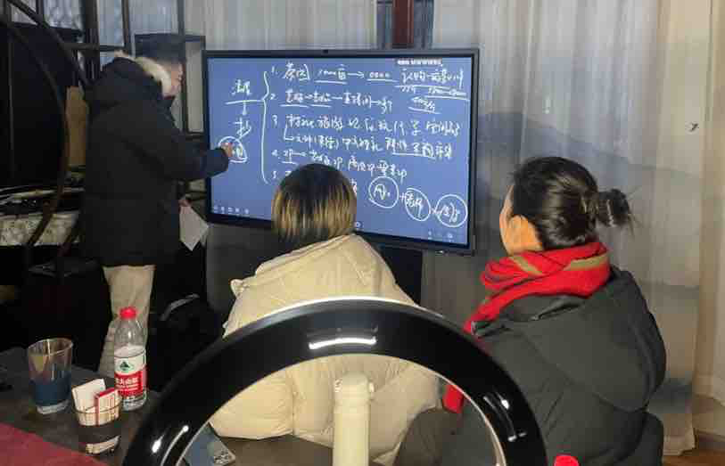

阿猫建议："我们可以通过抖音等平台，推广这些艺术家的作品，同时也介绍画外桐坞这个艺术村庄。"

我补充道："不仅如此，我们要把艺术家的创作过程、生活状态、思想理念都包装成内容。让用户不仅仅是买一幅画，而是买一种生活方式、一种精神追求。"

第四天，团队成立了。

由亮哥叫来的几个小伙伴、小易、MINDY、孙阳、段公子、舒婷、乔妹。这个团队的组成很有意思，每个人都有自己的专业背景和资源优势。

小易是阿里的产品经理，擅长用户体验设计和产品规划；MINDY有丰富的内容运营经验，曾经操盘过多个千万级的抖音账号；孙阳是技术出身，负责小程序和系统开发；段公子有很强的商务能力，人脉资源丰富；舒婷是设计师，审美能力很强；乔妹则是我们的天使投资人，同时也负责财务管理。

大家自我介绍了一下，大多数人来自于阿里以及恒生电子。发现这个团队的配置很完美：有技术、有运营、有设计、有商务、有资金，这正是我一直在寻找的"全栈创业团队"。

接着我和阿猫讲我们落地的思路以及我们能做些什么。

我说："我们要做的不是传统的旅游项目，而是一个'艺术生活方式品牌'。我们的目标用户是那些有一定消费能力、追求精神品质的人群。他们不满足于标准化的旅游产品，而是希望获得独特的、有文化内涵的体验。"

阿猫补充："我们的优势在于，我有厦大校友会的资源，卡若有私域运营的技术和经验，大家都有各自的专业能力。我们可以快速整合这些资源，打造一个从内容到产品到服务的完整闭环。"

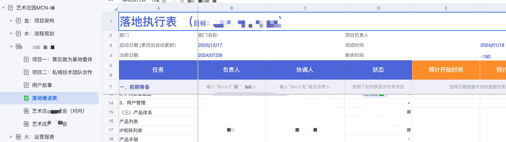

团队一开始就以联合众创的形式成立，并且分配收入。这个决定很关键，因为它确保了每个人都有明确的利益驱动，而不是简单的雇佣关系。

我们设计了一套详细的分润方式。

以确保团队成员、艺术家、以及其他相关方能够公平、公正地分享项目收益。

这套分润方式主要包括以下几个方面：

产品包与差价收益：我们将艺术庄园的民宿、中式婚礼、西式婚礼、团建、艺术家IP、艺术品拍卖等整合成产品包。

例如，一场中式婚礼可能需要包场，包括10个房间，总费用为10万元。

如果我们能够以6万元的成本价获得这些房间，差价为4万元。

通过这种方式，我们能够清晰地定义每个产品包的收益。

介绍IP与流量分成：团队中的成员负责拍摄抖音视频和推广活动。

如果某个视频成功带来客户并产生了收益，20%的收益将归属于介绍该项目的成员。

例如，若通过某个视频带来了2万元的订单，那么4000元将归属于该视频的制作者。

其余的收益将按股份比例分配给其他团队成员。

股权与股份比例：团队成员根据其在项目中的贡献和投资获得股份。

某成员初期投资了5万元投流费用，5万股占有一定总股份相应比例的股份。

所有收益在扣除IP介绍分成后，按照股份比例进行分配。

这样的方式确保了每个成员的贡献都能够得到回报，并激励大家投入更多的努力。

项目与合作方的收益分配：我们还与外部合作方，例如民宿老板和婚礼策划公司，签订了合作协议。

这些合作方根据提供的服务和资源获取固定比例的收益。

例如，民宿老板提供场地和服务，我们负责推广和运营，双方按约定的比例分配收益。

这种合作方式确保了所有参与方都能从项目中受益，并且提高了项目的整体成功率。

随后我们将艺术庄园的民宿、中式婚礼、西式婚礼、团建、艺术家IP、艺术品拍卖、西湖龙井茶整合成了产品包。

将它放在艺术庄园小程序。

"每一个小伙伴在短视频上展示自己的能力，我来给大家分享我做抖音的经验。"

"并且用存客宝给大家做私域赋能，让所有人成为超级个体，给整个艺术庄园带来流量。"我对小伙伴们说。

第五天，我和阿猫商量："我继续走BOSS直聘路线，阿猫走相亲角和厦大校友会，我们两个渠道一起发力。"

我们的原想法是做抖音IP，采访艺术家推荐他的作品，让他给自己的视频投流。

这样一来，不仅能推广艺术家，还能带来直接的经济效益。

然而，实施过程中我们遇到了挑战。

村里的老一辈艺术家们对我们的做法表示怀疑。

他们不相信这些新兴的互联网手段能带来实质性的改变。

"我们真的能成功吗？"小伙伴们有些担忧地问道。

"能。"我坚定地回答，"我们需要一个突破点，一个能让所有人都看到希望的突破点。"

为了找到这个突破点，我们决定从最热闹的西式婚礼、团建版块进行入手。

并且主动联系老板谈合作方式，只要他提供一个底价给我们。

我们很快针对这几个产品拍了相关的视频，反响很好。

像这种整个童话式的庄园婚礼10个酒店的房间、还有活动策划布置等3天10万元。

我们谈下来的价格也很美好。

然而，最大的挑战是如何协调这些多样化的项目。

以及如何有效地分配团队的时间和任务。

大家的时间和精力都是有限的，如何在有限的时间内实现最大的效益成了我们必须面对的问题。

"我们需要一个清晰的任务分配表。"亮哥提议。

"每个人都有明确的职责，这样才能提高效率。"

我点头同意，于是花了一整天时间制定详细的任务分配表。

每个小伙伴都有明确的任务和时间安排。

从拍摄抖音视频、采访艺术家，到推广民宿和策划婚礼活动。

随着计划的推进，我们还发现了另一个问题：

一些艺术家对于与民宿和婚礼项目的结合感到不满。

他们认为这会破坏艺术的纯粹性。

"我们不想让艺术变成商业工具。"一位老艺术家对我们说。

我理解他们的顾虑，心中五味杂陈。

我们的初衷是好的，但却忽略了他们的感受。

于是，小伙伴们进行了一次深度讨论。

"我们要做的是一个共赢的局面。"我对大家说。

"我们要尊重艺术家的创作自由，同时也帮助他们实现更大的影响力和经济效益。"

通过这次讨论，我们决定调整策略。

我们开始更多地倾听艺术家们的意见，与他们一起策划项目。

让他们参与到民宿和婚礼项目的设计中。

确保他们的作品和理念能够得到充分的展示和尊重。

经过一段时间的调整和努力，艺术家们开始愿意与我们合作。

游客们也逐渐增多。

我们逐渐找到了一种平衡点，既能实现商业目标，又能保持艺术的纯粹性和价值。

最终，艺术家们开始看到这种新模式带来的实际好处。

他们的作品得到了更多的关注和购买，我们的项目也逐步走上了正轨。

通过这次杭州30天挑战，我们不仅成功盘活了画外桐坞的物业资产。

还带动了当地的艺术氛围和旅游业。

并且小伙伴通过深度参与项目赚到了钱。

未来，我们计划将联合众创结合私域流量这种模式推广到更多的地方。

继续通过创新和合作，实现更多的商业和文化价值。

我们每一个人，亮哥、小易、MINDY、孙阳、段公子、舒婷、阿猫、乔妹，都是这次挑战的英雄。

我们不仅是同事，更是并肩作战的战友。

这次体验中也深刻地体验到"一个人可以走很快，一群人可以走很远"。

从杭州回来，我反复回想这三十天，发现真正起作用的不是那股热血，而是三次关键决策。

第一次决策，是先定义产品，再做传播。我们没有一到杭州就开始拍抖音，而是先把"艺术庄园产品包"定义清楚——民宿、婚礼、团建、艺术品，每个品类的底价、差价、客户画像都梳理透了，才开始投放内容。很多人失败，是因为把顺序搞反了：先把内容拍了，才发现没有可以承接流量的产品。

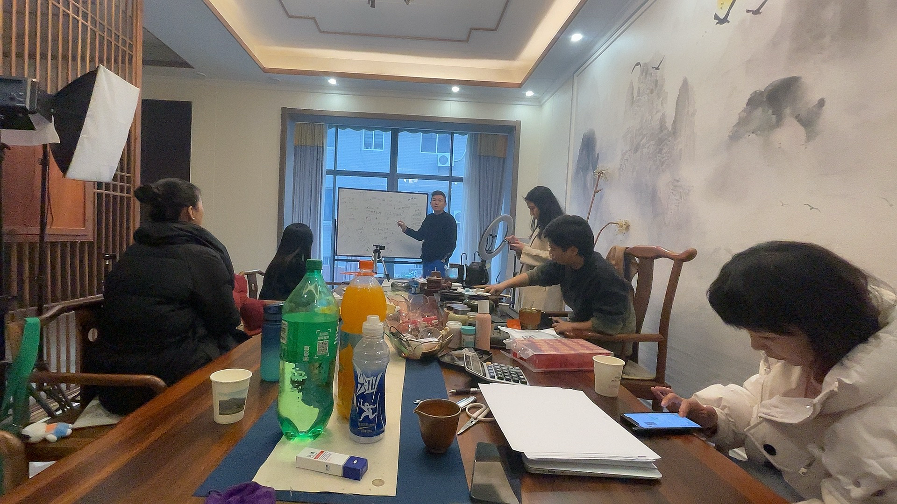

第二次决策，是先做分润机制，再扩张团队。在第四天把分润规则写清楚之前，团队成员是靠情绪和好奇心撑着的。规则落地之后，大家靠的是结果。这两种状态，可持续性完全不同。

第三次决策，是先做可以成交的场景，再讲品牌故事。我们先从婚礼、团建这些高确定性、高客单的场景切入，跑通了现金流，才有资格去聊"艺术庄园"的长期品牌价值。没有现金流支撑的品牌叙事，很快就会因为资金压力而崩塌。

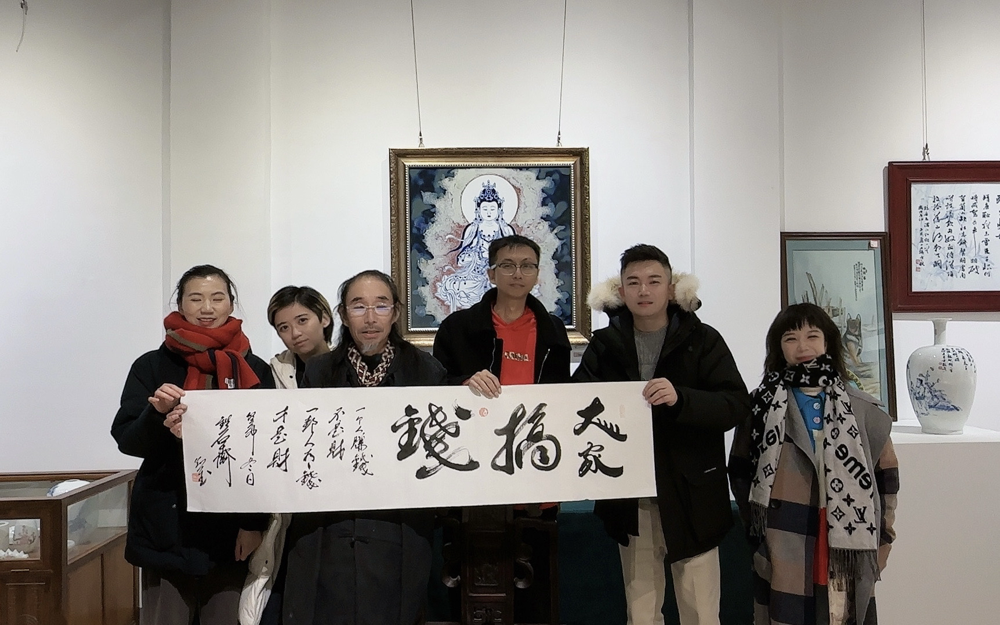

这三次决策，让项目从一个"好玩的创意"落成了"真实的现金流"。这次挑战，也让我深刻体验到一件事：一个人可以走很快，一群人才能走很远——但前提是，这群人有清晰的规则和方向。

## 4.9｜卡若私董会，是诈骗集团吗？

我搞了个私董会，要求年营收1000万以上且年费5万才能加入。

有人说这是诈骗。

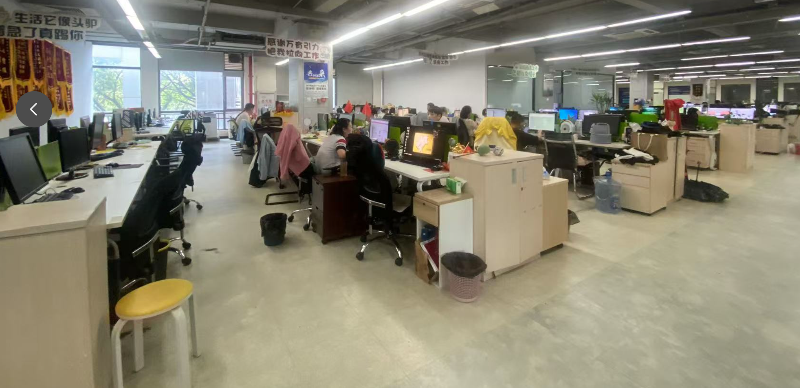

在如今复杂的商业世界里，私董会的名声确实毁誉参半。

看到不少私董会倒闭的新闻，知道很多人心中都有疑问：卡若私董会，是不是也不可靠？会不会是诈骗集团呢？

作为卡若私董会的创始人，我想在这里详细地介绍一下，让大家了解它的真实面貌。

卡若私董会的成员主要是两类企业主。

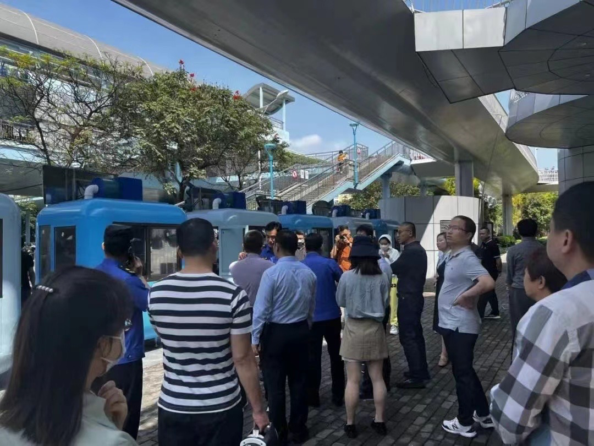

一类是经营着有一定规模的企业，比如年营收在1000万左右的销售公司老板，拥有百人销售团队，或者专注于私域运营的销售公司老板。

比如我们的成员老张，他经营着一家教育培训公司，年营收1200万，有80人的销售团队。

加入私董会后，通过我们的私域运营体系，他的客户转化率从15%提升到了35%，年营收增长到了1800万。

另一类则是那些拥有流量优势的企业主，像连锁门店的老板、地摊平台的创业者。

他们希望在抖音上放大影响力来扩展门店及影响力。

我们的成员小李，在厦门经营着8家奶茶店。

通过私董会的抖音矩阵运营策略，他的门店抖音账号总粉丝数从2万增长到了15万，线上订单占比从10%提升到了40%，单店月营收增长了60%。

还有成员老王，他是做二手车生意的，原来只是线下交易，年营收500万。

加入私董会后，我们帮他搭建了抖音IP，现在他的抖音粉丝有30万，通过直播卖车，年营收突破了2000万。

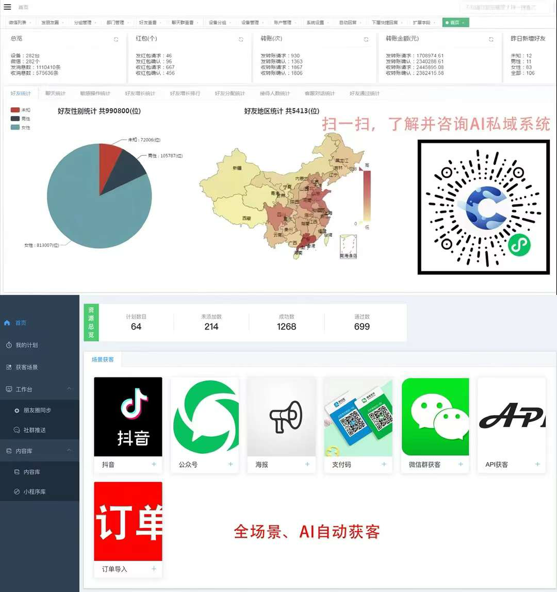

私董会有一个独特的优势，那就是能够实现私域之间的联合与合作。

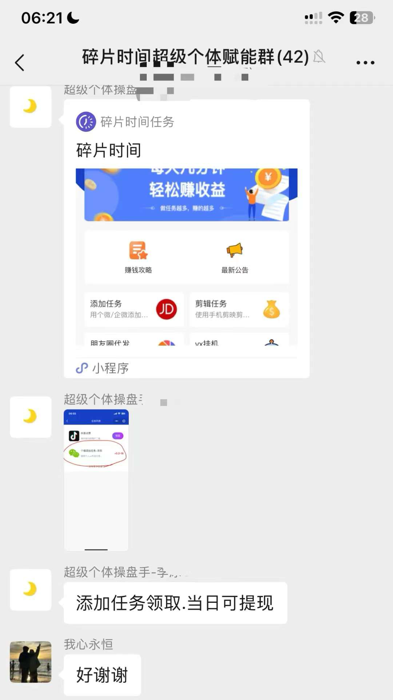

我给大家举几个例子：地摊的私域可以给厦门本地的美食节及附近门店导流，知识付费产品的私域能够给其他不同价格、不同人群定位的知识付费软件私域团队导流以及交易。

通过这种方式，我们打破了私域之间的界限，为大家创造了更多的商业机会，让大家可以共享流量带来的红利。

我一直秉持着帮助成员降本增效的运营理念。

我们借助先进的技术手段，比如AI和场景化获客技术，来精准定位目标客户，提高获客效率。

我们采用了灵活用工的方式，主要利用学生、残疾人以及宝妈这些群体的碎片时间和资源。

将企业大量重复性的工作进行细分，设计成15分钟到半个小时就能直接完成并拿到结果的任务形式。

这大大降低了管理及用工成本。

通过AI私域的自动化功能，原本需要百人团队才能完成的工作，现在只需要十个人就能达到同样的利润水平。

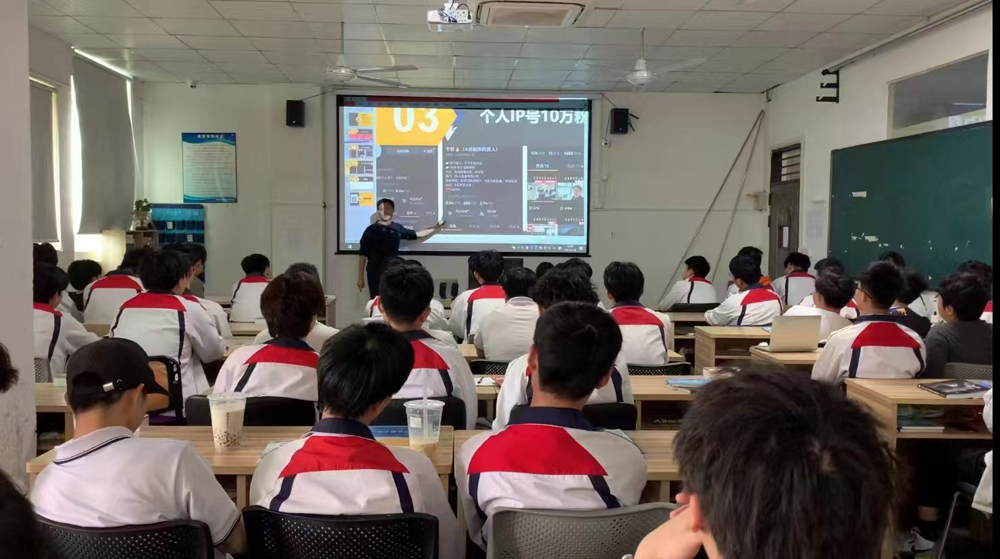

这不仅大大降低了人力成本，还提高了企业的运转效率。

对于有潜力的好项目，我们私董会也会积极参与投资。

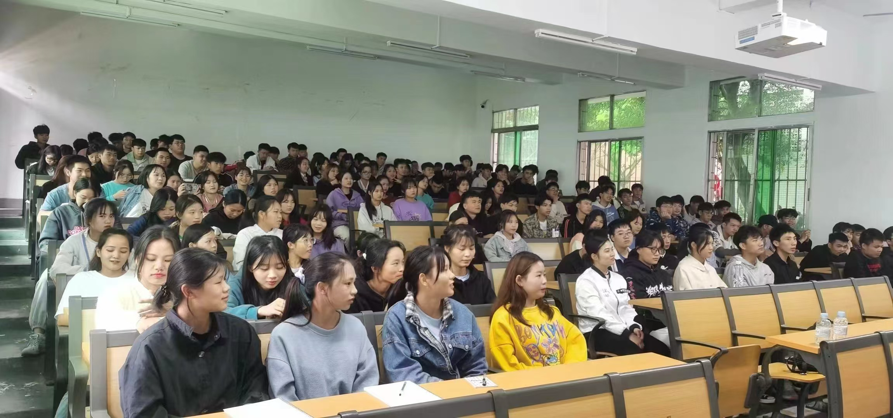

创始人深知企业发展过程中资金和资源的重要性，所以我们会凭借私董会的资源和经验，助力项目更好地发展，与大家共同成长，实现多方共赢。

加入卡若私董会，最明显的好处之一就是人脉的拓展。

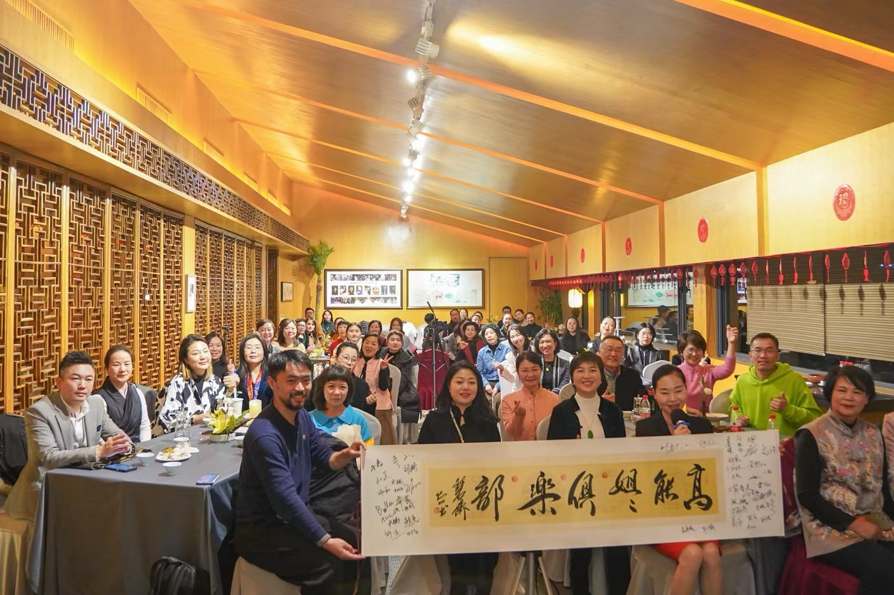

你在这里，可以结识很多与自己企业体量相当、发展方向相似的同行。

你可以互相交流经验、分享资源，这种人脉关系为你的企业带来了很多潜在的商业合作机会。

而且，不同行业的成员之间的交流也让你受益匪浅，他们的经验和视角为你打开了新的思路，让你能够更好地应对市场的变化。

因为大家的企业规模和发展阶段都比较接近，所以我们之间的交流非常顺畅和深入。

大家可以在交流中互相学习、互相支持，共同探讨企业面临的问题和解决方案。

这种同频共振的交流环境，更加坚定了自己的商业决策，也让我能够从其他成员的成功经验中汲取智慧，更好地发展自己的企业。

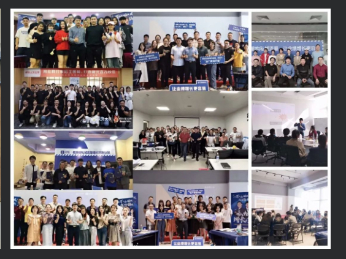

在我们私董会里，项目之间可以相互赋能。

A项目可以给B项目导流，同时大家还可以一起对项目进行估值，根据用户的实际利润产出进行投资决策。

这种合作模式不仅可以让项目获得更多的资源和支持，还可以提高项目的成功率和盈利能力。

成员之间还可以共享各种资源，比如客户资源、技术资源、项目产品资源等。

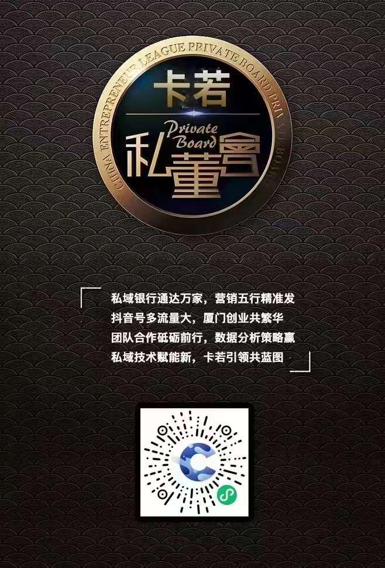

通过资源共享，我们可以充分发挥各自的优势，实现资源的优化配置，提高企业的综合竞争力。

我们致力于打造一个高品质的交流平台，以私域为核心主题，让大家的交流更加聚焦和有针对性。

在这个平台上，大家可以直接面对面地交流合作，迅速建立起良好的合作关系。

这种高效、高品质的交流环境，可以为你的企业发展提供有力的支持。

为了保证私董会的质量和交流效果，我们设置了一个5万块的门槛。

这个门槛不仅可以筛选出那些有诚意、有实力的企业主，还能确保成员之间在体量和发展阶段上具有一定的相似性。

大家在一个相对平等的基础上交流合作，更容易产生共鸣和协同效应。

目前我们私董会有35名核心成员，平均年营收1500万，其中年营收超过3000万的有8位。

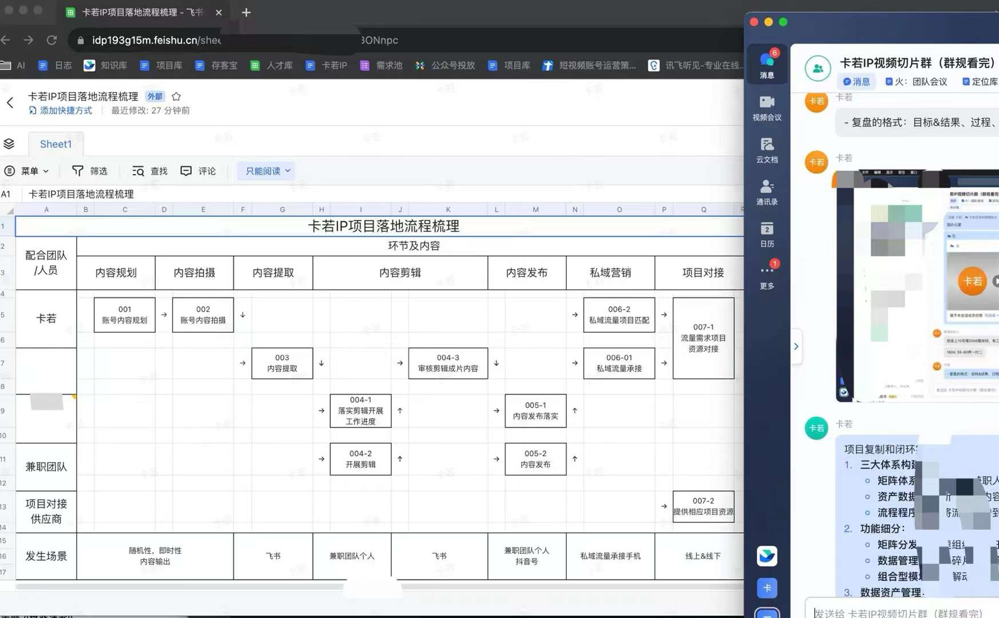

成员续费率达到90%，这说明大家对私董会的价值是认可的。

更重要的是，我们的成员在加入私董会后，平均营收增长率达到了45%。

有15位成员在一年内实现了营收翻倍，这些数据都是实实在在的成果。

我们每个月会有一场私董会议，每次会议成员企业主都可以提出一个需要解决的经营难题作为核心主题。

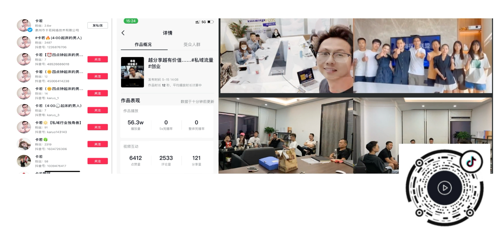

比如企业战略规划、私域流量运营、市场营销策略、创始人影响力放大、招商融资等。

在会议上，大家会围绕主题展开深入的讨论，分享自己的经验和见解。

这种有针对性的讨论方式，能够让你在短时间内获取大量有价值的信息和思路。

私董会的成员直接帮你解决碰到的困境，对企业的发展具有很强的意义。

私董会为成员提供了丰富的项目合作机会和资源对接平台。

大家可以根据自己的企业优势和资源需求，在私董会中寻找合适的合作伙伴，共同开展项目。

同时，我们也会积极促进成员之间的资源共享，包括客户资源、技术资源、人才资源等，让大家能够充分利用彼此的优势，实现互利共赢。

为了提升成员的专业素养和管理能力，我们还会不定期地举办各种培训和学习活动。

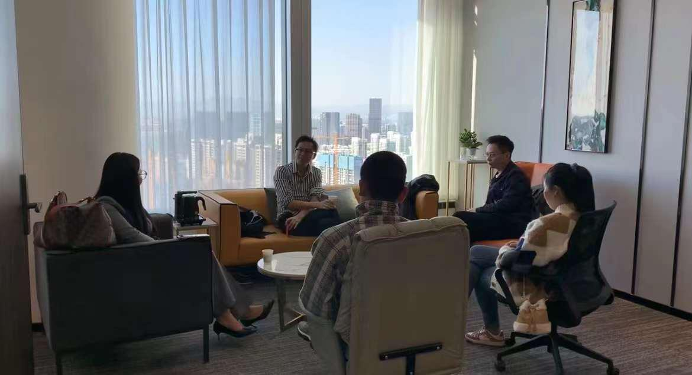

这些活动涵盖了企业经营管理的各个方面，如领导力培训、影响力放大培训、私域运营操盘、市场营销技巧、财务管理知识等。

通过这些活动，大家可以不断学习和掌握新的知识和技能，提升自己和企业的竞争力。

通过这些活动，成员们不断刷新认知，提升经营能力，而我也在每一次会议中汲取着来自不同行业的洞察。

"诈骗集团"这个标签，我理解它从哪里来。

市面上确实有太多打着"私董会"旗号的割韭菜场所：交了钱只换来几张合影，拿着名单去推销课程，没有实质性的商业价值，更没有成员的真实成长。

我不想做那样的组织。

所以我把验收标准定得很简单：一年后，成员的营收是否真的增长了？续费率能不能说明问题？

数据是最诚实的答案。成员续费率90%，平均营收增长45%——这不是我的承诺，而是用真实数据来回答那些质疑。

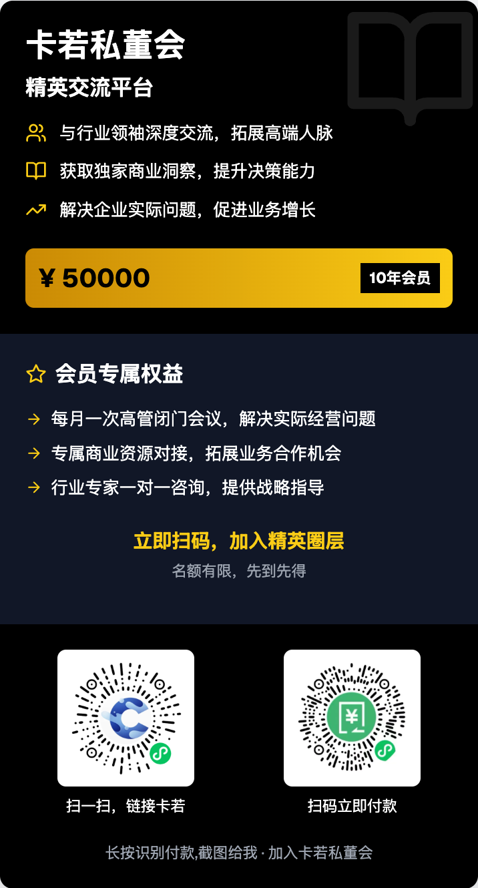

私董会是否有价值，不是我来定义的，而是那些在这里解决了问题、找到了方向的企业主说了算。

这个道理，和私域运营的本质其实是一样的：不是你说自己有多好，而是用户愿不愿意留下来，愿不愿意带着朋友一起来。

信任，从来不是靠说出来的，而是靠做出来的。

## 4.10｜超级个体到超级企业：AI时代的融合创新

2024年春节刚过，我在朋友圈发了一条动态："路上花25分钟做了存客宝产品官网，chatgpt自动生成文案图片，做seo，结合卡若私域将每一次点击转化为私域流量。精准客户路过留痕，工作效率大大提升。"

这条朋友圈背后，是我对AI技术商业化应用的深度思考。

2023年底ChatGPT爆火，2024年初Claude、文心一言等AI工具相继涌现，整个内容创作和商业运营的格局被彻底颠覆。

作为一个从游戏代练起家、深耕私域运营11年的技术创业者，我敏锐地感受到这不仅仅是工具的升级，更是商业模式的革命。

开始思考一个核心问题：如何将AI技术深度融入私域运营体系，实现从超级个体到超级企业的跨越？

2024年2月，开始系统性地将AI工具融入存客宝的产品迭代中。

最初的尝试确实让我震撼。原本需要我们内容团队3个人花一整天才能完成的10条抖音文案，现在用ChatGPT配合我们的行业数据库，30分钟就能生成，而且质量还更高。

但真正让我看到AI商业价值的，是3月份的一次客户服务实验。我们将AI客服接入存客宝系统，结果客户咨询的响应时间从平均2小时缩短到5分钟，客户满意度提升了40%。

更关键的是，AI让我重新定义了"超级个体"的概念。

以前，我们说一个运营专员一天最多能精细化管理300个私域客户。现在通过AI标签化和自动化营销，一个人可以同时管理3000个客户，效率提升了10倍。

以前，我们的内容创作完全依赖人工，10个人的团队每天产出有限。现在，3个懂AI工具的内容运营，配合我们训练好的模型，每天能产出比以前多5倍的个性化内容。

这种效率的跃升，让我看到了从超级个体到超级企业的可能性。

4月份，我们正式启动了存客宝的AI化升级。这次升级不是简单的功能叠加，而是对整个私域运营逻辑的重构。

第一个突破是智能客服系统。我们基于11年私域运营积累的100万+对话数据，训练了专属的AI客服模型。这个模型不仅能识别客户意图，还能根据客户的历史行为和标签，提供个性化的回复策略。

实际效果超出预期：AI客服能自动处理80%的常见咨询，剩下20%的复杂问题会智能分流给对应的人工专家。客户满意度从75%提升到92%，人工客服的工作量减少了60%。

第二个核心功能是AI内容引擎。这个系统会实时分析用户在微信、抖音等平台的行为轨迹，自动生成个性化的内容推送策略。

比如，系统检测到某个用户连续3天浏览美容护肤相关内容，AI会自动推送我们合作的美容院的优惠信息和护肤知识；如果用户是创业者标签，系统会推送私域运营的干货文章和成功案例。

第三个突破是预测性数据分析。AI会分析用户的全生命周期数据，预测用户的购买意向、流失风险和价值潜力。

这个功能让我们的营销精准度提升了300%。以前我们只能凭经验判断哪些客户可能付费，现在AI能给出具体的概率分数和最佳触达时机。

到6月份，AI升级的效果开始全面显现。数据不会撒谎：

客户服务响应时间从2小时缩短到5分钟，客户投诉率下降了70%；
内容创作效率提升了500%，原本需要10人团队的工作，现在3个人就能完成；
营销转化率从12%提升到18.5%，ROI提升了54%；
最关键的是，我们的人效比达到了行业平均水平的3倍。

更让我兴奋的是，团队每个人都在AI的赋能下成为了"超级个体"。

我们的运营专员小李，以前一天最多能跟进50个意向客户，现在通过AI辅助，她能同时管理500个客户的全生命周期，而且服务质量还更高。

我们的内容策划小王，以前写一篇爆款文案需要半天时间，现在30分钟就能产出3篇不同风格的文案，让我们在抖音矩阵上的内容更新频率提升了10倍。

这让我重新定义了"超级企业"的概念：不是用更多的人创造更大的价值，而是用AI技术让每个人都成为"超级个体"，从而让整个企业具备"超级能力"。

7月份，我们正式推出了"AI私域运营解决方案"，开始向市场输出我们的AI+私域模式。

第一个标杆客户是厦门的一家连锁美容院。他们有3家门店，会员总数8000人，但复购率只有25%，远低于行业平均水平。

我们为他们部署了AI客服系统和个性化营销引擎。3个月后，数据让所有人震惊：会员复购率提升到45%，单店月营收增长了80%，客户满意度从70分提升到92分。

第二个案例是一家在线教育机构。他们的痛点是获客成本高、学员流失率大。通过我们的AI内容推荐系统，他们的课程完课率从60%提升到85%，学员续费率从30%提升到52%，获客成本降低了40%。

第三个突破性案例是一家传统制造企业的数字化转型。他们通过我们的AI系统建立了完整的客户画像体系，将原本粗放的B2B销售模式精细化运营，订单转化率从8%提升到23%，客单价提升了60%。

我记得那家教育公司的老板激动地对我说："卡若，你这套AI系统简直是神器。我们原来需要20个客服，现在只需要5个就够了，而且服务质量还比以前更好。"

还有一家电商公司的运营总监告诉我："以前我们的内容团队有10个人，每天产出的内容还是有限。现在用了你们的AI工具，3个人就能产出比以前多5倍的内容，ROI提升了300%。"

到年底，我们已经服务了超过1000家企业，涵盖美业、教育、电商、餐饮等15个行业。平均帮助客户提升营收35%，降低运营成本25%。

这些数据让我清醒地认识到：我们已经完成了从私域运营公司到AI技术公司的转型。我们的价值不再是提供人工服务，而是通过AI技术重构整个私域运营的底层逻辑。

在这个过程中，我也总结出了企业引入AI的一个规律：大多数团队失败，不是因为不会用AI，而是用AI做错了层级。

我把AI升级分成三个阶段，每个阶段的目标完全不同。第一阶段是提效——先用AI解决重复劳动，客服初筛、文案初稿、标签整理，这些机械性的工作应该先交给AI，让人专注于判断和关系。第二阶段是提质——让AI参与策略，内容推荐、用户分层、最佳触达时机，这一层要求企业已经积累了一定的用户数据，才能发挥作用。第三阶段是提模式——把AI变成业务底座，重构组织分工和盈利逻辑，这需要管理者对商业模式有深度的理解，而不只是会操作工具。

很多客户刚接触AI就想直接跳到第三阶段，结果反而乱了阵脚。路线对了，投入才有复利；路线错了，越用越焦虑。

但快速发展的同时，我也清醒地看到了挑战：

技术迭代的压力巨大。AI技术每3个月就有重大更新，我们必须保持敏锐的技术嗅觉。为此，我专门成立了AI研发小组，每月投入营收的15%用于技术升级。

数据安全成为生死线。客户把最核心的用户数据交给我们，这是巨大的信任，也是巨大的责任。我们建立了三重加密体系，通过了ISO27001认证，确保客户数据的绝对安全。

人才稀缺是最大瓶颈。既懂AI技术又懂私域运营的复合型人才极其稀少。我们只能自己培养：从传统互联网公司挖技术骨干，从私域运营公司挖业务专家，然后让他们互相学习，形成T型人才。

最大的挑战其实是认知升级。很多企业主还停留在"雇更多人=做更大事"的思维里，不理解"AI赋能=指数级增长"的逻辑。我们花了大量时间做市场教育。

针对这些挑战，我们制定了系统性的解决方案：

技术层面，我们与清华、北大的AI实验室建立了合作关系，确保始终站在技术前沿。同时建立了模块化的产品架构，让技术升级不影响客户的正常使用。

安全层面，我们采用了银行级的安全标准，所有数据都在客户本地部署，我们只提供算法服务，绝不触碰客户的原始数据。

人才层面，我们启动了"AI+私域"人才培养计划，与5所高校合作开设专业课程，同时内部建立了导师制，让每个新人都有技术和业务双导师。

市场教育层面，我们每月举办"AI私域沙龙"，邀请成功案例的企业主分享经验，用真实的数据和故事说服更多企业主。

到2024年底，我们的AI+私域解决方案已经服务了超过1000家企业，涵盖了教育、电商、金融、制造业等15个行业。我们也完成了从私域运营公司到AI技术公司的华丽转身。

更重要的是，我们在AI时代找到了自己的定位：不是简单的技术提供商，而是企业数字化转型的深度合作伙伴。

展望2025年，我有三个明确的目标：

第一，技术突破。我们要在多模态AI应用上实现突破，让AI不仅能处理文字，还能理解图片、视频、语音，真正实现全场景的私域运营自动化。

第二，生态建设。我们要构建一个开放的AI+私域生态，让更多的开发者、服务商加入进来，共同为企业提供更完整的解决方案。

第三，国际化布局。AI技术无国界，私域运营的需求也是全球性的。我们要将成功经验复制到东南亚、欧美市场。

回顾这一年的发展，我深深感受到了技术变革的力量。AI不仅仅是一个工具，更是一种全新的商业范式。它让我们重新思考效率的边界，重新定义价值的创造方式。

在AI时代，那些能够拥抱变化、善用技术的企业，将获得指数级的竞争优势。而那些固守传统、拒绝变化的企业，将被时代无情抛弃。

我很庆幸，我们选择了前者。从私域流量到AI技术，从超级个体到超级企业，这是一个不断进化、不断突破的过程。

未来，我们将继续在这条路上探索前行，用技术的力量重新定义商业的可能性，用创新的思维推动整个行业的进步。

这就是我的AI时代宣言：拥抱变化，技术为王，价值至上。

## 小结：如果我是股东，我会这样看玩值电竞

这段我用最日常的聊天方式写，不绕术语，直接说股东最关心的三件事：能不能赚钱、能不能复制、能不能放大估值。

我问：你这个项目到底在卖什么？  
大金说：表面是网吧，底层卖的是"工位产值"。一台机位不再只是按小时收费，而是能接任务、跑产值、沉淀数据资产。

我再问：那为什么这件事对股东有吸引力？  
大金说：因为它把传统网吧的单一收入，改成了"网费+任务派单+IP孵化+算力协同"的复合现金流。  
股东看项目，不怕慢，就怕只有一条腿走路；现在这套模型，至少是四条腿在跑。

我继续问：增长怎么来，不会只是讲故事吧？  
大金说：增长链路已经很清楚了，先用电竞IP聚人，再把任务派发到网吧，再把执行结果变成可复用的运营资产。  
简单讲，就是"IP拉新，网吧承接，平台派单，数据复利"。这个链路一旦跑通，扩店不是成本，而是产能扩张。

从股东角度，我会特别看三组数：

第一组，是单店现金流有没有改善。  
如果门店从"只赚上机费"变成"上机费+任务分成"，那每个工位的产值天花板就被抬高了。

第二组，是复制效率。  
能不能把A店的打法，7天内迁移到B店、C店。能迁移，才说明这不是个人能力，而是系统能力。

第三组，是估值逻辑。  
当门店网络、任务网络、IP网络三层叠加时，估值不再只看设备折旧，而会看平台调度能力和持续派单能力。  
这也是为什么这个项目更像"线下入口+平台中台"的组合，而不只是传统门店生意。

这里也把商业计划书域名直接放上，打开就能看：  
- 玩值电竞网吧商业计划书（玩值域名）：[https://wzwb_bp.quwanzhi.com/](https://wzwb_bp.quwanzhi.com/)

配两张图，方便快速理解业务场景：

最后用20%的篇幅说 Web5.0 网吧这件事：

Web5.0 对玩值电竞来说，不是新名词，而是一个经营升级动作：把网吧从消费场景升级为可调度的任务节点。  
过去用户来网吧是花钱，现在的目标是让一部分用户在这里也能创造收入；过去设备是成本项，现在设备也是产值项。  
股东真正需要看到的，不是概念有多新，而是这套 Web5.0 机制能否稳定提升单店收益、缩短回本周期、并且在多城市复制。

所以这篇小结的核心结论只有一句：  
如果你是股东，玩值电竞值不值得投，关键不在它是不是"网吧"，而在它有没有把每个工位做成可复利的资产节点。

# PART 5：超级个体——把个人经验变成组织能力（2024年至今）

## 5.1｜超级个体：1人公司

2024年7月，我在飞书上写下了这一年的核心目标：帮助1万个超级个体资产放大3倍。

这不是一个口号，而是我用11年私域经验验证出来的路径。

那时候我刚从杭州30天挑战回来，团队背叛的阴影还没完全消散，但我已经看清了一件事——传统的雇佣关系正在瓦解，未来属于超级个体。

什么是超级个体？

我给它下了一个定义：一个人，借助AI和系统工具，能做到过去10人团队的产出，实现年入百万的"1人公司"。

这个定义不是空想，而是我亲眼见证的真实案例。

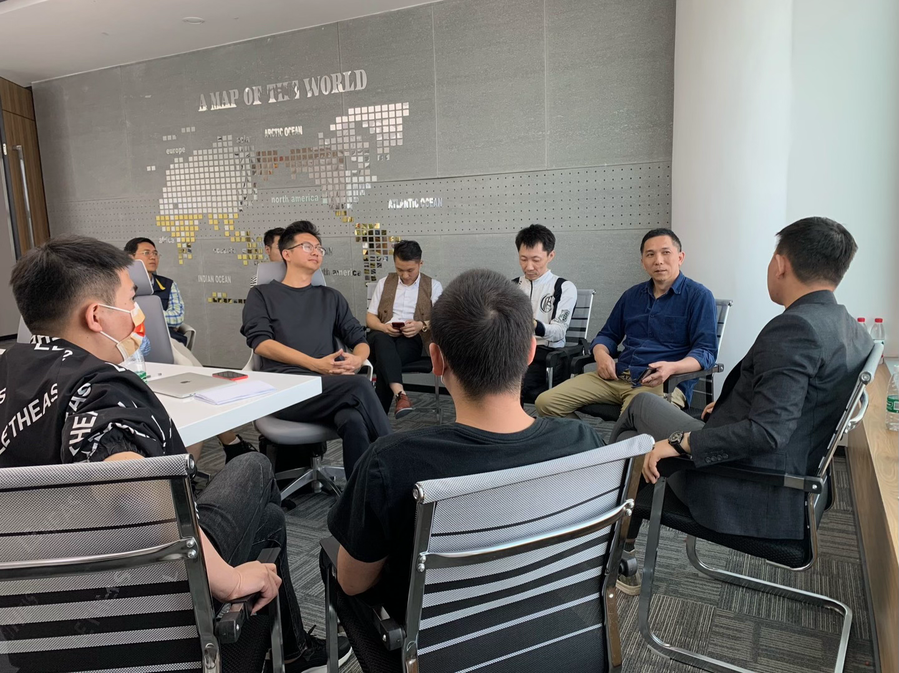

2024年9月，我和一个叫龙楷的年轻人聊了一个下午。

他之前在黑谷做销售，后来跑到厦门想创业。

他跟我说："卡若，我想做一个能赚钱的项目，但我没资金，没团队，只有我一个人。"

我问他："你有什么？"

他说："我有执行力，我愿意学，我对商业有一定的认知。"

我说："够了。这就是超级个体的起点。"

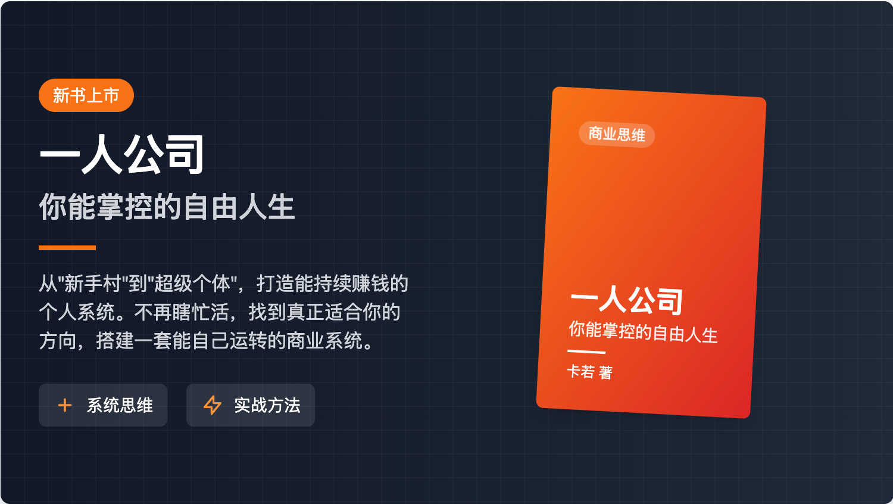

我给他讲了我的碎片时间项目。

这个项目的核心逻辑很简单：让宝妈、残疾人、学生等群体，利用碎片时间做简单任务，比如挂机微信、发朋友圈、剪辑视频、点赞抖音。

每个任务设计成15分钟到半小时就能完成，做完直接结算。

2024年上半年，我们已经有5000个微信号在挂机运转。

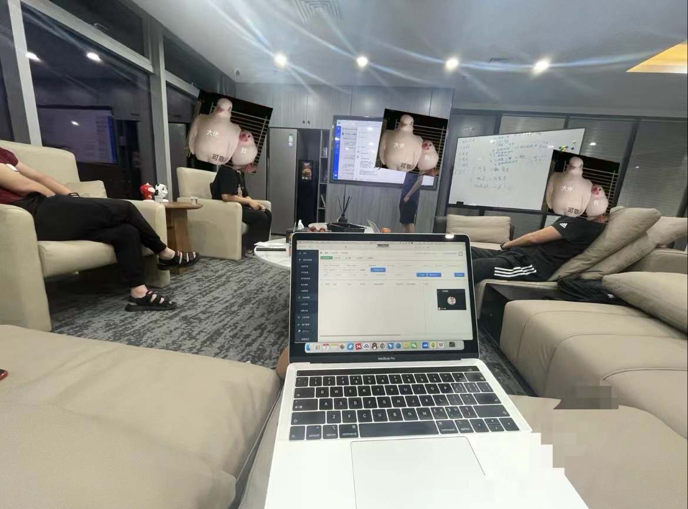

龙楷听完眼睛亮了："这不就是众包模式吗？"

我说："不只是众包。众包是你给别人打工，超级个体是你自己当老板。"

"你来找宝妈挂机，每个月给她们1000-2000的补贴。"

"这些微信号用来做什么？用来承接我们的知识付费产品、游戏课程、私域咨询。"

"你从中抽30%作为运营费用，宝妈赚了，你也赚了，我也赚了。"

"这就是云阿米巴——分不属于对方的钱，按创造价值分钱。"

龙楷当场决定加入。

三个月后，他一个人管理着80个兼职宝妈，月流水稳定在8万以上，自己到手2万多。

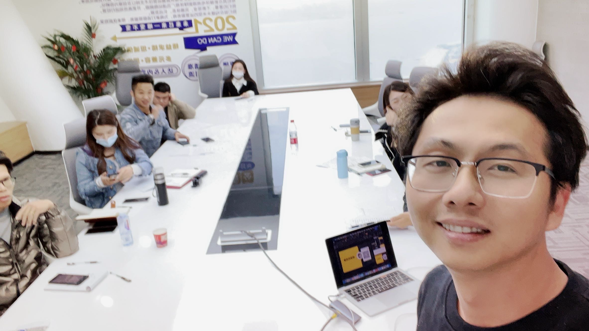

他就是一个典型的超级个体。

但龙楷的成功不是偶然，背后有一套系统在支撑。

2024年9月的一次技术会议上，我跟团队定下了存客宝的核心方向：模块化赋能超级个体。

什么意思？

就是把我们积累的私域工具、AI功能、运营SOP，全部打包成可复用的"工具箱"。

比如AI改写朋友圈——我们的系统能自动采集行业顶级销售的朋友圈内容，用AI改写成你自己的风格，每天自动发5条。

过去需要一个专职文案，现在系统3秒搞定。

比如自动养号——每个微信号会随机分配AI人设，自动跟好友互动、点赞朋友圈、发起聊天。

过去需要50个人管理100个微信，现在5个人就能管理200个。

比如客资回收——用户通过付款码支付后，手机号自动进入私域池，系统自动打标签、分配跟进人员。

过去需要手工录入，现在全自动。

这些工具，就是超级个体的"外挂"。

有了这套系统，一个人真的可以做到过去10人团队的产出。

2024年9月，我见了一个叫流光的创业者。

他是做性格色彩培训的，之前一个人单打独斗，一年勉强赚个三四十万。

我跟他说："你现在最大的问题是什么？"

他说："流量。我讲课没问题，但找不到客户。"

我说："这就对了。超级个体的第一课，就是解决流量问题。"

我给他设计了一套方案：

第一步，用我们的矩阵系统，每个月拍10-20条短视频，通过30个账号同时分发。

每条视频曝光量3万到10万，按最低算，一个月也有近100万曝光。

第二步，视频挂链接，用户点击后直接加微信。

每100个曝光能加1个精准用户，一个月能加1000人。

第三步，这1000人进入私域后，通过AI自动养号、朋友圈运营、社群管理，逐步建立信任。

第四步，每个月做一场99元的沙龙，30人参加就是3000收入，现场转化3-5个高价咨询客户，每个客户2万。

流光算了一笔账：一场沙龙收入3000，加3个咨询客户6万，一个月做4场沙龙，收入就是25万以上。

他一个人，加上我们的系统，就能实现这个产出。

这就是超级个体的威力。

但我要说一个残酷的事实：不是所有人都能成为超级个体。

2024年下半年，我见了很多想创业的人。

有的人一听"一个人就能年入百万"，眼睛放光，问我要秘籍、要捷径。

我都拒绝了。

因为超级个体不是躺着赚钱，而是把10倍的效率用在正确的方向上。

它需要三个条件：

第一，你得有一技之长。

流光能做咨询是因为他性格色彩讲了十几年，龙楷能管理团队是因为他执行力超强。

没有专业能力，再好的工具也只是摆设。

第二，你得愿意持续输出。

超级个体的核心资产是个人IP，而IP需要持续的内容喂养。

我见过太多人一开始热情高涨，一个月后就断更了。

抖音的算法不会因为你累了就给你流量。

第三，你得接受延迟满足。

前三个月可能一分钱都赚不到，半年后才能稳定出单，一年后才能形成复利。

很多人熬不过第三个月。

所以我常说：超级个体不是让你轻松，而是让你高效。

轻松是偷懒者的幻想，高效是奋斗者的武器。

2024年年底，我做了一个年度总结。

这一年，我们孵化了超过200个超级个体。

有做游戏知识付费的，月入5万。

有做婚恋咨询的，一场沙龙收入2万。

有做私域代运营的，服务10家企业，年入100万。

有做碎片时间管理的，管理100个兼职，月流水20万。

他们都有一个共同点：一个人，借助系统，实现了过去团队的产出。

这更加坚信，超级个体不是未来，而是现在。

AI让答案变得廉价，好问题才能让你脱颖而出。

同样，AI让效率变得廉价，独特的价值才能让你脱颖而出。

未来的商业世界，不再是大公司吃小公司的游戏。

而是一群超级个体，各自精通一个领域，通过平台连接，形成一个去中心化的生态。

这就是我对"1人公司"的理解。

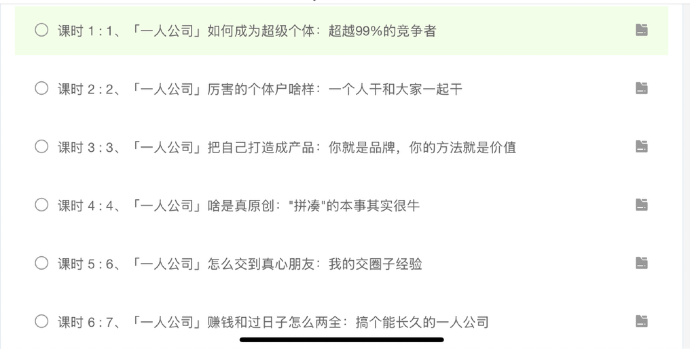

不是孤军奋战，而是站在巨人的肩膀上，用10倍效率创造10倍价值。

那么，当这些超级个体聚合在一起，又会形成怎样的组织形态？

这就是我下一章要讲的——超级企业。

## 5.2｜超级企业：构建生态化的组织

2024年9月28日，我和一个叫陈垚的电竞酒店老板聊了三个小时。

他的PK电竞酒店从4月份的3家，半年内扩张到了40家。

但他遇到了一个问题：钱不够了。

"卡若，我想走资本路线，但投资人觉得我的模式没有壁垒。"陈垚说。

我问他："你觉得壁垒是什么？"

他想了想："可能是品牌？或者是门店数量？"

我摇了摇头："壁垒不是你有什么，而是别人做不到什么。"

"你有40家门店，别人砸钱也能开40家。"

"但如果你有43万游戏用户、100个签约主播、一套AI私域运营系统，别人砸钱也复制不了。"

"这才叫壁垒。"

陈垚愣住了："但我没有这些啊。"

我笑了："我有。所以我们可以合作。"

这就是超级企业的核心逻辑——把一群超级个体聚合起来，形成一个别人无法复制的生态。

我跟陈垚讲了我的商业模式。

我的公司叫玩值，做了11年私域运营，沉淀了三个核心资产：

第一，43万游戏用户，分布在各个项目里，都是精准的、带IP属性的粉丝。

第二，100多个签约主播，从全国冠军到垂直领域KOL，每个人都是流量入口。

第三，一套AI私域运营系统，能解决微信矩阵、自动养号、内容生产、数据分析等所有问题。

这三个资产，单独拿出来都值钱，但组合在一起才是壁垒。

我跟陈垚说："我们不是简单的合作，而是成立一家运营公司。"

"你出场地和运营团队，我出流量和系统。"

"酒店的会员数据进我的私域池，我帮你做二次变现——卖游戏课程、电商产品、周边商品。"

"利润三七分，你七我三。"

陈垚问："为什么你只拿三成？"

我说："因为我要的不是一家店的利润，而是整个生态的价值。"

"你的40家店，每家店有3000个会员，就是12万用户。"

"这12万用户进入我的私域系统，加上我原有的43万用户，就是55万。"

"用户规模越大，估值越高，未来的资本故事才讲得通。"

陈垚听懂了。

他说："所以你是在用资本的逻辑做生意？"

我说："对。这就是超级企业和传统企业的区别。"

"传统企业追求的是利润最大化，每一笔钱都要赚到手。"

"超级企业追求的是生态最大化，短期可以不赚钱，甚至贴钱，但要把用户和数据留在生态里。"

"等生态成熟了，随便切一个点就能变现。"

这个思路不是我拍脑袋想出来的，而是从地摊项目里验证出来的。

2024年，我在厦门做了一个地摊项目。

政府提供场地，我投资餐车，招商让摊贩入驻，收取租金和管理费。

这个项目很简单，10个月就能回本，现金流稳定。

但我没有止步于此。

我在每个地摊上都装了付款码，用户扫码支付后，手机号自动进入我的私域池。

厦门有2000多个摊点，每天几万人扫码支付。

一个月下来，私域池里就多了十几万用户。

这些用户，我可以卖给周边的美容店、餐厅、健身房。

SDM新开了一家美容店，我给他们导流，每个用户收15块。

一个月导1000个用户，就是1.5万。

这还只是导流。

我还搭建了一个类似美团的小程序，地摊上的商品可以在线下单。

每笔订单我抽20%。

地摊老板赚了钱，周边商家有了流量，用户享受了便利，我也有了收入。

四方共赢，这就是生态。

2024年9月，我总结了超级企业的三个核心原则：

第一，不做从0到1的项目，只做从1到100的放大。

从0到1太难了，失败率太高。

我只找那些已经跑通了商业模式、有一定用户基础的项目，然后用我的流量和系统帮他们放大10倍。

比如PK电竞酒店，陈垚已经开了40家店，证明模式可行。

我进去，帮他把40家变成400家，把12万用户变成120万用户。

第二，成立运营公司，而不是做顾问或投资人。

顾问只出主意不担责任，投资人只出钱不干活。

但成立运营公司就不一样了——我出系统、出方法、出资源，对方出团队、出场地、出客户。

双方都有投入，都有风险，也都有收益。

这样的合作才稳固，才能长期。

2024年，我用这个模式合作了十几个项目：

与小鹅通销冠团队成立运营公司，卖知识付费软件，他们50人管100个微信，我帮他们用5人管200个微信。

与残疾人机构合作，让残疾人做视频剪辑和上传，按客资数量结算，每人每月一两千。

与婚恋行业合作，帮他们打造婚恋师IP，培训收费2980，婚恋局收费99起步。

每个项目，我都是运营公司的股东，而不是顾问或投资人。

第三，用现金分润，而不是股权绑定。

这是我从团队背叛那次学到的教训。

2023年，我给核心团队分了股份，结果他们拿着股份走了，还去做了竞品。

从那以后，我就想通了一个道理：千万不要想着和别人分股份，股份永远没有现金性感。

现金是最直接、最透明的激励方式。

每个月能拿到多少钱，一目了然，不会有任何争议。

而且现金分润更加灵活，可以根据贡献大小随时调整，不像股份一旦分出去就很难收回。

所以我设计了"云阿米巴"模式：

第一条：分不属于对方的钱。

只分我们共同创造的增量价值，不分我原有的存量收入。

第二条：按创造价值分钱。

根据每个人的实际贡献来分配收益，多劳多得，能者多得。

第三条：用稳定流量+便捷私域体系绑定合作方。

通过提供持续的流量支持和完善的工具体系，让合作方离不开我们的平台。

这个模式的好处是：合作方能够立即看到收益，我也能够保持对核心资源的控制，双方都有持续合作的动力。

2024年10月，我把公司的发展方向定义为"超级企业留存及估值体系"。

什么意思？

就是把所有合作项目的用户数据，都沉淀到统一的私域系统里。

每个用户都有标签、有行为记录、有消费能力评估。

这些数据，就是公司的核心资产。

当数据积累到一定规模，就可以用资本的方式进行估值和变现。

比如，一个能产生10万用户的项目，如果每个用户能带来10元收益，整个项目就值100万。

我用这个逻辑去跟投资人讲故事，比单纯讲"我有多少收入"更有吸引力。

2024年12月，我定下了一个更大的目标：1万台手机KPI。

什么意思？

就是用1万台手机，每台手机运行一个微信号，每个微信号承载500个用户。

1万台手机，就是5000万私域用户。

5000万用户，哪怕每个用户只产生1块钱价值，就是5000万的估值。

这个目标听起来疯狂，但我已经迈出了第一步。

2024年，我们已经有5000个微信号在稳定运转。

2025年，我要把这个数字翻一倍。

然后一步一步，走向1万，走向10万，走向更大的生态。

回顾我的整个创业历程，从1998年第一次接触互联网，到2024年构建超级企业生态。

26年了。

我从一个沉迷网吧的少年，变成了一个管理数千万私域用户的企业主。

这一路，有成功，有失败，有背叛，有坚持。

但有一件事从未改变：对效率和杠杆的极致追求。

超级企业不是终点，而是新的起点。

未来的商业世界，不再是层级森严的金字塔。

而是一群超级个体，通过共同的平台和生态，实现价值的无限放大。

这个生态，将不断生长、自我修复、持续进化。

它不会被单一的领导者所定义，而是由每一个参与其中的超级个体共同塑造。

我的IP财富旅程，也将在这个生态中，找到最广阔的舞台，实现最深远的价值。

这不仅仅是我的故事，更是未来商业的故事。

## 5.3｜卡若创业派对：从陌生人上麦到内容资产

## 开场：我为什么每天早上六点开一个房间

2025年10月9日，我在Soul上开了第一场创业派对。

一开始，我给自己定的目标很简单：开50场，链接1000个人。

每天早上六点，天还没完全亮，我走进书房，打开Soul，和一群陌生人说话。

有人问我：“卡若，你图什么？”

我说，图真实。

这个时间进来的人，大多不是来客套的。

有人找项目，有人找钱，有人找方向，也有人只是想找一个能说真话的地方。

他们上麦就问：“这个生意到底能不能做？”

我喜欢这种直接。

第119场时，我才把最初的原因说透：早起不是为了开派对，早起是为了不吵老婆睡觉。

我平常四点左右起床，先复盘、写文章、处理工作。

六点以后，老婆还在睡，我就去隔壁书房开派对。

这个很生活化的起点，后来慢慢长成了一套业务。

从第一场到第223场，派对不再只是聊天房。

它变成了我理解真实创业者的一扇窗，也变成了一条内容生产线。

更重要的是，它让我重新理解了个人IP。

**个人IP不是你讲了多少道理，而是你能不能持续接触真实的人、真实的问题和真实的痛点。**

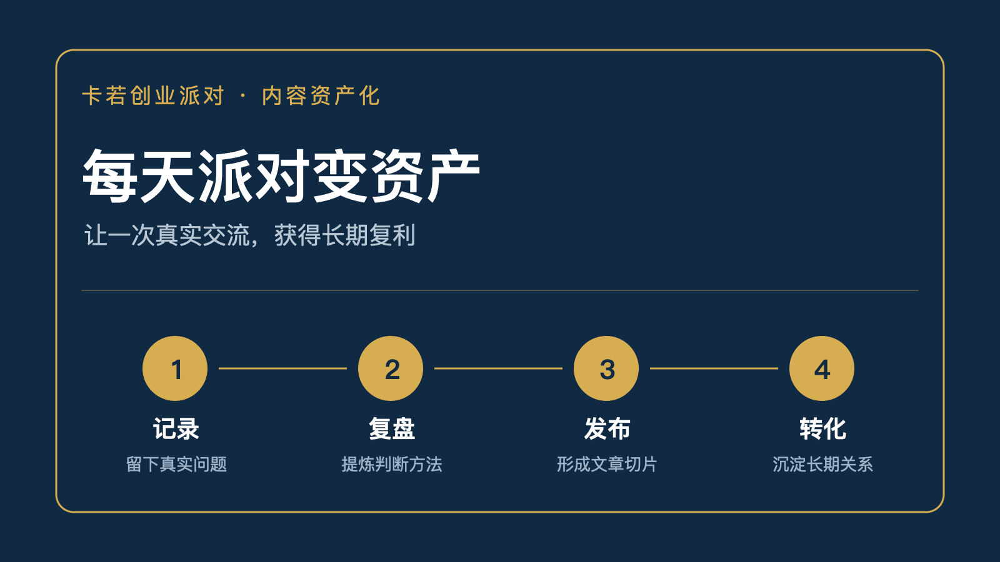

## 故事主体：派对不是直播，是一场长期筛选

第一场来了200多人。

有人问项目，有人问资源，也有人问怎么找到靠谱的合作伙伴。

我原本以为，自己只是找了一个早上说话的地方。

结果我发现，平台上有一大批创业者，脑子里有想法，手里也有资源，但缺少一个真实反馈场。

他们最缺的不是课程。

他们缺的是有人追问一句：“你的客户到底是谁？”

再追问一句：“钱怎么收？谁来交付？亏了谁负责？”

很多项目，第一句话听起来很漂亮。

多问三句，问题就出来了。

我开派对以后，很快形成了一套习惯。

先让对方把事情说清楚。

再拆目标人群、获客方式、交付成本和分润关系。

最后只给一个能马上执行的小动作。

这不是为了证明我比别人聪明。

相反，很多时候我会直接说：“这个行业我没做过，我不知道。”

不知道就不装。

做过的，就把坑讲清楚。

这种边界，反而让派对慢慢有了信任。

第119场，有人问我怎么建立信任。

我给的答案很简单：直接去做，直接执行。

早年做游戏业务时，我加工作室群，天天发、天天聊、天天解决问题。

后来为了拿到更好的渠道，我连续几个月给国外公司发邮件。

英文不行，就用翻译工具。

一次没有回复，就继续发。

信任不是求来的，是你长期把事情做出来以后，别人自然给你的。

派对也是一样。

你能不能坚持开七天、十四天？

你能不能听完以后写三行复盘？

你能不能把一个切片发出去？

这些小动作，比任何自我介绍都更能筛人。

所以我后来经常说，派对的核心只有两个字：筛选。

不是把所有人都留下。

而是让愿意行动的人，一步一步走出来。

## 从聊天到资产：记录、复盘、发布、转化

派对开到一百多场以后，我遇到一个新问题。

每天聊两三个小时，当时很热闹，第二天又要重新开始。

如果一场结束，内容就消失，那它只是消耗。

真正的转折，是我们开始把每一场派对做成资产。

第209场，我把这条链路压成四个动作：记录、复盘、发布、转化。

第一步，记录。

谁问了什么，哪一句让大家停下来，哪一个案例能继续追踪，都不能只靠记忆。

第二步，复盘。

这场为什么有人进来？

为什么有人愿意停留？

为什么有人愿意做下一步动作？

如果只有进房，没有下一步，问题通常不在流量，而在承接。

第三步，发布。

原始聊天记录不能直接当文章。

它要重新组织：开头放问题，中间讲真实对话和方法，结尾给下一步动作。

第四步，转化。

转化不是在结尾硬卖东西。

它是让读者知道，想看完整案例去哪里，想做切片找谁，想对接项目先完成什么登记。

这四步跑通以后，一场派对才不会白开。

**派对不是一次直播，而是每天生产一个可以反复使用的内容产品。**

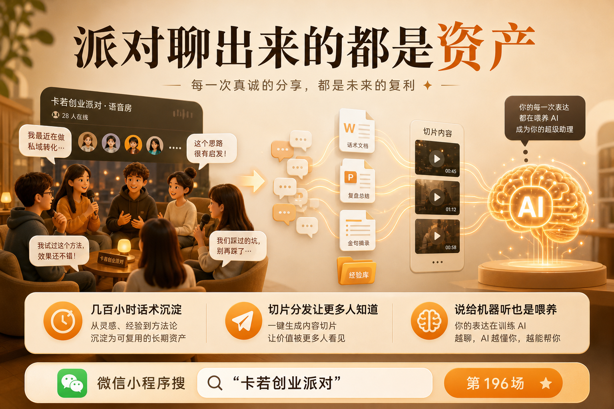

第197场，我又把这件事往前推了一步。

我说，资产必须具备三个条件：可检索、可复用、可以被AI读取。

一个人听完一场，只觉得“很有启发”，第二天全忘了，这不叫资产。

他能留下一个问题、一条判断和一个准备执行的动作，才算沉淀。

对公司也一样。

几百小时的派对记录，里面有人物、困局、项目、话术、判断和决策过程。

整理以后，它不只是一本书的素材。

它还是训练AI理解我、理解业务、理解客户的历史底稿。

所以，我开派对时，脑子里始终有两拨听众。

一拨是房间里的人。

另一拨是以后会读取这些记录的AI。

这也是我理解的Human 3.0：人负责真实经历、判断和关系，AI负责整理、检索和重复执行。

人不该把自己变成机器。

机器也不能替人承担信任。

两边各做擅长的事，内容才会越积越厚。

## 从Soul到飞书和小程序：内容生产线怎么跑

一场派对结束以后，真正的工作才刚开始。

原始录音先进入飞书妙记。

逐字稿被整理成可查的文字。

再从里面提炼主题、人物、冲突和可以执行的方法。

长内容变成文章，关键观点变成图片，适合传播的片段再变成视频切片。

文章进入《一场soul的创业实验》，同时放进“卡若创业派对”小程序。

切片发到Soul瞬间、朋友圈和其他平台。

有人看到切片，想了解完整内容，就会进入小程序。

有人读完文章，想进一步对接，再进入微信群或联系管理。

这条链路看起来很长，实际只做了一件事：**把一次说话，变成很多次被看见。**

它和我过去做抖音矩阵的逻辑一样。

不是赌一条内容爆。

而是把内容生产、分发和承接拆成不同岗位，让每个人只做自己擅长的一小段。

会聊天的人负责开场和追问。

会整理的人负责文章。

会剪辑的人负责切片。

会运营的人负责分发和承接。

AI负责转写、提炼、初步加工和查漏补缺。

飞书负责沉淀过程。

小程序负责承接长期阅读和交易。

这就是创业派对从“一个房间”变成“一个系统”的过程。

## 发多得多：让分发者也能拿到结果

内容生产出来以后，谁来发？

靠一个账号肯定不够。

于是我们设计了“发多得多”。

大白话就是：谁持续分发，谁绑定得多；谁真正带来结果，谁拿收益。

飞书《卡若 Soul 创业实验·项目总览》里，当时把规则写得很具体。

带ID的链接负责记录推荐关系。

绑定期按30天计算。

内容订单的推广收益，按当时规则给分发者90%。

会员订单再按会员和非会员设置不同分润。

这些数字以后可以调整，但底层原则不能变。

**不按嘴上说了多少分钱，只按谁创造了可验证的价值分钱。**

这和我一直坚持的云阿米巴是一套逻辑。

不分不属于对方的钱。

不靠画股份大饼留人。

先把流量、内容、链接和成交数据记清楚，再按结果结算。

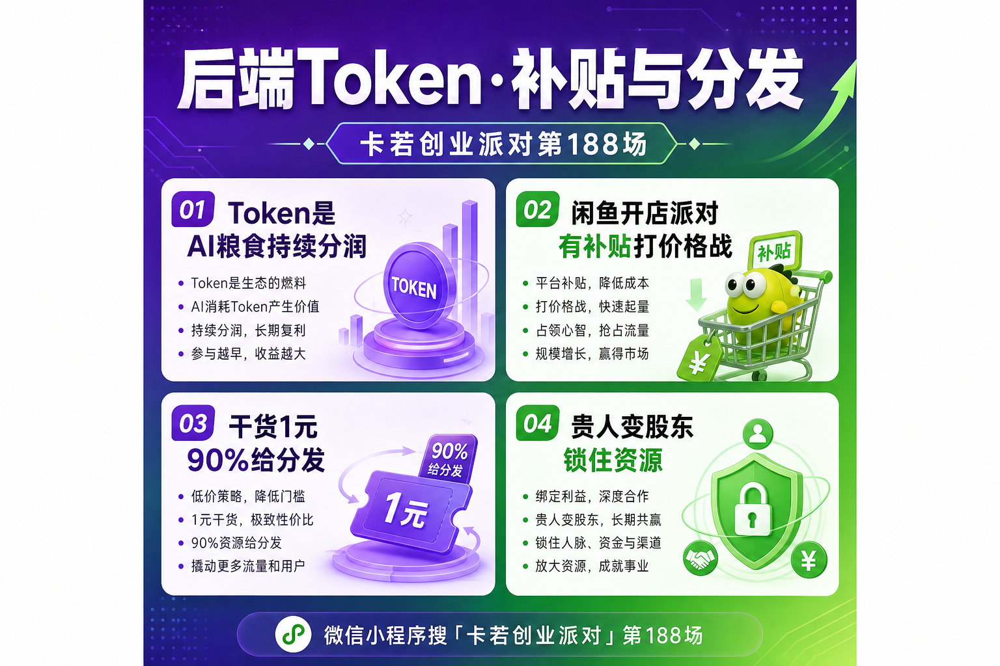

第140场，我把整个派对画成四层漏斗。

第一层，什么人愿意听。

第二层，谁愿意沉淀到私域。

第三层，谁能一起做事。

第四层，最终能帮谁解决具体需求。

很多人只看第一层。

场观很高，就觉得自己成功了。

但我真正关心的是：今天有几个人完成了下一步动作？

有几个人愿意连续发七天？

有几个人愿意把自己的项目资料补齐？

有几个人愿意先做一个小结果，再谈更大的合作？

热闹不能直接变现。

动作清晰、数据可查、关系能延续，才有机会变成生意。

## 方法论：创业派对的五个原则

第一，先真实，再包装。

项目没跑过，就说没跑过。

数据没有来源，就不要编。

一时好听不值钱，长期可信才值钱。

第二，先筛人，再谈项目。

不要求每个人都优秀。

但要看他能不能守规则、能不能行动、能不能把一件小事做完。

第三，先记录，再放大。

没有记录的经验，只属于当时在场的人。

变成文章、图片、切片和知识库以后，经验才会复利。

第四，先跑通，再分钱。

合作前先讲清楚谁负责流量、谁负责交付、谁承担风险、钱从哪里来。

链路没跑通，分润比例写得再漂亮也没用。

第五，先做小闭环，再建大生态。

一个人先完成一次分享、一次发布、一次有效承接。

小闭环能重复，才有资格谈矩阵、会员、分销和超级企业。

这五个原则，说到底还是一句话：先跑稳，再放大。

## 收尾：它是超级企业的前端组织系统

回头看，创业派对最重要的价值，不是让我多了一个直播间。

它把原本散落在各地的人、问题、项目和内容，放进了同一个持续运转的场。

有人在这里找到方向。

有人在这里暴露问题。

有人在这里证明自己的执行力。

也有人把一次分享，变成了一篇文章、一条切片、一段合作关系。

这正好接在“超级个体”和“超级企业”之间。

超级个体需要被看见、被验证、被连接。

超级企业需要稳定发现人才、生产内容、筛选项目和分配结果。

卡若创业派对，就是这两者之间的前端组织系统。

下一章，我会把这套线上连接继续往线下推。

当人、任务、设备和空间都能被系统调度，网吧就不再只是上网的地方。

它会变成超级个体真正可以走进去的孵化器。

## 5.4｜Web5.0的AI网吧：超级个体孵化器

最近半年，我见的每一个人，都在说现在生意不好做。

打工的人焦虑，简历投了很多，却没有回音。

老板也焦虑，房租和人工都在，现金流却越来越紧。

做业务的人更焦虑，广告费越来越高，老客户回应越来越少。

我把这种焦虑，分成两类人来看。

第一类是没钱的人。

他们焦虑的是找不到合适的工作。

有些岗位开 3000 元，却要求单休。

有些岗位还是 3000 元，却想让人干 2 万元的活。

这不是招人，更像是招萝卜。

所以越来越多的人开始放弃传统求职，去送外卖，开网约车，做短视频，做陪玩，或者尝试小副业。

他们心里都在想同一件事，与其等别人给机会，不如自己找出路。

第二类是有钱的人。

他们也焦虑，只不过焦虑的是钱该放到哪里。

银行利息不高，股票和房产不确定，基金黄金和外汇都配置了一些，但还是不踏实。

一句话就是，有钱，但不知道怎么投才更稳。

这两类人，一个在找活路，一个在找去处。

而中间那座桥，就是我今天要讲的事情。

一个周三下午两点，我走进一家电竞馆。

店里灯光很亮，设备很新，座位接近七成满。

里面几乎没有学生，坐着的大多是二十多岁到三十多岁的年轻人。

有人刚下夜班，有人刚面试完，也有人一边开黑一边刷招聘软件。

我问一个年轻人，工作怎么办。

他笑着说，先打两把，晚上再看。

那一刻我更确定了，这群人不是不努力，而是正在焦虑中寻找出口。

走出电竞馆那晚，王总给我打来电话。

王总这几年做过股权投资，也做过连锁实体。

他说，卡若，你最近讲的玩值电竞，到底是怎么跑的。

我说，周末来聊，当面讲透。

周六下午，婼瑄和王总都到了。

婼瑄先问，为什么要做网吧，核心目的是什么。

我说，就一件事，找一万个游戏玩家。

婼瑄说，网吧本来就有。

我说，对，网吧本来就有。

所以我们要做的不是开一家普通网吧，而是把这一万个人，变成一万个超级个体。

王总听到这里接了一句，你得把商业链路讲清楚，光讲愿景不够。

我说，行，我们就从链路开始讲。

我们找到了一条最近、也最容易落地的链路。

先孵化 IP，再让 IP 接单，再把订单派到网吧工位。

IP 在平台上聚合，任务向下分发，执行在网吧完成，培训也在网吧发生。

这条链路很简单，就是 IP、派单、网吧。

接着我给他们算了一笔账。

一个电竞 IP，通常有一万到十万粉丝。

不需要很高转化，1% 就够。

一万粉丝的 1%，就是一百个可以持续执行任务的人。

这些人坐在网吧工位上，接任务，跑产值。

从这个角度看，一个成熟电竞 IP，本质上就是一台可调度的小型企业引擎。

王总又问，这些人真正购买的是什么。

我说，不是网费本身，而是工位能力。

过去要进公司，才有设备和算力。

现在在网吧，一个工位就能把设备、账号、任务链路全部配齐。

单工位每月产值在 1000 元到 10000 元之间。

按一百工位测算，单店每月可以跑到 10 万到 100 万。

如果扩到 500 家门店，按每店 50 台算，就是 2.5 万个工位，约等于 2 万人的就业承载能力。

这已经不是传统门店估值逻辑，而是网络化产值逻辑。

王总点头说，明白了，这就是为什么投资人愿意听下去。

然后我继续讲第二笔账，单粉产值。

在传统场景里，很多电竞粉丝只能看直播、买周边、做轻消费，单粉产值大约 400 元。

但当粉丝进入可执行任务的工位体系，单粉产值可以提升到 5000 到 10000。

粉丝还是原来的粉丝，人还是原来的人。

真正变化的是，时间从被消费，变成了被定价。

聊到这里，婼瑄补了一句特别关键的话。

她说，传统网吧的重点是让人消费，而你们是让人挣钱。

我说，对，这就是核心差异。

传统网吧主要靠网费和附加消费。

Web5.0 的 AI 网吧，重点是让设备变产值项，让用户变劳动者，让订单自动匹配。

王总接着总结，这个模式要成立，必须人流和单流同时进来，缺一边都跑不通。

我说，完全正确。

这就是为什么我们一直在强调，不能只做门店，也不能只做线上，要把两边打通。

后面我把话题转给所有想自己开公司的人。

第一步永远不是找风口，而是选赛道。

段永平有两句话我很认同。

第一句，做对的事，比把事做对更重要。

第二句，不懂的不做。

翻译成大白话，就是先选上升行业，再拼执行效率。

从我这几年看到的趋势看，房地产和传统美业更难，大健康和餐饮竞争很卷。

而 AI、电竞、IP 内容、线下沉浸式体验，仍在上升通道。

电竞这个赛道尤其特别，它既有年轻流量，又能线下落地，还能和 AI 任务系统结合。

所以我给出的提醒很简单。

别硬扛大环境，要顺着趋势走。

别只追最热闹的行业，要选最有水位的行业。

最重要的是，让自己的时间被上升行业重新定价。

如果你看完这篇，心里有一点波动，无论你是想投资，还是想加入，或者只是想先看完整模型，都可以看这份[玩值电竞网吧商业计划书](https://wzwb_bp.quwanzhi.com/)。

里面把赛道判断、派单系统、门店模型、分润机制和融资节奏都写得很完整。

那天下午聊到最后，婼瑄说，你现在思路很清楚了。

王总在旁边笑着说，不，这件事才刚开始。

我没接话，只是在心里重复了一遍。

这件事，确实才刚刚开始。

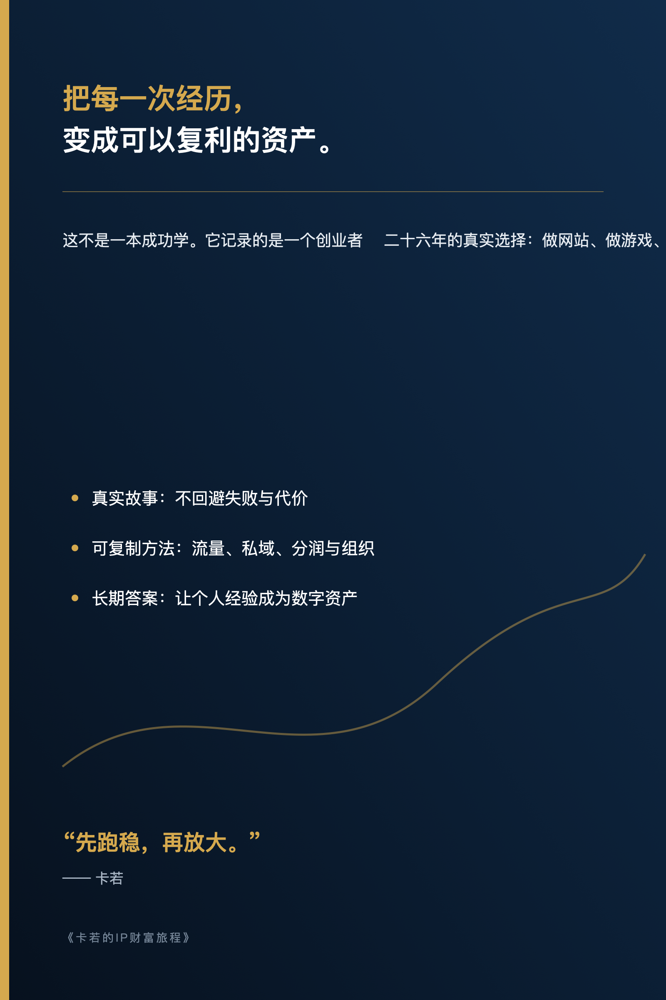
